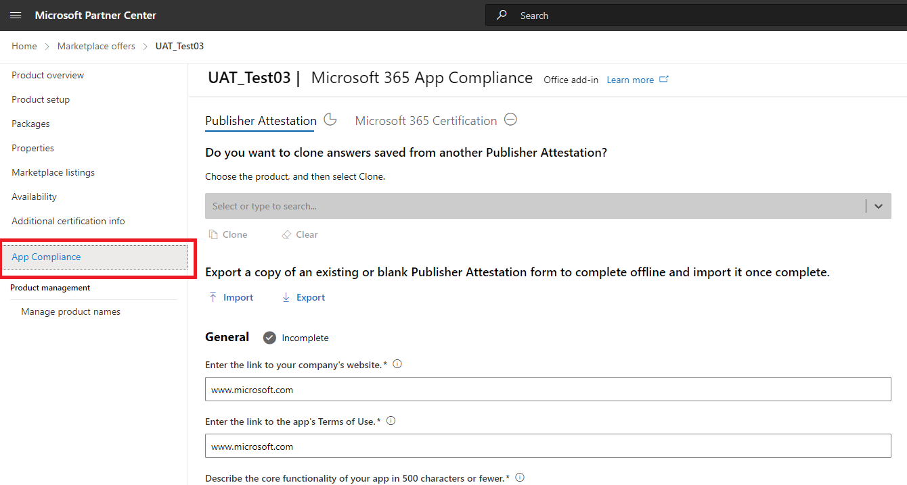
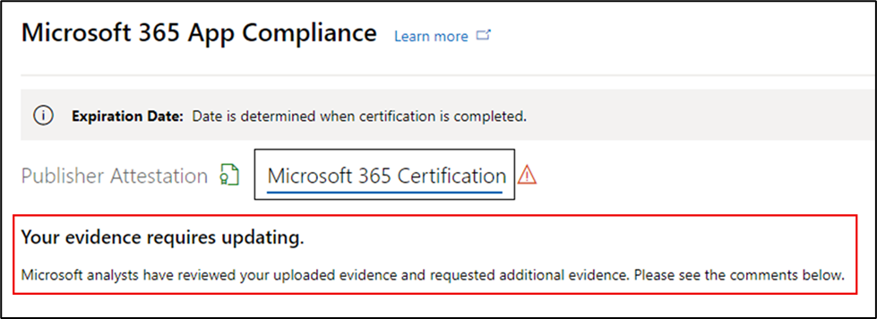

# 合作夥伴的應用程式合規性計畫Microsoft 365使用者指南 - SaaS

|階段|標題|
|---|---|
|階段 1| 發行者證明|
|階段 2| Microsoft 365 憑證|

## 1. 概觀 

本檔是合作夥伴的逐步使用者指南，我們已註冊Microsoft 365應用程式合規性計畫，並透過合作夥伴中心入口網站進行其 SaaS 應用程式的發行者證明和認證。

## 2.縮寫&定義
|縮略字 | 定義 |
|----|----|
|[電腦 (合作夥伴中心) ](https://partner.microsoft.com/)|適用于所有 Microsoft 合作夥伴的入口網站。 合作夥伴登入合作夥伴中心並提交自我評估問卷。 Microsoft 365[應用程式合規性](https://partner.microsoft.com/dashboard/home)合作夥伴中心|
|ISV | 獨立軟體廠商 a.k.a. 合作夥伴或開發人員 |
|應用程式來源 | 應用程式目錄 |
|範例 |[現在虛擬代理程式](https://appsource.microsoft.com/product/office/WA104381816)|

## 3.發行者證明工作流程

**首頁**：這是合作夥伴登入合作夥伴中心之後的登陸頁面。

  
**步驟 1** ：選取 Marketplace 供應專案

  
**步驟 2**：選取 [Marketplace 供應專案] 之後，切換至 [商業市集]。

從清單中選取應用程式，而另一個導覽列會彈出選項 [應用程式合規性]。
  
**步驟 3**：選取 [應用程式合規性]
  

  
**步驟 4**：填寫發行者證明的自我評量問卷。

  
**注意 如果您要返回更新/重新提交應用程式，請按一下 [選擇產品] 的下拉式清單，選取應用程式，然後按一下 [複製]。**

**您也可以利用匯入/匯出功能，離線完成表單，並在完成後匯入表單。**

 
**步驟 5**：完成後，按一下 [提交]，評定現在會是 [正在檢閱中]。
 
  
  
**核准/拒絕案例：**
  
答： 發行者證明拒絕
- 如果遭到拒絕，合作夥伴可以：
     - 檢視失敗報告
          - 合作夥伴會透過電子郵件收到通知，他們可以在合作夥伴中心檢視失敗報告
     - 更新並重新提交自我評估問卷。
        

B.  發行者證明核准
- 經核准，合作夥伴可以：
     - 更新並重新提交證明
     - 檢視已完成的發行者證明
     - 啟動Microsoft 365認證程式
        
        
  
 
  
**發行者證明核准後：AppSource 中針對發行者證明應用程式連結的範例。**
  

   
## 4.Microsoft 365認證工作流程
  
合作夥伴可以選取核取方塊並按一下 [提交] 來開始認證程式
  
 
  
**步驟 1**：初始檔提交

填寫所有詳細資料，上傳相關檔，然後按一下 [提交]
  
 
 
  
按一下 [提交] 時，將會檢閱初始檔提交。

  
如果初始檔不足或不相關，分析師會要求修訂。 分析師將與合作夥伴合作，協助取得正確的檔以供核准。

一旦分析師核准初始檔提交，合作夥伴必須提交控制需求。
  
**步驟 2**：控制需求提交
  
填寫所有詳細資料、上傳相關檔，然後按一下 [提交]

  

 
按一下 [提交] 時，將會檢閱初始檔提交。

  
如果控制需求檔不足或不相關，分析師會要求修訂。 分析師將與合作夥伴合作，協助取得正確的檔以供核准。

  
 
 
如果提交不符合核准標準，分析師將會拒絕提交。
  
合作夥伴可以與分析師合作，以提供相關資訊和檔。

  
一旦符合所有安全性標準，分析師就會核准提交，而合作夥伴將會Microsoft 365認證。

  
**認證核准後：AppSource 中Microsoft 365認證徽章的範例。** 

 
## 5.Microsoft 365更新工作流程：
  
**Microsoft 365發行者證明和認證更新工作流程：**  

Microsoft 365應用程式合規性計畫現在提供年度更新程式。 在此程式中，應用程式開發人員可以更新其現有的發行者證明問卷，以及Microsoft 365認證所需的檔。 
 
**好處：** 

- 在 AppSource、Office 市集、Teams市集和各種管理入口網站中維護您的認證徽章，以區別您的應用程式與其他人。 
- 提高客戶對使用認證應用程式的信賴度。 
- 使用更新的認證資訊，協助 IT 系統管理員做出明智的決策。

合作夥伴 [中心](https://partner.microsoft.com/dashboard/home) 提供新的續約程式，以提供順暢的體驗。 從到期日之前的 90 天開始，合作夥伴中心會顯示續約提醒。 定期提醒也會在到期前 90 天、60 天和 30 天透過電子郵件傳送。 
 
**階段 1：發行者證明更新：**
  
應用程式的發行者證明解答必須每年重新提交。 當證明接近 1 年標記時，會傳送電子郵件提醒，鼓勵重新提交證明。 
 
**步驟 1**：選取 **[更新** ] 以更新發行者證明。
  

  
**步驟 2**：檢閱先前的發行者證明解答，並視需要更新最新資訊。 
  
準備就緒時，提交發行者證明以進行更新。 M365 應用程式合規性分析師會加以檢閱。

  
**發行者證明更新已核准：**
  

  
**發行者證明已過期：**
  
應用程式的資訊必須在到期日之前更新，才能在 Microsoft 檔上維護應用程式的發行者證明頁面。及時更新也會確保應用程式在各種店面中持續出現徽章和圖示。 
 

**注意**：過期後，只要按一下 [更新]，即可隨時啟動發行者證明更新程式。
 
**階段 2：Microsoft 365認證更新**
  
應用程式的認證資訊必須每年重新提交。 這需要重新驗證您目前環境的範圍內控制項。 當認證接近 1 年時，會傳送電子郵件通知，鼓勵重新提交檔和辨識項。
 
 

**認證更新核准/拒絕案例：**

**案例 1：** 

認證更新已開始，目前正在檢閱中。
 
 

案例 1A： 

認證更新拒絕： 
- 如果下列狀況，可能會拒絕認證： 
     - 應用程式沒有必要的工具、程式或設定，而且無法在認證視窗內實作必要的變更。 
     - 應用程式有待處理的弱點，無法在認證視窗內修正。 
 

案例 1B： 

認證更新已核准

**認證到期：**

應用程式的資訊必須在到期日之前更新，才能在 Microsoft 檔上維護應用程式的 [認證] 頁面。及時更新也會確保 AppSource 和 Team Store 中應用程式的持續徽章和圖示。

  
注意：一旦過期，只要按一下 [更新]，即可隨時啟動發行者證明和認證程式。 
