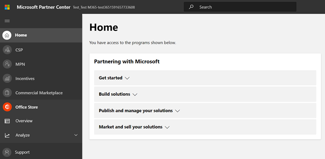

# Microsoft 365 應用程式規範計畫的協力廠商使用者指南-SaaSPartner's User Guide for Microsoft 365 App Compliance Program - SaaS

|階段Phase|職稱Title|
|---|---|
|階段1Phase 1| 發行者證明Publisher Attestation|
|階段2Phase 2| Microsoft 365 憑證Microsoft 365 Certification|

## 1. 簡介1. Overview 

這份檔是為我們的合作夥伴做為逐步的使用者指南，註冊 Microsoft 365 應用程式規範計畫，想要對其 SaaS app 進行 Publisher 證明和認證，但夥伴中心入口網站。This document acts as a step-by-step user guide for our Partners, enrolled for Microsoft 365 App Compliance Program aiming to undergo Publisher Attestation and Certification for their SaaS apps, though Partner Center portal.

## 2. 縮寫 & 定義2. Acronyms & Definitions
|縮略字Acronym | 定義Definition |
|----|----|
|[電腦 (合作夥伴中心) PC (Partner Center)](https://partner.microsoft.com/)|所有 Microsoft 合作夥伴的入口網站。A portal for all Microsoft Partners. 合作夥伴會登入至夥伴中心，並提交 Self-Assessment 問卷。A Partner logs in to Partner Center and submits Self-Assessment Questionnaire. [Microsoft 365 應用程式相容性](https://partner.microsoft.com/dashboard/home)的合作夥伴中心Partner Center for [Microsoft 365 App Compliance](https://partner.microsoft.com/dashboard/home)|
|ISVISV | 獨立軟體廠商 a.k.a。Independent Software Vendor a.k.a. Partner or DeveloperPartner or Developer |
|應用程式來源App Source |  (的應用程式目錄 AppSource) 範例： [Now virtual agent](https://appsource.microsoft.com/product/office/WA104381816)Catalog of apps (AppSource) Example: [Now virtual agent](https://appsource.microsoft.com/product/office/WA104381816) |

## 3. Publisher 認證工作流程3. Publisher Attestation Workflow

**首頁**：這是一次夥伴登入夥伴中心的登陸頁面。**Home Page**: This is the landing page once a partner logs in to Partner Center.

  
**步驟 1** ：在頁面左側的導覽列上：**Step 1** : On the left side of the page, on the navigation bar:

      a.    Select Commercial Marketplace
      
      b.    Select Overview

  
選取「一覽」時，partner 可以查看可用的應用程式清單，以啟動 Microsoft 365 合規性計畫。Upon selecting ‘Overview’, partner can see list of apps available to start the Microsoft 365 Compliance program.
  
**步驟 2**：從清單中選取應用程式，以開始 Publisher 認證程式。**Step 2**: Select an app from the list to begin the Publisher Attestation process.

 

在選取應用程式時，會以選項「應用程式相容性」彈出另一個導覽列。On selecting an app, another navigation bar will pop up with option ‘App Compliance’.
  
**步驟 3**：選取「應用程式符合性」**Step 3**: Select 'App Compliance’
  

  
**步驟 4**：填寫 Publisher 證明的 Self-Assessment 問卷。**Step 4**: Fill out the Self-Assessment Questionnaire for Publisher Attestation.
 

  
**附注：如果您要回到更新/重新提交應用程式，請按一下 [選擇產品的下拉式清單]，選取應用程式，然後按一下 [複製]。****Note: If you are coming back to update/re-submit your application, click dropdown for ‘Choose the product’, select the app and click ‘Clone’.**
  

  
**您也可以利用匯入/匯出功能，離線完成表單，並在完成後將其匯入。****You can also leverage the Import/Export feature to complete the form offline and import it once completed.**
  
 
  
 **步驟 5**：完成後，按一下 [提交]，評估現在會是「審閱」。**Step 5**: Once completed, click on ‘Submit’, the assessment will now be ‘under review’.
  
 
  
 
  
**核准/拒絕案例：****Approve/Reject Scenarios:**
  
答：A.  Publisher證明拒絕Publisher Attestation Rejection

    a.  In case of rejection, a Partner can:
    
        •   View failure report
        
            o   Partner will be notified via email, and they can view the failure report in Partner Center
          
        •   Update and re-submit Self-Assessment Questionnaire.
  
 
  
B。B.  Publisher證明核准Publisher Attestation Approval

    a.  Upon approval, the partner can:
    
        •   Update and resubmit attestation
        
        •   View completed Publisher Attestation
        
        •   Start M365 Certification Process
  
 
  
 
  
 **Post Publisher 驗證核准： Publisher attested 應用程式 AppSource 中的連結範例。****Post Publisher Verification Approval: Example of link in AppSource for publisher attested apps.**
  
  
  
 ## 4. Microsoft 365 認證工作流程4.  Microsoft 365 Certification Workflow
  
 協力廠商可以從選取核取方塊，然後按一下 [提交]，以開始認證程式。A partner can begin the Certification process by selecting the checkbox and clicking ‘Submit’
  
 
  
**步驟 1** ：初始檔提交**Step 1** : Initial Document Submission

 填寫所有詳細資料，上傳相關的檔，然後按一下 [提交]Fill out all the details, upload relevant documents and Click ‘Submit’
  
 
  
 
 
在按一下 [提交] 時，會進行審閱。On clicking Submit, the submission will be under review.
 

  
 當初始檔不足或沒有相關時，分析員會要求修訂。An analyst requests a revision in case the initial documents are not sufficient or relevant. 分析員會與合作夥伴合作，協助您取得適當的檔以供核准。The analyst will work with the Partner to help get the right documents for approval.
  

  
當分析員核准初始檔提交後，協力廠商必須提交控制需求。Once the analyst approves the initial document submission, the partner needs to submit the control requirements.
  
**步驟 2**：控制需求提交**Step 2**: Control Requirement Submission
  
填寫所有詳細資料，上傳相關的檔，然後按一下 [提交]Fill out all the details, upload relevant documents and Click ‘Submit’

 
在按一下 [提交] 時，會進行審閱。On clicking Submit, the submission will be under review.
  

  
當控制項需求檔不足或沒有相關時，分析員會要求修訂。An analyst requests a revision in case the control requirement documents are not sufficient or relevant. 分析員會與合作夥伴合作，協助您取得適當的檔以供核准。The analyst will work with the Partner to help get the right documents for approval.
  

  

  

  
若提交不符合核准標準，則分析員會拒絕提交。In case the submission does not satisfy the approval standards, the analyst will reject the submission.
  
合作夥伴可以與分析員搭配使用，以提供相關資訊和檔。The partner can work with the analyst to provide the relevant information and documents.
  

  
所有的安全性標準都符合後，分析員便會核准提交，而且會 Microsoft 365 認證合作夥伴。Once all the security standards have been met, the analyst will approve the submission and the partner will be Microsoft 365 Certified.
  

  
\* \* 後憑證核准： AppSource 中 Microsoft 365 憑證徽章的範例。\*\*Post Certification Approval: Example of Microsoft 365 certification badge in AppSource. ** 
  

  
## 5. Microsoft 365 更新工作流程：5.   Microsoft 365 Renewal Workflow:
  
**Microsoft 365 Publisher 證明和認證更新工作流程：****Microsoft 365 Publisher Attestation and Certification Renewal Workflow:**  

Microsoft 365App 相容性計畫現在提供一年的更新程式。Microsoft 365 App Compliance Program now offers an annual renewal process. 在此程式中，應用程式開發人員可以更新 Microsoft 365 憑證所需的現有 Publisher 認證問卷及檔。During this process, app developers can update their existing Publisher Attestation questionnaire and documents required for Microsoft 365 Certification. 
 
**好處：****Benefits:** 

  •維護 AppSource 和團隊存放區中的憑證徽章，以將您的應用程式與其他使用者區別開來。• Maintain your certification badge in AppSource and Team Store to differentiate your app from others. 
  
  •使用認證的應用程式，提高客戶的信賴程度。• Increase customer confidence in using your certified app. 
  
  •協助 IT 管理員以更新的認證資訊作出合理的決策。• Help IT admins make informed decisions with updated certification information.

新的續訂程式可在夥伴中心 (https://partner.microsoft.com/dashboard/home) ，以提供無縫體驗。The new renewal process is available in Partner Center(https://partner.microsoft.com/dashboard/home) to provide a seamless experience. 在夥伴中心的到期日的開始90天之後，將會顯示更新提醒。A renewal reminder will be shown in Partner Center starting 90 days before the expiration date. 定期提醒也會透過電子郵件于到期的90、60和30天傳送。Periodic reminders will also be sent via email at 90, 60 and 30 days before expiration. 
 
**第1層： Publisher 認證更新：****Tier 1: Publisher Attestation Renewal:**
  
應用程式的 Publisher 認證答案將需要一年重新提交。The app’s Publisher Attestation answers will need to be resubmitted on an annual basis. 當證明臨近1年標記時，系統會傳送電子郵件提醒，以鼓勵重新提交證明。When the attestation nears 1-year mark, an email reminder will be sent encouraging a resubmission of the attestation. 
 
**步驟 1**：選取 [**續訂**] 以更新 Publisher 認證。**Step 1**: Select **Renew** to renew the Publisher Attestation.
  

  
**步驟 2**：查看先前的 Publisher 認證答案，並視需要更新最新資訊。**Step 2**: Review the previous Publisher Attestation answers and update with the latest information as needed. 
  
提交 Publisher 認證以于準備時進行更新。Submit Publisher Attestation for renewal when ready. M365 應用程式規範分析員會檢查它。It will be reviewed by an M365 App Compliance Analyst.
  

  
**Publisher認證更新已核准：****Publisher Attestation Renewal Approved:**
  

  
**Publisher證明已到期：****Publisher Attestation Expired:**
  
應用程式的資訊必須在到期日之前更新，以維護 Microsoft 檔上應用程式的 Publisher 認證頁面。及時更新也會確保 AppSource 和小組存放區中的應用程式持續聲譽徽章授予及圖示。The app’s information needs to be renewed before the expiration date to maintain the app’s Publisher Attestation page on the Microsoft docs. Timely renewal will also ensure continued badging and icons for the app in AppSource and Team Store.
  

  
**附注**：已到期，只要按一下「更新」，即可隨時啟動 Publisher 證明更新程式。**Note**: Once expired, Publisher Attestation renewal process can be started anytime by clicking ‘Renew’.
 
**第2層： Microsoft 365 認證更新****Tier 2: Microsoft 365 Certification Renewal**
  
應用程式的認證資訊需要一年的頻率重新提交。The app’s certification information needs to be resubmitted on an annual basis. 這將需要重新驗證您目前環境中的範圍內控制項。This will require revalidation of the in-scope controls of your current environment. 當憑證臨近1年標記時，系統會傳送電子郵件通知，以鼓勵重新提交檔和證據。When the Certification nears 1-year mark an email notification will be sent encouraging a resubmission of the documents and evidence.
  

  
**認證更新核准/拒絕案例：****Certification Renewal Approve/Reject Scenarios:**
 
**案例1：** 憑證更新已開始，且正在審查中。**Scenario 1:** Certification renewal has started and is under review.
  

案例1A：憑證更新拒絕：如果：•應用程式沒有適當的工具、處理常式或設定，也無法在認證視窗中執行所需的變更，則可能會拒絕認證。Scenario 1A: Certification renewal rejection: Certification may be rejected if: •   The app does not have the required tooling, processes, or configurations in place and will not be able to implement required changes within the certification window. •應用程式有未完成的漏洞，無法在認證視窗內修正。•   The app has outstanding vulnerabilities in place and cannot be fixed within the certification window. 
  

  
案例1B：認證更新已獲核准Scenario 1B: Certification renewal is approved

**認證到期：****Certification Expiration:**
 
應用程式的資訊必須在到期日之前更新，以維護 Microsoft 檔上應用程式的 [證書] 頁面。及時更新也會確保 AppSource 和小組存放區中的應用程式持續聲譽徽章授予及圖示。The app’s information needs to be renewed before the expiration date to maintain app’s Certification page on the Microsoft docs. Timely renewal will also ensure continued badging and icons for the app in AppSource and Team Store.

  
附注：只要按一下「更新」，即可隨時啟動 Publisher 證明和認證程式。Note: Once expired, Publisher Attestation and Certification process can be started anytime by clicking ‘Renew’. 

  

  
 

  

 
