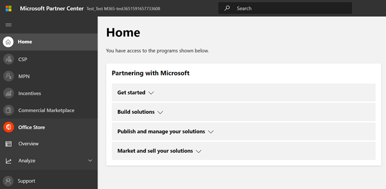
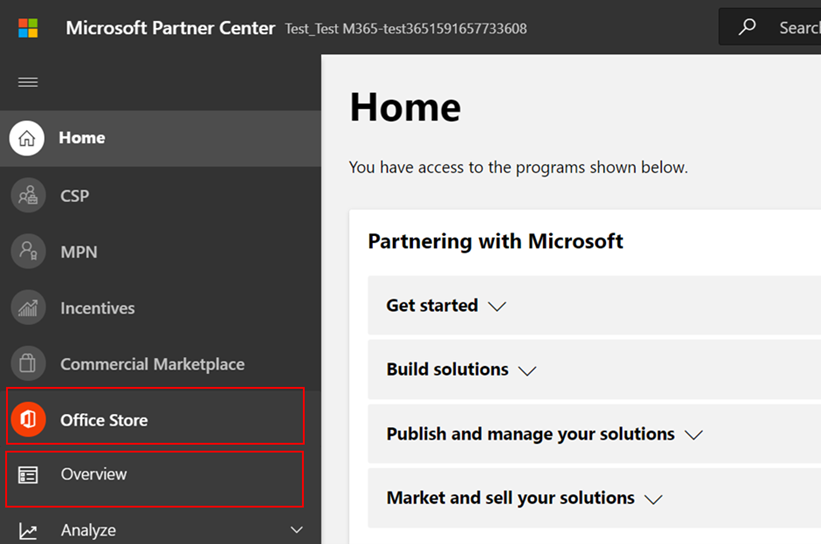
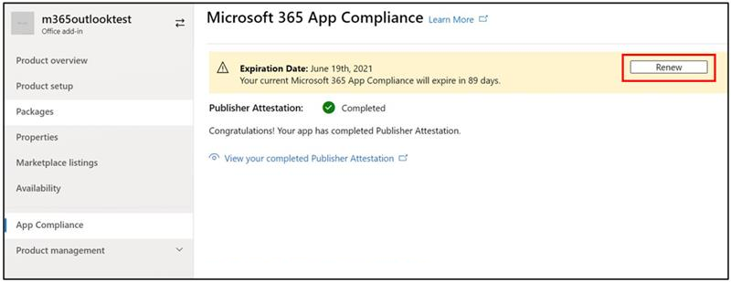

# 合作夥伴的 Microsoft 365 應用程式規範計畫的使用者指南Partner's User Guide for Microsoft 365 App Compliance Program

|階段Phase|職稱Title|
|---|---|
|階段1Phase 1| 發行者證明Publisher Attestation|
|階段2Phase 2| Microsoft 365 憑證Microsoft 365 Certification|

## 1. 簡介1. Overview
這份檔是在 Microsoft 365 應用程式規範計畫中註冊的合作夥伴逐步使用者指南，其目標是透過夥伴中心入口網站進行 Publisher 證明和憑證。This document acts as a step-by-step user guide for our partners enrolled in the Microsoft 365 App Compliance Program aiming to undergo Publisher Attestation and Certification though Partner Center portal.

## 2. 縮寫 & 定義2. Acronyms & Definitions
| 縮略字Acronym |定義Definition |
|---|----|
|電腦 [ (合作夥伴中心) ](https://partner.microsoft.com/)PC [(Partner Center)](https://partner.microsoft.com/)|所有 Microsoft 合作夥伴的入口網站。A portal for all Microsoft Partners. 合作夥伴會登入至夥伴中心，並提交 Self-Assessment 問卷。A Partner logs in to Partner Center and submits Self-Assessment Questionnaire. Microsoft 365 應用程式相容性的[合作夥伴中心](https://partner.microsoft.com/dashboard/home)[Partner Center](https://partner.microsoft.com/dashboard/home) for Microsoft 365 App Compliance|
|ISVISV|獨立軟體廠商。Independent Software Vendor. A.k.a.A.k.a. Partner or DeveloperPartner or Developer|
|應用程式來源App Source| [應用程式目錄Catalog of apps](https://appsource.microsoft.com/)
||範例： [Now virtual agent](https://appsource.microsoft.com/product/office/WA104381816)Example: [Now virtual agent](https://appsource.microsoft.com/product/office/WA104381816)|

## 3. Publisher 認證工作流程3.   Publisher Attestation Workflow

首頁：這是一次夥伴登入夥伴中心的登陸頁面。Home Page: This is the landing page once a partner logs in to Partner Center.

**步驟 1**   ：在頁面左側的導覽列中：**Step 1**   : On the left side of the page, in the navigation bar:
1. 選取 Office 儲存區Select Office store
1. 選取一覽Select Overview

選取「一覽」時，partner 可以查看透過夥伴中心提交且可用於 Microsoft 365 規範計畫的應用程式清單。Upon selecting ‘Overview’, partner can see list of apps submitted through Partner Center and available for the Microsoft 365 Compliance program.

**步驟 2** ：從清單中選取應用程式，以開始 Publisher 認證程式。**Step 2** : Select an app from the list to begin the Publisher Attestation process.

在選取應用程式時，會彈出另一個導覽列，其中包含選項「應用程式相容性」。On selecting an app, another navigation bar will pop up with option ‘App Compliance.’

**步驟 3**：選取「應用程式符合性」**Step 3**: Select ‘App Compliance’

**步驟 4**：填寫 Publisher 證明的 Self-Assessment 問卷**Step 4**: Fill out the Self-Assessment Questionnaire for Publisher Attestation

**附注：** 如果您要回到更新/重新提交應用程式，請按一下 [選擇產品的下拉式清單]，選取應用程式，然後按一下 [仿製]。**Note:** If you are coming back to update/re-submit your application, click dropdown for ‘Choose the product’, select the app and click ‘Clone.’

您也可以利用匯入/匯出功能，離線完成表單，並在完成後將其匯入。You can also leverage the Import/Export feature to complete the form offline and import it once completed.

您也可以利用匯入/匯出功能，離線完成表單，並在完成後將其匯入。You can also leverage the Import/Export feature to complete the form offline and import it once completed. 

**步驟 5**：完成後，按一下 [提交]，評估現在會是「審閱」。**Step 5**: Once completed, click on ‘Submit’, the assessment will now be ‘under review’.

### 核准/拒絕案例：Approve/Reject Scenarios:

**Publisher 證明拒絕****A.Publisher Attestation Rejection**

在此階段遭到拒絕時，合作夥伴可以：In case of rejection at this stage, an partner can:
-   View 失敗報告。View failure report.
    - 合作夥伴會透過電子郵件通知，而且可以在夥伴中心中查看失敗報告Partner will be notified via email, and they can view the failure report in Partner Center
-   更新並重新提交 Publisher 證明 Update and re-submit Publisher Attestation 

**b. Publisher 認證重新提交****B.Publisher Attestation Re-submission**

**c. Publisher 證明核准****C.Publisher Attestation Approval**

-   在核准合作夥伴可以執行下列作業：Upon approval partner can:
    - 更新並重新提交證明Update and resubmit attestation
    - 查看和共用已完成的 Publisher 證明View and share completed Publisher Attestation
    - 開始 M365 認證處理常式Start M365 Certification Process

**Post Publisher 驗證核准： Publisher attested 應用程式 AppSource 中的連結範例****Post Publisher Verification Approval: Example of link in AppSource for publisher attested apps**

## 4. Microsoft 365 認證工作流程4. Microsoft 365 Certification Workflow

協力廠商按一下「提交」並提交所有檔和證據進行審閱之後：Once partner clicks on ‘Submit’ and submits all documents and evidence for review: 

### Microsoft 365認證-已提交Microsoft 365 Certification - Submitted

**Microsoft 365 認證-已拒絕****Microsoft 365 certification - Rejected**

**Microsoft 365認證-已核准****Microsoft 365 Certification - Approved**

**後憑證核准： AppSource 中 Microsoft 365 憑證徽章的範例****Post Certification Approval: Example of Microsoft 365 certification badge in AppSource**

## 5. 現有 Isv 的工作流程5. Workflow for Existing ISVs

如果您是現有的 ISV，且想要更新 Publisher 證明。If you are an existing ISV and want to Update Publisher Attestation.

**步驟 1**：按一下「更新並重新提交您的 Publisher 認證」連結。**Step 1**: Click on ‘Update and re-submit your Publisher Attestation’ link.

**附注：**：如果您要回到更新/重新提交應用程式，請按一下 [選擇產品的下拉式清單]，選取應用程式，然後按一下 [匯入]。**Note:**: If you are coming back to update/re-submit your application, click dropdown for ‘Choose the product’, select the app and click ‘Import’.

**步驟 2**：對表單進行更新，然後按一下 [儲存/提交]。**Step 2**: Make updates to your form and click Save/Submit.

![按一下 [儲存] 或 [提交]](../media/existing%20isv%202.png)

送出後，即會進行考核。Once submitted, it will be under review.

## 6. Microsoft 365 Publisher 證明和認證更新工作流程：6.   Microsoft 365 Publisher Attestation and Certification Renewal Workflow:

Microsoft 365App 相容性計畫現在提供一年的更新程式。Microsoft 365 App Compliance Program now offers an annual renewal process. 在此程式中，應用程式開發人員可以更新 Microsoft 365 憑證所需的現有 Publisher 認證問卷及檔。During this process, app developers can update their existing Publisher Attestation questionnaire and documents required for Microsoft 365 Certification. 

**好處：****Benefits:**

- 在 AppSource 和小組存放區中維護您的憑證徽章，以將您的應用程式與其他使用者區別開來。Maintain your certification badge in AppSource and Team Store to differentiate your app from others. 
- 使用認證的應用程式，提高客戶的信賴程度。Increase customer confidence in using your certified app. 
- 協助 IT 管理員以更新的認證資訊作出合理的決策。Help IT admins make informed decisions with updated certification information. 

您可以在 [合作夥伴中心](https://partner.microsoft.com/en-us/dashboard/home) 取得新的更新程式，以提供無縫體驗。The new renewal process is available in [Partner Center](https://partner.microsoft.com/en-us/dashboard/home) to provide a seamless experience. 在夥伴中心的到期日的開始90天之後，將會顯示更新提醒。A renewal reminder will be shown in Partner Center starting 90 days before the expiration date. 定期提醒也會透過電子郵件于到期的90、60和30天傳送。Periodic reminders will also be sent via email at 90, 60 and 30 days before expiration.

**第1層： Publisher 認證更新：****Tier 1: Publisher Attestation Renewal:** 

應用程式的 Publisher 認證答案將需要一年重新提交。The app’s Publisher Attestation answers will need to be resubmitted on an annual basis. 當證明臨近1年標記時，系統會傳送電子郵件提醒，以鼓勵重新提交證明。When the attestation nears 1-year mark, an email reminder will be sent encouraging a resubmission of the attestation. 

**步驟 1**：選取 [**續訂**] 以更新 Publisher 認證。**Step 1**: Select **Renew** to renew the Publisher Attestation. 

**步驟 2**：查看先前的 Publisher 認證答案，並視需要更新最新資訊。**Step 2**: Review the previous Publisher Attestation answers and update with the latest information as needed. 提交 Publisher 認證以于準備時進行更新。Submit Publisher Attestation for renewal when ready. M365 應用程式規範分析員會檢查它。It will be reviewed by an M365 App Compliance Analyst.

**Publisher 證明已過期：** 應用程式的資訊必須在到期日之前更新，以維護 Microsoft 檔上應用程式的 Publisher 認證頁面。及時更新也會確保 AppSource 和小組存放區中的應用程式持續聲譽徽章授予及圖示。**Publisher Attestation Expired:** The app’s information needs to be renewed before the expiration date to maintain the app’s Publisher Attestation page on the Microsoft docs. Timely renewal will also ensure continued badging and icons for the app in AppSource and Team Store.

附注：已到期，只要按一下「更新」，即可隨時啟動 Publisher 證明更新程式。Note: Once expired, Publisher Attestation renewal process can be started anytime by clicking ‘Renew’. 

**第2層： Microsoft 365 認證更新****Tier 2: Microsoft 365 Certification Renewal** 

應用程式的認證資訊需要一年的頻率重新提交。The app’s certification information needs to be resubmitted on an annual basis. 這將需要重新驗證您目前環境中的範圍內控制項。This will require revalidation of the in-scope controls of your current environment. 當憑證臨近1年標記時，系統會傳送電子郵件通知，以鼓勵重新提交檔和證據。When the Certification nears 1-year mark an email notification will be sent encouraging a resubmission of the documents and evidence. 

**認證更新核准/拒絕案例：****Certification Renewal Approve/Reject Scenarios:**

**案例1：****Scenario 1:** 

Publisher證明已完成。Publisher Attestation  is complete. 憑證更新已開始，且正在進行審閱。Certification renewal has started and under review. 

**案例1A：****Scenario 1A:**

憑證更新拒絕：在下列情況中，可能會拒絕認證：Certification renewal rejection: Certification may be rejected if: 

 - 應用程式不具備必要的工具、程式或設定，也無法在認證視窗中執行所需的變更。The app does not have the required tooling, processes, or configurations in place and will not be able to implement required changes within the certification window. 
 - 應用程式有未完成的漏洞，無法在認證視窗內修正。The app has outstanding vulnerabilities in place and cannot be fixed within the certification window. 

    
**案例1B：****Scenario 1B:** 

認證更新已獲批准Certification renewal is approved  

**認證到期：****Certification Expiration:**

應用程式的資訊必須在到期日之前更新，以維護 Microsoft 檔上應用程式的 [證書] 頁面。及時更新也會確保 AppSource 和小組存放區中的應用程式持續聲譽徽章授予及圖示。The app’s information needs to be renewed before the expiration date to maintain app’s Certification page on the Microsoft docs. Timely renewal will also ensure continued badging and icons for the app in AppSource and Team Store. 

    
**附注**：只要按一下「更新」，即可隨時啟動 Publisher 證明和認證程式。**Note**: Once expired, Publisher Attestation and Certification process can be started anytime by clicking ‘Renew’. 

