# 合作夥伴的 Microsoft 365 應用程式規範計畫的使用者指南

|階段|標題|
|---|---|
|階段1| 發行者證明|
|階段2| Microsoft 365 憑證|

## 1. 簡介
這份檔是在 Microsoft 365 應用程式規範計畫中註冊的合作夥伴逐步使用者指南，其意圖是透過夥伴中心入口網站進行 Publisher 證明和認證。

## 2. 縮寫 & 定義
| 縮略字 |定義 |
|---|----|
|電腦 [ (合作夥伴中心) ](https://partner.microsoft.com/)|所有 Microsoft 合作夥伴的入口網站。 協力廠商會登入至夥伴中心，並提交自我評估問卷。 Microsoft 365 應用程式相容性的[合作夥伴中心](https://partner.microsoft.com/dashboard/home)|
|ISV|獨立軟體廠商。 A.k.a. partner or developer|
|應用程式來源| [應用程式目錄](https://appsource.microsoft.com/)
|範例|[現在，虛擬代理程式](https://appsource.microsoft.com/product/office/WA104381816)|

## 3. Publisher 認證工作流程

**首頁** ：這是一次夥伴登入夥伴中心的登陸頁面。

**步驟 1** ：選取 Marketplace 服務。 

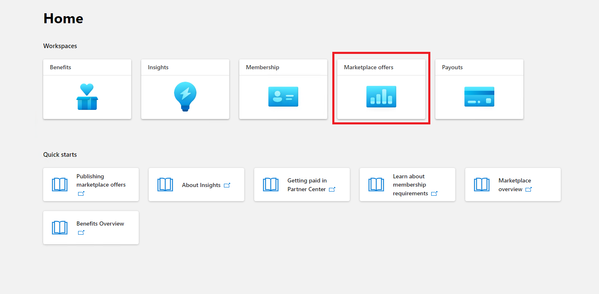
  
**步驟 2**：選取「Marketplace 產品」之後，請切換至「Office Store」。 從清單中選取應用程式，以開始 Publisher 認證程式。

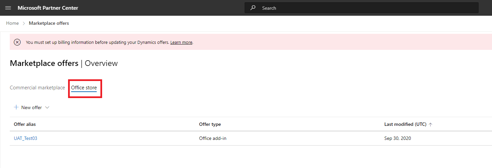

在選取應用程式時，會以選項「應用程式相容性」彈出另一個導覽列。
  
**步驟 3**：選取「應用程式符合性」

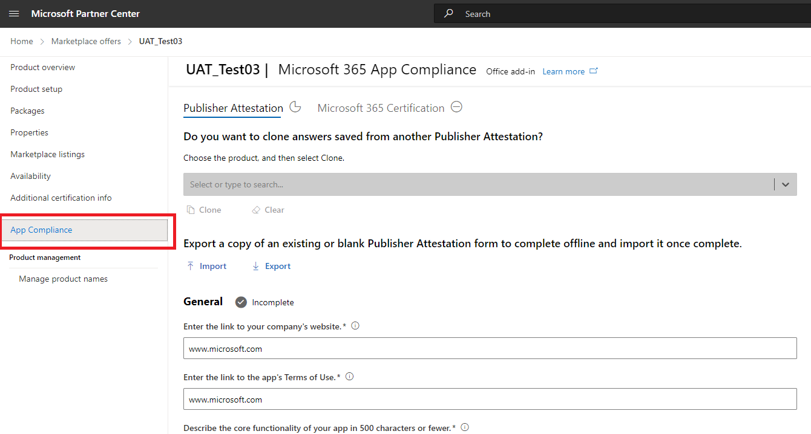

**步驟 4**：填寫 Publisher 證明的自我評估問卷

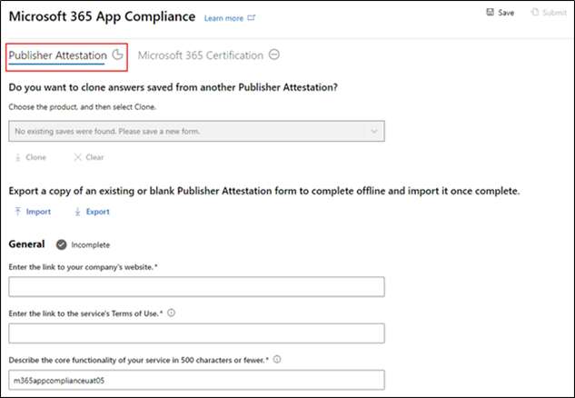

**附注如果您會傳回更新/重新提交應用程式，請按一下 [選擇產品的下拉式清單]，選取應用程式，然後按一下 [複製]。**

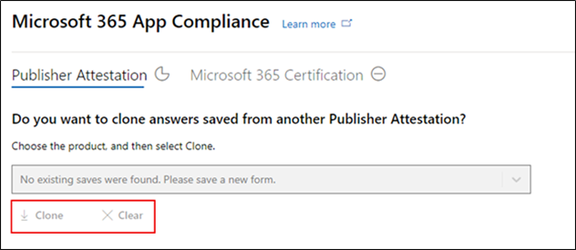

您也可以利用匯入/匯出功能，離線完成表單，並在完成後將其匯入。

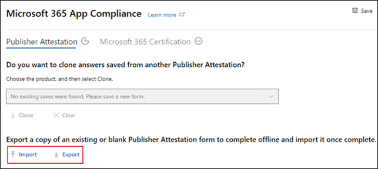

**步驟 5**：完成後，按一下 [提交]，評估現在會是「審閱」。

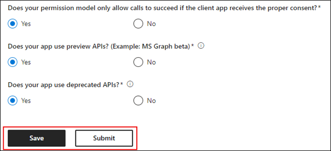

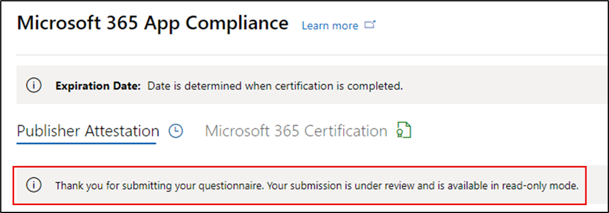

### 核准/拒絕案例：

**Publisher 證明拒絕**

- 在此階段遭到拒絕時，合作夥伴可以：
    - 查看失敗報告
         - 合作夥伴會透過電子郵件通知，而且可以在夥伴中心中查看失敗報告
    - 更新並重新提交 Publisher 證明

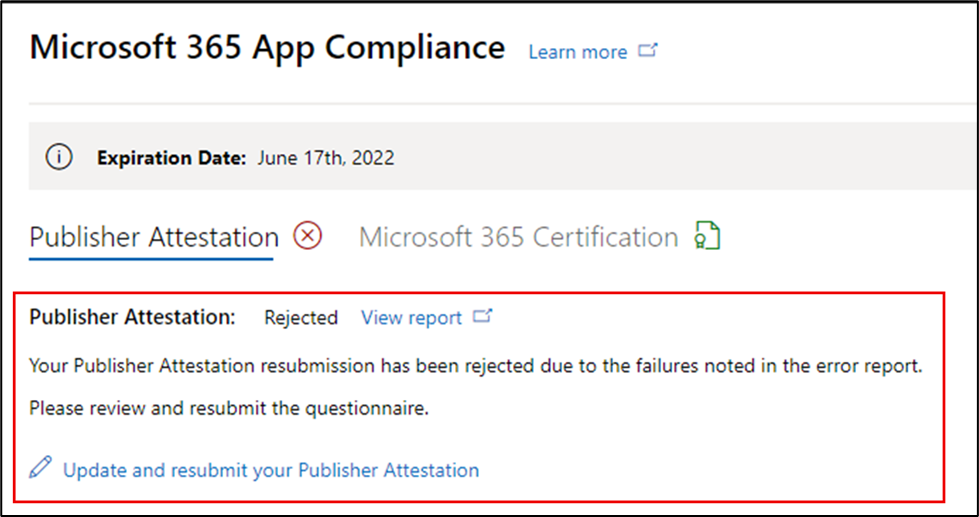

**b. Publisher 證明核准**

- 在核准合作夥伴可以執行下列作業：
    - 更新並重新提交證明
    - 查看和共用已完成的 Publisher 證明
    - 開始 Microsoft 365 認證程式

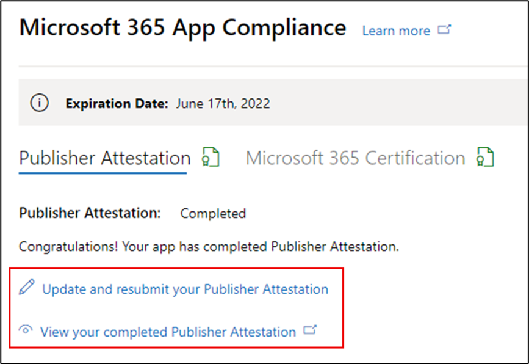

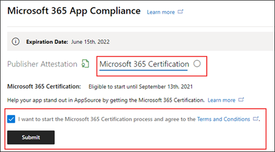

**Post Publisher 認證核准： Publisher attested 應用程式 AppSource 中的連結範例**

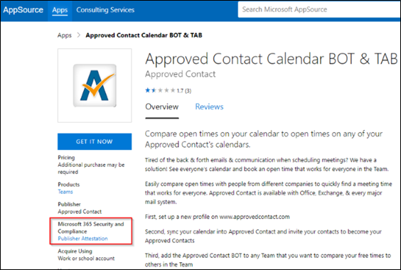

## 4. Microsoft 365 認證工作流程

協力廠商可以從選取核取方塊，然後按一下 [提交]，以開始認證程式。 

**步驟1：** 初始檔提交填寫所有詳細資料，上傳相關的檔，然後按一下 [提交]

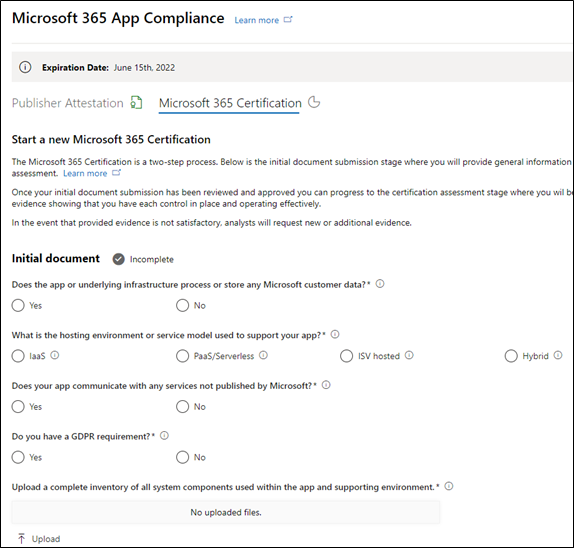
 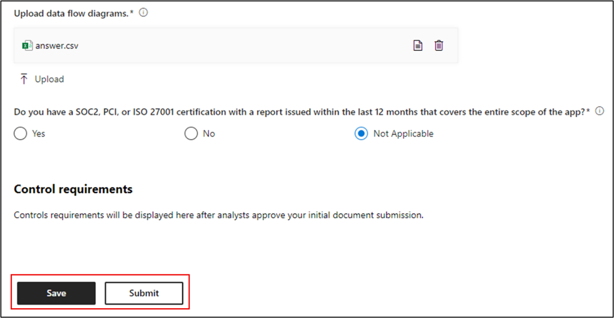

在按一下 [提交] 時，證明提交將會受到審核。 

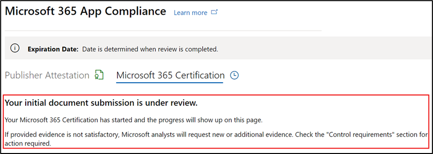

當初始檔不足或沒有相關時，分析員會要求修訂。 分析員會與合作夥伴合作，協助您取得適當的檔以供核准。 

當分析員核准初始檔提交後，協力廠商必須提交控制需求。 

**步驟2：** 控制需求提交填寫所有詳細資料、上傳相關的檔，然後按一下 [提交] 

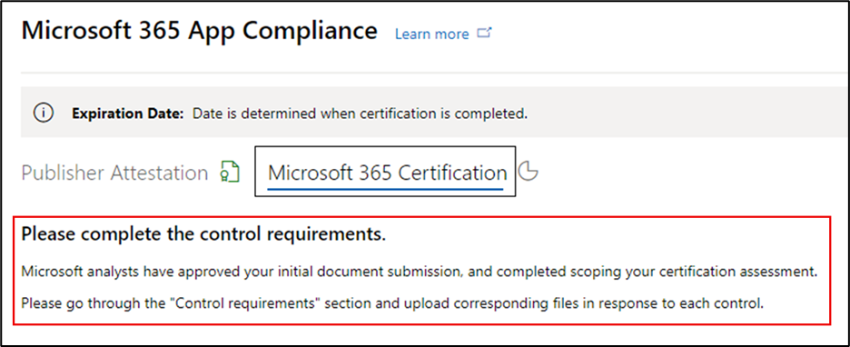
 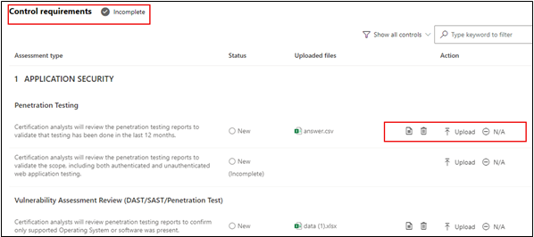
 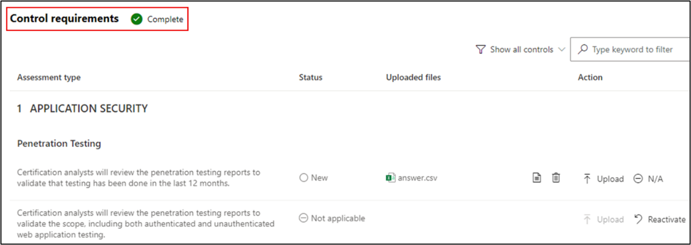

在按一下 [提交] 時，認證提交即會進行審閱。 

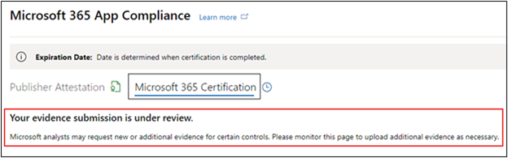

當控制項需求檔不足或沒有相關時，分析員會要求修訂。 分析員會與合作夥伴合作，協助您取得適當的檔以供核准。 

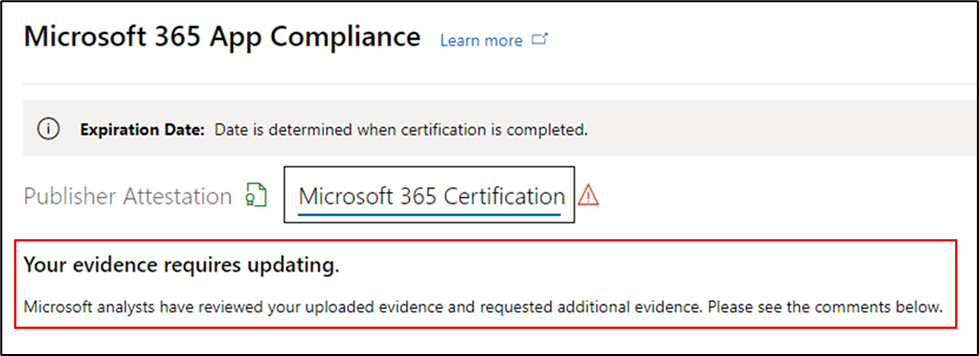
 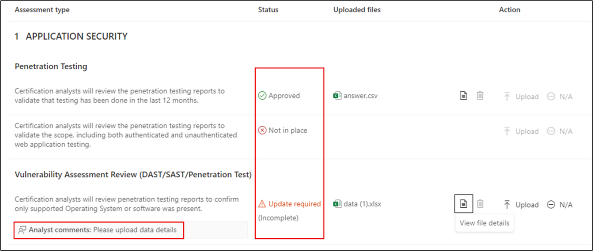
 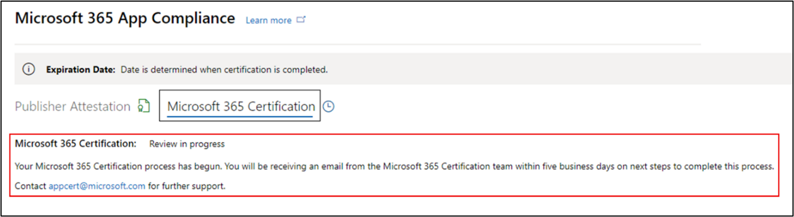

若提交不符合核准標準，則分析員會拒絕提交。 合作夥伴可以與分析員搭配使用，以提供相關資訊和檔。 

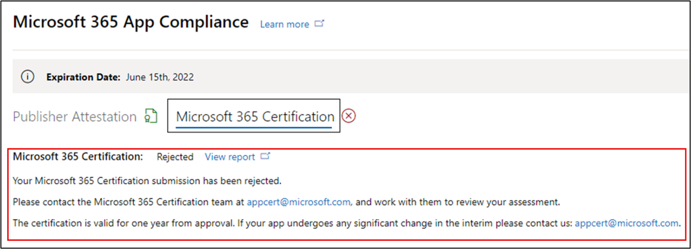

所有的安全性標準都符合後，分析員便會核准提交，而且會 Microsoft 365 認證合作夥伴。 

**後憑證核准： AppSource 中 Microsoft 365 憑證徽章的範例**

## 5. Microsoft 365 更新工作流程：
  
**Microsoft 365 Publisher 證明和憑證更新工作流程：** Microsoft 365 App 合規性計畫現在提供一年的更新程式。 在此程式中，應用程式開發人員可以更新 Microsoft 365 憑證所需的現有 Publisher 認證問卷及檔。 
 
**好處：** 

- 在 AppSource、Teams 存放區、Office 存放區和其他書店中維護您的憑證徽章，以區別應用程式。 
- 使用認證的應用程式，提高客戶的信賴程度。 
- 協助 IT 管理員以更新的認證資訊作出合理的決策。 

您可以在 [合作夥伴中心](https://partner.microsoft.com/dashboard/home) 取得更新程式，以提供無縫體驗。 在夥伴中心的到期日的開始90天之後，將會顯示更新提醒。 定期提醒也會透過電子郵件于到期的90、60和30天傳送。

**階段1： Publisher 證明更新：** 

您可以在 [合作夥伴中心](https://partner.microsoft.com/dashboard/home) 取得新的更新程式，以提供無縫體驗。 在夥伴中心的到期日的開始90天之後，將會顯示更新提醒。 定期提醒也會透過電子郵件于到期的90、60和30天傳送。 

**步驟 1**：選取 [**續訂**] 以更新 Publisher 認證。 

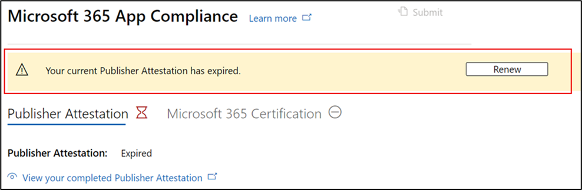

**步驟 2**：查看先前的 Publisher 認證答案，並視需要更新最新資訊。 提交 Publisher 認證以于準備時進行更新。 Microsoft 365 應用程式相容性分析員會檢查它。

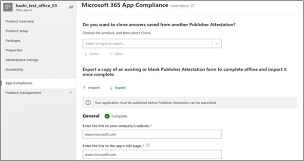

**Publisher已核准的證明更新**

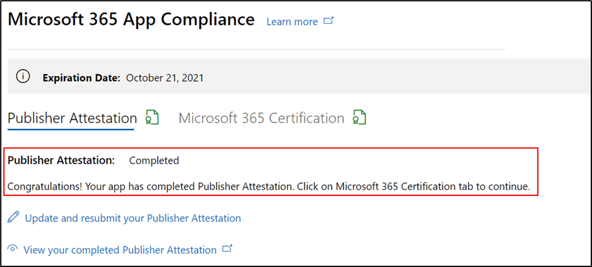

**Publisher 證明已過期：** 應用程式的資訊必須在到期日之前更新，以維護 Microsoft 檔上應用程式的 Publisher 認證頁面。及時更新也會確保 AppSource 中的應用程式持續聲譽徽章授予和圖示、Teams 儲存區、Office 存放區及其他書店。

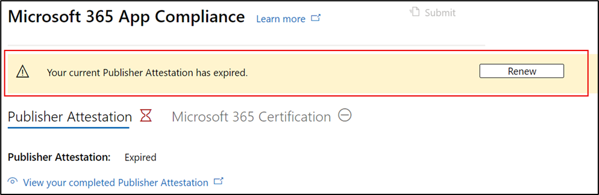

附注：已到期，只要按一下「更新」，即可隨時啟動 Publisher 證明更新程式。 

**階段2： Microsoft 365 憑證更新** 

應用程式的認證資訊需要一年的頻率重新提交。 這將需要重新驗證您目前環境中的範圍內控制項。 當憑證臨近1年標記時，系統會傳送電子郵件通知，以鼓勵重新提交檔和證據。 

**認證更新核准/拒絕案例：**
 
**案例1：** 

憑證更新已開始，且正在審查中。

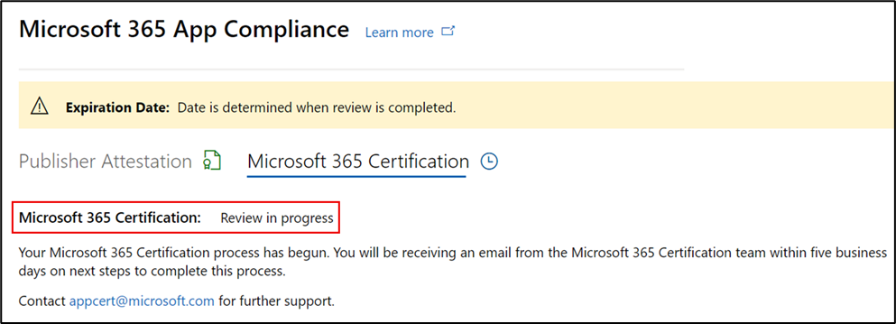

**案例1A：**

憑證更新拒絕：在下列情況中，可能會拒絕認證： 
- 應用程式不具備必要的工具、程式或設定，也無法在認證視窗中執行所需的變更。 
- 應用程式有未完成的漏洞，無法在認證視窗內修正。 
 
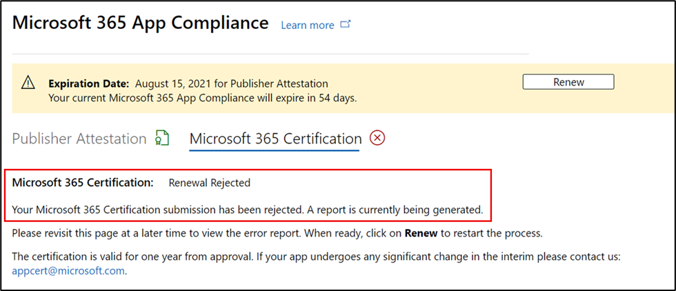
    
**案例1B：** 

認證更新已獲批准  

**認證到期：**
 
應用程式的資訊必須在到期日之前更新，以維護 Microsoft 檔上應用程式的 [證書] 頁面。及時更新也會確保 AppSource 和小組存放區中的應用程式持續聲譽徽章授予及圖示。

應用程式的資訊必須在到期日之前更新，以維護 Microsoft 檔上應用程式的 [證書] 頁面。及時更新也會確保 AppSource 中的應用程式持續聲譽徽章授予和圖示、Teams 儲存區、Office 存放區及其他書店。 

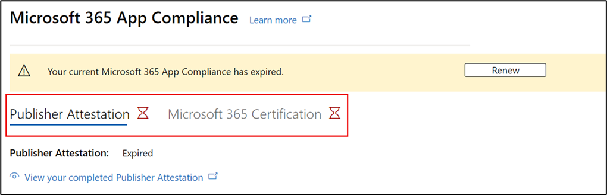
    
**附注**：只要按一下「更新」，即可隨時啟動 Publisher 證明和認證程式。 

