# 合作夥伴的 Microsoft 365 應用程式規範計畫的使用者指南

|||
|---|---|
|第1層| 發行者證明|
|第2層| Microsoft 365 憑證|

## 1. 簡介
這份檔是為我們的合作夥伴做為逐步使用者指南，註冊 Microsoft 365 應用程式規範計畫，其意圖是透過夥伴中心入口網站進行 Publisher 證明和憑證。

## 2. 縮寫 & 定義
| | |
|---|----|
|縮略字 | 定義 |
|電腦 (合作夥伴中心) |所有 Microsoft 合作夥伴的入口網站。 合作夥伴會登入至夥伴中心，並提交 Self-Assessment 問卷 https://partner.microsoft.com/|
|ISV|獨立軟體廠商 A.k.a。 Partner or Developer|
|應用程式來源|  (的應用程式目錄 https://appsource.microsoft.com/)
||範例：現在，虛擬代理程式 (https://appsource.microsoft.com/en-us/product/office/WA104381816)|

## 3. Publisher 認證工作流程

首頁：這是一次夥伴登入夥伴中心的登陸頁面。

**步驟 1**   ：在頁面左側的導覽列中：
1. 選取 Office 儲存區
1. 選取一覽

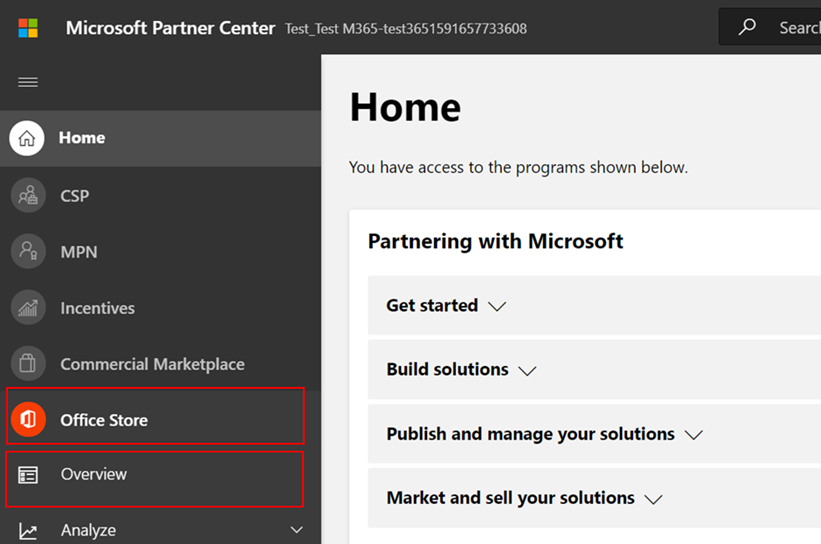

選取「一覽」時，partner 可以查看透過夥伴中心提交且可用於 Microsoft 365 規範計畫的應用程式清單。

**步驟 2** ：從清單中選取應用程式，以開始 Publisher 認證程式。

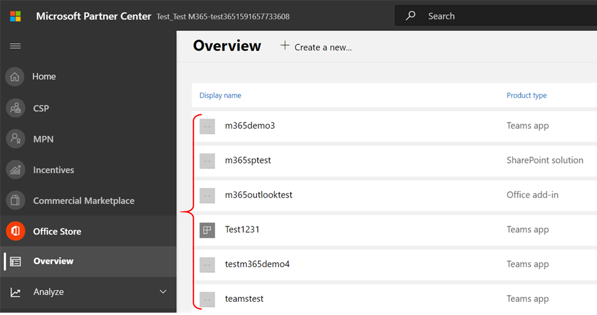

選取應用程式時，會彈出另一個導覽列，其中包含選項「應用程式相容性」

**步驟 3**：選取「應用程式符合性」

**步驟 4**：填寫 Publisher 證明的 Self-Assessment 問卷

**附注**：如果您要回到更新/重新提交應用程式，請按一下 [選擇產品的下拉式清單]，選取應用程式，然後按一下 [複製]。

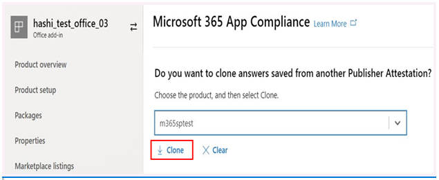
 

您也可以利用匯入/匯出功能，離線完成表單，並在完成後將其匯入。 

**步驟 5**：完成後，按一下 [提交]，評估現在會是「審閱」。

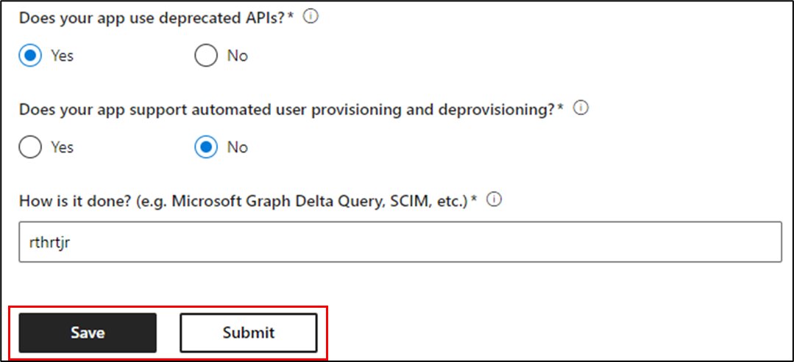

### 核准/拒絕案例：

**Publisher 證明拒絕**

在此階段遭到拒絕時，合作夥伴可以：
-   View 失敗報告。
    - 合作夥伴將會透過電子郵件通知合作夥伴中心。
-   更新 Self-Assessment 的回應。
-   重新提交自我評估。

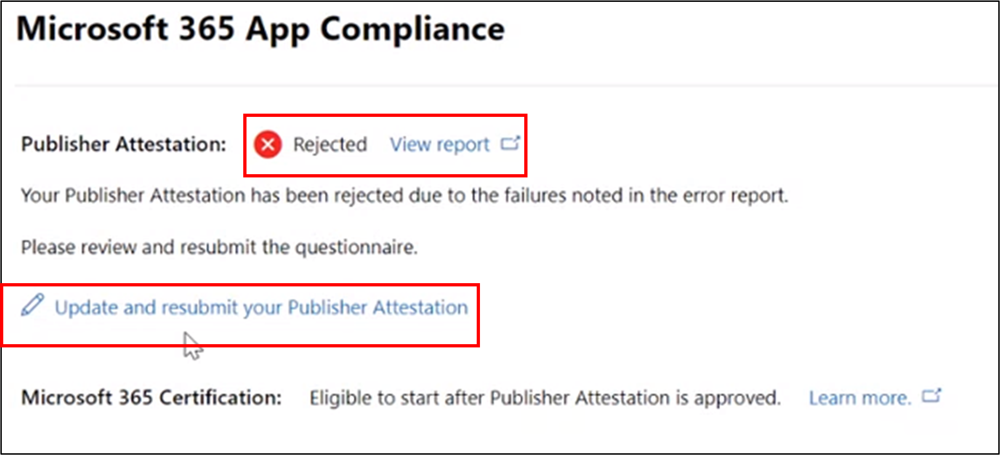

**b. Publisher 認證重新提交**

**c. Publisher 證明核准**

-   在核准合作夥伴可以執行下列作業：
    - 更新並重新提交證明
    - 查看和共用已完成的 Publisher 證明
    - 開始 M365 認證處理常式

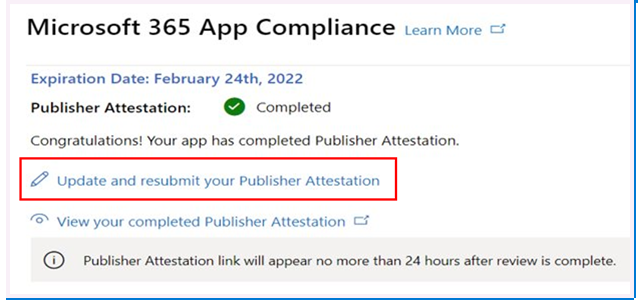

**Post Publisher 驗證核准： Publisher attested 應用程式 AppSource 中的連結範例**

## 4. Microsoft 365 認證工作流程

協力廠商按一下「提交」並提交所有檔和證據進行審閱之後： 

### Microsoft 365認證-已提交

**Microsoft 365 認證-已拒絕**

**Microsoft 365認證-已核准**

**後憑證核准： AppSource 中 Microsoft 365 憑證徽章的範例**

## 5. 現有 Isv 的工作流程

如果您是現有的 ISV，且想要更新 Publisher 證明。

**步驟 1**：按一下「更新並重新提交您的 Publisher 認證」連結。

**附注：**：如果您要回到更新/重新提交應用程式，請按一下 [選擇產品的下拉式清單]，選取應用程式，然後按一下 [匯入]。

**步驟 2**：對表單進行更新，然後按一下 [儲存/提交]。

![按一下 [儲存] 或 [提交]](../media/existing%20isv%202.png)

送出後，即會進行考核。

## 6. Microsoft 365 Publisher 證明和認證更新工作流程：

Microsoft 365App 相容性計畫現在提供一年的更新程式。 在此程式中，應用程式開發人員可以更新 Microsoft 365 憑證所需的現有 Publisher 認證問卷及檔。 

**好處：**

- 在 AppSource 和小組存放區中維護您的憑證徽章，以將您的應用程式與其他使用者區別開來。 
- 使用認證的應用程式，提高客戶的信賴程度。 
- 協助 IT 管理員以更新的認證資訊作出合理的決策。 

您可以在 [合作夥伴中心](https://partner.microsoft.com/en-us/dashboard/home) 取得新的更新程式，以提供無縫體驗。 在夥伴中心的到期日的開始90天之後，將會顯示更新提醒。 定期提醒也會透過電子郵件于到期的90、60和30天傳送。

**第1層： Publisher 認證更新：** 

應用程式的 Publisher 認證答案將需要一年重新提交。 當證明臨近1年標記時，系統會傳送電子郵件提醒，以鼓勵重新提交證明。 

**步驟 1**：選取 [**續訂**] 以更新 Publisher 認證。 

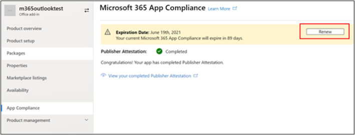

**步驟 2**：查看先前的 Publisher 認證答案，並視需要更新最新資訊。 提交 Publisher 認證以于準備時進行更新。 M365 應用程式規範分析員會檢查它。

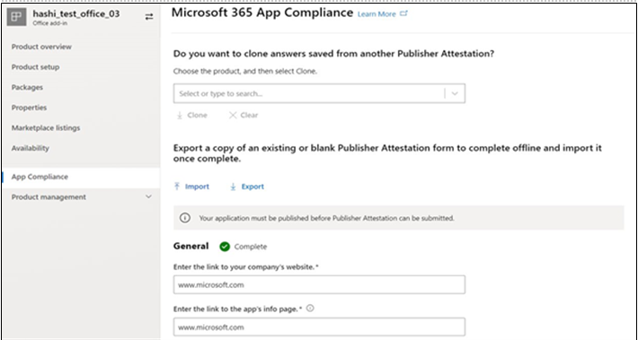

**Publisher 證明已過期：** 應用程式的資訊必須在到期日之前更新，以維護 Microsoft 檔上應用程式的 Publisher 認證頁面。及時更新也會確保 AppSource 和小組存放區中的應用程式持續聲譽徽章授予及圖示。

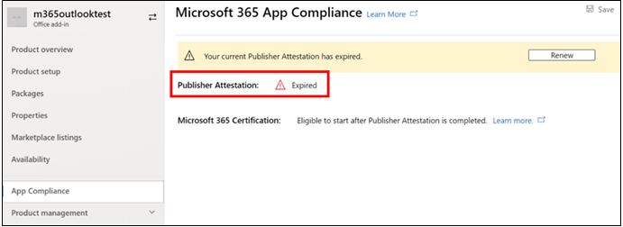

附注：已到期，只要按一下「更新」，即可隨時啟動 Publisher 證明更新程式。 

**第2層： Microsoft 365 認證更新** 

應用程式的認證資訊需要一年的頻率重新提交。 這將需要重新驗證您目前環境中的範圍內控制項。 當憑證臨近1年標記時，系統會傳送電子郵件通知，以鼓勵重新提交檔和證據。 

**認證更新核准/拒絕案例：**

**案例1：** 

Publisher證明已完成。 憑證更新已開始，且正在進行審閱。 

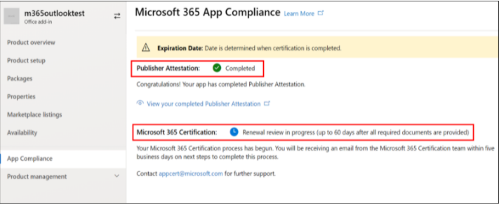

**案例1A：**

憑證更新拒絕：在下列情況中，可能會拒絕認證： 

 - 應用程式不具備必要的工具、程式或設定，也無法在認證視窗中執行所需的變更。 
 - 應用程式有未完成的漏洞，無法在認證視窗內修正。 

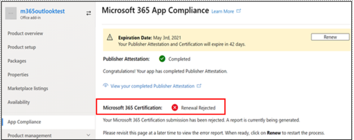
    
**案例1B：** 

認證更新已獲批准  

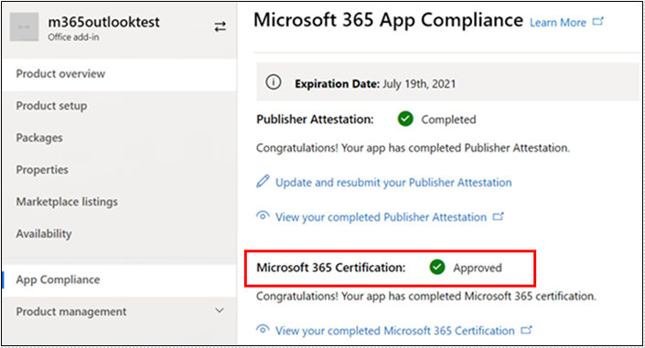

**認證到期：**

應用程式的資訊必須在到期日之前更新，以維護 Microsoft 檔上應用程式的 [證書] 頁面。及時更新也會確保 AppSource 和小組存放區中的應用程式持續聲譽徽章授予及圖示。 

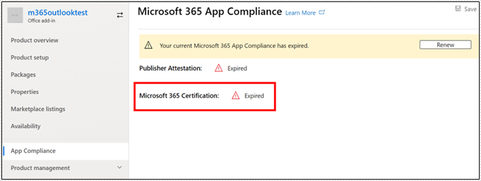
    
**附注**：只要按一下「更新」，即可隨時啟動 Publisher 證明和認證程式。 

