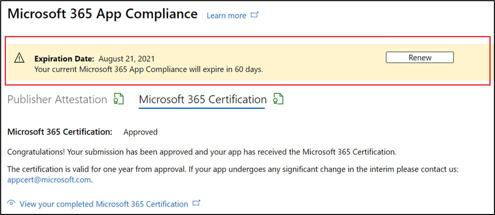

# 合作夥伴的應用程式合規性計畫Microsoft 365使用者指南

|階段|標題|
|---|---|
|階段 1| 發行者證明|
|階段 2| Microsoft 365 憑證|

## 1. 概觀
本檔作為我們合作夥伴的逐步使用者指南，這些合作夥伴已註冊Microsoft 365應用程式合規性計畫，並致力於透過合作夥伴中心入口網站進行Publisher證明和認證。

## 2.縮寫&定義
| 縮略字 |定義 |
|---|----|
|電腦 [ (合作夥伴中心) ](https://partner.microsoft.com/)|適用于所有 Microsoft 合作夥伴的入口網站。 合作夥伴登入合作夥伴中心並提交自我評估問卷。 Microsoft 365應用程式合規性[合作夥伴中心](https://partner.microsoft.com/dashboard/home)|
|ISV|獨立軟體廠商。 A.k.a. 合作夥伴或開發人員|
|應用程式來源| [應用程式目錄](https://appsource.microsoft.com/)
|範例|[現在虛擬代理程式](https://appsource.microsoft.com/product/office/WA104381816)|

## 3.Publisher證明工作流程

**首頁** ：這是合作夥伴登入合作夥伴中心之後的登陸頁面。

**步驟 1** ：選取 [Marketplace 供應專案]。 

  
**步驟 2**：選取 [Marketplace 供應專案] 之後，切換至 [Office市集]。 從清單中選取應用程式，以開始Publisher證明程式。

選取應用程式時，會出現另一個導覽列，其中包含 [其他認證資訊] 選項，然後按一下 [應用程式合規性]。
  
**步驟 3**：選取 [應用程式合規性]

**步驟 4**：填寫Publisher證明的自我評估問卷

**注意 如果您要返回更新/重新提交應用程式，請按一下 [選擇產品] 的下拉式清單，選取應用程式，然後按一下 [複製]。**

您也可以利用匯入/匯出功能離線完成表單，並在完成後匯入表單。

**步驟 5**：完成後，按一下 [提交]，評定現在會是 [正在檢閱中]。

![按一下 [Sumbit]](../media/UserGuidePhotos/07.png)

### 核准/拒絕案例：

**A. Publisher證明拒絕**

- 在此階段拒絕時，合作夥伴可以：
    - 檢視失敗報告
         - 合作夥伴會透過電子郵件收到通知，他們可以在合作夥伴中心檢視失敗報告
    - 更新並重新提交Publisher證明

**B. Publisher證明核准**

- 核准後，合作夥伴可以：
    - 更新並重新提交證明
    - 檢視和共用已完成Publisher證明
    - 開始Microsoft 365認證程式

**張貼Publisher證明核准：AppSource 中針對發行者證明應用程式連結的範例**

## 4.Microsoft 365認證工作流程

合作夥伴可以選取核取方塊並按一下 [提交] 來開始認證程式 

**步驟 1：** 初始檔提交 填寫所有詳細資料、上傳相關檔，然後按一下 [提交]

 

按一下 [提交] 時，將會檢閱證明提交。 

如果初始檔不足或不相關，分析師會要求修訂。 分析師將與合作夥伴合作，協助取得正確的檔以供核准。 

一旦分析師核准初始檔提交，合作夥伴必須提交控制需求。 

**步驟 2：** 控制項需求提交 填寫所有詳細資料、上傳相關檔，然後按一下 [提交] 

 
 

按一下 [提交] 時，將會檢閱認證提交。 

如果控制需求檔不足或不相關，分析師會要求修訂。 分析師將與合作夥伴合作，協助取得正確的檔以供核准。 

 
 

如果提交不符合核准標準，分析師將會拒絕提交。 合作夥伴可以與分析師合作，以提供相關資訊和檔。 

一旦符合所有安全性標準，分析師就會核准提交，而合作夥伴將會Microsoft 365認證。 

**認證核准後：AppSource 中Microsoft 365認證徽章的範例**

## 5.Microsoft 365更新工作流程：
  
**Microsoft 365 Publisher證明和認證更新工作流程：** Microsoft 365應用程式合規性計畫現在提供年度更新程式。 在此程式中，應用程式開發人員可以更新其現有的Publisher證明問卷，以及Microsoft 365認證所需的檔。 
 
**好處：** 

- 在 AppSource、Teams Store、Office Store 和其他店面中維護您的認證徽章，以區分應用程式。 
- 提高客戶對使用認證應用程式的信賴度。 
- 使用更新的認證資訊，協助 IT 系統管理員做出明智的決策。 

合作夥伴 [中心](https://partner.microsoft.com/dashboard/home) 提供更新程式，以提供順暢的體驗。 從到期日之前的 90 天開始，合作夥伴中心會顯示續約提醒。 定期提醒也會在到期前 90 天、60 天和 30 天透過電子郵件傳送。

**階段 1：Publisher證明更新：** 

合作夥伴 [中心](https://partner.microsoft.com/dashboard/home) 提供新的續約程式，以提供順暢的體驗。 從到期日之前的 90 天開始，合作夥伴中心會顯示續約提醒。 定期提醒也會在到期前 90 天、60 天和 30 天透過電子郵件傳送。 

**步驟 1**：選取 **[更新**] 以更新Publisher證明。 

**步驟 2**：檢閱先前的Publisher證明解答，並視需要更新最新資訊。 提交Publisher證明以在準備就緒時進行更新。 Microsoft 365應用程式合規性分析師會加以檢閱。

**Publisher證明更新已核准**

**Publisher證明已過期：** 應用程式的資訊必須在到期日之前更新，才能在 Microsoft 檔上維護應用程式的 [Publisher 證明] 頁面。及時更新也可確保 AppSource、Teams Store、Office Store 和其他店面中應用程式的徽章和圖示持續出現。

注意：一旦過期，Publisher只要按一下 [更新]，即可隨時啟動證明更新程式。 

**階段 2：Microsoft 365認證更新** 

應用程式的認證資訊必須每年重新提交。 這需要重新驗證您目前環境的範圍內控制項。 當認證接近 1 年時，會傳送電子郵件通知，鼓勵重新提交檔和辨識項。 

**認證更新核准/拒絕案例：**
 
**案例 1：** 

認證更新已開始，目前正在檢閱中。

**案例 1A：**

認證更新拒絕：如果發生下列狀況，可能會拒絕認證： 
- 應用程式沒有必要的工具、程式或設定，而且無法在認證視窗內實作必要的變更。 
- 應用程式有待處理的弱點，無法在認證視窗內修正。 
 

    
**案例 1B：** 

認證更新已核准  

**認證到期：**
 
應用程式的資訊必須在到期日之前更新，才能在 Microsoft 檔上維護應用程式的 [認證] 頁面。及時更新也會確保 AppSource 和 Team Store 中應用程式的持續徽章和圖示。

應用程式的資訊必須在到期日之前更新，才能在 Microsoft 檔上維護應用程式的 [認證] 頁面。及時更新也可確保 AppSource、Teams Store、Office Store 和其他店面中應用程式的徽章和圖示持續出現。 

    
**注意**：過期後，只要按一下 [更新]，即可隨時啟動Publisher證明和認證程式。 

