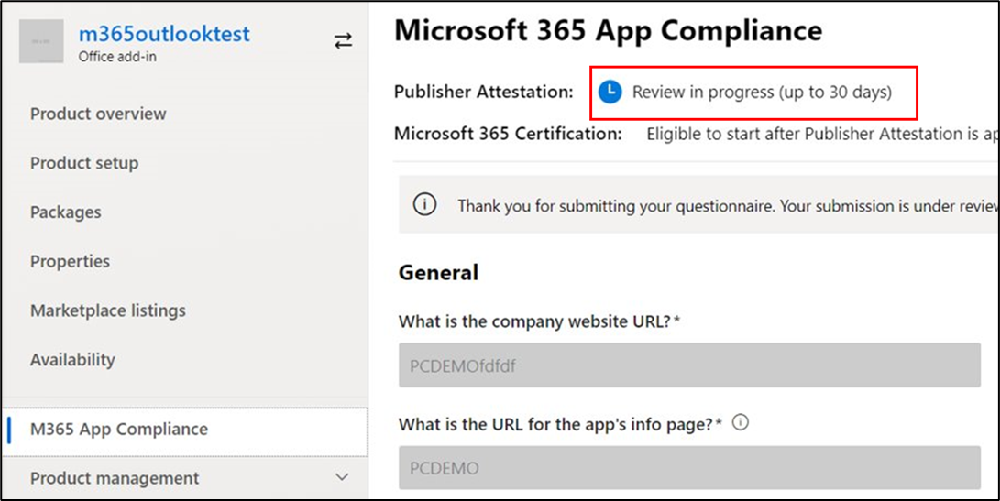

# Microsoft 365 應用程式規範計畫的合作夥伴使用者指南Partner's User Guide for Microsoft 365 App Compliance Program

|||
|---|---|
|第1層Tier 1| 發行者證明Publisher Attestation|
|第2層Tier 2| Microsoft 365 認證Microsoft 365 Certification|

## 1. 簡介1. Overview
這份檔是為我們的合作夥伴做為逐步使用者指南，註冊 Microsoft 365 應用程式相容性計畫，其意圖是透過發行者證明和憑證，不過是合作夥伴中心入口網站。This document acts as a step-by-step user guide for our Partners, enrolled for Microsoft 365 App Compliance Program aiming to undergo Publisher Attestation and Certification though Partner Center portal.

## 2. 縮寫 & 定義2. Acronyms & Definitions
| | |
|---|----|
|縮略字Acronym | 定義Definition |
|電腦 (合作夥伴中心) PC (Partner Center)|所有 Microsoft 合作夥伴的入口網站。A portal for all Microsoft Partners. 合作夥伴會登入至夥伴中心，並提交 Self-Assessment 問卷 https://partner.microsoft.com/A Partner logs in to Partner Center and submits Self-Assessment Questionnaire https://partner.microsoft.com/|
|ISVISV|獨立軟體廠商 A.k.a。Independent Software Vendor A.k.a. Partner or DeveloperPartner or Developer|
|應用程式來源App Source|  (的應用程式目錄 https://appsource.microsoft.com/)Catalog of apps (https://appsource.microsoft.com/)
||範例：現在，虛擬代理程式 (https://appsource.microsoft.com/en-us/product/office/WA104381816)Example: Now virtual agent (https://appsource.microsoft.com/en-us/product/office/WA104381816)|

## 3. 發行者證明工作流程3.   Publisher Attestation Workflow

首頁：這是一次夥伴登入夥伴中心的登陸頁面。Home Page: This is the landing page once a partner logs in to Partner Center.

**步驟 1**   ：在頁面左側的導覽列中：**Step 1**   : On the left side of the page, in the navigation bar:
1. 選取 Office 存放區Select Office store
1. 選取一覽Select Overview

選取「一覽」時，partner 可以查看透過夥伴中心提交且適用于 Microsoft 365 規範計畫的應用程式清單。Upon selecting ‘Overview’, partner can see list of apps submitted through Partner Center and available for the Microsoft 365 Compliance program.

**步驟 2** ：從清單中選取應用程式，以開始發行者證明程式。**Step 2** : Select an app from the list to begin the Publisher Attestation process.

選取應用程式時，會彈出另一個導覽列，其中包含選項「應用程式相容性」On selecting an app, another navigation bar will pop up with option ‘App Compliance’

**步驟 3**：選取「應用程式符合性」**Step 3**: Select ‘App Compliance’

**步驟 4**：填寫發行者證明的 Self-Assessment 問卷**Step 4**: Fill out the Self-Assessment Questionnaire for Publisher Attestation

**附注**：如果您要回到更新/重新提交應用程式，請按一下 [選擇產品的下拉式清單]，選取應用程式，然後按一下 [複製]。**Note**:If you are coming back to update/re-submit your application, click dropdown for ‘Choose the product’, select the app and click ‘clone’.

 

您也可以利用 [匯入/匯出] 功能，離線完成該表單，並在完成後將其匯入。You can also leverage the Import/Export feature to complete the form offline and import it once completed. 

**步驟 5**：完成後，按一下 [提交]，評估現在會是「審閱」。**Step 5**: Once completed, click on ‘Submit’, the assessment will now be ‘under review’.

### 核准/拒絕案例：Approve/Reject Scenarios:

**發行者證明拒絕****A.Publisher Attestation Rejection**

在此階段遭到拒絕時，合作夥伴可以：In case of rejection at this stage, an partner can:
-   View 失敗報告。View failure report.
    - 合作夥伴將會透過電子郵件通知合作夥伴中心。Partner will be notified in Partner Center and via email.
-   更新 Self-Assessment 的回應。Update Self-Assessment responses.
-   重新提交自我評估。Re-submit Self-Assessment.

**B. 發行者證明重新提交****B.Publisher Attestation Re-submission**

**C. 發行者證明核准****C.Publisher Attestation Approval**

-   在核准合作夥伴可以執行下列作業：Upon approval partner can:
    - 更新並重新提交證明Update and resubmit attestation
    - 查看和共用已完成的 Publisher 證明View and share completed Publisher Attestation
    - 開始 M365 認證處理常式Start M365 Certification Process

**發佈發行者驗證核准： publisher attested 應用程式的 AppSource 連結範例****Post Publisher Verification Approval: Example of link in AppSource for publisher attested apps**

## 4. Microsoft 365 認證工作流程4. Microsoft 365 Certification Workflow

協力廠商按一下「提交」並提交所有檔和證據進行審閱之後：Once partner clicks on ‘Submit’ and submits all documents and evidence for review: 

### Microsoft 365 認證-已提交Microsoft 365 Certification - Submitted

**Microsoft 365 認證-已拒絕****Microsoft 365 certification - Rejected**

**Microsoft 365 認證-已核准****Microsoft 365 Certification - Approved**

**後憑證核准： AppSource 中的 Microsoft 365 認證徽章範例****Post Certification Approval: Example of Microsoft 365 certification badge in AppSource**

## 5. 現有 Isv 的工作流程5. Workflow for Existing ISVs

如果您是現有的 ISV，且想要更新發行者證明。If you are an existing ISV and want to Update Publisher Attestation.

**步驟 1**：按一下「更新並重新提交發行者證明」連結。**Step 1**: Click on ‘Update and re-submit your Publisher Attestation’ link.

**附注：**：如果您要回到更新/重新提交應用程式，請按一下 [選擇產品的下拉式清單]，選取應用程式，然後按一下 [匯入]。**Note:**: If you are coming back to update/re-submit your application, click dropdown for ‘Choose the product’, select the app and click ‘Import’.

**步驟 2**：對表單進行更新，然後按一下 [儲存/提交]。**Step 2**: Make updates to your form and click Save/Submit.

![按一下 [儲存] 或 [提交]](../media/existing%20isv%202.png)

送出後，即會進行考核。Once submitted, it will be under review.

## 6. Microsoft 365 Re-Certification 工作流程：6.   Microsoft 365 Re-Certification Workflow:

當應用程式即將達到1年的憑證周年時，會定期提醒您更新認證。When an app is about to reach its 1-year Certification Anniversary, there will be periodic reminders to renew certification.

**已完成發行者證明。認證 InProgress。****Publisher Attestation Completed. Certification InProgress.**

核准/拒絕 Secnario：已拒絕證書Approval/Rejection Secnario: A. Certification Rejected

B。B. 已核准認證Certification Approved

到期案例：發行者證明已過期Expiration Scenario: A. Publisher Attestation Expired

B。B. 憑證已過期Certification Expired

