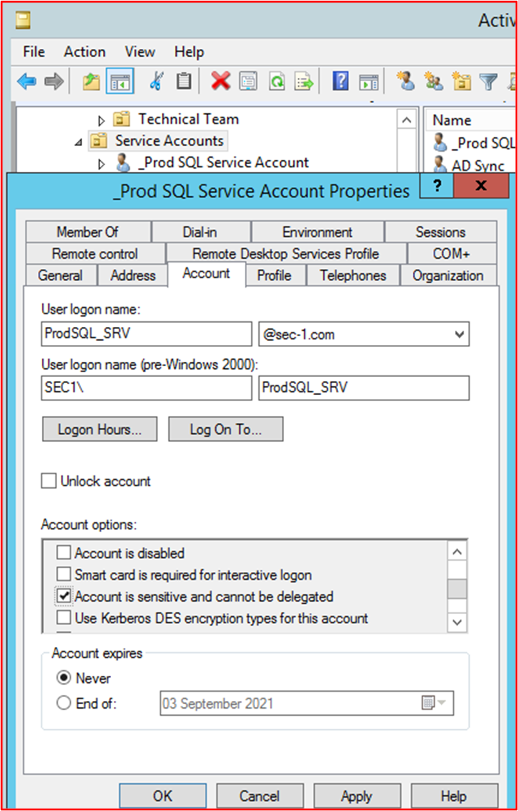
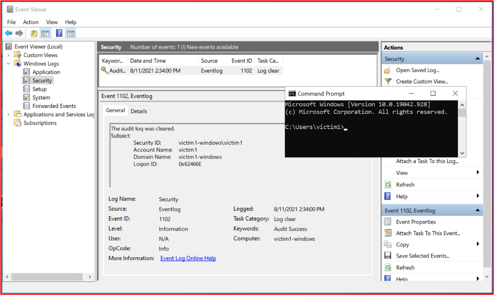

# Microsoft 365認證-範例證據指南

## 概觀

您已建立此指南，為 isv 提供 Microsoft 365 憑證控制所需詳細資訊層級的協助。 此外，它還提供如何構建證據提交的指導方針，以及可能用來滿足證書控制的證據類型範例。 在本檔中共用的任何範例，都不是唯一可用來協助保證控制得以滿足的證據，但是只會做為資訊類型的指導方針，以協助認證分析分析員提供必要的證據，以協助其使用此斷言。 請注意：-用來滿足需求的實際介面、螢幕擷取畫面及檔會因產品使用方式、系統設定及內部程式而異。 此外，請注意，必須要有原則或程式檔，才能傳送實際的檔，而不是在一些範例中所顯示的螢幕擷取畫面。 建議您遵循這些指導方針，避免因證據不足而推遲您的評估。 

在認證中有兩個區段需要提交：
1. [**初始檔提交：**](https://docs.microsoft.com/en-us/microsoft-365-app-certification/docs/initialdocumentsubguide) 限定評估範圍所需的一小部分高層級檔。
1. **證據提交：** 針對您的認證評估，每個範圍中的每個控制項所需的完整證據集合。 每個控制項的證據範例如下所示。

## 結構 

這會直接與「線上 Microsoft 365 憑證提交指南」中所述的類別相關聯。 請注意，最佳使用本指南的 Microsoft 365 憑證檢查清單試算表，可以避免 misunderstanding 哪個控制項設定此指導方針中每個範例的參照。 本檔中提供的指導方針如下所述：
- 安全性網域：所有控制項群組成的三個安全網域：應用程式安全性、運作安全性及資料安全性和隱私權。
- Control (s) ： = 評估活動描述-這些控制項 (s) 和關聯的號碼 (不會從 ) 的憑證檢查清單中取得。 Microsoft 365。  
- 目的： = 為何在程式中包含安全性控制，以及其要緩解的特定風險的目的。  [！注意事項] 此資訊將提供 Isv 與控制項背後的理由，以更好地瞭解需要收集的證據類型，以及哪些 ISV 必須注意和瞭解如何產生證據。
- 範例證據指導方針：若要協助指導 Microsoft 365 憑證檢查清單試算表上的證據收集工作，這可讓 ISV 能夠清楚地看到可供使用它的憑證分析員使用之證據類型的範例，以明確判斷控制項是否已到位和維護-並非本質上的意義。
- 證據範例： = 此區段提供對 Microsoft 365 憑證檢查清單試算表中每個控制項（特別是針對 [試算表) ] 中的 [運作安全性] 和 [資料安全性] 和 [隱私權安全性 (網域]）所捕獲的可能證據的範例螢幕擷取畫面和圖像。 請注意，在範例中，任何紅色箭號和方塊的資訊，都是為了進一步協助您瞭解符合任何控制項所需的需求。

## 安全性網域：應用程式安全性

**Control 1-control 16**：

Application Security domain 控制項可以使用過去12個月內發出的滲透測試報告來 satisifed，顯示您的應用程式沒有尚未完成的漏洞。 唯一需要的提交是由著名獨立公司的簡潔報告。 

## 安全性網域：運作安全性/安全開發

「運作安全性/安全開發」安全性網域的設計是為了確保 Isv 針對大量威脅者所面臨的威脅實施一組強大的安全性緩解技巧。  這是為了保護運作環境和軟體發展程式，以建立安全的環境。

#### 惡意程式碼保護-防毒程式

**不控制1：** 提供原則檔，以管理防病毒的作法與程式。
- 目的：此控制的目的在於評估 ISV 對考慮來自電腦病毒之威脅時所面臨的問題。 透過建立及使用業界最佳作法來開發防病毒原則和程式，ISV 會為組織提供一項專為組織降低惡意軟體面臨之風險的能力，列出病毒偵測和消除中的最佳作法，並提供已記錄的原則為組織及員工提供建議安全性指南的證據。 透過記錄 ISV 如何部署反惡意程式碼 decencies 的原則和程式，這可確保此技術的一致展及維護，以降低惡意程式碼對環境的風險。

- 證據指導方針範例：提供一份防毒軟體/反惡意軟體原則，詳述您的基礎結構中所執行的程式與程式，以提升防毒程式或惡意程式碼的最佳作法。
範例證據

- 證據範例：

**附注：** 這個螢幕擷取畫面顯示原則/程式檔，預期是供 Isv 共用實際的支援原則/程式檔，而不只是提供螢幕擷取畫面。

**控制項2：** 提供實實在在的證據，表明防毒軟體是在所有抽樣的系統元件上執行。

- 目的：在您的環境中執行防病毒 (AV)  (或反惡意程式碼) 防護，以防範網路安全風險，但在複雜和數位時，可能會導致您或可能不會注意到可能的 damagingattacks。 將 AV 部署至所有支援其使用的系統元件，將有助於降低環境中引入反惡意程式碼的某些風險。 它只會使用單一端點加以解除保護，以有可能會為威脅者提供攻擊的載體，以在環境中取得 foothold。 因此，AV 應該是一種防護層級，以防範這類威脅。

- 證據指導方針範例：證明已評估的環境中的 AV 使用中實例正在執行。 為範例中的 _每個裝置_ 提供一個螢幕擷取畫面，以支援使用防毒程式、防毒軟體使用中，或者如果您有一個集中式管理主控台用於防病毒，您可能可以從該管理主控台進行示範。 如果使用管理主控台，請務必在已抽樣裝置連線及運作的螢幕擷取畫面中進行證據。

- 證據範例1：下列螢幕擷取畫面已從 Azure Security Center 取得;它會顯示已在名為 MSPGPRODAZUR01 的 VM 上部署反惡意程式碼擴充 &quot; &quot; 。

- 證據範例2

下列螢幕擷取畫面已從 Windows 10 裝置中取得，顯示 &quot; &quot; 為主機名 &quot; CLARANET-SBU-WM 開啟即時保護 &quot; 。

**控制項3：** 提供 demonstratable 證據，讓所有環境 (在1天) 內，都是最新的防病毒簽名。

- 目的：每天識別數百封新惡意軟體和潛在有害的應用程式 (PUA) 。 若要針對新近發行的惡意程式碼提供適當的防護，您必須定期更新 AV 簽名，以進行新發行的惡意程式碼的帳戶。

- 這個控制措施是為了確保 ISV 已考慮到環境的安全性，以及過時的 AV 可能會對安全性造成的影響。

- 證據指導方針：從每個抽樣裝置提供防病毒記錄檔，顯示每天都會套用更新。

- 範例證據：下列螢幕擷取畫面顯示每日至少一次的 Microsoft Defender 更新，只須顯示 &#39;事件2000，Windows Defender&#39; 是更新。 會顯示主機名稱，顯示已從範圍內系統 &quot; CLARANET-SBU-WM 中取得 &quot; 。

**附注：** 提供的證據必須包含匯出記錄檔，以在較長的時間內顯示每日更新。 某些防病毒產品會產生更新記錄檔，所以應該提供這些檔案，或從事件檢視器匯出記錄。

**控制項4：** 提供 demonstratable 證據，以將反病毒設定為執行跨存取掃描或所有抽樣系統元件的定期掃描。

**附注：** 如果未啟用 [存取時掃描]，則 **必須** _be 啟用「每日掃描」和「alerting_。

- 目的：此控制的目的在於確定惡意程式碼會快速識別，以盡可能降低這對環境所造成的影響。 在進行中存取掃描的執行方式，以及自動封鎖惡意程式碼的位置，這會協助阻止反病毒軟體所知道的惡意程式碼感染。 在某些情況下存取掃描的&#39;，由於誤報造成服務中斷的危險，每日 (或更) 掃描及警示機制，必須實施，以確保及時回應惡意程式碼感染，以減少損毀。

- 證據指導方針：針對支援防病毒的範例中的 _每個裝置_ ，提供一個螢幕擷取畫面，顯示該防毒程式已在裝置上執行，並已設定為可供 (即時掃描) 掃描， **或** 提供顯示定期掃描的螢幕擷取畫面，以供每日掃描使用，則會設定警示，以及範例中 _每個裝置_ 的最後一個掃描日期。

- 範例證據：下列螢幕擷取畫面顯示已針對主機 &quot; CLARANET-SBU-WM 啟用即時保護 &quot; 。

**不控制5：** 提供 demonstratable 證據，以防病毒方式設定為自動封鎖所有抽樣系統元件的惡意程式碼或隔離及警示。

- 目的：惡意程式碼的複雜程度會隨著時間的 devastation 而逐漸演變。 此控制項的目的是讓惡意程式碼停止執行，進而停止惡意程式碼執行其潛在破壞的負載，或者，如果自動封鎖不是一個選項，請透過警示並立即回應可能的惡意程式碼感染，來限制惡意軟體可 wreak havoc 的時間長度。

- 證據指導方針：針對支援防病毒的範例中的 _每個裝置_ 提供螢幕擷取畫面，顯示防毒程式正在電腦上執行，並設定為自動封鎖惡意程式碼、警示或隔離及警示。

- 證據1：下列螢幕擷取畫面顯示主機 &quot; CLARANET-SBU-WM &quot; 已設定 Microsoft Defender 防毒軟體的即時保護。 如這一設定所示，這會找到並停用惡意程式碼，以在裝置上安裝或執行惡意程式碼。

**控制項6：** 提供 demonstratable 證據，以在部署之前核准應用程式。

- 目的：搭配應用程式控制，組織將會核准可在作業系統上執行的每個應用程式/進程。 此控制的目的在於確定已適當的核准程式可授權可執行哪些應用程式/進程。

- 證據準則範例：您可以提供證據，顯示正在遵循核准程式。 這可能是透過簽署檔、在變更控制系統中追蹤，或是使用 Azure DevOps 或 JIRA 等專案來追蹤這些要求和授權所提供。

- 範例證據：下列螢幕擷取畫面示範管理環境中每個允許執行之應用程式的核准程式。 這是以紙面為基礎的處理常式，但可使用其他機制。

**控制編號7：** 提供 demonstratable 證據，表明具有業務合理性論證的核准應用程式完整清單已存在並維持維護。

- 目的：組織必須維護已核准之所有應用程式的清單，以及應用程式/進程的認可資訊，這一點很重要。 這會協助確保設定保持在最新，並可對照基準檢查，以確保未設定未經授權的應用程式/流程。

- 證據指導方針：提供已記錄的認可應用程式/流程清單，以及業務理由。

- 證據範例：下列螢幕擷取畫面列出已核准的應用程式與業務理由。

**附注：** 這個螢幕擷取畫面顯示檔，預期是供 Isv 共用實際的支援檔，而不只是提供螢幕擷取畫面。

**控制項8：** 提供支援檔，詳述應用程式控制軟體的設定，以符合特定的應用程式控制機制。

- 目的：應該記錄應用程式控制技術的設定，以及如何維護技術（亦即，新增和刪除應用程式/流程）的程式。 如本檔中所述，使用的機制類型應該是每個應用程式/處理常式的詳細資訊。 這會將摘要放入下一個控制項，以確保將技術設定成已記載。

- 證據指導方針範例：提供支援檔，詳述如何設定應用程式控制項，以及如何在技術中設定每個應用程式/處理常式。

- 範例證據：下列螢幕擷取畫面列出用來執行應用程式控制項的控制項機制。 您可以在下方看到1個應用程式正在使用憑證控制項，另一個則是使用檔路徑。

**附注：** 這個螢幕擷取畫面顯示檔，預期是供 Isv 共用實際的支援檔，而不只是提供螢幕擷取畫面。

**控制項9：** 提供 demonstratable 證據，以從所有採樣的系統元件，將應用程式控制設定為已記錄。

- 目的：此方法的目的在於驗證每個檔的範例中，設定應用程式控制項的方式。

- 證據指導方針範例：為範例中的 _每個裝置_ 提供螢幕擷取畫面，以顯示已設定並啟動應用程式控制項。 這應該會顯示電腦名稱稱、其所屬的群組，以及套用到這些群組和電腦的應用程式控制原則。

- 證據範例：下列螢幕擷取畫面顯示已啟用軟體限制原則的群組原則物件。

接下來的螢幕擷取畫面會顯示上控制項的行中的設定。

在下一個螢幕擷取畫面中，會顯示 M365 環境和包含在套用至此 GPO 物件之範圍內的電腦 &#39;設定&#39; 的網域電腦。

此最後的螢幕擷取畫面會顯示在 &quot; &quot; 上述螢幕擷取畫面內的範圍內伺服器 DBSERVER1 位於 OU 內。

### 修補程式管理–風險排名

快速識別和修正安全性漏洞可協助您降低威脅者在威脅環境或應用程式時所面臨的風險影響。 修補程式管理分為兩個區段：風險排名及修補。 這三個控制項涵蓋安全性弱點的識別，並根據其帶來的風險加以排名。

此安全控制群組位於平臺即服務 (的範圍內 PaaS) 主控環境，因為應用程式/增益集的協力廠商軟體庫和基本代碼必須根據風險排名進行修補。

**控制項10：** 提供原則檔，可控制如何識別新的安全性弱點，並指派風險分數。

- 目的：此控制項的目的在於提供支援檔，以確保快速識別安全弱點，以減少威脅參與者利用這些弱點的機會。 強健的機制必須就地識別，以找出組織所使用之所有系統元件的漏洞;例如，作業系統 (Windows 伺服器、Ubuntu 等 ) 、應用程式 (Tomcat、MS Exchange、SolarWinds 等 ) 、程式碼相依性 (AngularJS、jQuery 等 ) 。 組織不僅必須確定房地產中的安全弱點的及時識別，也必須根據弱點所呈現的風險，以確保修正在適當的時間範圍內執行。

**記事** 即使您是在純平臺內的服務環境中執行，仍然有責任識別您的程式碼基底中的漏洞：例如，協力廠商文件庫。

- 證據準則範例：提供支援檔 (不是螢幕擷取畫面) 

- 範例證據：此螢幕擷取畫面顯示風險排名原則的程式碼片段。

**附注：** 這個螢幕擷取畫面顯示原則/程式檔，預期是供 Isv 共用實際的支援原則/程式檔，而不只是提供 screenshot。_

**控制項11：** 提供如何識別新安全性弱點的證據。

- 目的：此控制的目的在於確定已遵循此程式，且&#39;的功能足以識別整個環境中的新安全性弱點。 這可能不只是作業系統。它可能包含在環境中執行的應用程式和任何程式碼相依性。

- 證據指導方針：您可以透過顯示郵寄清單訂閱的方式來提供證據，以手動方式查看新發行的漏洞的安全性來源。 (是否需要充分追蹤活動的時間戳記，例如，使用 JIRA 或 Azure DevOps) 時，在尋找到期的軟體庫時，可能會 Snyk 可的 (工具。 或是使用識別過期軟體的已驗證掃描來 Nessus。 ) 。

**記事** 如果使用 Nessus，則必須定期執行此做法，以快速識別安全性漏洞。 我們建議您至少每週更新一次。

- 範例證據：此螢幕擷取畫面示範郵件群組是用來接收安全弱點的通知。

**控制項12：** 提供證據，表明已發現所有的漏洞都會被指派風險排名。

- 目的：修補需要以風險為基礎，riskier 此弱點，需要修正的速度越快。 已識別之弱點的風險排名是此程式的整體部分。 此控制的目的在於確定有記錄的風險排名程式已記錄下來，以確定所有識別的漏洞都會根據風險適當地排名出。 組織通常會利用 CVSS (常見的漏洞計分系統) 由廠商或安全性調查人員提供的等級。 如果組織依賴 CVSS，則建議您在該程式中包含重新排名機制，以允許組織根據內部風險評估來變更排名。 在此情況下，此弱點可能不是應用程式，因為應用程式已在環境中部署的方式。 例如，可能會發佈可影響組織未使用之特定文件庫的 JAVA 弱點。

- 證據指導方針：透過螢幕擷取畫面或其他方式來提供證據，例如 DevOps/Jira，這會示範漏洞是透過風險排名程式進行，並為組織指派適當的風險排名。

- 範例證據：這個螢幕擷取畫面顯示在欄 F 和 G 中進行的風險排名，以及在 F 和 G 中重新排名的情況，是否應組織執行風險評估，並判斷風險可以降級。 重新排名風險評估的證據必須提供為支援證據

### 修補程式管理–修補程式

下列控制項適用于修補程式管理的修補元素。 為了維護安全的運作環境，必須對應用程式/附加元件及支援的系統進行適當的修補。 識別 (或公開發行) 與修補之間的適當時間範圍必須進行管理，以減少威脅者利用之弱點的機會。 Microsoft 365 憑證不會 stipulate &#39;修補視窗&#39;，但憑證分析員會拒絕不合理的時段。

此安全控制群組位於平臺即服務 (的範圍內 PaaS) 主控環境，因為應用程式/增益集的協力廠商軟體庫和基本代碼必須根據風險排名進行修補。

**控制項13：** 提供原則檔，以修補內建的系統元件，其中包含嚴重、高及中等風險弱點的最小修補期限;和解除委任任何不支援的作業系統和軟體。

- 目的：許多安全性合規性框架（亦即 PCI-DSS、ISO 27001、NIST (SP) 800-53）都需要修補程式管理。 良好的修補程式管理的重要性無法超越壓力，因為它可以修正軟體中的安全性和功能問題、固件及緩解漏洞，以協助減少利用的機會。 這個控制的目的是為了將機遇的機會降至最低，威脅者必須利用範圍內環境內可能存在的漏洞。

- 證據指導方針範例：提供所有原則和程式的複本，詳述修補程式管理的程式。 這應該會在最小的修補程式視窗中包含區段，而且不能在環境內使用不受支援的作業系統和軟體。

- 範例證據：下列為範例原則檔。

**附注：** 這個螢幕擷取畫面顯示原則/程式檔，預期是供 Isv 共用實際的支援原則/程式檔，而不只是提供 screenshot。_

**控制編號14：** 提供 demonstratable 證據，以修補所有抽樣的系統元件。

**附注：** 包括任何軟體/協力廠商的文件庫。

- 目的：修補弱點可確保表單部分資訊技術基礎結構中 (硬體、軟體和服務) 的不同模組保持在最新狀態，並從已知的漏洞中免費。 在弱點詳細資料與修補的版本之間，必須儘快執行修補，以盡可能降低安全性事件的可能性。 這甚至更為重要的地方是利用眾所周知的弱點。

- 證據指導方針：提供範例中的 _每個裝置_ 的螢幕擷取畫面，以及支援的軟體元件，顯示已隨所記錄的修補程式安裝。

- 範例證據：下列螢幕擷取畫面顯示在「範圍系統元件 &quot; CLARANET-SBU-WM」中 &quot; 執行 Windows 更新的修補原則。

**附注：** 所有範圍內系統元件的修補都必須是證據。 這包括類似事項;作業系統更新、Application/Component 更新 (i.e__。、 _Apache Tomcat、OpenSSL 等 ) 、軟體相依性 (例如 JQuery、AngularJS_ 等 ) 等等。

**控制項15：** 提供 demonstratable 證據，使其不會在環境中使用任何不支援的作業系統和軟體元件。

- 目的：廠商未維護的軟體會因未修正的已知弱點而受到影響。 因此，在實際執行環境中不得使用不支援的作業系統和軟體元件。

- 證據指導方針範例：提供範例中 _每個裝置_ 的螢幕擷取畫面，顯示執行 (作業系統的版本，包含螢幕擷取畫面) 中的伺服器&#39;s 名稱。 除此之外，請提供在環境中執行的軟體元件執行支援版本的證據。 您可以提供內部弱點掃描報告的輸出，以提供已驗證掃描的內部弱點掃描報告 (包含) 和/或檢查協力廠商文件庫（如 [Snyk](https://snyk.io/)、 [Trivy](https://github.com/aquasecurity/trivy) 或 [NPM Audit](https://docs.npmjs.com/cli/v7/commands/npm-audit)）的工具輸出。 如果只在 PaaS 中執行，則修補控制項群組必須涵蓋協力廠商的文件庫修補程式。

- 範例證據：下列證據顯示內建的系統元件 THOR 執行的是廠商所支援的軟體（因為 Nessus 尚未標記任何問題&#39;）。

**附注：** 完整的報告必須與認證分析員共用。

- 證據2範例

這個螢幕擷取畫面顯示在支援的 Windows 版本上執行範圍內的系統元件 &quot; CLARANET-SBU-WM &quot; 。

- 證據3範例

下列螢幕擷取畫面是 [Trivy](https://github.com/aquasecurity/trivy) 輸出，其整個報告不會列出任何不受支援的應用程式&#39;t 列出。

**附注：** 完整的報告必須與認證分析員共用。

### 弱點掃描

透過引進一般的薄弱環節評估，組織可以偵測其環境中的弱點和 insecurities，這可能會為惡意的主角提供進入點，以損害環境。 弱點掃描可協助識別環境中遺失的修補程式或錯誤配置。 透過定期執行這些掃描，組織可以提供適當的補救措施，以最大限度降低因這些弱點掃描工具經常挑選的問題而遭到損害的風險。

**控制任何16：** 提供每季基礎結構及 web 應用程式的弱點掃描報告。 掃描必須針對整個公開的足跡執行， (IP 位址及 URLs) 和內部 IP 範圍。

**附注：** 這 **必須** 包含環境的完整範圍。

- 目的：弱點掃描會尋找組織中電腦系統、網路及 web 應用程式中可能的弱點，以找出可能導致安全性破壞及敏感性資料洩密的洞。 行業標準和政府法規等是弱點掃描通常是必要的，例如 PCI DSS (支付卡行業資料安全性標準) 。

- 依安全性度量的報表，依安全性 &quot; [衡量，已將2020安全性度量值導向至 PCI DSS 相容性](https://info.securitymetrics.com/pci-guide-2020) &quot; 狀態，這平均是從組織被發現攻擊者遭到威脅以危及系統安全的時間內，平均所用的 &#39;166 天。 一旦遭到損害，攻擊者會在平均127天記憶體取機密資料&#39; 因此，此控制項的目的在於識別範圍內環境內的潛在安全性弱點。

- 證據指導方針：針對在過去12個月內已執行的每個&#39;季度，提供完整掃描報告 (s) 。 報告應該清楚地陳述目標，以驗證是否包含完整公開公開，以及每個內部子網的適用位置。 提供 **每個** 季度的 **所有** 掃描報告。

- 範例證據：範例證據是從所使用的掃描工具提供掃描報告。 每個季度都應該提供&#39;s 掃描報告。 掃描必須包含整個環境系統元件，因此每個內部子網及環境可使用的每個公用 IP 位址/URL。

**控制17：** 提供 demonstratable 證據，修復在弱點掃描中識別的漏洞會隨著您已記錄的修補時間範圍進行修補。

- 目的：無法識別、管理和修正安全性漏洞與錯誤配置，可增加組織&#39;面臨可能造成資料損損損損的風險。 正確地識別和修正問題會看作組織&#39;的整體安全性狀態和環境（已具備各種安全性框架的最佳作法）的重要性和環境）。例如，ISO 27001 和 PCI DSS。

- 證據指導方針：提供適當的偽像 (例如，螢幕擷取畫面) 顯示從漏洞掃描中發現的漏洞範例會隨著上述控制項13中已提供的修補程式視窗而修正。

- 範例證據：下列螢幕擷取畫面顯示在此範例中名為 THOR)  (單一機器的對範圍環境進行的掃描， &quot; &quot; 顯示在2021年8月2日的漏洞。

下列螢幕擷取畫面顯示問題已解決，在修補原則中所定義的修補程式視窗內的2天之後。

**附注：** 針對此控制項，認證分析人員必須在過去的12個月內，查看每個季度的弱點掃描報告和修正。

### 防火牆

防火牆通常會在信任的 (內部網路) 、不可信 (Internet) 及不完全信任的 (DMZ) 環境之間提供安全性界限。 這通常是組織中防禦深度安全性策略中的第一行為，其設計目的是用來控制進入和傳出服務的流量流量，以及封鎖不想要的流量。 這些裝置必須嚴格控制，以確保其有效運作，而且不會因錯誤而導致環境面臨風險。

**控制編號18：** 提供原則檔，以控制防火牆管理的作法與程式。

- 目的：防火牆是分層安全性 (防禦深入) 策略中的重要第一行為，可保護環境不受信任的網路區域。 防火牆一般會根據 IP 位址和通訊協定/埠來控制流量流量，更多功能的防火牆也可以透過 &quot; &quot; 檢查應用程式流量，以根據所存取的應用程式來保護應用程式流量，以防禦誤用、弱點和威脅，以提供額外的應用層防禦。 這些保護措施只是防火牆的設定，因此很強的防火牆原則和支援程式必須已具備，以確保它們已設定為能夠適當地保護內部資產。 例如，具有規則的防火牆，允許所有來源到任何目的地的所有流量，都只是做為路由器。

- 證據的範例：提供您完整的防火牆原則/程式支援檔。 本檔應涵蓋下列所有適用于您環境的最佳作法和任何其他最佳作法。

- 範例證據：下列範例是我們需要的防火牆原則檔案類型的範例 (此為示範，而且可能不是完整) 。

**控制編號19：** 提供顯而易見的證據，指出在安裝至實際執行環境之前，會變更任何預設的系統管理認證。

- 目的：組織必須警惕廠商提供在裝置或軟體設定期間設定的預設系統管理認證。 預設認證通常是由廠商公開提供，而且可提供外部威脅，並有機會損害環境。 例如，在網際網路上進行預設 iDrac 的簡易搜尋 (整合型 Dell 遠端存取控制器) 認證會將 _root：： calvin_ 當做預設的使用者名稱和密碼醒目提示。 這可讓使用者遠端存取遠端伺服器管理。 此控制的目的是為了確保環境不會受到在裝置/應用程式強化時未變更的預設供應商認證的攻擊。

- 證據準則範例

- 這可以透過 screensharing 會話 evidenced，憑證分析員可嘗試使用預設認證，嘗試向範圍內的裝置驗證。

- 範例證據

下列螢幕擷取畫面顯示證書分析分析員從 WatchGuard 防火牆的無效使用者名稱/密碼所看到的內容。

**控制編號20：** 提供顯而易見的證據，表明防火牆已安裝在範圍內環境的邊界上，並安裝在周邊網路 (（也稱為 DMZ、隔離區域，以及遮罩式子網) 和內部信任網路）之間。

- 目的：防火牆可讓您控制不同安全性層級的不同網路區域之間的流量。 由於所有環境都已連接網際網路，所以防火牆必須安裝在網際網路與範圍內環境之間的界限上，亦即。 此外，防火牆必須安裝在較不受信任的 DMZ () 網路及內部信任網路之間的位置。 DMZs 通常是用來提供來自網際網路的流量，因此是攻擊的目標。 透過利用防火牆來控制流量流量，在&#39;的情況下，損害的 DMZ 受損，都一定會危及內部信任網路和公司/客戶資料的安全。 適當的記錄和警示應該已到位，以協助組織快速識別威脅，以最小化威脅者進一步損害內部信任網路的機會。 這個控制的目的是為了確保信任和較少信任的網路之間有足夠的控制權。

- 證據指導方針：證據應該是透過防火牆設定檔或螢幕擷取畫面提供，以示範 DMZ 已到位。 這應該會符合所提供的架構圖表，示範支援環境的不同網路。 防火牆上網路介面的螢幕擷取畫面，以及已在初始檔送出過程中所提供的網狀圖，應提供此證據。

- 範例證據：以下是 WatchGuard 防火牆示範兩個 DMZs 的螢幕擷取畫面，其中一個是) 的輸入服務 (，另一個則 (Bastian 主機) 。

**控制21：** 提供實實在在的證據，所有公開存取均會在隔離區域 (DMZ) 中終止。

- 目的：可公開存取的資源可公開多種攻擊。 正如之前所述，DMZ 的目的在於從信任的內部網路分割可能包含機密資料的較少信任網路。 因為可公開存取的主機可能會受到外部威脅者的影響，所以它會被視為較不信任的 DMZ。 公用存取應永遠在這些較低的信任網路中終止，這些網路是由防火牆充分細分，以協助保護內部資源和資料。 這個控制的目的是為了確保所有公用存取在這些較低的受信任 DMZs 中終止，如同對受信任的內部網路上的資源公開時一樣，危及這些資源的安全性，可提供 foothold 進入敏感性資料所在網路的威脅。

- 證據準則範例

- 為此提供的證據可能是防火牆設定，可顯示輸入規則，以及這些規則的終止位置，既就是將公用 IP 位址路由傳送到資源，或是提供 NAT (輸入流量的網路位址轉譯) 。

- 範例證據

在下方的螢幕擷取畫面中，有三個傳入規則，每個規則都會顯示 NAT 至10.0.3 和10.0.4 子網，也就是 DMZ 子網

**控制任何22：** 提供顯而易見的證據，透過防火牆所允許的所有流量都透過核准程式進行處理。

- 目的：由於防火牆是不受信任的流量和內部資源之間的防禦屏障，以及不同信任層級的網路之間，防火牆需要安全地設定，並確保只啟用商務運作所需的流量。 如果允許不必要的流量流量，或流量過於寬鬆的流量，這可能會在防護中帶來這些不同網路區域界限的弱點。 透過為所有的防火牆變更建立一個可靠的核准程式，引入一個規則會對環境帶來極大風險的風險。 Verizon&#39;s [2020 資料洩密調查報告](https://enterprise.verizon.com/en-gb/resources/reports/dbir/) 會強調 &quot; 錯誤&#39;s &quot; （包括錯誤配置）是唯一會持續增加年到年的動作類型。

- 證據指導方針：證據可以是檔的形式，顯示授權的防火牆變更要求，這可能是 CAB (變更顧問委員會) 會議或變更控制系統追蹤所有變更的時間。

- 範例證據：下列螢幕擷取畫面顯示正在使用以紙面架構處理常式要求及授權的防火牆規則變更。 例如，您可以透過 DevOps 或 Jira 之類的專案來完成此作業。

**控制23：** 提供顯而易見的證據，表明防火牆規則基本設定為丟棄未明確定義的流量。

- 目的：大多數防火牆會以自頂向下的方式處理規則，以嘗試及尋找符合規則。 如果規則相符，將會套用該規則的動作，而且會停止所有進一步的規則處理。 如果找不到符合的規則，預設會拒絕流量。 此控制項的目的在於，如果防火牆沒有找到符合的規則時，不&#39;預設會丟棄流量，則規則基底必須在 &quot; &quot; **所有** 防火牆清單的結尾包含 [拒絕所有規則]。 這是為了確保在處理規則時，防火牆會將&#39;預設值變成預設允許狀態，從而允許明確定義的流量&#39;。

- 證據指導方針：證據可以透過防火牆設定或以顯示顯示「拒絕所有規則」的所有防火牆規則的方式提供， &quot; &quot; 如果防火牆丟棄&#39;的流量預設符合規則，則會提供所有防火牆規則的螢幕擷取畫面，並提供廠商管理員指南的連結，以強調預設情況下，防火牆會丟棄所有未符合的流量。

- 範例證據：以下是 WatchGuard 防火牆規則基底的螢幕擷取畫面，它會示範未設定任何規則以允許所有流量。 結束時，WatchGuard 將會丟棄不會符合預設值&#39;的流量，因此沒有任何拒絕規則。

下列 WatchGuard 説明中心連結; [https://www.watchguard.com/help/docs/help-center/en-US/Content/en-US/Fireware/policies/policies\_about\_c.html](https://www.watchguard.com/help/docs/help-center/en-US/Content/en-US/Fireware/policies/policies_about_c.html) 包含下列資訊：

**控制任何24：** 提供顯而易見的證據，使防火牆只在所有非主控台管理介面上支援強式密碼編譯。

- 目的：若要減輕管理流量的中間人攻擊，所有的非主控台系統管理介面都應該只支援強式密碼編譯。 此控制項的主要目的是在設定非主控台連線時，保護系統管理認證。 此外，這也可以協助您防止偷聽至連線，嘗試重新顯示系統管理功能，以重新設定裝置或偵測的一部分。

- 證據指導方針範例：提供防火牆設定，如果設定提供非主控台管理介面的加密設定 (並非所有裝置都會將此專案當做「可設定選項」) 中包含。 如果這不是設定中&#39;t，您可以發出命令給裝置以顯示為這些連線設定的內容。 有些廠商可能會在文章中發佈這項資訊，這樣也可能是用來對此資訊進行證據的方式。 最後，您可能需要執行工具來輸出支援的加密。

- 範例證據：下列螢幕擷取畫面顯示 [SSLScan](https://github.com/rbsec/sslscan) 對照 TCP 埠8080上 WatchGuard 防火牆的 Web 系統管理介面輸出。 這會顯示 TLS 1.2 或更新版本，並使用最低的 AES 128bit 加密密碼。

**附注**： WatchGuard 防火牆也支援使用 SSH (tcp 埠 4118) 和 WatchGuard 系統管理員 (TCP 埠 4105 4117) 的管理功能 &amp; 。 您也需要提供這些非主控台管理介面的證據。

**控制項25：** 提供您執行防火牆規則檢查的 demonstratable 證據，至少每6個月。

- 目的：隨著時間的變化，使用範圍內環境的系統元件可能會發生設定蔓延的風險。 這通常會引入 insecurities 或錯誤配置，可增加環境面臨的風險。 設定蔓延可出於許多原因而引入，例如暫時變更協助疑難排解、臨時變更的特殊功能變更，以快速修正因引進快速修復的壓力而可能會導致過度的問題。 例如，您可能會引入暫時的防火牆規則 &quot; ，讓所有使用者都 &quot; 能克服緊急問題。 此控制項的目的在於識別錯誤配置的位置，其可能會引入 insecurities 和第二個，以協助識別不再需要的防火牆規則，亦即，如果服務已經停用但防火牆規則已不存在，就會加以移除。

- 證據指導方針：證據必須能夠證明已發生評審會議。 若要完成此作業，可透過共用防火牆檢查的會議紀要和任何其他變更控制證據，顯示從審閱中採取的任何動作。 請確定日期顯示如下&#39;d 至少需要有兩個會議 (（即每六個月) 

- 範例證據：下列螢幕擷取畫面顯示在2021年1月進行防火牆審查的證據。

下列螢幕擷取畫面顯示在2021年7月進行防火牆審查的證據。

### 防火牆– WAFs

將 Web 應用程式防火牆 (WAF) 部署到方案中是選用的。 如果使用 WAF，這會在 &#39;運作安全&#39; 安全網域中，算作計分清單的額外信用。 WAFs 可檢查網頁流量，以篩選和監視網際網路與發佈 web 應用程式之間的網頁流量，以識別 web 應用程式的特定攻擊。 web 應用程式可能會受到許多 web 應用程式（例如 SQL 注入 (SQLi) 、跨網站腳本 (的 XSS) 、跨網站要求偽造 (CSRF/XSRF) 等）的影響，而 WAFs 的設計是為了防範這些類型的惡意載荷，協助保護 web 應用程式不會受到攻擊和潛在的破壞。

**控制任何26：** 提供 demonstratable 證據，供 Web 應用程式防火牆 (WAF) 設定為主動監視、警示及封鎖惡意流量。

- 目的：此控制項已在適當位置，以確認 WAF 已就地放入所有傳入的 web 連線，並且設定為封鎖或警示惡意流量。 若要為網頁流量提供額外的防禦層級，WAFs 必須針對所有傳入的 web 連線進行設定，否則外部威脅參與者可能略過 WAFs，以提供此額外的保護層級。 如果&#39;WAF 未設定為積極封鎖惡意流量，WAF 必須能夠為人員提供立即警示，以協助維護潛在惡意流量，以協助維護環境的安全性，並停止攻擊。

- 證據指導方針：提供 WAF 中的設定輸出，以強調所服務的內送網頁連線，以及設定主動封鎖惡意流量，或是監視和警示。 此外，您也可以共用特定設定的螢幕擷取畫面，以示範組織是否符合此控制項。

- 範例證據：下列螢幕擷取畫面顯示 Contoso 生產 Azure 應用程式閘道 WAF 原則已啟用，且已設定為 &#39;防護&#39; 模式，它會積極地丟棄惡意流量。

下列螢幕擷取畫面顯示前端 IP 設定

**附注：** 證據應該示範環境所使用的所有公開 Ip，以確保所有的進入點都涵蓋，也就是這個螢幕擷取畫面也包含的原因。

下列螢幕擷取畫面顯示使用此 WAF 的傳入 web 連線。

下列螢幕擷取畫面顯示 Contoso \_ AppGW \_ CoreRules，顯示此為適用于 api.contoso.com 服務。

**控制編號27：** 提供 WAF 支援 SSL 卸載的實實在在證據。

- 目的：設定 WAF 以支援 SSL 卸載的能力很重要，否則 WAF 將無法檢查 HTTPS 流量。 因為這些環境需要支援 HTTPS 流量，所以這是 WAF 的重要功能，以確保 HTTPS 流量內的惡意負載可以辨識及停止。

- 證據指導方針：透過設定匯出或螢幕擷取畫面提供設定證據，顯示支援及設定 SSL 卸載。

- 範例證據：在 Azure 應用程式閘道內，設定 SSL 攔截器已啟用 SSL 卸載，請參閱 [TLS 終止與應用程式閘道 Microsoft 檔頁面的端對端 Tls 概述](https://docs.microsoft.com/en-us/azure/application-gateway/ssl-overview) 。 下列螢幕擷取畫面顯示此設定的 Contoso 實際執行 Azure 應用程式閘道。

**控制編號28：** ' 提供 demonstratable 證據，可防止 WAF 針對 OWASP 核心規則集以外的部分或所有類別的安全性漏洞 (3.0 或 3.1) ：
- 通訊協定和編碼問題
- 標頭植入、要求 smuggling 及回應分割
- 檔和路徑遍歷攻擊
- 遠端檔案包含 (RFI) 攻擊
- 遠端程式碼執行攻擊、
- PHP 植入攻擊、
- 跨網站腳本攻擊，
- SQL 植入的攻擊，
- 會話 fixation 攻擊。

- 目的：必須設定 WAFs，以識別常見漏洞類別的攻擊負載。 此控制可確保充分利用 OWASP 核心規則集來偵測弱點類別。

- 證據指導方針：透過設定匯出或螢幕擷取畫面提供設定證據示範所識別的大多數弱點類別，都是在掃描範圍內。

- 範例證據：下列螢幕擷取畫面顯示 Contoso 生產 Azure 應用程式閘道 WAF 原則設定為對照 OWASP 核心規則集版本3.2 進行掃描。

### 變更控制

為了確保所有的變更都透過可重複使用的結構化程式，建立及瞭解的變更控制程式是必要的。 透過確定所有變更都透過結構化的程式，組織可以確保變更的管理、對同事進行有效的管理，並在登出之前加以充分的測試。 這不僅有助於將系統停機風險降到最低，還有助於將潛在的安全性事件風險降至最低，因為會引入不正確的變更。

**控制項29：** 提供原則檔，以控制變更控制程式的處理。

- 目的：若要維護安全的環境和安全的應用程式，必須建立可靠的變更控制程式，以確保所有基礎結構和程式碼變更都是以強大的監管和定義的程式執行。 這可確保所做的變更已記錄下來，會考慮安全性的含義，考慮到變更將會有什麼樣的安全性影響等等。目的在於確定已記錄變更控制程式，以確保對環境和應用程式開發做法中的所有變更採取安全且一致的方法。

- 證據指導方針：應與證書分析分析員共用記錄的變更控制原則/程式。

- 範例證據：下圖顯示範例變更管理原則的開始。 請在評估過程中提供完整的原則與程式。

**附注：** 這個螢幕擷取畫面顯示原則/程式檔，預期是供 Isv 共用實際的支援原則/程式檔，而不只是提供螢幕擷取畫面。

**控制項30：** 提供 demonstratable 證據，以開發和測試環境強制將職責與實際執行環境分開。

- 目的：大部分的組織&#39;的開發/測試環境並未設定為與實際執行環境相同的 vigor，因此會降低安全性。 此外，不應在實際執行環境中執行測試，因為這可能會帶來安全性問題，也可能會對客戶的服務提供造成不利的損害。 透過維護強制分隔職責的個別環境，組織可以確保將變更套用至正確的環境，因此，在生產環境中實施針對開發/測試環境所做的變更時，就會降低錯誤的風險。

- 證據指導方針：可能會提供可示範開發/測試環境及實際執行環境中所使用的不同環境的螢幕擷取畫面。 一般來說，不同的人員/小組可以存取每個環境，或無法在哪裡做到這一點，環境會利用不同的授權服務，以確保使用者無法誤登入錯誤的環境以套用變更。

- 範例證據：下列螢幕擷取畫面顯示 Contoso&#39;s 測試環境的 Azure 訂閱。

下一個螢幕擷取畫面顯示 Contoso&#39;s &#39;生產&#39; 環境的個別 Azure 訂閱。

**控制任何31：** 提供 demonstratable 證據，使其不會在開發或測試環境中使用敏感的實際執行資料。

- 意向：如之前所述，組織不會將開發/測試環境的安全性措施，與實際執行環境的 vigor。 因此，利用這些開發/測試環境中的機密實際執行資料，您會增加損損的風險，而且必須避免在這些開發/測試環境中使用現場/機密資料。

**附注：** 您可以在開發/測試環境中使用即時資料，提供開發/測試以包含在評估範圍內，這樣就能對照 Microsoft 365 憑證控制來評估安全性。

- 證據指導方針：您可以透過在實際執行資料庫的相同 SQL 查詢輸出的螢幕擷取畫面，來提供證據 (密文) 和開發/測試資料庫的敏感資訊。 相同命令的輸出應產生不同的資料集。 儲存檔案時，在這兩種環境中查看資料夾的內容也應該會示範不同的資料集。

- 範例證據：下列螢幕擷取畫面顯示 (用於證據提交的前三筆記錄，請從實際執行資料庫中提供前 20) 。

下一個螢幕擷取畫面顯示來自開發資料庫的相同查詢，顯示不同的記錄。

這會示範資料組不相同。

**控制32：** 提供 demonstratable 證據：記錄的變更要求包含變更的影響、後端程式的詳細資料，以及要執行的測試。

- 目的：此控制的目的是為了確保考慮已進入所要求的變更。 對系統/環境安全性所做的影響，必須考慮並明確記錄下來，所有的後向程式都必須是檔，以協助復原，如果發生錯誤，最後還必須考慮驗證變更是否已成功的測試，也必須考慮和記錄。

- 證據指導方針：您可以匯出變更要求的範例、提供紙面變更要求，或提供變更要求的螢幕擷取畫面，以顯示變更要求中所包含的這三個細節，以提供證據。

- 範例證據：下圖顯示新的跨網站腳本攻擊漏洞 () 指派及記錄變更要求的 XSS。

下列票證顯示已設定或新增至其即將解決之票據的資訊。

 

下列兩個票證會顯示對系統所做的變更影響，以及發生問題時可能需要的任何復原程式。 您可以看到變更的影響，而回退程式已透過核准程式進行，並已獲核准以進行測試。

在螢幕的左側，您可以看到測試變更是否已獲批准，您可以在右側看到變更已獲批准並加以測試。

在整個程式中，請注意，工作人員在其上進行報告，而核准工作的人員是不同的人員。

 

以上憑證顯示變更現在已獲核准，可實施至實際執行環境。 右側的方塊會顯示測試已成功，且變更現在已實現至生產環境。

**控制33：** 提供 demonstratable 證據，以變更要求進行授權和簽收處理常式。

- 目的：必須實施處理常式，禁止在未適當授權和登出的情況下執行變更。 在執行變更之前必須先獲得變更，且必須在完成後簽核變更。 這可確保變更要求已正確檢查，且授權中的使用者已簽署變更。

- 範例證據指導方針：您可以匯出變更要求的範例、提供紙面變更要求，或提供變更要求的螢幕擷取畫面，以取得證據，在執行之前，顯示變更已獲授權，並在完成後簽核變更。

- 範例證據：下列螢幕擷取畫面顯示一個 Jira 票證的範例，表明必須先對變更進行授權，但不是由開發人員/申請者以外的人員實施及核准。 您可以在這裡看到的變更是由擁有授權的人員所核准。 在右側已完成後，由 DP 簽署。

在下一個票證中，您可以看到已完成簽署的變更，並顯示工作已完成並關閉。

### 安全的軟體發展/部署

參與軟體發展活動的組織通常會面臨安全性和 TTM (時間到市場) 壓力之間的競爭優先順序，但是在整個軟體發展週期 (SDLC) 中實施安全性相關的活動，不僅可以節約資金，還可以節省時間。 當安全性留給您想起時，通常只會在 (DSLC) 的測試階段中識別問題，這通常會花費更多時間，而且修正成本也會很高。 此 security 一節的目的是確保遵循安全的軟體發展做法，以降低在開發的軟體中引入的編碼缺陷風險。 此外，本節也會包含一些控制措施，以協助安全部署軟體。

**控制34：** 提供支援安全軟體發展及部署的原則和程式，包括針對一般弱點類別（如，OWASP Top 10 或 SANS Top 25 CWE）的安全的編碼最佳作法指導方針。

- 目的：組織必須在其電源中執行所有工作，以確保軟體安全地開發，並避免弱點。 為了達到此目的，最佳的做法是，可靠的安全軟體發展週期 (SDLC) 而且應建立安全的編碼最佳作法，以推廣安全的編碼技術，並在整個軟體發展程式中加強開發。 目的是要減少軟體中弱點的數目和嚴重性。

- 證據指導方針：提供已記錄的 SDLC 和/或支援檔，以示範如何使用安全開發生命週期，並為所有開發人員提供指導方針，以提升安全的編碼最佳作法。 請參閱 [SDLC 中的 OWASP](https://owasp.org/www-project-integration-standards/writeups/owasp_in_sdlc/) ，以及 [OWASP 軟體保證成熟度模型](https://owaspsamm.org/model/) (SAMM) 。

- 證據範例：以下是從 Contoso&#39;s 安全軟體發展程式（示範安全開發和編碼作法）提取的專案。

**附注：** 下列螢幕擷取畫面顯示安全的軟體發展檔，預期是供 Isv 共用實際的支援檔，而不只是提供螢幕擷取畫面。

**控制35：** 提供 demonstratable 證據，使程式碼變更經過第二個檢閱者的審閱和授權過程。

- 意向：此控制項的目的是為了協助識別可能會帶來軟體中弱點的任何編碼錯誤，以供另一位開發人員執行程式碼檢查。 您應建立授權，以確保執行代碼檢查、完成測試等。 部署之前。 授權步驟可驗證先前所定義的 SDLC 是否已遵循正確的處理常式 underpins。

- 證據指導方針：提供憑證，讓程式碼經歷對等審核，而且必須先獲得授權，才能套用至實際執行環境。 這種證據可能是透過匯出變更票證、示範是否已執行程式碼檢查，以及已變更授權，也可能是透過程式碼檢查軟體（如 Crucible ([https://www.atlassian.com/software/crucible](https://www.atlassian.com/software/crucible)) ）。

- 範例證據

以下是一個票證，顯示其他人（不是原始的開發人員）進行審閱和授權的程式碼變更。 它會顯示受託人要求的程式碼審閱，而且會指派給其他人進行程式碼複查。

下圖顯示將程式碼審閱指派給原始開發人員以外的其他人員，如下列圖像右邊的醒目區段所示。 在左側您可以看到程式碼已經過評審，且已 &#39;透過程式碼審閱&#39; 狀態由程式碼檢閱者所傳遞。

票據現在必須先取得管理員核准，才能將變更放入實際生產系統。

 上圖顯示已審閱的程式碼已獲核准，可在實際生產系統上實施。

 程式碼變更完畢後，最後的工作便會先登出，如上圖所示。

請注意，整個程式都有三個參與的人員、程式碼的原始開發人員、程式碼檢閱者及可供核准的管理員。 為了符合此控制項的準則，您必須遵循這項程式。 在您的程式碼審閱中，至少有三個人參與變更控制程式。

**控制36：** 提供 demonstratable 證據，讓開發人員每年都會進行安全的軟體發展訓練。

- 目的：編寫所有程式設計語言的最佳作法和技術，以確保程式碼得以安全地開發。 有一些外部訓練課程，可讓開發人員教學不同類型的軟體弱點類別和編碼技巧，以用於停止將這些弱點引入軟體中。 此控制項的目的在於將這些技術講授給所有開發人員，並確保不會遺忘這些技術，或透過以每年為基礎來瞭解較新的技術。

- 範例證據指導方針：透過憑證提供證據（如果是由外部訓練公司執行），或是提供訓練 diaries 或其他偽像的螢幕擷取畫面，以示範開發人員已參加訓練。 如果此訓練是透過內部資源進行，請另外提供訓練材料的證據。

- 證據範例：以下是要求 DevOps 小組中的電子郵件要求人員登記 OWASP 前10位訓練年訓練

以下顯示已要求商務合理性論證和核准的訓練。 然後再跟隨訓練的螢幕擷取畫面和完成記錄，顯示人員已完成年度訓練。

**控制37：** 提供 demonstratable 證據，以利用多重要素驗證 (MFA) 來保護代碼存放庫。

- 目的：如果威脅者可以存取及修改軟體&#39;s 程式碼庫，他/她可能會將弱點、後門程式或惡意程式碼引入程式碼基底，進而成為應用程式。 這已有數個實例已遭 NotPetya，可能是由於對 M.E.Doc (的烏克蘭軟體的更新所造成的影響最高的 reportedly （即「 [NotPetya](https://www.itpro.co.uk/malware/34381/what-is-notpetya)) 」）。

- 證據指導方針：透過從 **所有** 使用者已啟用 MFA 的程式碼存放庫的方式來提供證據。

- 範例證據：下列螢幕擷取畫面顯示所有8位 GitLab 使用者上的 MFA 皆已啟用。

**控制38：** 提供 demonstratable 證據，以控制存取權以保護程式碼存放庫。

- 意向：從上一個控制項開始，應實施 access 控制項，以限制僅限個別使用者在特定專案上運作的使用者存取權。 透過限制存取，您會限制進行未授權變更的風險，進而引入不安全的程式碼變更。 最低的特權方法應該是保護程式碼存放庫。

- 證據指導方針：從程式碼存放庫中的螢幕擷取畫面提供證據，以將存取限制于所需的個別人員，包含不同的許可權。

- 範例證據：下列螢幕擷取畫面顯示 &quot; GitLab 中的 Customers &quot; 專案成員，也就是 Contoso &quot; 客戶入口網站 &quot; 。 如螢幕擷取畫面所示，使用者有不同的 &quot; 角色 &quot; 可限制對專案的存取。

### 帳戶管理

安全帳戶管理做法很重要，因為使用者帳戶構成允許存取訊號系統、系統內容及資料的基礎。 使用者帳戶必須受到適當的保護，因為使用者&#39;的認證可能不僅會提供環境中的 foothold，也能存取機密資料，但如果使用者&#39;認證具有系統管理許可權，也可能會提供整個環境或重要系統的系統管理控制。

**控制39：** 提供原則檔，以控制帳戶管理的作法與程式。

- 目的：使用者帳戶繼續由威脅演員的目標，而且常常是資料受損的來源。 透過設定過高的帳戶，組織不僅會增加 &#39;特權&#39; 帳戶的集區，威脅者可以利用此集區來執行資料破壞，但也可能增加成功利用可能需要特定許可權才能成功之弱點的風險。

-  BeyondTrust 會每年產生一年 &quot; Microsoft 漏洞報告 &quot; ，它會分析 microsoft 的安全性弱點，以及這些弱點的詳細資料，這些弱點是具有系統管理員許可權的使用者帳戶。 在最近的博客文章中， &quot; [新的 Microsoft 漏洞報告會顯示 48% YoY &amp; 提高漏洞的隱患](https://www.beyondtrust.com/blog/entry/microsoft-vulnerabilities-report)：在 Internet Explorer 中，您可以使用最低許可權 &quot; 、90% 的重大漏洞加以緩解，100並在 Microsoft Outlook 中消除 Microsoft Edge% 的嚴重弱點85，以消除系統管理員許可權來緩解。 為了支援安全帳戶管理，組織必須確保支援的原則和程式可提升安全性最佳作法，並遵循這些威脅加以緩解。

- 證據指導方針：提供已記錄的原則和程式檔，涵蓋您的帳戶管理慣例。 涵蓋的主題至少應該對齊 Microsoft 365 憑證中的控制項。

- 範例證據：下列螢幕擷取畫面顯示 Contoso 的範例帳戶管理原則。

**附注：** 這個螢幕擷取畫面顯示原則/程式檔，預期是供 Isv 共用實際的支援原則/程式檔，而不只是提供螢幕擷取畫面。

**控制40：** 提供 demonstratable 證據，表示每個抽樣系統元件上的預設認證為停用、移除或變更。

- 目的：雖然這會變得不太流行，但在某些情況下，威脅參與者可以利用預設且經過周密記錄的使用者認證來損害實際執行系統元件。 這種情況的常見範例是透過 Dell iDRAC (整合型 Dell 遠端存取控制器) 。 您可以使用此系統來遠端系統管理 Dell 伺服器，這可供威脅者利用，以取得對伺服器&#39;s 作業系統的控制權。 Root：： calvin 的預設身分憑證已記錄，而且威脅者常常可以利用這些憑證來存取組織所使用的系統。 此控制的目的是要確保停用或移除這些預設認證

- 證據指導方針：有多種方式可以收集證據以支援此控制項。 所有系統元件上已設定之使用者的螢幕擷取畫面都有説明，亦即，Linux/etc/shadow 和/etc/passwd 檔案的螢幕擷取畫面會協助示範帳戶是否已停用。 請注意，請透過觀察密碼雜湊開始使用不正確字元（例如 &#39;！） &#39; 指出密碼是無法使用的，否則會需要/etc/shadow 檔案以示範帳戶已真正停用。 建議只會停用一些密碼的幾個字元，並將其重設為密文。 其他選項適用于 screensharing 會話，其中 assessor 可以手動嘗試預設認證，例如，在 Dell iDRAC 上的上述討論中，assessor 需要嘗試使用預設認證來驗證所有的 Dell iDRAC 介面。

- 範例證據：下列螢幕擷取畫面顯示為內部範圍系統元件 &quot; CLARANET-SBU-WM 設定的使用者帳戶 &quot; 。 顯示數個預設帳戶;管理員、DefaultAccount 及來賓，但下列螢幕擷取畫面顯示這些帳戶已停用。

下一個螢幕擷取畫面顯示在範圍內的系統元件 &quot; CLARANET-SBU-WM 中已停用系統管理員帳戶 &quot; 。

下一個螢幕擷取畫面顯示在範圍內系統元件 &quot; CLARANET-SBU-WM 中已停用來賓帳戶 &quot; 。

下一個螢幕擷取畫面顯示 DefaultAccount 在範圍內的系統元件 &quot; CLARANET-SBU-WM 中已停用 &quot; 。

**控制41：** 提供 demonstratable 證據，以建立、修改和刪除帳戶所經過的核准程式。

- 目的：目的在於建立一個程式，以確保所有帳戶管理活動獲得批准，以確保帳戶許可權維護最低許可權原則，而且可以正確地檢查和追蹤帳戶管理活動。

- 證據指導方針：證據一般是變更要求票證的形式，ITSM (IT 服務管理) 要求或書面書面，顯示要建立、修改或刪除之帳戶的要求已透過核准程式。

- 範例證據：下列影像會為 DevOps 小組顯示新 starter 的帳戶建立權，而您必須根據實際執行環境許可權進行 RBAC 設定，但不會存取開發環境和標準的非許可權存取任何其他專案。

建立帳戶及關閉憑證之後，就會透過核准程式和登出處理常式來建立帳戶。

**控制42：** 提供 demonstratable 證據，讓程式可以停用或刪除3個月內未使用的帳戶。

- 意向：非使用中的帳戶有時候會遭到攻破，因為它們是以暴力攻擊為目標，可能不會被標記為使用者不會嘗試登入帳戶，或是在使用者&#39;s 密碼已重複使用，且可在網際網路上的使用者名稱/密碼轉儲內使用的密碼資料庫破壞。 應停用或移除未使用的帳戶，以減少威脅者必須執行帳戶損等活動的攻擊面。 這些帳戶可能是由於 leavers 處理常式沒有正確地執行、長期 sickness 的職員成員，或是前往 maternity/paternity 的教職員工成員。 透過執行每一季程式來識別這些帳戶，組織可以將攻擊面降至最低。

- 證據準則範例：證據應該是兩折。 首先，顯示幕幕快照或檔案匯出，顯示 &quot; 在範圍內環境中的所有使用者帳戶的最後一次登 &quot; 入。 這可能是本機帳戶以及集中式目錄服務中的帳戶，例如 AAD (Azure Active Directory) 。 這會示範是否已啟用超過3個月的帳戶。 其次，每季考評程式的證據可能是在 ADO (Azure DevOps) 或 JIRA 票據中所完成的工作證據，或是應登出的紙面記錄。

- 證據範例：此第一個螢幕擷取畫面會顯示每季執行之腳本的輸出，以查看 AAD 內使用者的最後一個登入屬性。

如以上的螢幕擷取畫面所示，有兩個使用者顯示尚未登入一段時間。 下列兩個螢幕擷取畫面顯示這兩個使用者已停用。

**控制43：** 提供 demonstratable 證據，以加強強式密碼原則或其他適當的緩解，以保護使用者認證的位置。  下列專案應該用作基本的指導方針：
- 密碼長度的最小值為8個字元
- 超過10次嘗試的帳戶鎖定閾值
- 至少5個密碼的密碼歷史記錄
- 強制使用強式密碼

- 目的：如已討論，使用者認證通常是企圖存取組織&#39;環境之威脅者的攻擊目標。 強式密碼原則的目的在於嘗試並強制使用者挑選強式密碼，以減輕威脅演員可以強力強制執行的機率。 新增 &quot; 或其他適當的緩解措施的目的 &quot; 在於承認組織可能會執行其他安全性措施，以協助保護使用者認證（如 &quot; [NIST 特殊出版物 800-63B](https://pages.nist.gov/800-63-3/sp800-63b.html)） &quot; 。

- 證據指導方針：證實強式密碼原則的證據可能是組織群組原則物件或本機安全性原則帳戶原則的螢幕擷取畫面格式 &quot; 。請à密碼原則 &quot; 和 &quot; 帳戶原則à帳戶鎖定原則 &quot; 設定。 證據取決於所用的技術;例如，對於 Linux，它可能是/etc/pam.d/common-password config 檔案，針對 BitBucket 中的 [ &quot; 驗證原則] &quot; 區段 ([https://support.atlassian.com/security-and-access-policies/docs/manage-your-password-policy/](https://support.atlassian.com/security-and-access-policies/docs/manage-your-password-policy/)) 等等。

- 證據範例：下列的證據顯示 &quot; &quot; 在內部範圍系統元件 &quot; CLARANET-SBU-WM 的本機安全性原則中設定的密碼原則 &quot; 。

下列螢幕擷取畫面顯示 WatchGuard 防火牆的帳戶鎖定設定。

以下是 WatchGaurd 防火牆的最小複雜密碼長度範例。

**控制44：** 提供 demonstratable 證據，將唯一的使用者帳戶發佈給所有使用者。

- 目的：此控制項的目的為責任制。 使用者可以使用其專屬的使用者帳戶來發出使用者的活動，以追蹤使用者的動作，以供個別使用者追蹤。

- 證據指導方針：透過顯示可包含伺服器、程式碼存放庫、雲端管理平臺、Active Directory、防火牆等等之範圍內系統元件中所設定之使用者帳戶的螢幕擷取畫面方式來辨識證據。

- 範例證據：下列螢幕擷取畫面顯示為內部範圍系統元件 &quot; CLARANET-SBU-WM 設定的使用者帳戶 &quot; 。

下一個螢幕擷取畫面顯示在範圍內的系統元件 &quot; CLARANET-SBU-WM 中已停用系統管理員帳戶 &quot; 。

下一個螢幕擷取畫面顯示在範圍內系統元件 &quot; CLARANET-SBU-WM 中已停用來賓帳戶 &quot; 。

下一個螢幕擷取畫面顯示 DefaultAccount 在範圍內的系統元件 &quot; CLARANET-SBU-WM 中已停用 &quot; 。

**控制45：** 提供 demonstratable 證據，使其最小特權原則遵迴圈境中。

- 目的：只有在 fulfil 其工作功能所需的許可權時，才提供使用者。 這是為了限制使用者有意或無意存取其不應&#39;t 或執行惡意行為之資料的風險。遵循此原則也會減少潛在的攻擊面， (亦即，惡意威脅者可能會針對哪些特權帳戶) 。

- 證據準則範例：大多陣列織會利用群組，根據組織內的小組成員指派許可權。 證據可以是顯示各種許可權群組的螢幕擷取畫面，以及小組中需要這些許可權的使用者帳戶。 這通常會以支援的原則/處理常式來備份，這些原則/程式會定義每個已定義的群組，具有所需的許可權和業務理由，以及小組成員驗證群組成員資格的階層設定是否正確。

- 例如：在 Azure 中，「擁有者」群組應該非常有限，所以應該記錄此專案，而且應為該群組指派有限數目的人員。 另一個範例可能是可讓程式碼變更的人員數量有限的人員，您可以使用這項許可權設定群組，並將該許可權視為需要設定此許可權的人員的成員。 這應該會有記錄，因此認證分析員可以透過已設定群組等方式參考檔。

- 範例證據：下列螢幕擷取畫面顯示環境是以「工作」功能的 [指派群組] 設定。

下列螢幕擷取畫面顯示使用者是根據其工作職能指派給群組。

**控制46：** 提供 demonstratable 證據，以供程式用來保護或強化服務帳戶，以及遵循此程式的處理常式。

- 目的：服務帳戶通常是由威脅演員所決定，因為它們通常是以較高的權限進行設定。 這些帳戶可能不遵循標準密碼原則，因為服務帳戶密碼到期的期限常常會中斷功能。 因此，這些使用者可能會使用弱密碼或在組織內重複使用的密碼加以設定。 另一個潛在問題，尤其是在 Windows 環境內，都可能是作業系統快取密碼雜湊。 這可能是一項大問題：服務帳戶是在目錄服務中設定的，因為這個帳戶可以在多個系統上使用設定的許可權層級進行存取，或是服務帳戶是本機的，所以可能會在環境中的多個系統上使用相同的帳戶/密碼。 上述問題可能會導致威脅者能夠存取環境中的更多系統，而且可能會造成特權和/或橫向移動的進一步提升。 因此，目的在於確定服務帳戶已正確強化並受到保護，以協助防範威脅參與者，或限制這些服務帳戶中的其中一項遭受威脅。

- 證據指導方針：網際網路上有許多指南可協助強化服務帳戶。 證據可以是螢幕擷取畫面的形式，其示範組織如何對帳戶實施安全強化。  (預期的一些範例是使用多種技術) 包含：
- 將帳戶限制在 Active Directory 中的一組電腦上，
- 將帳戶設定為互動式登入不&#39;允許，
- 設定極其複雜的密碼
- 若為 Active Directory，請啟用該 &quot; 帳戶是敏感的，而且無法委派 &quot; 旗標。 下列文章中討論的 &quot; [持卡人資料環境的相關文章和共用 Active Directory](https://pciramblings.com/2019/12/13/segmentation-and-shared-active-directory-of-a-cardholder-data-environment/)中討論這些技術 &quot; 。

- 範例證據：有多種方式可強化服務帳戶，其將取決於每個個別的環境。 適用于您環境的機制，會在帳戶管理原則/程式檔中記錄下來，以協助複查此證據。 以下是一些可以採用的機制：

下列螢幕擷取畫面顯示 &#39;帳戶是敏感的，且已在服務帳戶 &quot; \_ 生產 SQL 服務帳戶上選取 [以委派方式&#39;] 選項 &quot; 。

在下一個螢幕擷取畫面中，會顯示服務帳戶 &quot; \_ 生產 SQL 服務帳戶 &quot; 已鎖定至 SQL Server，且只能登入該伺服器。

接下來的螢幕擷取畫面顯示服務帳戶 &quot; \_ 生產 SQL 服務帳戶 &quot; 只允許登入服務。

**控制47：** 提供 demonstratable 證據，該證據是針對所有遠端存取連線和所有非主控台系統管理介面，設定 MFA。

定義為下列專案的字詞：
- **遠端存取** –通常是指用來存取支援環境的技術。 例如，Remote Access IPSec VPN、SSL VPN 或 Jumpbox/Bastian 主機。
- **非主控台系統管理介面** -通常，這是指透過網路對系統元件的系統管理連接。 這可能是透過遠端桌面、SSH 或 web 介面。

- 目的：此控制的目的是為了針對強力強制特權帳戶和具有環境安全存取權的帳戶提供遷移。 透過提供多重要素驗證 (MFA) ，在成功登入的情況下，仍然應該保護已遭破壞的密碼，因為 MFA 機制仍然應該是安全的。 這有助於確保所有的 access 和系統管理動作都只由已授權和受信任的教職員工成員執行。

- 證據指導方針：證據需要顯示所有符合上述類別的技術，MFA 皆已啟用。 這可能是透過螢幕擷取畫面，顯示已在系統層級啟用 MFA。 根據系統層級，我們需要辨識為所有使用者啟用的證據，而不只是啟用 MFA 之帳戶的範例。 在將技術備份至 MFA 解決方案的地方，我們需要證據以證明已啟用並在使用中。 其意義為何;在設定 Radius 驗證（指向 MFA 提供者）的技術時，您也需要辨識它所指的 Radius 伺服器，是 MFA 解決方案，而且該帳戶已設定為使用它。

- 證據的範例1：下列螢幕擷取畫面顯示在脈衝安全設定的驗證領域，可用於遠端存取環境。 使用 SaaS MFA 支援的服務來備份驗證。

這個螢幕擷取畫面顯示已啟用其他驗證服務器，此伺服器會指向 &quot; &quot; &#39;雙核預設路由&#39; 驗證領域的雙核-LDAP。

此最後的螢幕擷取畫面會顯示適用于 MFA 的雙核 SaaS 服務的雙核 LDAP 驗證服務器設定。

證據2：下列螢幕擷取畫面顯示所有 Azure 使用者皆已啟用 MFA。

**附注：** 您將需要提供所有非主控台連線的證據，以示範是否已為 MFA 啟用 MFA。 例如，如果您的 RDP 或 SSH 是伺服器或其他系統元件 (亦即，防火牆) 。

**控制48：** 提供 demonstratable 證據，針對所有遠端存取連線和所有非主控台系統管理介面設定增強式加密，包括存取任何程式碼存放庫及雲端管理介面。

定義為下列專案的字詞：
- 程式 **代碼存放庫**–必須針對惡意修改保護應用程式的程式碼基底，這可能會將惡意程式碼引入應用程式中。 需要在程式碼存放庫中設定 MFA。
- **雲端管理介面** –其中一部分或所有環境主控于雲端服務提供者 (CSP) 中，雲端管理的系統管理介面會包含在這裡。

- 目的：此控制項的目的是為了確保所有系統管理流量都經過適當加密，以防範中間人攻擊。

- 證據指導方針：顯示遠端存取技術、RDP、SSH 和 Web 系統管理介面之加密設定的螢幕擷取畫面可提供證據。 針對 Web 系統管理介面，Qualys SSL 實驗室掃描器 (若可公開存取（亦即雲端管理介面），) 可使用 SaaS 碼存放庫或 SSL VPN 連線。

- 範例證據：下列的證據顯示 &quot; Webserver01 &quot; 設定為 &#39;高層級的 RDP 加密層級 &quot; 。 如解說文字所示，這是使用強大的128位加密 (，這是 Microsoft Windows RDP 的最高層次。

下列證據也顯示 RDP transport security 已設定為使用 TLS 1.0 在 &quot; Webserver01 (上， &quot; 這是 Windows 伺服器) 的最高。

**控制49：** 提供 demonstratable 證據，以 MFA 用來保護您用來管理及維護所有公用功能變數名稱服務 (DNS) 記錄的管理入口網站。

- 目的：若惡意威脅人員可以存取公用 DNS 記錄，則有可能會有可能會讓使用者修改 URLs 所使用的，或是資訊清單檔指向引入惡意程式碼或將使用者流量指引至主角控制項底下的端點。 這可能會導致使用者資料遺失，或是整個應用程式的使用者基底的惡意程式碼/勒索代碼感染。

- 證據指導方針範例：提供表明公用 DNS 管理入口網站受 MFA 保護的證據。 即使公用 DNS 主控于範圍內環境中的伺服器上 (（例如，由組織) 控制和運作），可能仍然有系統管理員入口網站已註冊功能變數名稱，而且 DNS 記錄會 &#39;Managed&#39;，以將 DNS 伺服器指向您自己的基礎結構。 在此情況下，如果可以修改網域的 DNS 記錄，則應該在網域註冊系統管理介面上啟用 MFA。 應提供一個螢幕擷取畫面，顯示已在系統層級為 MFA 啟用管理介面， (也就是說，所有的許可權帳戶都) 。

- 範例證據：下列螢幕擷取畫面顯示在 contoso Corporation 的 Microsoft Azure 內管理 contoso.com DNS。

**附注：** IP 位址是私人 RFC 1918 位址，未公開路由。 這只是為了示範的目的。

下列螢幕擷取畫面顯示所有 Azure 使用者已啟用 MFA。

### 侵入偵測及防護 (選用) 

「入侵偵測」和「防護」系統 (IDPS) 閘道可提供額外的保護層，以防禦許多網際網路和內部威脅。 這些系統可協助避免這些威脅，並可提供重要的警示功能，以警示組織，以防範即時威脅，讓組織能夠執行其他防禦策略，以進一步保護環境，以防範這些主動威脅。

**本節適用于額外的信用，因此是選用的。這並不是必要條件，但如果您確實要完成，您的評估會顯示更完整的環境，以及您已就地實施的控制項和標準。**

**控制50：** 提供 demonstratable 證據，使入侵偵測及防護系統 (IDPS) 部署在範圍內的環境周邊。

- 目的：雖然部分來源描述內部的內部威脅，但由於外部威脅的情況，內部的威脅也會包含疏忽，所以以年初的百分比年為單位錯誤增加。 在範圍內的 (環境周邊上安裝 IDPS 的目的是在) 上，由於這些威脅類型所使用的性質和技術，因此通常可以透過 IDPS 機制偵測到外部威脅。

- 證據指導方針：應提供證據，以示範在周邊安裝 IDPS，這可以直接在防火牆上執行，如果執行 NextGen 防火牆，或是部署在鏡像交換器埠上的 IDPS 感應器，以確保已部署的感應器會看到所有流量。 如果使用 IDPS 感應器，可能需要提供額外的證據，以示範感應器可以查看所有外部流量流程。

- 範例證據：下列螢幕擷取畫面顯示 WatchGuard 防火牆上啟用的 IDPS 功能。

下列其他的螢幕擷取畫面會示範 WatchGuard 防火牆&#39;s config 中的所有規則都已啟用 IDPS。

**控制51：** 提供 demonstratable 證據，IDPS 簽章會在24小時內保留目前的 () 。

- 目的： IDPS 有多種作業模式，最常見的是使用特徵碼來識別攻擊流量。 隨著攻擊演變和更新的漏洞遭到識別，請務必更新 IDPS 簽章，以提供適當的保護。 這個控制的目的是為了確保維護 IDPS。

- 證據指導方針：證據可能是以螢幕擷取畫面為例，顯示 IDPS 已設定為至少每日更新一個特徵碼，並顯示最後一次更新。

- 範例證據：雖然這個螢幕擷取畫面不&#39;顯示 IDPS 簽章已于過去24小時內更新，但是它會示範已安裝的最新版本，也就是從一周前的 (_上收集的證據，18__th_ _可能_) 。 這會結合接下來的螢幕擷取畫面，顯示在24hour 期間內，簽章會是最新的。

**控制52：** 提供 IDPS 設定為支援所有傳入 web 流量之 TLS 檢查的 demonstratable 證據。

- 目的：由於 IDPS 依賴簽章，因此必須能夠檢查所有流量資料流程，以識別攻擊流量。 TLS 流量已加密，因此 IDPS 將無法正確檢查流量。 這對 HTTPS 流量很重要，因為這是 web 服務常見的許多威脅。 此控制項的目的在於確定也可檢查加密流量的流量以進行 IDPS。

- 證據指導方針：證據應該以螢幕擷取畫面的方式提供，示範 IDPS 解決方案也會檢查加密的 TLS 流量。

- 範例證據：此螢幕擷取畫面顯示防火牆上的 HTTPS 規則

接下來的螢幕擷取畫面顯示這些規則已啟用 IDPS。

下列螢幕擷取畫面顯示 &quot; Proxy 動作套用 &quot; 至 &#39;輸入 \_ Bot \_ 流量&#39; 規則，用來開啟內容檢查。

下列螢幕擷取畫面顯示已啟用內容檢查功能。

**控制53：** 提供 IDPS 所設定的 demonstratable 證據，以監視所有輸入流量流程。

- 目的：如已討論，IDPS 會監控所有輸入流量流程以識別任何形式的攻擊流量，這一點很重要。

- 範例證據指導方針：您應該提供使用螢幕擷取畫面的證據，以示範監控所有輸入流量流程。 這可能會使用 NextGen 防火牆，顯示已啟用 IDPS 的所有內送規則，也可以使用 IDPS 感應器的方式，並示範所有流量已設定為到達 IDPS 感應器。

- 範例證據：這個螢幕擷取畫面顯示 IDPS 是在所有 WatchGuard 防火牆&#39;s 規則 (原則) 上設定。

**控制54：** 提供 IDPS 所設定的 demonstratable 證據，以監視所有輸出流量流程。

- 目的：如已討論，IDPS 會監控所有輸出流量流程以識別任何形式的攻擊流量，這一點很重要。 有些 IDPS 系統也可以透過監視所有輸出流量，識別可能的內部違規。 若要執行此動作，可以識別目標 &#39;命令的流量，並控制&#39; 端點。

- 範例證據指導方針：您應該提供使用螢幕擷取畫面的證據，以示範監控所有輸出流量流程。 這可能會使用 NextGen 防火牆，顯示已針對 IDPS 啟用所有的外寄規則，也可以使用 IDPS 感應器的方式，並示範所有流量已設定為到達 IDPS 感應器。

- 範例證據：這個螢幕擷取畫面顯示 IDPS 是在所有 WatchGuard 防火牆&#39;s 規則 (原則) 上設定。

- 範例證據2： Azure 透過協力廠商應用程式提供 IDPS。 在下列範例中，Netwatcher packets capture 已用來捕獲封包，並與 Suricata （Open-Source 識別碼] 工具）搭配使用。

合併由網路觀察器和開放來源 ID 工具（例如 Suricata）所提供的封包捕獲，您可以針對多種威脅執行網路入侵偵測。 下圖顯示 Suricata 介面。

特徵碼是用來觸發警示，可輕鬆安裝及更新。 下圖顯示某些特徵碼的快照。

下圖顯示如何使用 Sentinel SIEM/SOAR，監控 Netwatcher 和 Suricata 協力廠商軟體的 IDPS 設定。

- 範例證據3：下圖顯示如何為入侵偵測新增覆寫入侵簽名或略過規則。 使用 CLI

下圖顯示如何使用 CLI 列出所有入侵偵測設定

- 範例證據4： Azure 最近已開始提供 IDPS 命名的 Azure 防火牆進階版，可透過原則進行設定 TLS、威脅智慧、IDPS，但請注意，您必須仍然使用前門或應用程式閘道來進行 SSL 卸載輸入流量，以供 Azure 防火牆進階版不支援輸入 SSL 連線上的 IDPS。

在下一個範例中，預設的 [特優] 設定已用於原則規則與 TLS 檢查的設定，IDPS 模式，已啟用威脅情報，並保護 Vnet。

### 安全性事件記錄

「安全性事件記錄」是組織&#39;s 安全性程式的不可分割部分。 適當的安全性事件記錄加上調整的警示和審核程式，可協助組織識別遭到破壞或企圖的破壞，可供組織用來加強安全性及防禦性安全性策略。 此外，正確的記錄會對組織的事件回應功能有有益的影響，例如能夠準確識別已遭破壞的資料，以及誰&#39;的資料已遭破壞、損損，並提供詳細的分析報告給政府機關等等。

**控制55：** 提供原則檔，以取得控制安全性事件記錄的最佳作法與程式。

- 目的：安全性事件記錄是任何組織&#39;s 安全性程式的重要功能。 原則和程式必須已到位，以提供清晰和一致性，以協助確保組織以廠商和行業建議做法為依據的方式執行記錄控制。 這可協助確保消耗的相關和詳細記錄，這些記錄不僅可識別潛在或實際的安全性事件，還能協助事件回應活動識別安全性破壞程度。

- 證據指導方針：提供組織中規定的原則和程式檔，涵蓋安全性事件記錄的最佳作法。

- 範例證據：以下是從記錄原則/程式中解壓縮的專案。

**附注：** 這個螢幕擷取畫面顯示原則/程式檔，預期是供 Isv 共用實際的支援原則/程式檔，而不只是提供螢幕擷取畫面。

**控制56：** 提供 demonstratable 證據，顯示在所有抽樣系統元件之間設定安全性事件記錄，以記錄下列事件：
- 使用者對系統元件及應用程式的存取
- 高許可權使用者採取的所有動作
- 不正確邏輯存取嘗試
- 建立或修改特權帳戶
- 事件記錄檔篡改
- 停用安全性工具，例如反惡意程式碼或事件記錄
- 反惡意軟體記錄，例如更新、惡意程式碼偵測及掃描失敗
- IDPS 及 WAF 事件（若已設定）

- 目的：若要識別所嘗試的和實際的破壞，必須由組成環境的所有系統來收集適當的安全性事件記錄。 這個控制的目的是為了確保能夠將正確的安全性事件種類進行收集，進而將其送入審核和警示程式，以協助識別及回應這些事件。

- 範例證據指導方針：每個抽樣裝置和相關的任何系統元件都應該提供以螢幕擷取畫面或設定設定為證據的證據，以示範設定記錄的方式，以確保已捕獲這些類型的安全性事件。

- 證據1：下列螢幕擷取畫面顯示稱為 VICTIM1-WINDOWS 的其中一個抽樣裝置的設定設定 &quot; &quot; 。 這些設定會顯示 &#39;本機安全性原則中啟用的各種審核設定，而不限本機原則，則會使 [審核原則]&#39; 設定。

接下來的螢幕擷取畫面會顯示一個事件，其中的使用者已從其中一個稱為 VICTIM1-WINDOWS 的抽樣裝置清除事件記錄 &quot; &quot; 。

此最後的螢幕擷取畫面顯示記錄訊息會出現在集中式記錄解決方案內。

**附注**：在所有抽樣的系統元件上都需要截屏 **，且****必須** 辨識上述所有安全性事件。

**控制57：** 提供記錄的安全性事件中包含下列最小資訊的 demonstratable 證據：
- User
- 事件種類
- 日期和時間
- 成功或失敗指示器
- 識別受影響系統的標籤

- 目的：記錄的安全性事件需要提供足夠的資訊，以協助判斷攻擊流量是否已成功、哪些資訊已存取，以及哪些層級、負責人、來源等等。

- 證據指導方針範例：證據應該顯示所有系統元件的記錄範例，顯示這些類型的安全性事件。 記錄檔應包含以上所列的所有資訊。

- 範例證據：下列螢幕擷取畫面顯示來自範圍內系統元件 SEGSVR02 的 Windows 事件檢視器中的安全性事件的資訊 &quot; &quot; 。

**附注**：在所有抽樣的系統元件上都需要截屏 **，而且必須** 能夠辨識上述控制項中詳細的所有安全性事件。 在上述控制項中收集的證據可能也會滿足此控制項，並提供記錄資訊的適當詳細資料。

**控制58：** 提供 demonstratable 證據，表明所有抽樣系統元件的時間都同步處理至相同的主要和次要伺服器。

- 目的：記錄的重要元件是確保所有系統上的記錄都有同步處理的系統時鐘。當需要進行調查以追蹤損損和/或資料損等時，這一點很重要。 如果記錄的時間戳記數目不同，因為重要記錄可能錯過，而且很難追蹤，所以透過各種系統追蹤事件會變得接近。

- 證據指導方針：理想情況下，應維護時間同步處理拓撲，以顯示整個房產的同步時間。 然後，您可以透過採樣的系統元件的時間同步處理設定的螢幕擷取畫面來提供證據。 這會顯示所有的時間同步處理都是相同的主要 (，如果是位於次要) 伺服器上。

- 範例證據：此圖顯示使用中的時間同步處理拓撲。

接下來的螢幕擷取畫面會顯示設定為 NTP 伺服器的 WatchGuard，並在&#39;s 時間來源時，指向 time.windows.com。

此最後的螢幕擷取畫面會顯示範圍內的系統元件， &quot; CLARANET-SBU-WM &quot; 已設定為指向) WatchGuard 防火牆 (10.0.1.1 的主伺服器。

**控制59：** 當公開的系統正在使用中時，提供 demonstratable 證據，安全性事件記錄會傳送至不在周邊網路中的集中式記錄解決方案。

- 目的：使用此控制項的目的，是要確保 DMZ 和記錄端點之間的邏輯或實體分隔。 在 DMZ 遭到公開的情況下，這會對外部威脅參與者公開，因此會比環境中的其他元件更危險。 如果已危及到 DMZ 元件，則必須維護記錄資料的完整性，而不只是阻止威脅的執行者篡改記錄以隱藏損損，但也可協助您進行任何可能需要的鑒證調查工作。 透過登入 DMZ 以外的系統，用來將流量從 DMZ 限制為安全系統的安全性控制措施，可協助保護它們免受惡意活動和篡改的企圖。

- 證據指導方針：證據應該是透過螢幕擷取畫面或設定設定提供，示範記錄已設定立即 (或關閉，以立即) 傳送至位於 DMZ 以外的集中式記錄解決方案。 我們現在只會尋找記錄傳送至集中式記錄解決方案所需的時間，因為將記錄傳送至集中式記錄解決方案所需的時間越長，在運送之前，treat 主角必須篡改本機記錄的時間就越多。

- 範例證據： Contoso DMZ 系統利用 NXLog 來傳送記錄檔。 下列螢幕擷取畫面顯示在 7S65PN dmz jumpbox 上執行的 &#39;nxlog&#39; 服務， &quot; &quot; 用來管理所有的 DMZ 伺服器。

下列螢幕擷取畫面顯示從 nxlog 檔解壓縮的目的，顯示目的地是10.0.1.250 上的應用程式子網中的內部記錄收集器，用來送出至 AlienVault。

下列 NXLog (URL [https://nxlog.co/documentation/nxlog-user-guide/modes.html](https://nxlog.co/documentation/nxlog-user-guide/modes.html)) 會顯示透過下列解壓縮即時記錄傳送：

**控制60：** 提供實實在在的證據，顯示集中式記錄解決方案已受到保護，以防未授權篡改記錄資料。

- 目的：雖然邏輯/實體分隔通常是在記錄裝置和集中式記錄解決方案之間進行，但仍然有可能會嘗試並篡改記錄以隱藏其活動的風險。 這個控制的目的是為了限制可對集中式記錄解決方案執行管理動作的使用者數量，以進行適當的授權機制。

- 證據指導方針：證據通常是透過顯示集中式記錄解決方案之授權和驗證設定的螢幕擷取畫面，示範使用者限制在其工作角色/功能所需的方式。

- 範例證據： Contoso 外包 SOC 利用 AlienVault 做為集中式 SIEM 工具。 AlienVault 已于 &amp; 2018 中的 T 購買，現在由是 Anywhere 進行。 下列網頁 ([https://cybersecurity.att.com/documentation/usm-anywhere/deployment-guide/admin/usm-anywhere-data-security.htm](https://cybersecurity.att.com/documentation/usm-anywhere/deployment-guide/admin/usm-anywhere-data-security.htm)) 討論是無所不在如何防止未經授權的篡改資料。 下列連結 ([https://cybersecurity.att.com/documentation/usm-appliance/raw-logs/raw-log-management.htm](https://cybersecurity.att.com/documentation/usm-appliance/raw-logs/raw-log-management.htm)) 著重是無所不在產品如何確保已封存記錄檔的完整性。

**附注：** 如果 SIEM 是內部的，將需要提供證據，以示範對記錄資料的存取是否限制為根據其工作需求選取的使用者人數，而且該平臺本身會受到保護，以避免受到篡改 (大多數的解決方案都會將此功能構建成記錄解決方案) 的功能。

**控制61：** 提供顯而易見的證據，可立即使用30天的安全性事件記錄資料，並保留90天的安全性事件記錄。

- 目的：有時候，洩露或安全性事件與識別該事件的組織有時間差。 此控制的目的在於確定組織可以存取歷史事件資料，以協助事件回應，以及可能需要的任何鑒證調查工作。

- 證據指導方針範例：證據通常是透過顯示集中式記錄解決方案&#39;s 設定設定，顯示資料的保留時間。 您必須立即在解決方案內使用30days 的安全性事件記錄資料，但在資料已封存的情況下，您需要示範90days 值得使用。 這可能是透過顯示匯出資料的日期封存資料夾。

- 證據的範例1：下列螢幕擷取畫面顯示 AlienVault 中有30days 值得的記錄。

**附注**：由於這是公開的公開檔，因此會 redacted 防火牆序號碼，但是，我們無法&#39;t envisage isv 以支援任何 redacted 螢幕擷取畫面，除非包含個人身分識別資訊。

接下來的螢幕擷取畫面顯示記錄解壓後5個月內可用。

**附注**：由於這是公開的公開檔，因此我們會 redacted，除非包含個人身分識別資訊，否則我們將無法&#39;t envisage isv 支援任何 redacted 螢幕擷取畫面。

- 證據2：下列螢幕擷取畫面顯示記錄事件會在 Azure 的冷儲存體內保留30天的即時和90天。

### 檢查 (的安全性事件記錄資料) 

檢查安全性記錄檔是協助組織識別安全性事件（可能是指安全性破壞或偵測活動，可能表示有哪些事項）的重要功能。 這既可以透過手動過程進行，也可以透過使用 SIEM (安全性資訊和事件管理) 解決方案來協助您分析審核記錄檔，並尋找可以標示為手動檢查的相互關聯和異常。

**控制62：** 提供原則檔，以控制記錄檢查的做法和程式。

- 意向：由 IBM 所述的 &quot; [資料洩密報告成本所組成](https://www.ibm.com/security/digital-assets/cost-data-breach-report/#/)的報告。 2020 &quot; 強調，識別及包含資料洩密的平均時間可能會花費280days，這是一種惡意威脅者（報告為315days）所造成的破壞。 在報告的資料破壞平均成本為數百萬美元時，此資料洩密週期很重要，這一點很重要，就是將曝光時段降至最低，也就是減少威脅者必須對環境中的資料進行 exfiltrate 的時間範圍。 透過縮短此視窗，組織可以降低資料洩密的整體成本。

- 透過實施強大的審閱及警示程式，組織可更好地發現資料洩密生命週期中的破壞程度，以最大限度降低組織對組織的影響。 此外，強大的程式可能會協助識別違規嘗試，讓組織能夠加強安全性防護機制，以降低此增加的威脅，以進一步減少攻擊活動遭到攻破的機率。

- 證據指導方針：提供組織的原則和程式檔，涵蓋記錄評審的最佳作法。

- 範例證據：以下是從記錄檔複查原則/程式中解壓縮的專案。

**附注：** 這個螢幕擷取畫面顯示原則/程式檔，預期是供 Isv 共用實際的支援原則/程式檔，而不只是提供螢幕擷取畫面。

**控制63：** 提供顯而易見的證據：人工或自動化的工具會每日逐項檢查記錄，以識別可能的安全性事件。

- 目的：此控制的目的在於確定每日記錄審閱都會執行。這對於識別任何可能不會由設定為提供安全性事件警示的警示腳本/查詢所挑選的異常，都很重要。

- 證據指導方針：證據通常是透過螢幕擷取畫面或 screenshare 提供，示範即將進行記錄檔檢查。 這可能是透過每天完成的表單，或 JIRA 或 DevOps 票證的方式，其相關的批註會發佈到顯示這一天執行。 例如，每週一次的 JIRA 票據可能會建立每 &quot; 日記錄審閱每日一次的記錄審閱，每日2021年6月當 &quot; 有人發佈每日記錄檔的結果。 如果已標記任何異常，則可以在這個相同的票證中記錄這種情況，以示範單一 JIRA 中的下一個控制項。

- 如果使用的是自動工具，則可以提供螢幕擷取畫面證據來示範所設定的自動化，並提供額外的證據，以顯示自動化已執行，並且有人查看的是自動輸出。

- 範例證據： Contoso 利用協力廠商 SOC 提供者，Claranet 網路安全性，以進行記錄相關及評論。 針對反常記錄和連鎖事件（可能會反白顯示可能的安全性事件）提供自動化記錄分析的提供功能，可使用 AlienVault。 下列三個螢幕擷取畫面會顯示 AlienVault 中的相互關聯規則。

第一個螢幕擷取畫面會識別使用者已新增至 &#39;Domain Admins&#39; 群組的位置。

接下來的螢幕擷取畫面會找出多個失敗登入嘗試的位置，然後會成功地登入，這可能會反白顯示成功的暴力攻擊。

此最後的螢幕擷取畫面會識別設定原則時發生密碼原則變更的位置，因此帳戶密碼會&#39;過期。

下一個螢幕擷取畫面顯示在 SOC&#39;s ServiceNow 工具中，會自動引發票證，以觸發上述規則。

**控制64：** 提供顯而易見的證據，表明可能的安全性事件和異常已調查並修正。

- 目的：目的在於調查每日記錄審閱過程中所識別的任何異常，並執行適當的修復或動作。這通常會包含一個會審程式，用以識別異常是否需要採取動作，然後可能需要呼叫事件回應程式。

- 證據指導方針：證據應該以螢幕擷取畫面為例，此螢幕擷取畫面會示範識別為日常記錄評審一部分的異常。 如先前所述，這可能是透過 JIRA 票證顯示已標記的反常狀況，然後詳述之後所執行的活動。 這可能會提示所引發的特定 JIRA 票證，以追蹤所有執行中的活動，也可能只會在每日記錄審閱憑證內記錄。 如果需要事件回應動作，應將此訊息記錄為事件回應程式的一部分，並提供證據加以示範。

- 範例證據：下列螢幕擷取畫面範例顯示 Claranet 網路安全性 MDR (受管理的偵測和回應) SOC 所 ServiceNow 中追蹤的安全性警示。

接下來的螢幕擷取畫面會顯示通過 ServiceNow 客戶入口網站內的更新，在 David Ashton @ Contoso 已解決此問題的確認。

### 安全性事件警示

必須立即調查重要的安全性事件，以將對資料和操作環境的影響降至最低。 警示可協助您立即針對員工強調可能的安全性違規，以確保及時回應，讓組織能夠儘快包含安全性事件。 透過確保報警可以有效地運作，組織可以將安全性破壞的影響降至最低，從而減少嚴重遭到破壞的機率，進而會損毀組織的品牌，並透過罰款和 reputational 損毀來進行財務損毀。

**控制65：** 提供原則檔，以控制安全性事件警示的作法與程式。

- 目的：警示應該用於重要的安全性事件，這些事件需要從組織立即回應，因為可能是發生環境破壞和/或資料破壞的情況。 應記錄警示處理常式的強大程式，以確保以一致且可重複的方式執行這一過程。 這將有助於減少 &quot; 資料洩密週期的 &quot; 時程表。

- 證據指導方針：提供組織的原則和程式檔，涵蓋安全性事件警示最佳作法。

- 範例證據：以下是從安全性事件警示原則/程式的摘錄。 請提供完整的原則及程式檔，以支援您的評估。

 

**附注：** 這個螢幕擷取畫面顯示原則/程式檔，預期是供 Isv 共用實際的支援原則/程式檔，而不只是提供螢幕擷取畫面。

**控制66：** 提供顯而易見的證據，會針對下列類型的安全性事件，觸發警示以進行立即會審：
- 建立或修改特權帳戶
- 病毒或惡意程式碼事件
- 事件記錄檔篡改
- IDPS 或 WAF 事件（若已設定）

- 目的：以上是某些類型的安全性事件清單，這些事件可能會反白顯示發生的安全性事件，可能會指出環境遭到破壞和/或資料破壞。

- 證據指導方針範例：證據應該是透過警示設定的螢幕擷取畫面 **以及** 所收到之警示的證據所提供。 設定螢幕擷取畫面應該會顯示觸發提醒的邏輯，以及傳送警示的方式。 您可以透過 SMS、電子郵件、Teams 通道、寬限時間通道等傳送警示。

- 範例證據： Contoso 利用 [Claranet 網路安全性](https://www.claranet.co.uk/services/cybersecurity/managed-detection-and-response)所提供的協力廠商 SOC。 下列範例顯示由 SOC 使用的 AlienVault 中的警示，已設定為將警示傳送給 SOC 小組的成員，Dan Turner at Claranet 網路安全性。

下一個螢幕擷取畫面顯示 Dan 所收到的警示。

**控制67：** 提供顯而易見的證據，顯示員工永遠可供使用，每天，每天，以回應安全性警示。

- 目的：很重要的一點是，應儘快將安全警示加以會審，以限制環境和/或資料的暴露。 若識別出遭到破壞的情況，則員工必須永遠能夠回應提醒，並提供重要的調查工作。 此程式的開始速度越快，安全性事件越快，就能保護資料或限制遭到破壞的影響。

- 證據指導方針：應該提供證據，以說明員工的成員可以全天候使用，以回應安全警示。 這可能是由「待命 rota」所表示。

- 範例證據：下列螢幕擷取畫面顯示 Contoso 2020 12 月的待命 rota。 Claranet 網路安全性 SOC 團隊會提醒 Contoso 待命小組的成員。

### 資訊安全性風險管理

資訊安全性風險管理是一項重要活動，所有的組織都應該至少每年執行一次。 組織必須瞭解其威脅和風險，以有效緩解這些威脅。 若沒有有效的風險管理，組織可能會在其感覺很重要的地方實施安全性最佳作法，因此，當其他威脅變得更容易時，可能會造成資源、時間和資金的投資，而且應該緩解。 有效的風險管理可協助組織將重點放在最面臨業務威脅的風險上。 這應該每年應隨著安全性景觀的變更而執行，因此威脅和風險可能會變更加班。 COVID-19 可看到很好的範例，看到大量增加網路釣魚攻擊的數量，以及大量 (和) 快速的遠端工作，可供數百位以上的工作者使用。

**控制68：** 提供 demonstratable 證據，以建立正式的資訊安全性風險管理流程。

- 目的：如前文所述，穩健的資訊安全性風險管理程式非常重要，可協助組織有效地管理風險。 這會協助組織規劃對環境威脅的有效遷移。

**重要的是風險評估包含資訊安全風險，而不只是一般 &quot; 業務 &quot; 風險。**

- 證據準則範例：應該提供正式記錄的風險評估管理程式。

- 範例證據：下列證據是 Contoso&#39;s 風險評估程式的一部分螢幕擷取畫面。

**附注：** 這個螢幕擷取畫面顯示原則/程式檔，預期是供 Isv 共用實際的支援原則/程式檔，而不只是提供螢幕擷取畫面。

**控制69：** 提供實實在在的風險評估，至少每一年都會以最低的證據進行。

- 目的：安全性威脅會因環境變更而不斷變更，對提供的服務、外部影響、安全性威脅環境演變等進行變更。組織至少需要一年完成此程式。 建議您也在重大變更時執行此程式，因為威脅可能會變更。

- 證據指導方針：證據可能是透過版本追蹤或日期證據的方式。 應提供證據，顯示資訊安全風險評估的輸出，以及 **非** 資訊安全風險評估程式本身的日期。

- 範例證據：這個螢幕擷取畫面顯示每六個月排定一次的風險評估會議。

這兩個螢幕擷取畫面會顯示兩個風險評估會議的會議紀要。

**控制70：** 提供實實在在的證據，指出資訊安全風險評估包含威脅、弱點或對等專案。

- 目的：資訊安全風險評估應針對環境和資料提出威脅，以及可能會出現的可能弱點。 這會協助組織識別大量威脅/弱點，可能會帶來重大風險。

- 證據指導方針：證據應以不僅提供資訊安全風險評估程式的方式來提供，但是也是風險評估的輸出 (依據風險寄存器/風險治療計畫) 應包含風險和弱點的方式。

- 範例證據：下列螢幕擷取畫面顯示會包含威脅和弱點的風險示範。

**附注：** 應該提供完整的風險評估檔，而不是螢幕擷取畫面。

**控制71：** 提供實實在在的證據，指出資訊安全風險評估包含影響、可能性風險矩陣或對等專案。

- 目的：資訊安全風險評估應記錄影響和可能性評級。 這些清單通常是用來協助識別風險值，組織可使用此風險值來決定風險的處理優先順序，以協助降低風險的價值。

- 證據指導方針：證據應以不僅提供資訊安全風險評估程式的方式來提供，但是也是風險評估的輸出 (遵循風險寄存器/風險治療計畫) 應包含影響和可能性的評級。

- 範例證據：下列螢幕擷取畫面顯示會包含影響和 likelihoods 的風險寄存器。

**附注：** 應該提供 assessment_ _document__ation 的完整風險，而不是螢幕擷取畫面。

**控制72：** 提供顯而易見的證據，指出資訊安全風險評估包含風險註冊與治療計畫。

- 目的：組織必須有效地管理風險。 這需要正確追蹤才能提供所套用之四種風險治療之一的記錄。 風險治療如下：

- **避免/終止** ：業務可能會判斷處理風險的成本是否高於從服務產生的收入。 因此，業務可能會選擇停止執行服務。
- **傳輸/共用** ：業務可以選擇將處理移至協力廠商，以將風險轉給協力廠商。
- **接受/容忍/保留** ：業務可以決定風險是否可接受。 這在企業風險 appetite 上非常大量，而且會因組織而異。
- **視/緩解/修改** ：業務決定實施緩解控制措施，以降低可接受之層級的風險。

- 這個控制的目的是為了保證組織執行風險評估，並據此作出作用。

- 證據指導方針範例：應該提供風險治療計畫/風險寄存器 (或類似) ，以示範風險評估程式已正確執行。

- 範例證據：以下是 Contoso 的冒險註冊。

**附注：** 應該提供完整的風險評估檔，而不是螢幕擷取畫面。

下列螢幕擷取畫面示範風險治療計畫。

### 安全性事件回應

針對所有組織而言，安全性事件回應很重要，因為這樣可以縮短組織所花費的時間，以包含安全性事件，並限制組織對資料 exfiltration 的暴露層級。 透過制定完整且詳細的安全性事件回應方案，可從識別到包含時間的時間中大幅減少這項曝光量。

由 IBM 所舉報的 &quot; [資料洩密報告成本所組成的報告 2020](https://www.ibm.com/security/digital-assets/cost-data-breach-report/#/) &quot; 會強調平均，包含破壞的時間是73days。 此外，同一個報告可識別遭受破壞之組織的最大成本節約器，其為事件回應準備，提供平均 $2000000 成本節約。

組織應該遵循使用業界標準架構（例如 ISO 27001、NIST、SOC 2、PCI DSS 等）進行安全性合規性的最佳作法。

**控制73：** 提供安全事件回應計畫 (IRP) 。

- 目的：如已討論，此控制項的目的是需要正式記錄的事件回應方案。 這會協助管理安全性事件回應更有效率，最終可限制組織資料遺失風險，並降低損害成本。

- 證據準則的範例：提供完整版本的事件回應計畫/程式。 這應該包含下一個控制項中所涵蓋的記錄處理常式。

- 範例證據：下列螢幕擷取畫面顯示 Contoso&#39;s 事件回應方案的開始。 在您的證據提交過程中，您必須提供整個事件回應計畫。

**附注：** 這個螢幕擷取畫面顯示原則/程式檔，預期是供 Isv 共用實際的支援原則/程式檔，而不只是提供螢幕擷取畫面。

**控制74：** 提供顯而易見的證據，安全性 IRP 包含已記錄的通訊程式，可確保重要專案關係人及時獲得通知，例如付款商標和 acquirers、法規內文、主管機構、director 及客戶。

- 目的：組織可能會根據他們在 (中運作的國家/地區，對其進行破壞的通知義務，例如一般資料保護規定;GDPR) 或根據提供的功能 (例如，PCI DSS （如果處理付款資料）) 。 失敗的及時通知可能會造成嚴重的影響，因此，為了確保符合通知的義務，事件回應計畫應包含通訊程式，包括與所有的專案關係人、媒體通訊程式進行通訊，以及誰可以或無法對媒體講話。

- 證據指導方針範例：提供完整版本的事件回應計畫/程式，其中應包含涵蓋通訊程式的章節。

- 證據範例：下列螢幕擷取畫面顯示從事件回應計畫提取顯示通訊程式的步驟。

**控制75：** 提供顯而易見的證據，表明事件回應小組的所有成員都已完成每年訓練或表格主要練習。

- 意向：如之前所述，組織所需的時間越長，資料 exfiltration 的風險就越低，資料的風險也會越大，造成的挾帶資料量越大，而且損害的整體成本也會越大。 組織&#39;的事件回應小組可以及時回應安全性事件，這一點很重要。 透過定期訓練和執行 tabletop 練習，這可使團隊快速且有效地處理安全性事件。

- 建議的做法是針對事件回應小組執行內部事件回應訓練， **並** 執行定期 tabletop 練習，該練習應連結到資訊安全風險評估，以找出最可能發生的安全性事件。 如此一來，小組將知道要採取哪些步驟，快速地包含並調查最可能的安全性事件。

- 證據指導方針：應該提供的證據是透過分享訓練內容來執行示範訓練，以及顯示誰參與 (應包含所有的「事件回應小組) 」的記錄。 或者，也就是顯示 tabletop 練習已執行的記錄。當提交證據時，全部都必須在12month 期間內完成。

- 範例證據： Contoso 使用稱為「Claranet 網路安全性」的外部安全性公司來執行事件回應 tabletop 練習。 以下是諮詢的一部分所產生的報告範例。

**附注：** 需要共用完整的報表。 此練習也可以在內部執行，因為這不是由協力廠商公司執行的 Microsoft 365 需求。

**控制76：** 提供實實在在的證據，顯示安全性 IRP 會根據所學的教訓或組織變更進行更新。

- 目的：隨著時間的推移，事件回應計畫 (IRP) 應該根據組織的變更或在制定 IRP 時所學到的經驗來演變。 對作業環境所做的變更可能需要對 IRP 所做的變更，因為威脅可能會變更，或法規需求可能會有所變更。 此外，隨著 tabletop 練習和實際的安全性事件回應的執行，這通常可識別可以改進之 IRP 區域。 這需要在計畫內建，目的是要確保 IRP 中包含此處理程式。

- 證據指導方針：這通常是透過回顧安全性事件或 tabletop 練習的結果來 evidenced，其經驗教訓已識別並在 IRP 的更新中產生。 IRP 應該會維護變更記錄，也就是根據所學的教訓或組織變更，參考所執行的變更。

- 範例證據：下列螢幕擷取畫面來自所提供的 IRP，其中包含根據經驗教訓和/或組織的變更來更新 IRP 的區段。

IRP 變更記錄會顯示在2021年7月執行的 tabletop 運動後所進行的更新。

## 安全性網域：資料處理安全性和隱私權

包含此安全網域是為了確保所有從 M365 使用的資料在傳輸和靜止時都受到充分保護。 此網域也可讓使用者 (資料主體) 隱私權考慮，以及與歐盟公民隱私權相關的一般資料保護法規 (GDPR) 。

### 傳輸中的資料

由於 M365 開發的應用程式/增益集的連線需求，因此會透過公用網路（亦即網際網路）進行通訊。 因此，傳輸中的資料必須受到適當的保護。 本節涵蓋透過網際網路的資料通訊保護。

**控制任何1：** 提供 TLS 設定符合或超過 [Tls 設定檔設定需求](https://docs.microsoft.com/en-us/microsoft-365-app-certification/docs/certification-submission-guide#appendix-a)內之加密需求的 demonstratable 證據。

- 目的：此控制項的目的是為了確保您的組織所消耗的 M365 資料安全地傳輸。 TLS 設定檔設定會定義 TLS 特有的需求，以協助確保流量免受中間人攻擊的保護。

- 證據指導方針：證據的最簡單方法是針對 **所有** 網頁攔截器執行 [Qualys SSL 伺服器測試](https://www.ssllabs.com/ssltest/)工具，包括在非標準埠上執行的任何網頁攔截器。

- 請記得勾選 [ &quot; 不要在板上顯示結果] &quot; 選項，這會停止將 URL 新增至網站。

- 您也可以提供證據，以示範 TLS 設定檔設定需求內的個別檢查。 您可以使用設定設定，以及腳本和軟體工具，協助提供某些特定設定的證據，亦即會停用 TLS 壓縮。

- 範例證據：下列螢幕擷取畫面顯示 [www.clara.net:443](http://www.clara.net:443/) 網頁監聽器的結果。

**附注**：證書分析師會檢查完整輸出，以確認已符合 TLS 設定檔設定需求的所有需求 (請提供完整掃描輸出) 的螢幕擷取畫面。 已 _提供 Depending_ _what 的證據_ ，分析員可能會執行其自己的 Qualys 掃描。

- 證據2：下列螢幕擷取畫面顯示已在儲存體上設定 TLS 1.2。

**附注：** 這個螢幕擷取畫面只是無法滿足這項需求。

- 範例證據3：下列螢幕擷取畫面顯示只會在伺服器上啟用 TLS 1.3 版。

這個範例會使用登錄機碼，調整值以停用或啟用通訊協定，如下所示：

二進位： 0-滅 1-開

十六進位： 0x00000000-off 0xffffffff-開啟

**請注意** ：如果您不了解此方法，請不要使用此方法，因為我們 (的 Microsoft) 不會讓您使用或遵循此範例，也就是在您的系統上使用的任何效果。 在這裡，只是示範另一種方式來顯示是否已啟用或停用 TLS。

**附注**：這些螢幕擷取畫面只會使您無法滿足此需求。

**控制項2：** 提供 demonstratable 證據，以在所有用來處理 web 要求的公開服務間停用 TLS 壓縮。

- 目的：有特定的 TLS 弱點，罪犯 ([CVE-2012-4929](https://nvd.nist.gov/vuln/detail/CVE-2012-4929)) ，這會影響 TLS 壓縮。 因此，工業建議是關閉此功能。

- 證據的範例：這可以是透過 Qualys SSL 實驗工具的證據。

- 範例證據：下列螢幕擷取畫面透過 Qualys SSL 實驗工具顯示這種情況。

**控制項3：** 提供 demonstratable 證據，以在所有網站上啟用 TLS HTTP 嚴格傳輸安全性並設定為 >= 15552000。

- 意向： HTTP Strict Transport Security (HSTS) 是一種安全性機制，其設計目的是透過以「嚴格-Transport-安全性」的 HTTPS 回應標頭欄位的方式強制執行 TLS 連線，以保護網站不受中間人攻擊 &quot; &quot; 。

- 證據準則範例：這可以是透過 Qualys SSL 實驗工具或其他工具和網頁瀏覽器增益集的證據。

- 範例證據：下列螢幕擷取畫面透過稱為 [www.microsoft.com](http://www.microsoft.com/) 網站 &#39;HTTP 標頭 Spy&#39; 的網頁瀏覽器增益集來顯示。

### 靜態資料

當 isv 儲存從 Microsoft 365 平臺使用的資料時，必須適當保護資料。 本節涵蓋資料庫和檔案存放區中所儲存資料的保護需求。

**控制項4：** 提供 demonstratable 證據：靜態的資料會以加密設定檔需求進行內嵌加密，例如，使用 AES、Blowfish、TDES 和加密金鑰大小的128位和256位等加密演算法。

- 目的：一些舊的加密演算法是已知的一些密碼弱點，可增加威脅者在不知道金鑰的情況下，可對資料進行解密的機率。 因此，此控制項的目的是確保只使用業界公認的加密演算法來保護儲存的 M365 資料。

- 證據指導方針：透過螢幕擷取畫面可提供證據，顯示要用來保護資料庫中的 M365 資料和其他儲存位置的加密。 證據應該會示範 Microsoft 365 憑證的[加密設定檔設定需求](https://docs.microsoft.com/en-us/microsoft-365-app-certification/docs/certification-submission-guide#appendix-b)所在的加密設定。

- 範例證據：下列螢幕擷取畫面顯示 Contoso 資料庫上已啟用 TDE (透明資料加密) 。 第二個螢幕擷取畫面顯示 Microsoft doc 頁面 &#39;[SQL Database、SQL Managed 實例和 azure Synapse 分析&#39; 的透明資料加密](https://docs.microsoft.com/en-us/azure/azure-sql/database/transparent-data-encryption-tde-overview?view=sql-server-ver15&amp;tabs=azure-portal)，顯示 azure TDE 使用 AES 256 加密。

- 證據2：下列螢幕擷取畫面顯示 Azure 儲存體設定 blob 和檔案的加密的。 下列螢幕擷取畫面顯示 [Microsoft 檔] 頁面 &quot; [Azure 儲存體靜態資料的加密](https://docs.microsoft.com/en-gb/azure/storage/common/storage-service-encryption)， &quot; 顯示此 Azure 儲存體使用 AES-256 加密。

**不控制5：** 提供 demonstratable 證據，讓雜湊函數或郵件驗證 (HMAC SHA1) 只用于保護靜態內嵌的資料與加密設定檔需求。

- 目的：如同使用加密演算法，某些雜湊函數和郵件驗證演算法是以具有加密弱點的演算法為基礎。 這個控制的目的是為了確保使用雜湊法做為資料保護機制時，M365 資料會受到強雜湊函數保護。 如果環境和/或應用程式不使用這種方式，則需要提供證據，以 corroborate 這項功能。

- 證據指導方針：證據可能是顯示雜湊函數運作程式碼片段的螢幕擷取畫面形式。

- 範例證據： Contoso 利用其應用程式內的雜湊功能。 下列螢幕擷取畫面示範 SHA256 在雜湊函數中使用。

**控制項6：** 提供所有儲存資料的庫存，包括用來保護資料的儲存位置和加密。

- 目的：若要正確保護資料，組織必須留意其環境/系統所耗用的資料，以及儲存資料的位置。 完全瞭解和記錄這一功能之後，組織就可以只執行適當的資料保護，但也可以整合資料所在的位置，以更有效率地實施保護。 此外，將資料合併到盡可能少的位置時，執行適當的 RBAC (角色型存取控制) ，以將存取許可權制在必要的員工時，會更容易。

- 證據指導方針：證據應該以檔方式提供，或從內部系統匯出，亦即 SharePoint 或 Confluence，詳述所有已使用的資料、所有儲存位置，以及執行的加密層級。

- 範例證據：下列螢幕擷取畫面顯示顯示資料類型的檔可能類似的範例。

### 資料保留與處置

因為 Isv 會利用和儲存 M365 資料，所以威脅者可能會危及 ISV 環境的危險。 若要將此風險降至最低，組織應該只保留傳送服務所需的資料，而不是 &quot; 未來可能使用的資料 &quot; 。 此外，只要提供資料已捕獲的服務，只應該保留資料。 應定義資料保留，並與使用者進行通訊。 資料超過定義的保留期限後，必須加以安全刪除，這樣才能重新建立或復原資料。

**控制編號7：** 提供 demonstratable 證據，以正式建立已核准和記錄的資料保留期間。

- 目的：已記錄的和遵循的保留原則很重要，不僅是為了符合某些法律義務，例如資料隱私權法規，但不限於一般資料保護規定 (EU GDPR) 和資料保護法案 (UK DPA 2018) ，但也是限制組織的風險。 透過瞭解組織的資料需求，以及商務執行其功能所需的資料長度，組織可以確保資料在其有用性到期之後正確地加以處置。 透過減少所儲存的資料量，組織會在資料洩漏時，減少所公開的資料量。 這會限制整體影響。

- 組織通常只會儲存資料，因為這&#39;很 &quot; 不錯 &quot; ，但如果組織沒有&#39;需要用來執行其服務或業務職能的資料，則資料應該不會儲存，因為這會使組織面臨非必要的風險增加。

- 證據指導方針：提供完整的資料保留原則，明確說明資料 (必須涵蓋所有資料類型) 應該保留，讓業務可以執行其業務功能。

- 證據範例：下列螢幕擷取畫面顯示 Contoso&#39;s 資料保留原則。

**附注：** 這個螢幕擷取畫面顯示原則/程式檔，預期是供 Isv 共用實際的支援原則/程式檔，而不只是提供螢幕擷取畫面。

**控制項8：** 提供 demonstratable 證據，保留的資料符合定義的保留期間。

- 目的：此控制項的目的只是驗證是否符合所定義的資料保留期間。 正如已討論過的，組織可能會有法律義務來達成這種情況，但只要必要，也必須保留必要的資料，以降低組織面臨的風險。

- 證據指導方針：提供螢幕擷取畫面證據 (或透過 screenshare) 顯示所有不同資料位置（例如資料庫、檔案共用、封存等等）上的已儲存資料 (，&#39;) 不會超過定義的資料保留原則。 範例可以是資料庫記錄的螢幕擷取畫面，其中包含日期欄位、搜尋最舊的記錄順序及/或檔案儲存位置，顯示保留期間內的時間戳記。

**附注：** 任何個人敏感的客戶資料都應該 redacted 在螢幕擷取畫面內。

- 範例證據：下列證據會顯示 SQL 查詢，顯示在 &#39;DATE TRANSACTION&#39; 欄位上以遞增順序排序的資料庫資料表內容 \_ ，以顯示資料庫中的最舊記錄。 這應該是兩個月舊的資料，而不是&#39;超過所定義的保留期間。

**附注：** 這是測試資料庫，因此不會有&#39;中的大量歷史資料。

**控制項9：** 提供 demonstratable 證據，以進行處理以安全地刪除保留期間內的資料。

- 目的：此控制項的目的是確保用於刪除超過保留期間之資料的機制會安全地進行。 刪除的資料有時候可能會復原;因此，刪除程式必須足夠穩定，以確保資料一經刪除，便無法復原。

- 證據準則範例：如果以程式設計方式完成刪除程式，請提供用來執行這項腳本的螢幕擷取畫面。 如果&#39;s 依排程執行，請提供顯示排程的螢幕擷取畫面。 例如，刪除檔案共用內之檔案的腳本可以設定為 CRON 工作，以螢幕擷取畫面顯示執行排程和腳本的 CRON 工作，並提供顯示所用命令的腳本。

- 範例證據1：這是一種簡單的腳本，可用來刪除所有根據日期保留的資料記錄，其中 DateAdd 是30天，這會在選取的資料保留日期之後清除超過30天的所有保留記錄。 請注意，我們將需要腳本，同時也會證明所執行的工作及結果。

- 範例證據2：以下是從 Control 7 取得的 Contoso 資料保留計畫--這會顯示用於資料銷毀的程式。

**附注：** 這個螢幕擷取畫面顯示原則/程式檔，預期是供 Isv 共用實際的支援原則/程式檔，而不只是提供螢幕擷取畫面。

- 範例證據3：在此範例中，已建立 Runbook，並對應于 Azure 中的排程，以安全刪除結束日期在資料記錄保留原則到期後30天內建立的記錄。 此工作設定為每月于當月的最後一天執行。

下圖顯示已編輯過的 Runbook，以尋找記錄，並在視圖中刪除不像腳本的命令。 請注意，[！注意事項] 您必須在 [視圖] 中的螢幕擷取畫面，而且會需要 ISV&#39;s 才能顯示之前刪除記錄計數的螢幕擷取畫面，以及刪除記錄計數的螢幕擷取畫面。 這兩個螢幕擷取畫面只是可接近這種方式的不同方式範例。

### 資料存取管理

資料存取必須限制為需要的人員數量，以降低資料遭受惡意或意外洩密的機率。 存取資料和加密金鑰應該限制在具有合法商務用權的使用者，以便存取其工作角色 fulfil。 這應該會有很好的記錄，並且應該實施要求存取的完善處理常式。 資料和加密金鑰的存取權應遵循最低許可權原則。

**控制項10：** 提供可存取資料或加密金鑰（包括業務理由）的所有個人清單。

- 目的：組織應該限制對員工盡可能少的資料和加密金鑰的存取。 這個控制的目的是為了確保員工能夠存取資料和/或加密金鑰，以明確的業務需求稱為存取。

- 證據指導方針：內部系統的檔或螢幕擷取畫面，可記錄所有員工存取資料和/或加密金鑰的方式，以及如何提供這些人應提供存取權的業務理由。 憑證分析員會使用此清單來範例使用者的下一個控制項。

- 證據範例：下列檔顯示記錄的使用者清單，其中包含資料的存取權及業務理由。

**控制項11：** 提供 demonstratable 證據，讓具有資料或加密金鑰存取權的人員獲得正式核准，以詳述其工作職能所需的許可權。

- 目的：授與資料和/或加密金鑰存取權的程式必須納入核准，以確保其工作職能必須能夠存取個別的&#39;。 這可確保員工沒有真正原因可供存取，但不會提供任何&#39;的存取權。

- 證據指導方針：通常，為上一個控制項提供的證據可協助您支援此控制項。 如果您提供的檔沒有任何&#39;正規核准，則證據可能是由在 Azure DevOps 或 Jira 等工具內，針對存取權引發和核准的變更要求所組成。

- 範例證據：這組影像會顯示針對 Control 10 中的上述清單所建立及核准的 Jira 機票，以授與或拒絕對機密資料和/或加密金鑰的存取。

此影像示範在 Jira 中建立的要求，可在系統後端環境上，針對加密金鑰取得 Sam 每日核准。 這是做為下一個步驟，以控制已取得上一個已寫入授權的上10。

這表示提供 Sam 每日存取權的要求已由吳建 Smith 從管理的人員核准，可在控制10中看到。  (請注意核准必須來自具有足夠授權的使用者，才能允許變更要求，它不能是另一位開發人員) 。

上表顯示此程式在 Jira 中的工作流程，請注意，除非已透過自動化的核准程式，因此無法將任何新增為已完成。

上述 Project 的主機板現在顯示為 Sam 每日&#39;存取加密金鑰所獲得的核准。 在積壓工作下，會顯示 Sam 每日&#39;的要求核准，以及指派執行該工作的人員。

若要符合此控制項的需求，您必須顯示所有的螢幕擷取畫面或類似說明，以示範您已符合控制項需求。

- 證據2：在下列範例中，系統會要求使用者對實際執行資料庫的系統管理員存取權和完全控制許可權。 要求已傳送為待核准，就如同可以在影像右側看到的，而這已獲核准，就如同您可以在左邊看到。

您可以在上方看到 [已核准] 和 [簽署登出] 的存取權。

**控制項12：** 提供 demonstratable 證據，讓具有資料或加密金鑰存取權的使用者，只具備核准中包含的許可權。

- 目的：此控制項的目的是確認資料和/或加密金鑰存取設定為每份檔。

- 證據指導方針：可以透過螢幕擷取畫面提供證據，以顯示授與抽樣人員的資料和/或加密金鑰存取權限。 證據必須涵蓋所有的資料位置。

- 範例證據：這個螢幕擷取畫面會顯示授與使用者 John Smith 的許可權，這些許可權會 &quot; &quot; 根據此相同使用者的核准要求，與上一個控制項的證據相同。

**控制項13：** 提供客戶資料共用所在的所有協力廠商清單。

- 目的：協力廠商是用來儲存或處理 M365 資料的地方，這些實體可能會帶來很大的風險。 組織應制定好的協力廠商到期的努力和管理程式，以確保協力廠商可以安全地儲存/處理資料，並確保他們會遵守任何法律義務，例如 GDPR 下的資料處理器。

- 組織應維護所有協力廠商的清單，其與下列部分或所有專案共用資料：

- ) 提供 ( () 什麼服務。
- 共用的資料
- 共用資料的原因
- 主要連絡人資訊 (亦即主要連絡人、違反通知連絡人、DPO 等 ) 、
- 合同更新/到期
- 法律/合規性義務 (例如，GDPR、HIPPA、PCI DSS、FedRamp 等等 ) 

- 證據指導方針範例：提供檔，詳述 **所有** 協力廠商的 M365 資料共用。

**附注：** 若未使用協力廠商，則必須以資深領導小組成員的身分 (電子郵件) 來確認。

- 證據1的範例

- 範例證據2：這個螢幕擷取畫面顯示資深領導小組成員的電子郵件範例，以確認未使用協力廠商來處理 M365 資料。

**控制編號14：** 提供 demonstratable 證據，讓所有協力廠商消耗的客戶資料都有共用協定。

- 目的：在 M365 資料與協力廠商共用的地方，請務必適當且安全地處理資料。 資料共用協定必須已到位，以確保協力廠商在必要時才處理資料，並瞭解其安全義務。 組織的安全性只會與最脆弱的連結一樣強大。 這個控制的目的是要確保協力廠商不會成為組織的薄弱環節。

- 證據指導方針：分享與協力廠商搭配使用的資料共用協定。

- 證據範例：下列螢幕擷取畫面顯示簡化的範例資料共用合約。

**附注：** 完整的合約應該是共用的，而不是螢幕擷取畫面。

### GDPR

大多陣列織會處理的資料可能是歐洲公民&#39;s (資料主體) 資料。 **任何** 資料主體的資料的處理位置，組織必須符合一般資料保護法規 (GDPR) 。 這適用于兩個數據控制器 (您可以直接捕獲所說的資料) 或資料處理者， (您會代出資料控制器) 的資料。 雖然本節並未涵蓋整個法規&#39;，但是它會協助 GDPR 中的一些重要要素，以協助您取得組織認真進行 GDPR 的一些保證。

**控制項15：** 提供已記錄的主體存取要求 (SAR) 處理常式，並提供證據，證明資料主體能夠提出 SARs。

- 目的： GDPR 包含組織處理資料主體&#39; 資料時必須滿足的特定義務。 組織管理 SARs) 中的主體存取 (要求的義務會包含在第12篇文章中（在文章12.3 下），讓資料審計員一月收到 SAR，以回應要求。 您可以在必要的情況下，繼續擴充兩個月。 即使您的組織充當資料處理者，仍然需要這種方式，以協助您的客戶 (資料控制者) fulfil 其 SARs 責任。

- 證據指導方針：提供處理 SARs 的已記錄處理常式。

- 證據範例：下列範例顯示 SARs 處理的已記錄程式。

**附注：** 這個螢幕擷取畫面顯示原則/程式檔，預期是供 Isv 共用實際的支援原則/程式檔，而不只是提供螢幕擷取畫面。

**控制任何16：** 提供 demonstratable 證據，您可以在回應 SAR 時，識別資料主體之資料的所有位置。

- 目的：此控制的目的在於確保組織具備強大的機制，以識別所有資料主體&#39; 資料。 這可能是手動處理常式，因為所有資料儲存都已記錄在案，或其他工具可以用來確保所有資料都位於 SARs 處理常式的一部分。

- 證據指導方針：可以透過所有資料位置的清單及已記錄的處理常式來提供證據，以搜尋資料的所有資料位置。 這會包括任何必要的命令來搜尋資料，亦即，如果包含 SQL 位置，則將會詳細說明特定 SQL 語句，以確保正確找到資料。

- 範例證據：下列螢幕擷取畫面是上述 SAR&#39;s 程式的程式碼片段，顯示資料的找到方式。

下列四個影像會顯示所查詢的 ISV 資料位置，然後儲存體 explorer，以向下流覽至需要從儲存體中移除以符合 SARs 要求的檔案或 blob。

此查詢會確認使用中的儲存體帳戶。 您可以使用 Resource Graph Explorer (Kusto) 或 PowerShell 來查詢及移除儲存體、blob 和/或檔案， (請參閱下列) 。

上述影像會顯示在用戶端需要移除的 blob 容器內找到的資料，且下列各項會顯示要刪除或 soft delete blob 中資訊的動作。

**控制17：** 提供隱私權通知的連結，該連結應包含下列的所有必要元素：

- 公司詳細資料 (名稱、位址等。) 。
- 詳述正在處理的個人資料類型。
- 詳述處理個人資料的 lawfulness。
- 詳細資料主體&#39;s 權力：
  - - 要通知的許可權，
  - - 資料主體的存取權
  - - 從右到擦除，
  - - 限制處理的權利
  - - 資料可攜性的權利
  - - 從右至 object，
  - - 與自動化決策相關的權利，包括分析。
- 詳述個人資料的保留時間。

- 目的： GDPR 的第13篇文章包含在取得個人資料時，必須提供給資料主體的特定資訊。 這個控制的目的是要確保組織資料隱私權注意事項提供資料主體，其中包含第13篇文章中包含的一些重要資訊。

- 證據準則範例：這通常是透過提供資料隱私權通知來提供。 認證分析員會檢查這一點，以確保資料隱私權通告中包含的所有資訊都包含在該控制項內。

- 範例證據

上述隱私權注意事項的影像會顯示線上隱私政策的範例，其中包含 GDPR 的文章13。

以下是可搭配先前所顯示之隱私權通知使用的資料保護原則。

上述 Azure 圖像顯示如何將 Azure 設定為符合 GDPR 後端環境中所儲存之資料的相容性需求。 您 _可以從 Azure 藍圖進行自訂或建立_ 的原則 () 可讓 ISV 確定用戶端&#39;的資料儲存正確，而且只有設定的計量和警示可供設定，以確保相容性，並在合規性管理員儀表板上顯示不相容的資料或使用者存取權。

書

 (Murdoch 2018) Blue Team 手冊：事件回應 Edition：網路安全事件回應程式的緊縮欄位指南。 第二版，Publisher： CreateSpace 獨立發行平臺。

參考

- 您可以在 [https://www.actionfraud.police.uk/](https://www.actionfraud.police.uk/) 08/02/21) 上存取的「動作欺詐」網路罪犯報告： (。
- 歐盟。  (2021) 可用資料控制器的 GDPR 檢查清單： [https://gdpr.eu/checklist/](https://gdpr.eu/checklist/) (于 01/02/21) 存取。
- Microsoft.  (2018) 事件記錄 (Windows 安裝程式) 可用： docs.microsoft.com/en-us/windows/win32/msi/event-logging (： 23/12/20) 。
- 肯定的技術。  (2020) 如何處理安全的軟體發展，請參閱： [https://www.ptsecurity.com/ww-en/analytics/knowledge-base/how-to-approach-secure-software-development/](https://www.ptsecurity.com/ww-en/analytics/knowledge-base/how-to-approach-secure-software-development/) (可存取： 21/12/20) 。
- 規章 (歐盟) 2016/679 的歐洲 Parliament 及理事會的理事會的2016理事會的法務人員，保護一般人員處理個人資料的處理，以及這類資料的自由移動，以及 repealing 指令 95/46/EC (一般資料保護法規)  () 2016 的文字，請參閱： [https://www.legislation.gov.uk/eur/2016/679/contents](https://www.legislation.gov.uk/eur/2016/679/contents) (存取： 11/01/2021) 。
- 安全性度量。  (2020) 針對 PCI DSS 規範的安全性度量指南。 可用位置： [https://info.securitymetrics.com/pci-guide-2020](https://info.securitymetrics.com/pci-guide-2020) (存取： 01/06/21) 。
- Williams 中可用的 OWASP 風險排名： [https://owasp.org/www-community/OWASP\_Risk\_Rating\_Methodology](https://owasp.org/www-community/OWASP_Risk_Rating_Methodology) (存取： 08/12/20) 。
- Qualys.  (2014) SSL 實驗室：信任的新分數 (T) 及不相符 (M) 可用的問題： [https://blog.qualys.com/product-tech/2014/06/17/ssl-labs-new-grades-for-trust-t-and-mismatch-m-issues](https://blog.qualys.com/product-tech/2014/06/17/ssl-labs-new-grades-for-trust-t-and-mismatch-m-issues) (存取： 29/01/21) 。
- NIST SP800-61r2： [https://csrc.nist.gov/publications/detail/sp/800-61/rev-2/final](https://csrc.nist.gov/publications/detail/sp/800-61/rev-2/final) (于 24/01/21) 上存取的電腦安全性性事件處理指南：可用。

**從 Microsoft 檔取得的影像**

- [https://www.sans.org/information-security-policy/](https://www.sans.org/information-security-policy/) (18/02/21) 上的 Accessedd。
- [https://docs.microsoft.com/en-us/cloud-app-security/anomaly-detection-policy](https://docs.microsoft.com/en-us/cloud-app-security/anomaly-detection-policy) 在 16/02/21) 上存取 (。
- [https://docs.microsoft.com/en-us/azure/azure-monitor/alerts/alerts-overview](https://docs.microsoft.com/en-us/azure/azure-monitor/alerts/alerts-overview) 在 17/02/21) 上存取 (。
- [https://docs.microsoft.com/en-us/cloud-app-security/anomaly-detection-policy](https://docs.microsoft.com/en-us/cloud-app-security/anomaly-detection-policy) 在 22/02/21) 上存取 (。
- [https://docs.microsoft.com/en-us/azure/security-center/security-center-managing-and-responding-alerts](https://docs.microsoft.com/en-us/azure/security-center/security-center-managing-and-responding-alerts) 在 24/02/21) 上存取 (。
- [https://docs.microsoft.com/en-us/azure/security-center/security-center-managing-and-responding-alerts](https://docs.microsoft.com/en-us/azure/security-center/security-center-managing-and-responding-alerts) 在 24/02/21) 上存取 (。
- [https://microsoft.github.io/AzureTipsAndTricks/blog/tip272.html](https://microsoft.github.io/AzureTipsAndTricks/blog/tip272.html)
- [https://docs.microsoft.com/en-gb/azure/information-protection/what-is-information-protection](https://docs.microsoft.com/en-gb/azure/information-protection/what-is-information-protection)
- [https://docs.microsoft.com/en-us/azure/azure-sql/database/transparent-data-encryption-tde-overview?tabs=azure-portal](https://docs.microsoft.com/en-us/azure/azure-sql/database/transparent-data-encryption-tde-overview?tabs=azure-portal)
- [https://docs.microsoft.com/en-us/azure/governance/policy/assign-policy-portal](https://docs.microsoft.com/en-us/azure/governance/policy/assign-policy-portal)
- [https://docs.microsoft.com/en-us/azure/azure-sql/database/threat-detection-configure](https://docs.microsoft.com/en-us/azure/azure-sql/database/threat-detection-configure)
