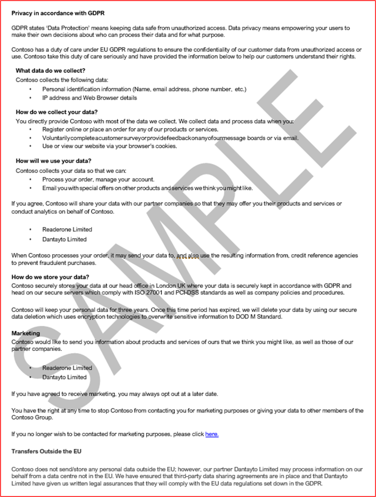

# Microsoft 365認證 - 範例辨識項指南

## 概觀

本指南的建立方式是為 ISV 提供各Microsoft 365認證控制項所需的辨識項類型和詳細層級範例。 本檔中共用的任何範例都不代表唯一可用來示範是否符合控制項的辨識項，而只會作為所需辨識項類型的指導方針。 

請注意：用來滿足需求的實際介面、螢幕擷取畫面和檔會根據產品使用、系統設定和內部程式而有所不同。 此外，請注意，需要原則或程式檔時，ISV 必須傳送 ACTUAL 檔，而不是螢幕擷取畫面，如某些範例所示。 

認證中有兩個區段需要提交：
1. [**初始檔提交：**](../docs/initialdocumentsubguide.md) 設定評量範圍所需的一小組高階檔。
1. **辨識項提交：** 認證評定範圍內每個控制項所需的完整辨識項集合。 

## 結構 

本檔會直接對應至您將在合作夥伴中心認證期間呈現的控制項。 本檔中提供的指引詳述如下：
- 安全性網域：所有控制項分組的三個安全性網域：應用程式安全性、作業安全性和資料安全性和隱私權。
- 控制 (的) ：= 評定活動描述 - 這些控制項 () 和相關聯的數位 (No.) 直接從Microsoft 365認證檢查清單取得。  
- 意圖： = 為何安全性控制項包含在程式中的意圖，以及其旨在降低的特定風險。  希望這項資訊能為 ISV 提供控制項背後的理由，以進一步瞭解需要收集的辨識項類型，以及 ISV 必須注意哪些專案，並瞭解及瞭解如何產生辨識項。
- 範例辨識項指導方針：= 為了協助引導Microsoft 365認證檢查清單試算表上的辨識項集合工作，這可讓 ISV 清楚地看到辨識項類型的範例，這些辨識項類型可供認證分析師使用，而這些辨識項會使用它來確定控制項已就緒並加以維護 ，這並不代表本質上的詳盡。
- 辨識項範例：= 本節提供範例螢幕擷取畫面，以及針對Microsoft 365認證檢查清單試算表內每個控制項擷取的潛在辨識項螢幕擷取畫面和影像，特別是針對試算表) 內的 [作業安全性和資料安全性與隱私權安全性網域] (索引標籤。 請注意，範例中含有紅色箭號和方塊的任何資訊，都是為了進一步協助您瞭解符合任何控制項所需的需求。

## 安全性網域：應用程式安全性

**控制項 1 - 控制項 16**：

應用程式安全性網域控制項可以滿足過去 12 個月內發出的滲透測試報告，顯示您的應用程式沒有未解決的弱點。 唯一需要的提交是由信譽良好的獨立公司所提供的全新報告。 

## 安全性網域：作業安全性/安全開發

「作業安全性/安全開發」安全性網域的設計目的是要確保 ISV 針對威脅執行者所面臨的各種威脅，實作一組強大的安全防護技術。  這是設計來保護作業環境和軟體發展程式，以建置安全的環境。

#### 惡意程式碼防護 - 防毒軟體

**控制節點 1：** 提供控管防毒軟體做法和程式的原則檔。
- 意圖：此控制項的目的是要評估 ISV 在考慮來自電腦病毒的威脅時所遇到的問題。 ISV 藉由建立和使用業界最佳做法來開發防毒軟體原則和程式，提供專為其組織降低惡意程式碼所面臨風險的能力量身打造的資源，列出病毒偵測和消除的最佳做法，並證明記載的原則為組織及其員工提供建議的安全性指引。 藉由記錄 ISV 如何部署反惡意程式碼小數點的原則和程式，這可確保這項技術的一致推出和維護，以降低惡意程式碼對環境的風險。

- 範例辨識項指導方針：提供防毒軟體/反惡意程式碼原則的複本，其中詳細說明基礎結構內實作的程式和程式，以推廣防毒軟體/惡意程式碼最佳做法。
範例辨識項

- 範例辨識項：

**注意：** 此螢幕擷取畫面顯示原則/程式檔，預期 ISV 會共用實際的支援原則/程式檔，而不只是提供螢幕擷取畫面。

**控制節點 2：** 提供可證明防毒軟體正在所有取樣系統元件上執行的明顯證據。

- 意圖：請務必讓防毒軟體 (防毒軟體)  (或反惡意程式碼防禦) 在您的環境中執行，以防止網路安全性風險，因為複雜度和數目都可能造成損害， 將 AV 部署到支援其使用的所有系統元件，有助於降低將反惡意程式碼引入環境中的一些風險。 只有單一端點未受保護，才可能提供攻擊向量，讓威脅執行者取得環境的據點。 因此，AV 應該作為數個防禦層的其中一個，以防範這種類型的威脅。

- 範例辨識項指導方針：證明 AV 的作用中實例正在評估的環境中執行。 針對範例中支援使用防毒軟體的 _每個裝置_ 提供螢幕擷取畫面，其中顯示防毒程式正在執行、防毒軟體為作用中，或如果您有防毒軟體的集中管理主控台，您或許可以從該管理主控台進行示範。 如果使用管理主控台，請務必在螢幕擷取畫面中證明取樣的裝置已連線並正常運作。

- 辨識項範例 1：下列螢幕擷取畫面取自Azure 資訊安全中心;其中顯示已在名為 &quot; MSPGPRODAZUR01 的 VM 上部署反惡意程式碼擴充功能 &quot; 。

- 辨識項範例 2

下列螢幕擷取畫面取自Windows 10裝置， &quot; 顯示主機名稱 &quot; CLARANET-SBU-WM &quot; 的即時保護 &quot; 已開啟。

**控制節點 3：** 提供可辨識的辨識項，證明所有環境中的防毒軟體簽章在) 1 天內 (為最新狀態。

- 意圖：每天會識別數以十萬計的新惡意程式碼和潛在的垃圾應用程式 (PUA) 。 若要針對新發行的惡意程式碼提供適當的保護，必須定期更新防毒軟體簽章，以考慮新發行的惡意程式碼。

- 此控制項的存在可確保 ISV 已考慮環境的安全性，以及過期的 AV 對安全性的影響。

- 範例辨識項指導方針：提供來自每個取樣裝置的防病毒記錄檔，顯示每天套用更新。

- 範例辨識項：下列螢幕擷取畫面顯示 Microsoft Defender 至少每天更新一次，其中顯示&#39;事件 2000，Windows Defender&#39;這是更新。 主機名稱隨即顯示，顯示這是從範圍內的系統 &quot; CLARANET-SBU-WM &quot; 取得。

**注意：** 提供的辨識項必須包含記錄的匯出，以顯示在較長時間內的每日更新。 某些防毒軟體產品會產生更新記錄檔，因此應該提供這些檔案，或從事件檢視器匯出記錄檔。

**控制節點 4：** 提供可辨識的辨識項，證明防毒軟體已設定為在所有取樣的系統元件上執行存取掃描或定期掃描。

**注意：** 如果未啟用存取掃描，則至少會啟用每日掃描和alerting_ **必須** _be啟用。

- 意圖：此控制項的目的是要確保快速識別惡意程式碼，以將這可能對環境的影響降到最低。 在進行存取掃描並結合自動封鎖惡意程式碼的情況下，這有助於停止防毒軟體已知的惡意程式碼感染。 因為誤判導致服務中斷的風險，&#39;不需要存取掃描，適合每日 (或更多) 掃描和警示機制需要實作，以確保及時回應惡意程式碼感染，以將損害降到最低。

- 範例辨識項指導方針：針對支援防毒軟體的範例中的 _每個裝置_ 提供螢幕擷取畫面，其中顯示防毒軟體正在裝置上執行，並已設定為存取 (即時掃描) 掃描， **或** 提供螢幕擷取畫面，顯示已啟用每日掃描的定期掃描、已設定警示，以及範例中 _每個裝置_ 的最後一個掃描日期。

- 範例辨識項：下列螢幕擷取畫面顯示已針對主機 &quot; CLARANET-SBU-WM &quot; 啟用即時保護。

**控制節點 5：** 提供可辨識的辨識項，證明防毒軟體已設定為自動封鎖惡意程式碼或隔離，並警示所有取樣的系統元件。

- 意圖：惡意程式碼的複雜性會隨著其所能帶來的不同程度而不斷演進。 此控制項的目的是要停止惡意程式碼的執行，因而阻止它執行其可能的承載，或是如果自動封鎖不是選項，藉由警示並立即回應潛在的惡意程式碼感染，限制惡意程式碼可能造成破壞的時間量。

- 範例辨識項指導方針：為範例中支援防毒軟體 _的每個裝置_ 提供螢幕擷取畫面，其中顯示防毒軟體正在電腦上執行，並設定為自動封鎖惡意程式碼、警示或隔離和警示。

- 範例辨識項 1：下列螢幕擷取畫面顯示主機 &quot; CLARANET-SBU-WM &quot; 已針對Microsoft Defender 防毒軟體設定即時保護。 如設定所示，這會找出並阻止惡意程式碼在裝置上安裝或執行。

**控制節點 6：** 提供可辨識的辨識項，證明應用程式在部署之前已核准。

- 意圖：透過應用程式控制，組織會核准允許在作業系統上執行的每個應用程式/程式。 此控制項的目的是要確保核准程式已就緒，以授權哪些應用程式/進程可以執行。

- 範例辨識項指導方針：可以提供辨識項，顯示正在遵循核准程式。 這可以透過已簽署的檔、在變更控制系統內追蹤，或使用類似Azure DevOps或 JIRA 的方式來追蹤這些要求和授權。

- 範例辨識項：下列螢幕擷取畫面示範管理的核准，每個允許在環境中執行的應用程式都會遵循核准程式。 這是 Contoso 的紙張型程式，但可以使用其他機制。

**控制節點 7：** 提供可辨識的辨識項，證明具有商業理由的已核准應用程式完整清單存在並受到維護。

- 意圖：組織必須維護所有已核准應用程式的清單，以及應用程式/程式核准原因的相關資訊。 這有助於確保設定保持最新狀態，並可根據基準進行檢閱，以確保未設定未經授權的應用程式/進程。

- 範例辨識項指導方針：提供已核准應用程式/程式的檔案清單以及業務理由。

- 範例辨識項：下列螢幕擷取畫面列出具有業務理由的已核准應用程式。

**注意：** 此螢幕擷取畫面顯示檔，預期 ISV 會共用實際的支援檔，而不只是提供螢幕擷取畫面。

**控制節點 8：** 提供支援檔，詳細說明應用程式控制軟體已設定為符合特定應用程式控制機制。

- 意圖：應記錄應用程式控制技術的設定，以及如何維護技術的程式，也就是新增和刪除應用程式/進程。 在本檔中，應該針對每個應用程式/進程詳細說明所使用的機制類型。 這會饋送至下一個控制項，以確保將技術設定為已記載。

- 範例辨識項指導方針：提供支援檔，詳細說明如何設定應用程式控制，以及如何在技術中設定每個應用程式/程式。

- 範例辨識項：下列螢幕擷取畫面列出用來實作應用程式控制的控制項機制。 您可以在下面看到 1 個應用程式正在使用憑證控制項，而其他應用程式則使用檔案路徑。

**注意：** 此螢幕擷取畫面顯示檔，預期 ISV 會共用實際的支援檔，而不只是提供螢幕擷取畫面。

**控制節點 9：** 提供可辨識的辨識項，證明應用程式控制已設定為所有取樣系統元件所記載。

- 意圖：其目的是要根據檔驗證應用程式控制項是否已在範例中設定。

- 範例辨識項指導方針：提供範例中 _每個裝置_ 的螢幕擷取畫面，以顯示其已設定和啟用應用程式控制項。 這應該會顯示電腦名稱稱、其所屬的群組，以及套用至這些群組和機器的應用程式控制原則。

- 辨識項範例：下列螢幕擷取畫面顯示已啟用軟體限制原則的群組原則物件。

下一個螢幕擷取畫面顯示與上述控制項一起的組態。

下一個螢幕擷取畫面顯示 M365 環境和套用至此 GPO 物件範圍內的電腦&#39;網域電腦設定&#39;。

最後一個螢幕擷取畫面顯示範圍內的伺服器 &quot; DBServer1 &quot; 位於上述螢幕擷取畫面內的 OU 內。

### 修補程式管理 – 風險排名

安全性弱點的快速識別和補救有助於將威脅執行者危害環境或應用程式的風險降到最低。 修補程式管理分成兩個區段：風險排名和修補。 這三個控制項涵蓋安全性弱點的識別，並根據它們所造成的風險來排名它們。

此安全性控制群組位於平臺即服務 (PaaS) 裝載環境的範圍內，因為必須根據風險排名修補應用程式/增益集協力廠商軟體程式庫和程式碼基底。

**控制節點 10：** 提供原則檔，控管如何識別新的安全性弱點並指派風險分數。

- 意圖：此控制項的目的是要有支援檔，以確保快速識別出安全性弱點，以減少威脅執行者必須利用這些弱點的機會範圍。 必須有健全的機制，才能識別涵蓋組織使用中所有系統元件的弱點;例如，作業系統 (Windows Server、Ubuntu 等) 、 (Tomcat、MS Exchange、SolarWinds 等的應用程式、) 程式碼相依性 (AngularJS、jQuery 等) 。 組織不僅需要確保及時識別資產內的弱點，也必須據以排名任何弱點，以確保根據弱點所帶來的風險，在適當的時間範圍內執行補救。

**注意** 即使您是在單純的平臺即服務環境中執行，您仍然必須負責識別程式碼基底內的弱點：也就是協力廠商程式庫。

- 範例辨識項指導方針：提供支援檔 (不是螢幕擷取畫面) 

- 範例辨識項：此螢幕擷取畫面顯示風險排名原則的程式碼片段。

**注意：** 此螢幕擷取畫面顯示原則/程式檔，預期 ISV 會共用實際的支援原則/程式檔，而不只是提供screenshot._

**控制節點 11：** 提供如何識別新安全性弱點的辨識項。

- 意圖：此控制項的目的是要確保程式已遵循，且其&#39;強大到足以識別整個環境的新安全性弱點。 這可能不只是作業系統;其中可能包含在環境中執行的應用程式，以及任何程式碼相依性。

- 範例辨識項指導方針：提供辨識項的方法可能是顯示郵寄清單的訂用帳戶、手動檢閱安全性來源，以瞭解新發行的弱點 (需要充分追蹤活動的時間戳記，也就是使用 JIRA 或Azure DevOps) ，例如，尋找過期軟體程式庫時，尋找過期軟體 (的工具可能是 Snyk， 或 可能是使用可識別過期 software.) 之已驗證掃描的 Nessus。

**注意** 如果使用 Nessus，則必須定期執行，以快速識別弱點。 建議您至少每週使用一次。

- 範例辨識項：此螢幕擷取畫面示範正在使用郵件群組來收到安全性弱點的通知。

**控制節點 12：** 提供辨識項，證明一旦識別出所有弱點，都會獲指派風險排名。

- 意圖：修補作業必須以風險為基礎、弱點風險也一樣高，需要更快速地補救。 已識別弱點的風險排名是此程式不可或缺的一部分。 此控制項的目的是要確保會遵循已記載的風險排名程式，以確保根據風險適當地排名所有已識別的弱點。 組織通常會利用 CVSS (一般弱點評分系統) 廠商或安全性研究人員所提供的評等。 如果組織依賴 CVSS，建議在程式中包含重新排名機制，以允許組織根據內部風險評估來變更排名。 有時候，弱點可能不是應用程式，因為應用程式在環境中的部署方式。 例如，可能會釋放 JAVA 弱點，這會影響組織未使用的特定程式庫。

- 範例辨識項指導方針：以螢幕擷取畫面或其他方式提供辨識項，例如，DevOps/Jira，其示範弱點正在經歷風險排名程式，並由組織指派適當的風險排名。

- 範例辨識項：此螢幕擷取畫面顯示如果組織執行風險評估並判斷風險可以降級，就會在資料行 D 中發生風險排名，並在 F 和 G 資料行中重新排名。 需要提供重新排名風險評估的辨識項作為支援辨識項

### 修補程式管理 – 修補

下列控制項適用于修補程式管理的修補專案。 若要維護安全的操作環境，必須適當地修補應用程式/附加元件和支援系統。 必須管理識別 (或公開發行) 與修補之間的適當時間範圍，以減少威脅執行者利用弱點的機會範圍。 Microsoft 365憑證不會規定&#39;修補視窗&#39;，但認證分析師會拒絕不合理的時間範圍。

此安全性控制群組位於平臺即服務 (PaaS) 裝載環境的範圍內，因為必須根據風險排名修補應用程式/增益集協力廠商軟體程式庫和程式碼基底。

**控制節點 13：** 提供修補範圍內系統元件的原則檔，其中包含適用于重大、高和中風險弱點的最小修補時間範圍;以及解除委任任何不支援的作業系統和軟體。

- 意圖：許多安全性合規性架構都需要修補程式管理，例如 PCI-DSS、ISO 27001、NIST (SP) 800-53。 良好的修補程式管理的重要性不能過度強調，因為它可以修正軟體、韌體的安全性和功能問題，並減輕弱點，這有助於減少惡意探索的機會。 此控制項的目的是要將威脅執行者利用可能存在於範圍內環境內弱點的機會範圍降到最低。

- 範例辨識項指導方針：提供所有原則和程式的複本，詳細說明修補程式管理的程式。 這應該包含最小修補視窗上的區段，而且不支援的作業系統和軟體不得在環境中使用。

- 範例辨識項：以下是範例原則檔。

**注意：** 此螢幕擷取畫面顯示原則/程式檔，預期 ISV 會共用實際的支援原則/程式檔，而不只是提供screenshot._

**控制節點 14：** 提供可辨識的辨識項，證明正在修補所有取樣的系統元件。

**注意：** 包含任何軟體/協力廠商程式庫。

- 意圖：修補弱點可確保構成資訊技術基礎結構 (硬體、軟體和服務) 一部分的不同模組保持在最新狀態，並不受已知弱點影響。 必須儘快執行修補，以將弱點詳細資料發行與修補之間的安全性事件可能性降到最低。 這更為重要，因為已知會在惡意探索弱點。

- 範例辨識項指導方針：提供範例中 _每個裝置_ 的螢幕擷取畫面，並支援軟體元件，其中顯示修補程式已與記載的修補程式一起安裝。

- 範例辨識項：下列螢幕擷取畫面顯示範圍系統元件 &quot; CLARANET-SBU-WM &quot; 中的 正在執行Windows更新，以符合修補原則。

**注意：** 修補所有範圍內的系統元件必須是辨識項。 這包括像這樣;OS 更新、應用程式/元件更新 (i.e__.、_ _Apache Tomcat、OpenSSL 等) 、軟體相依性 (例如 JQuery、AngularJS 等) 等。_

**控制節點 15：** 提供可辨識的辨識項，證明環境中不會使用任何不支援的作業系統和軟體元件。

- 意圖：供應商未維護的軟體會因已知的弱點而無法修正，而加班時會受到影響。 因此，不支援作業系統和軟體元件的使用不得在生產環境中使用。

- 範例辨識項指導方針：提供範例中 _每個裝置_ 的螢幕擷取畫面，其中顯示執行 (的作業系統版本，包括螢幕擷取畫面) 中的伺服器&#39;名稱。 除此之外，提供證明在環境中執行的軟體元件正在執行支援的版本。 這可以藉由提供內部弱點掃描報告的輸出來完成， (提供已驗證的掃描包含) 和/或檢查協力廠商程式庫的工具輸出，例如 [Snyk](https://snyk.io/)、 [Trivy](https://github.com/aquasecurity/trivy) 或 [NPM 稽核](https://docs.npmjs.com/cli/v7/commands/npm-audit)。 如果只在 PaaS 中執行，則修補控制群組只需要涵蓋協力廠商程式庫修補。

- 範例辨識項：下列辨識項顯示範圍內的系統元件 THOR 正在執行廠商支援的軟體，因為 Nessus 尚未&#39;任何問題。

**注意：** 完整的報告必須與認證分析師共用。

- 範例辨識項 2

此螢幕擷取畫面顯示範圍內的系統元件 &quot; CLARANET-SBU-WM &quot; 正在支援的Windows版本上執行。

- 範例辨識項 3

下列螢幕擷取畫面是 [Trivy](https://github.com/aquasecurity/trivy) 輸出，完整報表不會&#39;列出任何不支援的應用程式。

**注意：** 完整的報告必須與認證分析師共用。

### 弱點掃描

藉由引進一般弱點評估，組織可以偵測其環境中的弱點和不安全性，而這些弱點和不安全性可能會為惡意執行者提供危害環境的進入點。 弱點掃描有助於識別環境中遺失的修補程式或設定錯誤。 藉由定期進行這些掃描，組織可以提供適當的補救措施，以將由於這些弱點掃描工具經常挑選的問題而導致的危害風險降到最低。

**控制節點 16：** 提供每季的基礎結構和 Web 應用程式弱點掃描報告。 必須針對整個公用使用量進行掃描， (IP 位址和 URL) 和內部 IP 範圍。

**注意：** 這 **必須** 包含環境的完整範圍。

- 意圖：弱點掃描會尋找組織電腦系統、網路和 Web 應用程式中可能的弱點，以找出可能導致安全性缺口和敏感性資料暴露的漏洞。 產業標準與政府法規通常需要弱點掃描，例如 PCI DSS (支付卡產業資料安全標準) 。

- 名為 &quot; [PCI DSS 合規性之 2020 安全性計量指南的安全](https://info.securitymetrics.com/pci-guide-2020)性計量報告指出，從組織發現攻擊者入侵系統有弱點起，平均需要 166 天的時間&#39;。 &quot; 一旦遭到入侵，攻擊者平均可以存取敏感性資料 127 天&#39;因此，此控制項旨在找出範圍內環境中潛在的安全性弱點。

- 範例辨識項指導方針：針對過去 12 個月執行的每季&#39;弱點掃描，提供完整掃描報告 () 。 報告應該清楚陳述目標，以驗證是否包含完整的公用使用量，以及在適用的情況下，每個內部子網。 提供 **每** 季 **的所有** 掃描報告。

- 範例辨識項：範例辨識項是從所使用的掃描工具提供掃描報告。 每季&#39;應提供掃描報告以供檢閱。 掃描必須包含整個環境系統元件，如此;每個內部子網，以及可供環境使用的每個公用 IP 位址/URL。

**控制節點 17：** 提供可辨識的辨識項，證明在弱點掃描期間所識別的弱點補救會依照您記載的修補時間範圍進行修補。

- 意圖：無法快速識別、管理和補救弱點和設定錯誤，可能會增加組織&#39;遭到入侵而導致潛在資料外泄的風險。 正確識別和補救問題被視為組織&#39;整體安全性狀態和環境很重要，這符合各種安全性架構的最佳做法;例如，ISO 27001 和 PCI DSS。

- 範例辨識項指導方針：提供適當的成品 (也就是螢幕擷取畫面) 顯示弱點掃描中探索到的弱點範例，會依照上述控制項 13 中已提供的修補視窗進行補救。

- 範例辨識項：下列螢幕擷取畫面顯示範圍內環境的 Nessus 掃描， (此範例中名為 &quot; THOR &quot; 的單一電腦) 顯示 2021 年 8 月 2 日弱點。

下列螢幕擷取畫面顯示問題已解決，2 天后會在修補原則內定義的修補視窗內。

**注意：** 針對此控制項，認證分析師必須查看過去 12 個月每季的弱點掃描報告和補救。

### 防火牆

防火牆通常會在受信任的 (內部網路) 、不受信任 (網際網路) 和半信任 (DMZ) 環境之間提供安全性界限。 這些通常是組織深入防禦安全性策略內的第一道防線，其設計目的是要控制輸入和輸出服務的流量流程，以及封鎖不必要的流量。 這些裝置必須受到嚴密控制，以確保它們能有效運作，而且不受設定錯誤而造成環境風險。

**控制節點 18：** 提供管理防火牆管理做法和程式的原則檔。

- 意圖：防火牆是多層式安全性 (深層防禦) 策略中的重要第一道防線，可保護環境不受信任的網路區域。 防火牆通常會根據 IP 位址和通訊協定/埠來控制流量，更多功能豐富的防火牆也可以藉由檢查應用程式流量，以根據所存取的應用程式來防範誤用、弱點和威脅，以提供額外的 &quot; 應用層 &quot; 防護。 這些保護只和防火牆的設定一樣好，因此必須備妥強式防火牆原則和支援程式，以確保它們已設定為提供適當的內部資產保護。 例如，具有允許從 ANY 來源到 ANY 目的地之所有流量之規則的防火牆只是做為路由器。

- 範例辨識項指導方針：提供完整的防火牆原則/程式支援檔。 本檔應涵蓋下列所有重點，以及適用于您環境的任何其他最佳做法。

- 範例辨識項：以下是我們需要的防火牆原則檔案類型範例 (這是示範，可能無法完成) 。

**控制節點 19：** 提供可辨識的辨識項，證明任何預設系統管理認證都會在安裝到生產環境之前變更。

- 意圖：組織必須留意廠商提供的預設系統管理認證，這些認證是在裝置或軟體設定期間設定的。 廠商通常會公開提供預設認證，並可為外部威脅執行者提供入侵環境的機會。 例如，在網際網路上簡單搜尋預設 iDrac (整合式 Dell 遠端存取控制器) 認證會醒目提示 _root：：calvin_ 作為預設使用者名稱和密碼。 這可讓某人遠端存取遠端伺服器管理。 此控制項的目的是要確保環境不會因為裝置/應用程式強化期間未變更的預設廠商認證而容易受到攻擊。

- 範例辨識項指導方針

- 這可透過螢幕共用會話辨識，認證分析師可以嘗試使用預設認證向範圍內的裝置進行驗證。

- 範例辨識項

下列螢幕擷取畫面顯示認證分析師會從 WatchGuard 防火牆的無效使用者名稱/密碼看到的內容。

**控制節點 20：** 提供防火牆安裝在範圍內環境界限的明顯證據，並安裝在周邊網路 (也稱為 DMZ、非機構化區域，以及已篩選的子網) 和內部信任網路之間。

- 意圖：防火牆可讓您控制不同安全性層級之不同網路區域之間的流量。 由於所有環境都已連線到網際網路，因此必須在網際網路與範圍內環境之間的界限上安裝防火牆。 此外，防火牆必須在較不受信任的 DMZ (De-Marketplacezed 區域) 網路和內部信任網路之間安裝。 DMZ 通常用來提供來自網際網路的流量，因此是攻擊的目標。 藉由實作 DMZ 並使用防火牆來控制流量，DMZ 的入侵&#39;不一定表示內部信任的網路和公司/客戶資料遭到入侵。 應備妥適當的記錄和警示，以協助組織快速識別入侵，將威脅執行者進一步入侵內部信任網路的機會降到最低。 此控制項的目的是要確保信任的網路與較不受信任的網路之間有足夠的控制。

- 範例辨識項指導方針：應該透過防火牆組態檔或螢幕擷取畫面來提供辨識項，以示範 DMZ 是否已就緒。 這應該符合提供的架構圖表，示範支援環境的不同網路。 防火牆上網路介面的螢幕擷取畫面，加上已在初始檔提交中提供的網狀圖，應該會提供此辨識項。

- 範例辨識項：以下是示範兩個 DMZ 的 WatchGuard 防火牆螢幕擷取畫面，其中一個是針對名為 DMZ) 的輸入服務 (，另一個則是 (Bastian Host) 提供 Jumpbox。

**控制節點 21：** 提供可辨識的辨識項，證明所有公用存取都會在 DMZ)  (非目的地區域中終止。

- 意圖：可公開存取的資源會對各種攻擊開放。 如上所述，DMZ 的目的是要將較不受信任的網路與可能包含敏感性資料的信任內部網路區隔。 DMZ 被視為較不受信任，因為主機有很大的風險可公開存取，而不會遭到外部威脅執行者入侵。 在這些較不受信任的網路中，公用存取應該一律終止，防火牆會適當地分割這些網路，以協助保護內部資源和資料。 此控制項的目的是要確保所有公用存取在這些較不受信任的 DMZ 中終止，就像信任的內部網路上的資源是公開的一樣，這些資源的入侵會為威脅執行者提供保存敏感性資料之網路的據點。

- 範例辨識項指導方針

- 為此提供的辨識項可能是防火牆設定，其中顯示輸入規則，以及這些規則終止的位置，方法是將公用 IP 位址路由傳送至資源，或提供輸入流量的 NAT (網路位址轉譯) 。

- 範例辨識項

在下列螢幕擷取畫面中，有三個傳入規則，分別顯示 10.0.3.x 和 10.0.4.x 子網的 NAT，也就是 DMZ 子網

**控制節點 22：** 提供可辨識的辨識項，證明所有允許通過防火牆的流量都會通過核准程式。

- 意圖：由於防火牆是不受信任流量和內部資源之間的防禦屏障，而且在不同信任層級的網路之間，必須安全地設定防火牆，並確保只啟用商務作業所需的流量。 藉由允許不必要的流量或過度寬鬆流量，這可能會在這些不同網路區域的界限上造成防禦弱點。 藉由為所有防火牆變更建立健全的核准程式，引進對環境造成重大風險的規則風險就會降低。 Verizon&#39;[的 2020 年資料外泄調查報告](https://enterprise.verizon.com/en-gb/resources/reports/dbir/) 強調， &quot; 錯誤&#39;&quot; 包含錯誤設定，是唯一持續每年增加的動作類型。

- 範例辨識項指導方針：辨識項可以是檔形式，其中顯示已獲授權的防火牆變更要求，可能是從 CAB (Change Advisor Board) 會議或由追蹤所有變更的變更控制系統起算的分鐘數。

- 範例辨識項：下列螢幕擷取畫面顯示使用以紙張為基礎的程式要求和授權的防火牆規則變更。 例如，這可以透過 DevOps 或 Jira 之類的方式來達成。

**控制節點 23：** 提供防火牆規則基底已設定為卸載未明確定義流量的明顯辨識項。

- 意圖：大部分的防火牆都會以自上而下的方式處理規則，以嘗試並尋找相符的規則。 如果規則相符，將會套用該規則的動作，並停止規則的所有進一步處理。 如果找不到相符的規則，預設會拒絕流量。 此控制項的目的是，如果防火牆未在找不到相符規則時&#39;預設為捨棄流量，則規則基底必須在 **[所有** &quot; 防火牆] 清單的結尾包含 &quot; [全部拒絕] 規則。 這是為了確保在處理規則時，防火牆不會&#39;預設為預設允許狀態，因此允許尚未明確定義&#39;的流量。

- 範例辨識項指導方針：辨識項可以透過防火牆設定的方式提供，或是螢幕擷取畫面顯示結尾顯示 &quot; [全部拒絕 &quot; ] 規則的所有防火牆規則，或防火牆捨棄預設&#39;不符合規則的流量，然後提供所有防火牆規則的螢幕擷取畫面和廠商系統管理指南的連結，醒目提示防火牆預設會捨棄所有不相符的流量。

- 範例辨識項：以下是 WatchGuard 防火牆規則基底的螢幕擷取畫面，其中示範未設定任何規則來允許所有流量。 結尾沒有拒絕規則，因為 WatchGuard 會捨棄預設&#39;不相符的流量。

下列 WatchGuard 說明中心連結; [https://www.watchguard.com/help/docs/help-center/en-US/Content/en-US/Fireware/policies/policies\_about\_c.html](https://www.watchguard.com/help/docs/help-center/en-US/Content/en-US/Fireware/policies/policies_about_c.html) 包含下列資訊：

**控制節點 24：** 提供防火牆只支援所有非主控台系統管理介面上強式密碼編譯的明顯證據。

- 意圖：若要減輕系統管理流量的攔截式攻擊，所有非主控台系統管理介面都應該只支援強式密碼編譯。 此控制項的主要目的是在設定非主控台連線時保護系統管理認證。 此外，這也有助於防止竊聽連線，嘗試重新執行系統管理功能以重新設定裝置或作為偵察的一部分。

- 範例辨識項指導方針：如果設定提供非主控台系統管理介面的密碼編譯設定，則提供防火牆設定 (並非所有裝置都會將此包含為可設定的選項) 。 如果&#39;不在組態內，您可能可以向裝置發出命令，以顯示為這些連線設定的內容。 有些廠商可能會在文章中發佈這項資訊，因此這也可能是證明這項資訊的方法。 最後，您可能需要執行工具來輸出支援哪些加密。

- 範例辨識項：下列螢幕擷取畫面顯示 [SSLScan](https://github.com/rbsec/sslscan) 對 TCP 埠 8080 上 WatchGuard 防火牆的 Web 系統管理員介面的輸出。 這會顯示最低加密加密為 AES-128 位的 TLS 1.2 或更新版本。

**注意**：WatchGuard 防火牆也支援使用 SSH (TCP 埠 4118) 和 WatchGuard System Manager (TCP 埠 4105 &amp; 4117) 的系統管理功能。 也必須提供這些非主控台系統管理介面的辨識項。

**控制節點 25：** 提供您至少每 6 個月執行一次防火牆規則檢閱的可辨識辨識項。

- 意圖：經過一段時間後，在具有範圍內環境的系統元件中會有組態擷取的風險。 這通常會導致不安全或設定錯誤，而增加危害環境的風險。 組態擷取的原因有很多，例如，協助疑難排解的暫時性變更、臨機操作功能變更的暫時性變更，以快速修正有時可能會因為引進快速修正而造成過度寬鬆的問題。 例如，您可能會引入暫時防火牆規則 &quot; 允許全部 &quot; 克服緊急問題。 此控制項的意圖有兩個層面，一是要識別何處的設定錯誤可能會造成不安全，第二個目的是協助識別不再需要的防火牆規則，因此可以移除，也就是說，如果服務已淘汰，但防火牆規則已遺失。

- 範例辨識項指導方針：辨識項必須能夠證明已發生檢閱會議。 這可以藉由共用防火牆檢閱的會議分鐘數，以及顯示從檢閱中採取之任何動作的任何其他變更控制辨識項來完成。 請確定日期已存在，因為我們&#39;必須至少看到其中兩個會議 (也就是每六個月) 

- 範例辨識項：下列螢幕擷取畫面顯示 2021 年 1 月發生防火牆檢閱的辨識項。

下列螢幕擷取畫面顯示 2021 年 7 月發生防火牆檢閱的辨識項。

### 防火牆 – WAF

將 Web 應用程式防火牆 (WAF) 部署到解決方案是選擇性的。 如果使用 WAF，這會計算為&#39;作業安全性&#39;安全性網域內評分矩陣的額外點數。 WAF 可以檢查 Web 流量，以篩選和監視網際網路與已發佈 Web 應用程式之間的 Web 流量，以識別 Web 應用程式特定的攻擊。 Web 應用程式可能會遭受許多 Web 應用程式特定的攻擊，例如SQL插入 (SQLi) 、跨網站腳本 (XSS) 、跨網站偽造要求 (CSRF/XSRF) 等，而 WAF 的設計目的是要防範這些類型的惡意承載，以協助保護 Web 應用程式免于遭受攻擊和潛在入侵。

**控制節點 26：** 提供可辨識的辨識項，證明Web 應用程式防火牆 (WAF) 已設定為主動監視、警示及封鎖惡意流量。

- 意圖：此控制項已就緒，可確認所有傳入的 Web 連線都已備妥 WAF，且已設定為封鎖或警示惡意流量。 若要為 Web 流量提供額外的防禦層級，必須為所有連入的 Web 連線設定 WAF，否則外部威脅執行者可能會略過專為提供這一層額外保護而設計的 WAF。 如果 WAF 未&#39;設定為主動封鎖惡意流量，WAF 必須能夠立即向可快速回應潛在惡意流量的員工提供警示，以協助維護環境的安全性並停止攻擊。

- 範例辨識項指導方針：提供來自 WAF 的設定輸出，其中會醒目提示所提供的連入 Web 連線，以及設定會主動封鎖惡意流量，或正在監視和警示。 或者，可以共用特定設定的螢幕擷取畫面，以示範組織是否符合此控制項。

- 範例辨識項：下列螢幕擷取畫面顯示已啟用 Contoso Production Azure 應用程式閘道 WAF 原則，且已針對&#39;預防&#39;模式進行設定，這會主動捨棄惡意流量。

下列螢幕擷取畫面顯示前端 IP 組態

**注意：** 辨識項應該示範環境使用的所有公用 IP，以確保涵蓋所有輸入點，這也是包含此螢幕擷取畫面的原因。

下列螢幕擷取畫面顯示使用此 WAF 的連入 Web 連線。

下列螢幕擷取畫面顯示 ContosoAppGWCoreRules \_ \_ ，其中顯示這是針對 api.contoso.com 服務。

**控制節點 27：** 提供可證明 WAF 支援 SSL 卸載的辨識項。

- 意圖：WAF 設定為支援 SSL 卸載的能力很重要，否則 WAF 將無法檢查 HTTPS 流量。 由於這些環境需要支援 HTTPS 流量，這是 WAF 的重要功能，可確保 HTTPS 流量內的惡意承載可以識別並停止。

- 範例辨識項指導方針：透過設定匯出或螢幕擷取畫面提供設定辨識項，其中顯示支援並設定 SSL 卸載。

- 範例辨識項：在Azure 應用程式閘道中，設定已啟用 SSL 接聽程式的 SSL 卸載，請參閱使用 應用程式閘道 Microsoft 檔的[TLS 終止和端對端 TLS 概觀](/azure/application-gateway/ssl-overview)頁面。 下列螢幕擷取畫面顯示針對 Contoso Production Azure 應用程式閘道設定的此功能。

**控制節點 28：** 「根據 OWASP 核心規則集 (3.0 或 3.1) ，提供 WAF 可防範某些或下列所有弱點類別的可辨識證據：
- 通訊協定和編碼問題
- 標頭插入、要求外設和回應分割、
- 檔案和路徑周遊攻擊，
- 遠端檔案包含 (RFI) 攻擊
- 遠端程式碼執行攻擊，
- PHP 插入式攻擊，
- 跨網站腳本攻擊，
- SQL插入式攻擊
- 會話修正攻擊。

- 意圖：WAF 必須設定為識別常見弱點類別的攻擊承載。 此控制項旨在利用 OWASP 核心規則集，確保能充分偵測弱點類別。

- 範例辨識項指導方針：透過設定匯出提供設定辨識項，或螢幕擷取畫面示範掃描涵蓋了上述大部分的弱點類別。

- 範例辨識項：下列螢幕擷取畫面顯示 Contoso Production Azure 應用程式閘道 WAF 原則已設定為針對 OWASP 核心規則集 3.2 版進行掃描。

### 變更控制項

建立且瞭解的變更控制程式對於確保所有變更都經過可重複的結構化程式而言非常重要。 藉由確保所有變更都經過結構化程式，組織可以確保變更在登出之前會受到有效管理、對等檢閱及適當測試。 這不僅有助於將系統中斷的風險降到最低，也有助於透過引進的不當變更，將潛在安全性事件的風險降到最低。

**控制節點 29：** 提供控管變更控制程式的原則檔。

- 意圖：若要維護安全的環境和安全的應用程式，必須建立健全的變更控制程式，以確保所有基礎結構和程式碼變更都透過強式監督和定義的程式來執行。 這可確保記錄變更、考慮安全性影響、思考變更會對安全性造成什麼影響等等。其目的是要確保記錄變更控制程式，以確保對環境和應用程式開發實務內的所有變更採取安全且一致的方法。

- 範例辨識項指導方針：所記載的變更控制原則/程式應該與認證分析師共用。

- 範例辨識項：以下顯示範例變更管理原則的開頭。 請提供完整的原則和程式作為評量的一部分。

**注意：** 此螢幕擷取畫面顯示原則/程式檔，預期 ISV 會共用實際的支援原則/程式檔，而不只是提供螢幕擷取畫面。

**控制節點 30：** 提供可辨識的辨識項，證明開發和測試環境會強制區分工作與生產環境。

- 意圖：大部分的組織&#39;開發/測試環境未設定為與生產環境相同的震動，因此較不安全。 此外，測試不應該在生產環境中執行，因為這可能會造成安全性問題，或對客戶的服務傳遞造成損害。 藉由維護可強制區分職責的個別環境，組織可以確保變更會套用至正確的環境，藉由在開發/測試環境時實作生產環境的變更來降低錯誤的風險。

- 範例辨識項指導方針：可以提供螢幕擷取畫面，示範用於開發/測試環境和生產環境的不同環境。 一般而言，您會有不同的人員/小組可以存取每個環境，或在無法存取的情況下，環境會利用不同的授權服務來確保使用者無法誤入錯誤的環境來套用變更。

- 範例辨識項：下列螢幕擷取畫面顯示 Contoso&#39;TEST 環境的 Azure 訂用帳戶。

下一個螢幕擷取畫面顯示 Contoso&#39;&#39;PRODUCTION&#39; 環境的個別 Azure 訂用帳戶。

**控制節點 31：** 提供可辨識的辨識項，證明敏感性生產資料不會在開發或測試環境中使用。

- 意圖：如上所述，組織不會將開發/測試環境的安全性措施實作成與生產環境相同的震動。 因此，藉由在這些開發/測試環境中使用敏感性生產資料，您會增加遭到入侵的風險，而且必須避免在這些開發/測試環境中使用即時/敏感性資料。

**注意：** 您可以在開發/測試環境中使用即時資料，前提是開發/測試包含在評定範圍內，以便根據Microsoft 365認證控制項來評估安全性。

- 範例辨識項指導方針：您可以針對生產資料庫共用相同SQL查詢輸出的螢幕擷取畫面來提供辨識項， (修訂任何敏感性資訊) 和開發/測試資料庫。 相同命令的輸出應該會產生不同的資料集。 儲存檔案的位置，檢視這兩個環境內的資料夾內容也應該示範不同的資料集。

- 範例辨識項：下列螢幕擷取畫面顯示辨識項提交的前 3 筆記錄 (，請從生產資料庫提供前 20 個) 。

下一個螢幕擷取畫面顯示來自開發資料庫的相同查詢，其中顯示不同的記錄。

這會示範資料集不同。

**控制節點 32：** 提供可辨識的辨識項，其中記載的變更要求包含變更的影響、備份程式的詳細資料，以及要執行的測試。

- 意圖：此控制項的目的是要確保思考已進入要求的變更。 變更對系統/環境安全性的影響需要考慮並清楚記載，任何備份程式都必須記載，以在發生錯誤時協助復原，最後也必須考慮並記錄驗證變更成功所需的測試詳細資料。

- 範例辨識項指導方針：您可以匯出變更要求的範例、提供紙張變更要求，或提供變更要求的螢幕擷取畫面，顯示變更要求內保留的這三個詳細資料，以提供辨識項。

- 範例辨識項：下圖顯示指派 XSS) 的新跨網站腳本弱點 (，以及變更要求的檔。

下列票證顯示已設定或新增至要解決之票證的資訊。

 

下列兩張票證顯示系統變更的影響，以及發生問題時可能需要的任何退回程式。 您可以看到變更和退回程式的影響已通過核准程式，並已核准進行測試。

在畫面左側，您可以看到測試變更已核准，您會在右側看到變更現在已核准並經過測試。

在整個程式中，請注意，執行此作業的人員、報告該工作的人員，以及核准要完成工作的人員都是不同的人員。

 

上述票證顯示變更現在已核准可實作至生產環境。 右方方塊顯示測試已運作且成功，且變更現在已實作至 Prod 環境。

**控制節點 33：** 提供可辨識的辨識項，讓變更要求進行授權和簽核程式。

- 意圖：必須實作程式，這會禁止在未經適當授權和登出的情況下執行變更。 在實作變更之前，必須先授權變更，而且變更必須在完成後登出。 這可確保已正確檢閱變更要求，且授權單位中的人員已簽署變更。

- 範例辨識項指導方針：您可以匯出變更要求的範例、提供紙張變更要求，或提供變更要求的螢幕擷取畫面，顯示在實作之前已授權變更，且變更已在完成後登出，以提供辨識項。

- 範例辨識項：下列螢幕擷取畫面顯示範例 Jira 票證，其中顯示變更必須先獲得授權，才能由開發人員/要求者以外的人實作和核准。 您可以在這裡看到有授權人員核准的變更。 右側已由 DP 簽署完成。

在下列票證中，您可以看到變更在完成後已登出，並顯示作業已完成並已關閉。

### 安全軟體發展/部署

涉及軟體發展活動的組織通常會面臨安全性與 TTM 之間的競爭優先順序， (上市時間) 壓力，不過，在整個軟體發展生命週期中實作安全性相關活動 (SDLC) 不僅可以節省成本，還可以節省時間。 當安全性保留為事後考慮時，通常只會在 (DSLC) 的測試階段識別出問題，這通常會更耗時且更耗費成本來修正。 本安全性區段的目的是要確保遵循安全的軟體發展做法，以降低將程式碼錯誤引入開發的軟體中的風險。 此外，本節會尋找包含一些控制項，以協助安全部署軟體。

**控制節點 34：** 提供支援安全軟體發展和部署的原則和程式，包括針對常見弱點類別的安全編碼最佳做法指引，例如 OWASP 前 10 名或 SANS 前 25 名 CWE。

- 意圖：組織必須以自己的能力執行一切工作，以確保軟體能安全地開發並免于弱點。 為了達到此目的，應該建立健全的安全軟體發展生命週期 (SDLC) 和安全的程式碼撰寫最佳做法，以在整個軟體發展程式中推廣安全的程式碼撰寫技術和安全開發。 其目的是要減少軟體中弱點的數目和嚴重性。

- 範例辨識項指導方針：提供記載的 SDLC 和/或支援檔，其中示範安全開發生命週期正在使用中，並提供指引給所有開發人員，以提升安全的程式碼撰寫最佳做法。 請參閱 [SDLC 中的 OWASP](https://owasp.org/www-project-integration-standards/writeups/owasp_in_sdlc/) 和 [SAMM)  (OWASP 軟體保證成熟度模型](https://owaspsamm.org/model/) 。

- 範例辨識項：以下是從 Contoso&#39;安全軟體發展程式擷取，其中示範安全開發和程式碼撰寫做法。

**注意：** 這些螢幕擷取畫面顯示安全軟體發展檔，預期 ISV 會共用實際的支援檔，而不只是提供螢幕擷取畫面。

**控制節點 35：** 提供可辨識的辨識項，證明程式碼變更會由第二位檢閱者進行檢閱和授權程式。

- 意圖：此控制項的目的是要由另一個開發人員執行程式碼檢閱，以協助識別可能在軟體中造成弱點的任何程式碼撰寫錯誤。 應建立授權以確保執行程式碼檢閱、完成測試等。 部署之前。 授權步驟可以驗證是否已遵循正確的程式，以支援上述定義的 SDLC。

- 範例辨識項指導方針：提供辨識項，證明程式碼會進行對等檢閱，而且必須先獲得授權，才能套用至生產環境。 此辨識項可能是透過變更票證的匯出，示範程式碼檢閱已執行且變更已獲授權，或是透過程式碼檢閱軟體，例如 Crucible ([https://www.atlassian.com/software/crucible](https://www.atlassian.com/software/crucible)) 。

- 範例辨識項

以下是一個票證，其中顯示程式碼變更會由原始開發人員以外的人員進行檢閱和授權程式。 它會顯示受指派者已要求程式碼檢閱，並會指派給其他人進行程式碼檢閱。

下圖顯示程式碼檢閱已指派給原始開發人員以外的其他人，如下圖右側反白顯示的區段所示。 在左側，您可以看到程式碼已經過檢閱，而且程式碼檢閱者&#39;狀態&#39;已通過程式碼檢閱。

票證現在必須經過經理核准，才能將變更放入即時生產系統。

 上圖顯示已核准在即時生產系統上實作的已檢閱程式碼。

 程式碼變更完成後，最終作業就會登出，如上圖所示。

請注意，整個程式中涉及三個人，即程式碼的原始開發人員、程式碼檢閱者，以及要核准和登出的管理員。 為了符合此控制項的準則，預期您的票證會遵循此程式。 至少三個人參與程式碼檢閱的變更控制程式。

**控制節點 36：** 提供可辨識的辨識項，讓開發人員每年進行安全的軟體發展訓練。

- 意圖：所有程式設計語言都有程式碼撰寫最佳做法和技術，以確保程式碼安全地開發。 有一些外部訓練課程旨在教導開發人員不同類型的軟體弱點類別，以及可用來停止將這些弱點引入軟體的程式碼技術。 此控制項的目的是要向所有開發人員教授這些技術，並確保不會忘記這些技術，或是每年執行這項作業來學習較新的技術。

- 範例辨識項指導方針：如果由外部訓練公司執行，或提供訓練字典或其他成品的螢幕擷取畫面，以憑證方式提供辨識項，以示範開發人員已參加訓練。 如果這項訓練是透過內部資源執行，也請提供訓練資料的辨識項。

- 範例辨識項：以下是要求DevOps小組中的員工註冊 OWASP 十大訓練年度訓練的電子郵件

下列顯示已要求具有業務理由和核准的訓練。 接著會接著從訓練中擷取的螢幕擷取畫面，以及顯示人員已完成年度訓練的完成記錄。

**控制節點 37：** 提供可辨識的辨識項，證明程式碼存放庫是使用多重要素驗證 (MFA) 來保護。

- 意圖：如果威脅執行者可以存取和修改軟體&#39;程式碼基底，則可能會在程式碼基底中引進弱點、後門或惡意程式碼，因而導入應用程式中。 這已經有數個實例，其中最公開的可能是 NotPetya 勒索軟體攻擊，此攻擊是透過名為 的已遭入侵的烏克蘭稅務軟體更新而感染，M.E.Doc (請參閱 [什麼是 NotPetya](https://www.itpro.co.uk/malware/34381/what-is-notpetya)) 。

- 範例辨識項指導方針：透過程式碼存放庫中 **所有** 使用者都已啟用 MFA 的螢幕擷取畫面來提供辨識項。

- 範例辨識項：下列螢幕擷取畫面顯示已在所有 8 個 GitLab 使用者上啟用 MFA。

**控制節點 38：** 提供可辨識的辨識項，證明存取控制已就緒，可保護程式碼存放庫。

- 意圖：從先前的控制項開始，應該實作存取控制，以限制只有處理特定專案的個別使用者才能存取。 藉由限制存取權，您會限制未經授權變更執行的風險，因而導致不安全的程式碼變更。 應採用最低許可權的方法來保護程式碼存放庫。

- 範例辨識項指導方針：透過程式碼存放庫的螢幕擷取畫面提供辨識項，這些螢幕擷取畫面僅限個人所需的存取權，包括不同的許可權。

- 範例辨識項：下列螢幕擷取畫面顯示 GitLab 中 Customers 專案的成員 &quot; &quot; ，也就是 Contoso &quot; 客戶入口網站 &quot; 。 如螢幕擷取畫面所示，使用者有不同的 &quot; 角色 &quot; 可限制對專案的存取。

### 帳戶管理

安全帳戶管理做法很重要，因為使用者帳戶是允許存取訊號系統、系統內容和資料的基礎。 使用者帳戶必須適當地受到保護，因為使用者&#39;認證不僅可以提供環境的據點和敏感性資料的存取權，也可以在使用者&#39;認證具有系統管理許可權時，提供整個環境或金鑰系統的系統管理控制。

**控制節點 39：** 提供管理帳戶管理做法和程式的原則檔。

- 意圖：使用者帳戶會繼續成為威脅執行者的目標，而且通常是資料洩露的來源。 藉由設定過度寬鬆帳戶，組織不僅會增加&#39;特殊許可權&#39;帳戶的集區，這些帳戶可由威脅執行者利用來執行資料外泄，還可以增加成功惡意探索弱點的風險，而該弱點需要特定許可權才能成功。

-  BeyondTrust 每年會產生 Microsoft &quot; 弱點報告 &quot; ，以分析去年 Microsoft 的安全性弱點，並詳細說明依賴具有系統管理員許可權之使用者帳戶的這些弱點百分比。 在近期的部落格文章 &quot; 中[，新的 Microsoft 弱點報告顯示弱點的 YoY 增加 &amp; 48%如何以最低許可權](https://www.beyondtrust.com/blog/entry/microsoft-vulnerabilities-report) &quot; 減輕弱點、Internet Explorer 中 90% 的重大弱點、Microsoft Edge中 85% 的重大弱點，以及移除系統管理員許可權來減輕 Microsoft Outlook 100% 的重大弱點。 若要支援安全的帳戶管理，組織必須確保支援可提升安全性最佳做法的原則和程式已就緒，並遵循以減輕這些威脅。

- 範例辨識項指導方針：提供涵蓋您帳戶管理做法的記載原則和程式檔。 涵蓋的主題至少應與Microsoft 365認證內的控制項一致。

- 範例辨識項：下列螢幕擷取畫面顯示 Contoso 的帳戶管理原則範例。

**注意：** 此螢幕擷取畫面顯示原則/程式檔，預期 ISV 會共用實際的支援原則/程式檔，而不只是提供螢幕擷取畫面。

**控制節點 40：** 提供可辨識的辨識項，證明預設認證會在取樣的系統元件中停用、移除或變更。

- 意圖：雖然這會變得較不受歡迎，但仍有威脅執行者可以利用預設且記載完善的使用者認證來危害生產系統元件的實例。 其中一個常用的範例是使用 Dell iDRAC (整合式 Dell 遠端存取控制器) 。 此系統可用來從遠端系統管理 Dell Server，威脅執行者可以利用此 Dell Server 來控制伺服器&#39;的作業系統。 root：：calvin 的預設認證已記載，而且通常可由威脅執行者利用來存取組織所使用的系統。 此控制項的目的是要確保停用或移除這些預設認證

- 範例辨識項指導方針：有各種方式可以收集辨識項以支援此控制項。 所有系統元件上已設定的使用者可提供協助的螢幕擷取畫面，也就是 Linux /etc/shadow 和 /etc/passwd 檔案的螢幕擷取畫面有助於示範帳戶是否已停用。 請注意，需要 /etc/shadow 檔案來示範帳戶是否真的停用，方法是觀察密碼雜湊的開頭是不正確字元，例如 &#39;！&#39;表示密碼無法使用。 建議您只停用密碼的幾個字元，並重做其餘的字元。 其他選項則適用于螢幕共用會話，其中評估人員能夠手動嘗試預設認證，例如在上述關於 Dell iDRAC 的討論中，評估人員需要嘗試使用預設認證來驗證所有 Dell iDRAC 介面。

- 範例辨識項：下列螢幕擷取畫面顯示為範圍內系統元件 &quot; CLARANET-SBU-WM &quot; 設定的使用者帳戶。 會顯示數個預設帳戶;不過，系統管理員、DefaultAccount 和 Guest 的螢幕擷取畫面顯示這些帳戶已停用。

下一個螢幕擷取畫面顯示系統管理員帳戶已在範圍內的系統元件 &quot; CLARANET-SBU-WM &quot; 上停用。

下一個螢幕擷取畫面顯示在範圍內系統元件 &quot; CLARANET-SBU-WM &quot; 上停用來賓帳戶。

下一個螢幕擷取畫面顯示已在範圍內的系統元件 &quot; CLARANET-SBU-WM &quot; 上停用 DefaultAccount。

**控制節點 41：** 提供可辨識的辨識項，證明帳戶的建立、修改和刪除會經歷已建立的核准程式。

- 意圖：目的是要建立一個程式，以確保所有帳戶管理活動都獲得核准，以確保帳戶許可權維持最低許可權原則，而且可以正確地檢閱和追蹤帳戶管理活動。

- 範例辨識項指導方針：辨識項的形式通常是變更要求票證、ITSM (IT 服務管理) 要求或檔，顯示要建立、修改或刪除之帳戶的要求已通過核准程式。

- 範例辨識項：下圖顯示建立新入門的帳戶，DevOps小組必須根據生產環境許可權設定 RBAC，而無須存取開發環境，也不需要對所有其他專案進行標準的非特殊許可權存取。

帳戶建立已完成核准程式，並在建立帳戶並關閉票證之後進行登出程式。

**控制節點 42：** 提供可辨識的辨識項，證明已備妥在 3 個月內停用或刪除未使用的帳戶。

- 意圖：非使用中的帳戶有時可能會遭到入侵，可能是因為這些帳戶是暴力密碼破解攻擊的目標，可能不會標示為使用者不會嘗試登入帳戶，或是因為使用者&#39;密碼已重複使用，且可在網際網路上的使用者名稱/密碼傾印中取得密碼資料庫缺口。 應該停用/移除未使用的帳戶，以減少威脅執行者必須執行帳戶入侵活動的攻擊面。 這些帳戶可能是因為離職者程式未正確執行、員工成員長期打勾，或員工成員正在休假/同父期。 藉由實作每季程式來識別這些帳戶，組織可以將受攻擊面降至最低。

- 範例辨識項指導方針：辨識項應該是雙折迭。 首先，螢幕擷取畫面或檔案匯出，其中顯示 &quot; 範圍內環境中所有使用者帳戶的最後一次登 &quot; 入。 這可能是本機帳戶，以及集中式目錄服務內的帳戶，例如AAD (Azure Active Directory) 。 這會示範未啟用超過 3 個月的帳戶。 其次，每季檢閱程式的辨識項，可能是在 ADO (Azure DevOps) 或 JIRA 票證內完成工作的證明，或是透過應該登出的紙張記錄。

- 範例辨識項：第一個螢幕擷取畫面顯示每季執行的腳本輸出，以檢視AAD內使用者的最後一個登入屬性。

如上列螢幕擷取畫面所示，兩位使用者顯示為有一段時間未登入。 下列兩個螢幕擷取畫面顯示這兩個使用者已停用。

**控制節點 43：** 提供強式密碼原則或其他適當的防護措施，以保護使用者認證的可辨識證據。  下列專案應作為最小指導方針：
- 密碼長度下限為 8 個字元
- 不超過 10 次嘗試的帳戶鎖定閾值
- 密碼歷程記錄至少 5 個密碼
- 強制使用強式密碼

- 意圖：如先前所討論，使用者認證通常是威脅執行者嘗試取得組織&#39;環境存取權的攻擊目標。 強式密碼原則的目的是要嘗試並強制使用者挑選強式密碼，以降低威脅執行者能夠暴力密碼破解他們的機會。 新增 &quot; 或其他適當緩和 &quot; 措施的目的是要辨識組織可以實作其他安全性措施，以根據[NIST 特殊發行集 800-63B](https://pages.nist.gov/800-63-3/sp800-63b.html) &quot; 等 &quot; 產業發展來協助保護使用者認證。

- 範例辨識項指導方針：示範強式密碼原則的辨識項可能是組織群組原則物件或本機安全 &quot; 策略帳戶原則 à 密碼原則 &quot; 和 &quot; 帳戶原則à帳戶鎖定 &quot; 原則設定的螢幕擷取畫面。 辨識項取決於所使用的技術;也就是針對 Linux，它可以是 /etc/pam.d/common-password 組態檔、針對 BitBucket &quot; ，則為管理入口網站內的 [驗證 &quot; 原則] 區段， () [https://support.atlassian.com/security-and-access-policies/docs/manage-your-password-policy/](https://support.atlassian.com/security-and-access-policies/docs/manage-your-password-policy/) 等。

- 範例辨識項：下列辨識項顯示在範圍內系統元件 &quot; CLARANET-SBU-WM &quot; 的本機安全 &quot; 策略內 &quot; 設定的密碼原則。

下列螢幕擷取畫面顯示 WatchGuard 防火牆的帳戶鎖定設定。

以下是 WatchGaurd 防火牆的最小複雜密碼長度範例。

**控制節點 44：** 提供可辨識的辨識項，證明唯一的使用者帳戶會簽發給所有使用者。

- 意圖：此控制項的意圖是責任。 藉由發行具有自己唯一使用者帳戶的使用者，使用者將負責其動作，因為使用者活動可以追蹤至個別使用者。

- 範例辨識項指導方針：辨識項是透過螢幕擷取畫面顯示跨範圍系統元件設定的使用者帳戶，其中可能包含伺服器、程式碼存放庫、雲端管理平臺、Active Directory、防火牆等。

- 範例辨識項：下列螢幕擷取畫面顯示為範圍內系統元件 &quot; CLARANET-SBU-WM &quot; 設定的使用者帳戶。

下一個螢幕擷取畫面顯示系統管理員帳戶已在範圍內的系統元件 &quot; CLARANET-SBU-WM &quot; 上停用。

下一個螢幕擷取畫面顯示在範圍內系統元件 &quot; CLARANET-SBU-WM &quot; 上停用來賓帳戶。

下一個螢幕擷取畫面顯示已在範圍內的系統元件 &quot; CLARANET-SBU-WM &quot; 上停用 DefaultAccount。

**控制節點 45：** 提供可辨識的辨識項，證明環境中遵循最低許可權原則。

- 意圖：只應為使用者提供履行其作業功能所需的許可權。 這是為了限制使用者刻意或無意中存取應該&#39;t 或執行惡意行為的資料的風險。藉由遵循此原則，它也會減少潛在攻擊面 (也就是特殊許可權帳戶) ，這些帳戶可能會成為惡意威脅執行者的目標。

- 範例辨識項指導方針：大部分的組織都會利用群組，根據組織內的小組來指派許可權。 辨識項可能是螢幕擷取畫面，其中顯示各種特殊許可權群組，且僅顯示需要這些許可權之小組的使用者帳戶。 通常，這會備份支援的原則/程式，以定義具有必要許可權和業務理由的每個已定義群組，以及驗證群組成員資格的小組成員階層已正確設定。

- 例如：在 Azure 中，「擁有者」群組應該非常有限，因此這應該會記載，而且應該要有有限數目的人員指派給該群組。 另一個範例可能是能夠進行程式碼變更的人員人數有限，群組可能會以此許可權設定，且員工成員視為需要設定此許可權。 這應該會記載，讓認證分析師可以與已設定的群組交互參照檔等等。

- 範例辨識項：下列螢幕擷取畫面顯示環境已設定為根據作業函式指派的群組。

下列螢幕擷取畫面顯示使用者會根據其作業功能配置給群組。

**控制節點 46：** 提供可辨識的辨識項，證明程式已就緒，可保護或強化服務帳戶，並遵循此程式。

- 意圖：服務帳戶通常會以威脅執行者為目標，因為它們通常會以較高的許可權進行設定。 這些帳戶可能不會遵循標準密碼原則，因為服務帳戶密碼的到期通常會中斷功能。 因此，它們可能會設定為弱式密碼或在組織內重複使用的密碼。 另一個可能的問題，特別是在Windows環境中，可能是作業系統快取密碼雜湊。 如果是在目錄服務內設定服務帳戶，這會是一大問題，因為此帳戶可以跨多個系統使用存取權，且已設定許可權等級，或服務帳戶是本機的，所以可能會在環境中的多個系統上使用相同的帳戶/密碼。 上述問題可能導致威脅執行者取得環境內更多系統的存取權，並可能導致進一步提高許可權和/或橫向移動。 因此，其目的是要確保服務帳戶已正確強化並受到保護，以協助保護它們免于被威脅執行者接管，或藉由在其中一個服務帳戶遭到入侵時限制風險。

- 範例辨識項指導方針：網際網路上有許多指南可協助強化服務帳戶。 辨識項可以是螢幕擷取畫面的形式，示範組織如何實作帳戶的安全強化。 一些 (預期的範例是會使用多種技術) 包括：
- 將帳戶限制為 Active Directory 內的一組電腦，
- 將帳戶設定為不允許互動式登入&#39;
- 設定極複雜的密碼
- 針對 Active Directory，啟用 &quot; 帳戶為機密且無法委派 &quot; 旗標。 下列適用于[持卡人資料環境](https://pciramblings.com/2019/12/13/segmentation-and-shared-active-directory-of-a-cardholder-data-environment/) &quot; 的分割和共用 Active Directory 一文 &quot; 會討論這些技術。

- 範例辨識項：有多種方式可強化服務帳戶，這取決於每個個別環境。 適用于您環境的機制會在稍早的帳戶管理原則/程式檔中記載，這有助於檢閱此辨識項。 以下是一些可能採用的機制：

下列螢幕擷取畫面顯示&#39;帳戶是機密的，且已在服務帳戶 Prod SQL服務帳戶 &quot; \_ 上選取 [連線&#39;委派] &quot; 選項。

![ 此螢幕擷取畫面顯示已在服務帳戶 [_Prod SQL服務帳戶] 上選取 [帳戶敏感且已委派連線] 選項。](../media/UserGuidePhotos/Control-No-46.png)

下一個螢幕擷取畫面顯示服務帳戶 Prod SQL服務帳戶 &quot; \_ &quot; 已鎖定至SQL Server，且只能登入該伺服器。

下一個螢幕擷取畫面顯示服務帳戶 &quot; \_ Prod SQL服務帳戶 &quot; 只允許以服務身分登入。

**控制節點 47：** 提供 MFA 已針對所有遠端存取連線和所有非主控台系統管理介面設定的可辨識辨識項。

定義為：
- **遠端存取** – 一般而言，這指的是用來存取支援環境的技術。 例如，遠端存取 IPSec VPN、SSL VPN 或 Jumpbox/Bastian 主機。
- **非主控台系統管理介面** – 一般而言，這是指透過網路系統管理連線連線到系統元件。 這可能是透過遠端桌面、SSH 或 Web 介面。

- 意圖：此控制項的目的是要針對暴力密碼破解特殊許可權帳戶和具有安全存取環境的帳戶，提供緩和措施。 藉由提供多重要素驗證 (MFA) ，受入侵的密碼仍應受到保護，避免成功登入，因為 MFA 機制仍應受到保護。 這有助於確保所有存取和系統管理動作只會由授權和信任的員工成員執行。

- 範例辨識項指導方針：辨識項必須顯示已在符合上述類別的所有技術上啟用 MFA。 這可能是透過螢幕擷取畫面顯示已在系統層級啟用 MFA。 根據系統層級，我們需要辨識它已針對所有使用者啟用，而不只是已啟用 MFA 的帳戶範例。 在將技術備份至 MFA 解決方案時，我們需要證據來證明它已啟用且正在使用中。 這是什麼意思;其中，技術已針對指向 MFA 提供者的 Radius 驗證進行設定，您也需要證明它所指向的 Radius 伺服器是 MFA 解決方案，且帳戶已設定為使用它。

- 範例辨識項 1：下列螢幕擷取畫面顯示 Pulse Secure 上設定的驗證領域，用於遠端存取環境。 驗證是由適用于 MFA 支援的 Duo SaaS 服務所關閉。

此螢幕擷取畫面示範已啟用其他驗證服務器，指向 &quot; &#39;Duo - 預設路由&#39;驗證領域的 Duo-LDAP &quot; 。

最後一個螢幕擷取畫面顯示 Duo-LDAP 驗證服務器的組態，其示範這是指向 MFA 的 Duo SaaS 服務。

範例辨識項 2：下列螢幕擷取畫面顯示所有 Azure 使用者都已啟用 MFA。

**注意：** 您必須提供所有非主控台連線的辨識項，以證明已為它們啟用 MFA。 例如，如果您使用 RDP 或 SSH 連線到伺服器或其他系統元件， (即防火牆) 。

**控制節點 48：** 提供可辨識的辨識項，證明已針對所有遠端存取連線和所有非主控台系統管理介面設定增強式加密，包括存取任何程式碼存放庫和雲端管理介面。

定義為：
- **程式碼存放庫** – 應用程式的程式碼基底必須受到保護，以防止惡意修改，而這些修改可能會在應用程式中引入惡意程式碼。 必須在程式碼存放庫上設定 MFA。
- **雲端管理介面** – 其中部分或所有環境裝載于雲端服務提供者 (CSP) 內，此處包含雲端管理的系統管理介面。

- 意圖：此控制項的目的是要確保所有系統管理流量都經過適當加密，以防止攔截式攻擊。

- 範例辨識項指導方針：可透過螢幕擷取畫面提供辨識項，其中顯示遠端存取技術、RDP、SSH 和 Web 系統管理員介面的加密設定。 針對 Web 系統管理員介面，如果可以公開存取，則 Qualys SSL Labs 掃描器 (，也就是雲端管理介面、SaaS 程式碼存放庫或 SSL VPN 連線) 。

- 範例辨識項：下列辨識項顯示 Webserver01 &quot; 上的 &quot; RDP 加密層級，其設定&#39;高階。 &quot; 如解說文字所示，這是使用強式 128 位加密 (這是 Microsoft Windows RDP 的最高層級。

![下列辨識項顯示 「Webserver01」 上的 RDP 加密層級是以 [高階] 設定來設定。](../media/UserGuidePhotos/Control-No-48.png)

下列辨識項也會顯示 RDP 傳輸安全性已設定為在 Webserver01 &quot; 上 &quot; 使用 TLS 1.0 (這是 Windows Server) 的最高值。

**控制節點 49：** 提供 MFA 用來保護系統管理入口網站的可辨識辨識項，您可用來管理和維護所有公用功能變數名稱服務， (DNS) 記錄。

- 意圖：如果惡意威脅執行者可以取得公用 DNS 記錄的存取權，他們就有可能修改應用程式所使用的 URL，或資訊清單檔案指向導入惡意程式碼，或將使用者流量導向至動作專案控制項下的端點。 這可能會導致使用者資料遺失，或導致應用程式使用者基底上的惡意程式碼/勒索軟體感染。

- 範例辨識項指導方針：提供示範公用 DNS 系統管理入口網站受到 MFA 保護的辨識項。 即使公用 DNS 裝載于範圍內環境內的伺服器上， (也就是由組織) 控制和操作，在註冊功能變數名稱的地方可能仍有管理入口網站，且 DNS 記錄已&#39;受控&#39;，以將 DNS 伺服器指向您自己的基礎結構。 在此情況下，如果可以修改網域 DNS 記錄，則應該在網域註冊機構系統管理介面上啟用 MFA。 應提供螢幕擷取畫面，其中顯示已在系統層級啟用 MFA 的系統管理介面 (也就是所有特殊許可權帳戶) 。

- 範例辨識項：下列螢幕擷取畫面顯示 contoso Corporation Microsoft Azure內管理 contoso.com DNS。

**注意：** IP 位址是私人 RFC 1918 位址，而不是公開路由。 這僅供示範之用。

下列螢幕擷取畫面顯示所有 Azure 使用者都已啟用 MFA。

### 入侵偵測和預防 (選擇性) 

閘道 (IDPS) 的入侵偵測和預防系統，可以針對各種網際網路型和內部威脅提供額外的保護層。 這些系統可協助防止這些威脅成功，並可提供重要的警示功能，以警示組織即時入侵嘗試，讓組織實作額外的防禦策略，進一步保護環境免于遭受這些作用中的威脅。

**本節適用于額外的點數，因此是選擇性的。這不是必要條件，不過，如果您完成，您的評量會顯示環境以及您已備妥之控制項和標準的更完整圖片。**

**控制節點 50：** 提供入侵偵測和預防系統 (IDPS) 部署在範圍內環境周邊的可辨識辨識項。

- 意圖：雖然某些來源將內部威脅描述為現在超過外部威脅執行者的威脅，但內部威脅也包括過失，而人為錯誤會以年份的百分比遞增。 將 IDPS 安裝在範圍內環境周邊 () 的目的是，通常可以透過 IDPS 機制來偵測外部威脅，因為這些威脅類型所使用的本質和技術。

- 範例辨識項指導方針：應該提供辨識項，以示範 IDPS 已安裝在周邊，如果執行 NextGen 防火牆，這可能直接在防火牆上，或是透過在鏡像交換器埠上設定的部署 IDPS 感應器，以確保部署的感應器會看到所有流量。 如果使用 IDPS 感應器，可能需要提供其他辨識項，以證明感應器能夠查看所有外部流量。

- 範例辨識項：下列螢幕擷取畫面顯示已在 WatchGuard 防火牆上啟用 IDPS 功能。

下列其他螢幕擷取畫面示範已在 WatchGuard 防火牆&#39;設定內的所有規則上啟用 IDPS。

**控制節點 51：** 提供可辨識的辨識項，證明 IDPS 簽章會在) 的 24 小時內保留目前的 (。

- 意圖：IDPS 有多種作業模式，最常見的是使用簽章來識別攻擊流量。 隨著攻擊的演進和發現較新的弱點，請務必讓 IDPS 簽章保持在最新狀態，以提供適當的保護。 此控制項的目的是要確保 IDPS 受到維護。

- 範例辨識項指導方針：辨識項可能是透過螢幕擷取畫面，顯示 IDPS 已設定為至少每天更新簽章，並顯示上次更新。

- 範例辨識項：雖然此螢幕擷取畫面&#39;不會顯示 IDPS 簽章在過去 24 小時內已更新，但它確實示範是否已安裝最新版本，這是從一周前 (_5 月_ _18__th) 日收集的辨_ 識項。 這會與後面的螢幕擷取畫面結合，顯示簽章將在 24 小時期間內保持最新狀態。

**控制節點 52：** 提供 IDPS 設定為支援所有傳入 Web 流量的 TLS 檢查的可辨識辨識項。

- 意圖：由於 IDPS 依賴簽章，因此必須能夠檢查所有流量，以識別攻擊流量。 TLS 流量已加密，因此 IDPS 將無法正確檢查流量。 這對 HTTPS 流量而言非常重要，因為 Web 服務常有各種威脅。 此控制項的目的是要確保加密的流量也可檢查是否有 IDPS。

- 範例辨識項指導方針：應該透過螢幕擷取畫面提供辨識項，以示範 IDPS 解決方案也會檢查加密的 TLS 流量。

- 範例辨識項：此螢幕擷取畫面顯示防火牆上的 HTTPS 規則

下一個螢幕擷取畫面顯示已在這些規則上啟用 IDPS。

下列螢幕擷取畫面顯示 &quot; Proxy 動作 &quot; 已套用至 &#39;InboundBotTraffic \_ \_&#39; 規則，用來開啟內容檢查。

下列螢幕擷取畫面顯示已啟用內容檢查。

**控制節點 53：** 提供 IDPS 設定為監視所有輸入流量的可辨識辨識項。

- 意圖：如先前所討論，所有輸入流量流程都受到 IDPS 監視，以識別任何形式的攻擊流量非常重要。

- 範例辨識項指導方針：應透過螢幕擷取畫面提供辨識項，以示範所有輸入流量流量都會受到監視。 這可以使用 NextGen 防火牆，顯示已針對 IDPS 啟用所有傳入規則，或是透過使用 IDPS 感應器，並示範所有流量都已設定為連線到 IDPS 感應器。

- 範例辨識項：此螢幕擷取畫面顯示已在所有 WatchGuard 防火牆&#39;規則上設定 IDPS， (原則) 。

**控制節點 54：** 提供可辨識的辨識項，證明 IDPS 已設定為監視所有輸出流量。

- 意圖：如先前所討論，所有輸出流量流程都受到 IDPS 監視，以識別任何形式的攻擊流量。 某些 IDPS 系統也可以藉由監視所有輸出流量來識別潛在的內部缺口。 這可以藉由識別&#39;命令和控制&#39;端點的流量來完成。

- 範例辨識項指導方針：應透過螢幕擷取畫面提供辨識項，以證明所有輸出流量都會受到監視。 這可以使用 NextGen 防火牆，顯示所有傳出規則都已針對 IDPS 啟用，或是透過使用 IDPS 感應器，並示範所有流量都已設定為連線到 IDPS 感應器。

- 範例辨識項：此螢幕擷取畫面顯示已在所有 WatchGuard 防火牆&#39;規則上設定 IDPS， (原則) 。

- 範例辨識項 2：Azure 透過協力廠商應用程式提供 IDPS。 在下列範例中，Netwatcher 封包擷取已用來擷取封包，並與 Suricata 搭配使用，這是Open-Source IDS 工具。

結合 網路監看員 所提供的封包擷取和開放原始碼 IDS 工具，例如 Suricata，您可以針對各種威脅執行網路入侵偵測。 下圖顯示 Suricata 介面。

簽章可用來觸發警示，而且可以輕鬆地安裝和更新。 下圖顯示一些簽章的快照集。

下圖顯示如何使用 Sentinel SIEM/SOAR 監視 Netwatcher 和 Suricata 協力廠商軟體的 IDPS 設定。

- 範例辨識項 3：下圖顯示如何使用 CLI 新增入侵偵測的覆寫簽章或略過規則

下圖顯示如何使用 CLI 列出所有入侵偵測組態

- 範例辨識項 4：Azure 最近開始提供名為 Azure 防火牆 進階版 的 IDPS，這會允許透過原則設定 TLS、威脅情報、IDPS，不過請注意，您仍然需要使用 Front Door 或應用程式閘道來卸載輸入流量，因為Azure 防火牆 進階版不支援輸入 SSL 連線上的 IDPS。

在下列範例中，已使用預設進階設定來設定原則規則和 TLS 檢查、IDPS 模式、威脅情報，這些設定都已與 Vnet 的保護一起啟用。

### 安全性事件記錄

安全性事件記錄是組織安全性計畫&#39;不可或缺的一部分。 足夠的安全性事件記錄，加上已調整的警示和檢閱程式，可協助組織識別組織可用來增強安全性和防禦性安全性策略的缺口或嘗試入侵。 此外，適當的記錄將會受到組織事件回應功能的危害，而這些功能可以饋送至其他活動，例如能夠精確地識別哪些資料和誰&#39;的資料遭到入侵、入侵期間、提供詳細的分析報告給政府機關等等。

**控制節點 55：** 提供控管安全性事件記錄之最佳做法和程式的原則檔。

- 意圖：安全性事件記錄是任何組織&#39;安全性計畫的重要功能。 必須備妥原則和程式，以提供清楚且一致性，以協助確保組織會根據廠商和業界建議的做法來實作記錄控制項。 這有助於確保取用相關和詳細的記錄，不僅有助於識別潛在或實際的安全性事件，還可以協助事件回應活動識別安全性缺口的範圍。

- 範例辨識項指導方針：提供組織記載的原則和程式檔，其中涵蓋安全性事件記錄的最佳做法。

- 範例辨識項：以下是記錄原則/程式的擷取。

**注意：** 此螢幕擷取畫面顯示原則/程式檔，預期 ISV 會共用實際的支援原則/程式檔，而不只是提供螢幕擷取畫面。

**控制節點 56：** 提供可示範的辨識項，以顯示安全性事件記錄已跨所有取樣的系統元件設定，以記錄下列事件：
- 使用者存取系統元件和應用程式
- 高許可權使用者所採取的所有動作
- 不正確邏輯存取嘗試
- 建立或修改特殊許可權帳戶
- 事件記錄檔竄改
- 停用安全性工具，例如反惡意程式碼或事件記錄
- 反惡意程式碼記錄，例如更新、惡意程式碼偵測和掃描失敗
- 如果已設定，則為 IDPS 和 WAF 事件

- 意圖：若要識別嘗試和實際的缺口，請務必由組成環境的所有系統收集足夠的安全性事件記錄檔。 此控制項的目的是要確保擷取正確的安全性事件種類，然後再饋送至檢閱和警示程式，以協助識別和回應這些事件。

- 範例辨識項指導方針：應該在所有取樣的裝置和任何相關性系統元件之間提供螢幕擷取畫面或組態設定的辨識項，以示範如何設定記錄，以保證擷取這些類型的安全性事件。

- 範例辨識項 1：下列螢幕擷取畫面顯示其中一個範例裝置的組態設定，稱為 &quot; VICTIM1-WINDOWS &quot; 。 這些設定會顯示在&#39;本機安全性原則  本機原則  稽核原則&#39;設定內啟用的各種稽核設定。

下一個螢幕擷取畫面顯示使用者已從其中一個名為 VICTIM1-WINDOWS &quot; 的取樣裝置 &quot; 清除事件記錄檔的事件。

最後一個螢幕擷取畫面顯示記錄訊息出現在集中式記錄解決方案內。

**注意**：所有取樣的系統元件都需要螢幕擷取畫面 **，而且****必須** 證明上述所有安全性事件。

**控制節點 57：** 提供可證明記錄的安全性事件包含下列最小資訊的辨識項：
- 使用者
- 事件種類
- 日期和時間
- 成功或失敗指標
- 識別受影響系統的標籤

- 意圖：記錄的安全性事件必須提供足夠的資訊，以協助判斷攻擊流量是否成功、已存取哪些資訊、何種層級、誰負責、其來源等等。

- 範例辨識項指導方針：辨識項應顯示來自所有系統元件的記錄範例，其中顯示這些類型的安全性事件。 記錄應該包含上面所列的所有資訊。

- 範例辨識項：下列螢幕擷取畫面顯示來自範圍內系統元件 &quot; SEGSVR02 &quot; Windows 事件檢視器內安全性事件的資訊。

**注意**：所有取樣的系統元件都需要螢幕擷取畫面 **，而且必須** 證明上述控制項中詳述的所有安全性事件。 針對上述控制項所收集的辨識項可能也會滿足此控制項，並提供記錄資訊的適當詳細資料。

**控制節點 58：** 提供可辨識的辨識項，證明所有取樣的系統元件都會時間同步處理到相同的主要和次要伺服器。

- 意圖：記錄的重要元件是確保所有系統的記錄都具有同步的系統時鐘。當需要調查以追蹤入侵和/或資料外泄時，這一點很重要。 如果記錄有不同程度的時間戳記，因為可能會遺漏重要的記錄，而且難以追蹤，則透過各種系統追蹤事件可能變得幾乎不可能。

- 範例辨識項指導方針：在理想的情況下，應該維護時間同步處理拓撲，以顯示如何跨資產同步處理時間。 接著，您可以透過跨取樣系統元件的時間同步處理設定螢幕擷取畫面來提供辨識項。 這應該會顯示所有時間同步處理都是到相同的主要 (，或是就地進行次要) 伺服器。

- 範例辨識項：此圖表顯示使用中的時間同步處理拓撲。

下一個螢幕擷取畫面顯示已設定為 NTP 伺服器的 WatchGuard，並指向 time.windows.com，因為它&#39;的時間來源。

最後一個螢幕擷取畫面顯示範圍內的系統元件 &quot; CLARANET-SBU-WM &quot; 已設定為 NTP 指向主伺服器，也就是 WatchGuard 防火牆 (10.0.1.1) 。

**控制節點 59：** 當公用面向系統正在使用時，提供可辨識的辨識項，安全性事件記錄檔會傳送至不在周邊網路內的集中式記錄解決方案。

- 意圖：此控制項的目的是要確保 DMZ 與記錄端點之間的邏輯或實體區隔。 當 DMZ 公開時，這會公開給外部威脅執行者，因此比環境內的其他元件有更大的風險。 如果 DMZ 元件遭到入侵，就必須維護記錄資料的完整性，不僅要防止威脅執行者竄改記錄來隱藏入侵，也要協助進行任何可能需要的鑒識調查工作。 藉由記錄到 DMZ 外部的系統，用來限制從 DMZ 到這些安全性系統的流量的安全性控制應該有助於保護它們免于遭受惡意活動和竄改嘗試。

- 範例辨識項指導方針：應該透過螢幕擷取畫面或組態設定來提供辨識項，以示範記錄已設定為立即 (或接近，) 傳送至 DMZ 外部的集中式記錄解決方案。 我們正在尋找幾乎立即傳送記錄，因為將記錄傳送至集中式記錄解決方案所需的時間越長，處理動作專案在出貨發生前就必須竄改本機記錄的時間就越多。

- 範例辨識項：Contoso DMZ 系統會利用 NXLog 來傳送記錄檔。 下列螢幕擷取畫面顯示在用來管理所有 DMZ 伺服器的 DESKTOP-7S65PN &quot; DMZ jumpbox 上 &quot; 執行的 &#39;nxlog&#39; 服務。

下列螢幕擷取畫面顯示從 nxlog.conf 檔案擷取，其中顯示目的地是 10.0.1.250 上應用程式子網內的內部記錄收集器，用來寄送至要運送至的要件。

下列 NXLog (URL) [https://nxlog.co/documentation/nxlog-user-guide/modes.html](https://nxlog.co/documentation/nxlog-user-guide/modes.html) 顯示記錄傳送是透過下列擷取即時傳送：

**控制節點 60：** 提供可證明的辨識項，以顯示集中式記錄解決方案受到保護，以防止未經授權的記錄資料遭到竄改。

- 意圖：雖然記錄裝置與集中式記錄解決方案之間通常會有邏輯/實體區隔，但仍有可能會有人嘗試竄改記錄來隱藏其活動的風險。 此控制項的目的是要確保有足夠的授權機制，以限制可對集中式記錄解決方案執行系統管理動作的使用者數目。

- 範例辨識項指導方針：辨識項通常是透過螢幕擷取畫面顯示集中式記錄解決方案的授權和驗證組態，示範使用者僅限於其作業角色/函式所需的使用者。

- 範例辨識項：Contoso 外包的 SOC 會利用 MarketplaceVault 作為集中式 SIEM 工具。 在 2018 年，AtT &amp; 已購買要有一個將要購買的 VaultVault，現在由 USM Anywhere 購買。 下列網頁 ([https://cybersecurity.att.com/documentation/usm-anywhere/deployment-guide/admin/usm-anywhere-data-security.htm](https://cybersecurity.att.com/documentation/usm-anywhere/deployment-guide/admin/usm-anywhere-data-security.htm)) 討論 USM Anywhere 如何保護資料免于未經授權的竄改。 下列連結 ([https://cybersecurity.att.com/documentation/usm-appliance/raw-logs/raw-log-management.htm](https://cybersecurity.att.com/documentation/usm-appliance/raw-logs/raw-log-management.htm)) 會醒目提示 USM Anywhere 產品如何確保封存記錄的完整性。

**注意：** 如果 SIEM 是內部的，則必須提供辨識項，以證明記錄資料的存取權會根據其作業需求限制為選取的使用者數目，而且平臺本身會受到保護，以防止遭到竄改 (大部分解決方案都會將此資料建置到記錄解決方案) 的功能中。

**控制節點 61：** 提供至少 30 天安全性事件記錄資料立即可用的明顯證據，並保留 90 天的安全性事件記錄檔。

- 意圖：有時候，入侵或安全性事件與識別事件的組織之間會有時間差異。 此控制項的目的是要確保組織能夠存取歷史事件資料，以協助處理事件回應和可能需要的任何鑒識調查工作。

- 範例辨識項指導方針：辨識項通常是透過顯示集中式記錄解決方案&#39;顯示資料保留時間長度的組態設定。 30 天的安全性事件記錄資料必須立即在解決方案中提供，不過，在封存資料的情況下，這必須證明有 90 天的可用價值。 這可能是透過顯示具有匯出資料日期的封存資料夾。

- 範例辨識項 1：下列螢幕擷取畫面顯示有 30 天的記錄可在一起，

**注意**：由於這是公開的檔，防火牆序號已經過修訂，不過，除非其包含個人識別資訊，否則我們不會&#39;支援任何修訂的螢幕擷取畫面。

下一個螢幕擷取畫面顯示記錄檔擷取回 5 個月，以顯示可用的記錄。

**注意**：由於這是公開檔，因此已修訂公用 IP 位址，不過，除非其包含個人識別資訊，否則我們不會&#39;支援任何修訂的螢幕擷取畫面。

- 範例辨識項 2：下列螢幕擷取畫面顯示記錄事件會保留 30 天的即時可用時間，以及在 Azure 內的冷儲存體中保留 90 天。

### 檢閱 (安全性事件記錄資料) 

檢閱安全性記錄是協助組織識別安全性事件的重要功能，這些事件可能表示安全性缺口或偵察活動可能表示即將發生的事件。 這可以透過每日手動程式來完成，或透過使用 SIEM (安全性資訊和事件管理) 解決方案來協助分析稽核記錄，尋找可標示為手動檢查的相互關聯和異常。

**控制節點 62：** 提供控管記錄檢閱做法和程式的原則檔。

- 意圖：IBM &quot; 的「[資料外泄成本報告 2020](https://www.ibm.com/security/digital-assets/cost-data-breach-report/#/) &quot; 」報告強調，識別和包含資料外泄的平均時間可能需要 280 天，這會大於惡意威脅執行者回報為 315 天的缺口。 由於報告的資料外泄平均成本是以數百萬美元為單位，因此此資料外泄生命週期必須降低，不僅可將資料的暴露時間降到最低，還能減少威脅執行者必須從環境中外流資料的時間範圍。 藉由減少此時間範圍，組織可以降低資料外泄的整體成本。

- 藉由實作健全的檢閱和警示程式，組織更有能力更快地在資料外泄生命週期中識別缺口，以將其對組織的影響降到最低。 此外，強式程式可能有助於識別入侵嘗試，讓組織能夠加強安全性防禦機制，以減輕此增加的威脅，進一步降低攻擊活動入侵的機會。

- 範例辨識項指導方針：為組織提供涵蓋記錄檢閱最佳做法的記載原則和程式檔。

- 範例辨識項：以下是從記錄檢閱原則/程式擷取。

**注意：** 此螢幕擷取畫面顯示原則/程式檔，預期 ISV 會共用實際的支援原則/程式檔，而不只是提供螢幕擷取畫面。

**控制節點 63：** 提供可辨識的辨識項，證明人類或自動化工具會每天檢閱記錄，以識別潛在的安全性事件。

- 意圖：此控制項的目的是要確保執行每日記錄檢閱。這對於識別設定為提供安全性事件警示的警示腳本/查詢可能無法挑選的任何異常狀況非常重要。

- 範例辨識項指導方針：辨識項通常會由螢幕擷取畫面或螢幕共用提供，以示範正在執行記錄檢閱。 這可能是透過每天完成的表單，或透過 JIRA 或DevOps票證，張貼相關批註以顯示每天執行此作業。 例如，每週 JIRA 票證可能會在 2021 &quot; 年 6 月 26 日建立 &quot; 每日記錄檢閱 W/C，每天有人張貼每日記錄檢閱的結果。 如果標幟了任何異常，這可以記載在此相同的票證內，以示範單一 JIRA 中的下一個控制項。

- 如果正在使用自動化工具，則可以提供螢幕擷取畫面辨識項來示範已設定的自動化，並提供其他辨識項來顯示自動化正在執行，而有人正在檢閱自動化輸出。

- 範例辨識項：Contoso 利用協力廠商 SOC 提供者 Claranet 網路安全性，進行記錄相互關聯和檢閱。 SoC 提供者會使用一個要突顯潛在安全性事件的異常記錄和鏈結事件自動化記錄分析功能。 下列三個螢幕擷取畫面顯示在要說的Vault 內的相互關聯規則。

第一個螢幕擷取畫面會識別已將使用者新增至 &#39;Domain Admins&#39;群組的位置。

下一個螢幕擷取畫面會識別多個失敗的登入嘗試之後，接著成功登入，這可能會醒目提示成功的暴力密碼破解攻擊。

這個最終螢幕擷取畫面會識別密碼原則變更發生的位置，因此帳戶密碼不會&#39;過期。

下一個螢幕擷取畫面顯示 SOC&#39;ServiceNow 工具內自動引發票證，並觸發上述規則。

**控制節點 64：** 提供可辨識的辨識項，證明可能會調查並補救潛在的安全性事件和異常。

- 意圖：目的是要調查每日記錄檢閱程式期間所識別的任何異常狀況，並執行適當的補救或動作。這通常牽涉到分級程式，以識別異常是否需要採取動作，然後可能需要叫用事件回應程式。

- 範例辨識項指導方針：應該透過螢幕擷取畫面提供辨識項，以示範在每日記錄檢閱中識別為一部分的異常狀況會被追蹤。 如上所述，這可能是透過 JIRA 票證顯示異常被標幟，然後詳細說明之後執行的活動。 這可能會提示引發特定的 JIRA 票證，以追蹤正在執行的所有活動，或者可能只是記錄在每日記錄檢閱票證內。 如果需要事件回應動作，則應該將此記錄為事件回應程式的一部分，並提供辨識項來證明這一點。

- 範例辨識項：下列螢幕擷取畫面範例顯示 Claranet 網路安全性 MDR (Managed Detection and Response) SOC 在 ServiceNow 中追蹤的安全性警示。

下一個螢幕擷取畫面顯示此問題已由 David Ashton @ Contoso 透過 ServiceNow 客戶入口網站內的更新來解決。

### 安全性事件警示

必須立即調查重大安全性事件，以將對資料和作業環境的影響降到最低。 警示有助於立即向員工強調潛在的安全性缺口，以確保及時回應，讓組織可以儘快包含安全性事件。 藉由確保警示能夠有效運作，組織可以將安全性缺口的影響降到最低，因而降低嚴重缺口的機會，而嚴重缺口可能會損害組織品牌，並因罰款和信譽損害而造成財務損失。

**控制節點 65：** 提供管理安全性事件警示做法和程式的原則檔。

- 意圖：警示應該用於需要組織立即回應的重要安全性事件，因為事件有可能表示環境外泄和/或資料外泄。 應記載警示程式的強式程式，以確保以一致且可重複的方式執行。 這有助於減少 &quot; 資料外泄生命週期 &quot; 時間軸。

- 範例辨識項指導方針：提供組織記載的原則和程式檔，其中涵蓋安全性事件警示的最佳做法。

- 範例辨識項：以下是從安全性事件警示原則/程式擷取。 請提供完整的原則和程式檔，以支援您的評量。

 

**注意：** 此螢幕擷取畫面顯示原則/程式檔，預期 ISV 會共用實際的支援原則/程式檔，而不只是提供螢幕擷取畫面。

**控制節點 66：** 針對下列類型的安全性事件，提供觸發立即分級警示的可辨識證據：
- 特殊許可權帳戶建立或修改
- 病毒或惡意程式碼事件
- 事件記錄檔竄改
- 如果已設定，則為 IDPS 或 WAF 事件

- 意圖：上述是某些安全性事件種類的清單，這些事件可能會醒目提示已發生的安全性事件，而事件可能指向環境缺口和/或資料外泄。

- 範例辨識項指導方針：應該透過警示設定的螢幕擷取畫面 **和** 接收警示的辨識項來提供辨識項。 組態螢幕擷取畫面應該會顯示觸發警示的邏輯，以及警示的傳送方式。 警示可以透過 SMS、電子郵件、Teams通道、Slack 通道等來傳送。

- 範例辨識項：Contoso 利用 [Claranet 網路安全](https://www.claranet.co.uk/services/cybersecurity/managed-detection-and-response)性所提供的協力廠商 SOC。 下列範例顯示 SOC 所使用之將要在將警示傳送給 SOC 小組成員 Dan 在 Claranet 網路安全性上，以在一般Vault 內發出警示。

下一個螢幕擷取畫面顯示 Dan 正在接收的警示。

**控制節點 67：** 提供可辨識的辨識項，顯示員工一律可以全天、每天回應安全性警示。

- 意圖：請務必儘快分級安全性警示，以限制暴露于環境和/或資料。 如果發現缺口，員工必須隨時可以回應警示，並提供重要的調查工作。 此程式啟動的速度會更快，可包含安全性事件來保護資料或限制缺口的影響。

- 範例辨識項指導方針：應該提供辨識項，以示範員工每天 24 小時可用來回應安全性警示。 這可能是透過待命漫遊來進行。

- 範例辨識項：下列螢幕擷取畫面顯示 Contoso 2020 年 12 月的通話漫遊。 Claranet 網路安全性 SOC 小組會警示 Contoso 待命小組的成員。

### 資訊安全性風險管理

資訊安全性風險管理是所有組織至少每年應執行的重要活動。 組織必須瞭解其威脅和風險，才能有效降低這些威脅。 如果沒有有效的風險管理，組織可能會在認為重要的區域中實作安全性最佳做法，因而在這些領域投資資源、時間和金錢，因為其他威脅更可能，因此應該降低風險。 有效的風險管理可協助組織專注于對企業造成最大威脅的風險。 這應該每年執行一次，因為安全性環境不斷改變，因此威脅和風險可能會隨著加班而改變。 COVID-19 可看到這種情況的一個很好的範例，其發現網路釣魚攻擊大幅增加，大量 (和快速) 數百或數千名工作者的遠端工作推出。

**控制節點 68：** 提供正式資訊安全性風險管理程式已建立的可辨識證據。

- 意圖：如上所述，健全的資訊安全性風險管理程式對於協助組織有效地管理風險非常重要。 這可協助組織針對環境的威脅規劃有效的風險降低措施。

**風險評估必須包含資訊安全性風險，而不只是一般 &quot; 商務 &quot; 風險。**

- 範例辨識項指導方針：應提供正式記載的風險評估管理程式。

- 範例辨識項：下列辨識項是 Contoso 風險評估程式&#39;部分的螢幕擷取畫面。

**注意：** 此螢幕擷取畫面顯示原則/程式檔，預期 ISV 會共用實際的支援原則/程式檔，而不只是提供螢幕擷取畫面。

**控制節點 69：** 提供正式風險評估至少每年發生一次的可辨識證據。

- 意圖：安全性威脅會根據環境的變更、所提供服務的變更、外部影響、安全性威脅環境的演進等而不斷變更。組織至少需要每年進行此程式。 建議也會在重大變更時執行此程式，因為威脅可能會變更。

- 範例辨識項指導方針：辨識項可能是透過版本追蹤或過時的辨識項。 應該提供辨識項，以顯示資訊安全性風險評估的輸出，以及資訊安全性風險評估程式本身的 **NOT** 日期。

- 範例辨識項：此螢幕擷取畫面顯示每六個月排定一次風險評估會議。

這兩個螢幕擷取畫面顯示兩個風險評估會議的會議分鐘數。

**控制節點 70：** 提供資訊安全性風險評估包含威脅、弱點或對等專案的明顯證據。

- 意圖：應針對環境和資料的威脅，以及針對可能存在的弱點執行資訊安全性風險評估。 這可協助組織識別可能造成重大風險的眾多威脅/弱點。

- 範例辨識項指導方針：辨識項不僅應透過已提供的資訊安全性風險評估程式提供，也應透過風險暫存器/風險處理計畫) 來提供風險評估 (輸出，其中應包含風險和弱點。

- 範例辨識項：下列螢幕擷取畫面顯示風險暫存器，其中顯示包含威脅和弱點。

**注意：** 應提供完整的風險評估檔，而不是螢幕擷取畫面。

**控制節點 71：** 提供資訊安全性風險評估包含影響、可能性風險矩陣或對等專案的明顯證據。

- 意圖：資訊安全性風險評估應該記錄影響和可能性分級。 這些矩陣通常用來協助識別風險值，組織可以使用此值來排定風險處理的優先順序，以協助降低風險值。

- 範例辨識項指導方針：辨識項不僅應透過已提供的資訊安全性風險評估程式提供，也應透過風險暫存器/風險處理計畫) 來提供風險評估 (輸出，其中應包含影響和可能性分級。

- 範例辨識項：下列螢幕擷取畫面顯示風險暫存器，其中顯示包含的影響和可能性。

**注意：** 應提供完整風險assessment_ _document__ation，而不是螢幕擷取畫面。

**控制節點 72：** 提供資訊安全性風險評估包含風險暫存器和處理計畫的明顯證據。

- 意圖：組織需要有效地管理風險。 這必須正確追蹤，才能提供所套用四種風險風險之一的記錄。 風險解決方式如下：

- **避免/終止** ：企業可能會判斷處理風險的成本大於從服務產生的營收。 因此，企業可能會選擇停止執行服務。
- **轉移/共用** ：企業可選擇將處理移至協力廠商，以將風險轉移給協力廠商。
- **接受/容許/保留** ：企業可能會決定可接受的風險。 這非常取決於企業的風險偏好，而且可能會因組織而異。
- **處理/緩和/修改** ：企業決定實作風險降低控制措施，以將風險降低到可接受的層級。

- 此控制項的目的是要確保組織正在執行風險評估，並據此採取行動。

- 範例辨識項指導方針：風險處理計畫/風險暫存器 (或應提供一些對等) ，以證明風險評估程式正在正確執行。

- 範例辨識項：以下是 Contoso 的風險暫存器。

**注意：** 應提供完整的風險評估檔，而不是螢幕擷取畫面。

下列螢幕擷取畫面示範風險處理計畫。

### 安全性事件回應

安全性事件回應對所有組織都很重要，因為這樣可以減少組織在包含安全性事件所花費的時間，並限制組織暴露于資料外泄的程度。 藉由開發完整且詳細的安全性事件回應計畫，從識別時間到內含專案的時間，可以大幅降低此暴露程度。

IBM 的「 &quot; [資料外泄成本報告 2020](https://www.ibm.com/security/digital-assets/cost-data-breach-report/#/) &quot; 」報告強調，平均而言，包含缺口所花費的時間為 73 天。 此外，相同的報告會識別發生缺口的組織最大的成本節省，也就是事件回應準備，提供平均 $2，000，000 成本節省。

組織應該遵循使用業界標準架構的安全性合規性最佳做法，例如 ISO 27001、NIST、SOC 2、PCI DSS 等。

**控制節點 73：** 提供安全性事件回應計畫 (IRP) 。

- 意圖：如先前所討論，此控制項的目的是需要正式記載的事件回應計畫。 這有助於管理更有效率的安全性事件回應，最終可能會限制組織的資料遺失暴露，並降低入侵的成本。

- 範例辨識項指導方針：提供事件回應計畫/程式的完整版本。 這應該包含下一個控制項所涵蓋的已記載通訊程式。

- 範例辨識項：下列螢幕擷取畫面顯示 Contoso&#39;事件回應計畫的開頭。 在提交辨識項時，您必須提供整個事件回應計畫。

**注意：** 此螢幕擷取畫面顯示原則/程式檔，預期 ISV 會共用實際的支援原則/程式檔，而不只是提供螢幕擷取畫面。

**控制節點 74：** 提供可證明的安全性 IRP 包含記載的通訊程式，以確保及時通知重要專案關係人，例如付款品牌和取得者、監管機構、監管機關、主管和客戶。

- 意圖：組織可能根據其在 (中運作的國家/國家/地區，例如一般資料保護規定;GDPR) ，或根據所提供的功能 (例如，如果付款資料) 處理，則為 PCI DSS。 及時通知失敗可能會造成嚴重的後果，因此為了確保符合通知義務，事件回應計畫應包含通訊程式，包括與所有專案關係人通訊、媒體通訊程式，以及誰可以和誰無法與媒體溝通。

- 範例辨識項指導方針：提供事件回應計畫/程式的完整版本，其中應包含涵蓋通訊程式的區段。

- 範例辨識項：下列螢幕擷取畫面顯示事件回應計畫的擷取，其中顯示通訊程式。

**控制節點 75：** 提供可辨識的辨識項，證明事件回應小組的所有成員都已完成年度訓練或表格熱門練習。

- 意圖：如先前所述，組織包含入侵所需的時間越長、資料外泄的風險越大，可能導致大量外泄的資料，以及入侵的整體成本愈高。 組織&#39;的事件回應小組必須能夠及時回應安全性事件。 藉由進行定期訓練並執行桌面練習，這可讓小組快速且有效率地處理安全性事件。

- 建議為事件回應小組執行這兩個內部事件回應訓練， **並** 執行週期性表格式練習，這應該連結至資訊安全性風險評估，以識別最有可能發生的安全性事件。 如此一來，小組就會知道要採取哪些步驟來快速包含和調查最可能的安全性事件。

- 範例辨識項指導方針：應該提供辨識項，以透過共用訓練內容來示範已執行的訓練，以及顯示誰參與 (應包含所有事件回應小組) 的記錄。 或者，或也顯示已執行表格式練習的記錄。所有作業都必須在提交辨識項之後的 12 個月內完成。

- 範例辨識項：Contoso 使用名為 Claranet 網路安全性的外部安全性公司，執行事件回應表格式練習。 以下是當做顧問一部分產生的報表範例。

**注意：** 必須共用完整報表。 此練習也可以在內部執行，因為協力廠商公司不需要執行此Microsoft 365。

**控制節點 76：** 提供可辨識的辨識項，以根據所學到的經驗或組織變更來顯示安全性 IRP 已更新。

- 意圖：經過一段時間後，事件回應計畫 (IRP) 應該根據組織變更或根據制定 IRP 時所學到的經驗而演進。 作業環境的變更可能需要變更 IRP，因為威脅可能會變更，或法規需求可能會變更。 此外，當執行桌面練習和實際的安全性事件回應時，這通常可以識別可以改善的 IRP 區域。 這必須內建在計畫中，而此控制項的目的是要確保此套裝程式含在 IRP 中。

- 範例辨識項指導方針：這通常會藉由檢閱安全性事件或表格式練習的結果來辨識，其中已識別所學到的課程，並在 IRP 的更新中產生這些經驗。 IRP 應該維護變更記錄，這也應該參考根據所學到的課程或組織變更實作的變更。

- 範例辨識項：下列螢幕擷取畫面來自提供的 IRP，其中包含根據所學課程和/或組織變更更新 IRP 的區段。

IRP 變更記錄會顯示在 2021 年 7 月執行的表格式練習後方進行更新。

## 安全性網域：資料處理安全性和隱私權

此安全性網域包含在內，以確保從 M365 取用的任何資料在傳輸中和待用時都會受到充分保護。 此網域也可確保 ISV 符合 (資料主體) 隱私權考慮的取用者，符合與歐盟公民隱私權有關的一般資料保護規定 (GDPR) 。

### 傳輸中的資料

由於 M365 開發的應用程式/增益集的連線需求，通訊會透過公用網路進行，也就是網際網路。 基於這個理由，傳輸中的資料必須適當地受到保護。 本節涵蓋透過網際網路的資料通訊保護。

**控制節點 1：** 提供 TLS 組態符合或超過 [TLS 設定檔](../docs/certification-submission-guide.md#appendix-a)設定需求內加密需求的可辨識辨識項。

- 意圖：此控制項的目的是要確保組織所取用的 M365 資料會安全地傳輸。 TLS 設定檔群組態會定義 TLS 特定需求，以協助確保流量安全地抵禦攔截式攻擊。

- 範例辨識項指導方針：最簡單的方式就是針對 **所有** Web 接聽程式執行 [Qualys SSL Server 測試](https://www.ssllabs.com/ssltest/)工具，包括在非標準埠上執行的任何工具。

- 請記得勾選 &quot; [不要在面板 &quot; 上顯示結果] 選項，這會阻止 URL 新增至網站。

- 您也可以提供辨識項來示範 TLS 設定檔群組態需求內的個別檢查。 組態設定可以連同腳本和軟體工具一起使用，以協助提供一些特定設定的辨識項，也就是 TLS 壓縮已停用。

- 範例辨識項：下列螢幕擷取畫面顯示 [www.clara.net:443](http://www.clara.net:443/) Web 接聽程式的結果。

**注意**：認證分析師會檢閱完整輸出，確認符合 TLS 設定檔設定需求的所有需求 (請提供完整掃描輸出) 的螢幕擷取畫面。 Depending_已 _提供_what辨_ 識項，分析師可能會執行自己的 Qualys 掃描。

- 範例辨識項 2：下列螢幕擷取畫面顯示已在儲存體上設定 TLS 1.2。

**注意：** 僅此螢幕擷取畫面無法滿足此需求。

- 範例辨識項 3：下列螢幕擷取畫面顯示僅在伺服器上啟用 TLS V1.3。

此範例會使用登錄機碼，藉由調整值來停用或啟用通訊協定，如下所示：

二進位：0 - 關閉 1 - 開啟

十六進位：0x00000000 - 關閉 0xffffffff - 開啟

**請注意** ： - 如果您不了解此方法，請勿使用此方法，因為我們 (Microsoft) 不負責您使用或遵循此範例，或其使用可能對系統造成的任何影響。 這裡只是說明另一種顯示 TLS 已啟用或停用的方式。

**注意**：這些螢幕擷取畫面本身無法滿足這項需求。

**控制節點 2：** 提供可辨識的辨識項，證明所有處理 Web 要求的公開服務都會停用 TLS 壓縮。

- 意圖：有特定的 TLS 弱點， ([CVE-2012-4929](https://nvd.nist.gov/vuln/detail/CVE-2012-4929)) ，這會影響 TLS 壓縮。 因此，業界建議您關閉這項功能。

- 範例辨識項指導方針：這可以是 Qualys SSL Labs 工具的辨識項。

- 範例辨識項：下列螢幕擷取畫面透過 Qualys SSL Labs 工具顯示此專案。

**控制節點 3：** 提供 TLS HTTP 嚴格傳輸安全性已啟用並設定為跨所有網站>= 15552000 的可辨識辨識項。

- 意圖：HTTP Strict Transport Security (HSTS) 是一種安全性機制，其設計目的是透過名為 &quot; Strict-Transport-Security &quot; 的 HTTPS 回應標頭欄位強制執行 TLS 連線，以保護網站免于攔截式攻擊。

- 範例辨識項指導方針：這可以是 Qualys SSL Labs 工具或其他工具和網頁瀏覽器增益集的辨識項。

- 範例辨識項：下列螢幕擷取畫面會透過名為 &#39;HTTP 標頭的網頁瀏覽器增益集顯示 www.microsoft.com 網站的 [Spy&#39;](https://www.microsoft.com/) 。

### 待用資料

當 ISV 儲存從 Microsoft 365 平臺取用的資料時，必須適當地保護資料。 本節涵蓋儲存在資料庫和檔案存放區中之資料的保護需求。

**控制節點 4：** 提供可辨識的辨識項，證明待用資料會以加密設定檔需求內嵌方式加密，使用 AES、大滑鼠、TDES 等加密演算法，以及 128 位和 256 位的加密金鑰大小。

- 意圖：某些較舊的加密演算法已知包含一些密碼編譯弱點，這會增加威脅執行者在不知道金鑰的情況下能夠解密資料的機會。 基於這個理由，此控制項的目的是要確保只會使用業界接受的加密演算法來保護儲存的 M365 資料。

- 範例辨識項指導方針：您可以透過螢幕擷取畫面提供辨識項，其中顯示用來保護資料庫和其他儲存位置內 M365 資料的加密。 證據應該會示範加密組態符合Microsoft 365認證的[加密設定檔](../docs/certification-submission-guide.md#appendix-b)設定需求。

- 範例辨識項：下列螢幕擷取畫面顯示已在 Contoso 資料庫上啟用 TDE (透明資料加密) 。 第二個螢幕擷取畫面顯示 Microsoft 檔頁面&#39;SQL Database[、SQL 受管理執行個體和Azure Synapse分析的透明資料](/azure/azure-sql/database/transparent-data-encryption-tde-overview?view=sql-server-ver15&amp;tabs=azure-portal)加密&#39;顯示 AES 256 加密用於 Azure TDE。

- 範例辨識項 2：下列螢幕擷取畫面顯示Azure 儲存體設定 Blob 和檔案的加密。 下列螢幕擷取畫面顯示 Microsoft 檔頁面 &quot; [Azure 儲存體待用](/azure/storage/common/storage-service-encryption) &quot; 資料的加密，顯示Azure 儲存體使用 AES-256 進行加密。

**控制節點 5：** 提供雜湊函式或訊息驗證 (HMAC-SHA1) 僅用來保護具有加密設定檔需求的待用資料。

- 意圖：如同加密演算法，某些雜湊函式和訊息驗證演算法是以具有密碼編譯弱點的演算法為基礎。 此控制項的目的是要確保 M365 資料在雜湊做為資料保護機制時，會使用強式雜湊函式來保護。 如果環境和/或應用程式未使用此專案，則必須提供可將此情況進行確認的辨識項。

- 範例辨識項指導方針：辨識項的格式可能是螢幕擷取畫面，其中顯示雜湊函數運作所在的程式碼片段。

- 範例辨識項：Contoso 會利用其應用程式內的雜湊功能。 下列螢幕擷取畫面示範 SHA256 是雜湊函式的一部分。

**控制節點 6：** 提供所有已儲存資料的清查，包括用來保護資料的儲存位置和加密。

- 意圖：若要適當保護資料，組織必須知道其環境/系統正在取用哪些資料，以及資料的儲存位置。 一旦完全瞭解並記載，組織不僅能夠實作適當的資料保護，也能夠合併資料所在的位置，以更有效率地實作保護。 此外，當資料盡可能合併到最少的位置時，實作適當的 RBAC (角色型存取控制) ，以視需要限制對少數員工的存取更為容易。

- 範例辨識項指導方針：辨識項應透過檔或從內部系統匯出的方式提供，例如，SharePoint或 Confluence，詳細說明所有耗用的資料、所有儲存位置，以及實作的加密層級。

- 範例辨識項：下列螢幕擷取畫面顯示顯示資料類型的檔外觀範例。

### 資料保留和處置

當 ISV 取用和儲存 M365 資料時，如果威脅執行者危害 ISV 環境，就會有資料洩露的風險。 為了將此風險降到最低，組織應該只保留傳遞服務所需的資料， &quot; 而不是未來可能 &quot; 使用的資料。 此外，只有在需要提供擷取資料的服務時，才應該保留資料。 應該定義資料保留期，並與使用者通訊。 一旦資料超過定義的保留期間，就必須安全地刪除此專案，才能重新建構或復原資料。

**控制節點 7：** 提供可辨識的辨識項，證明已正式建立已核准和記載的資料保留期間。

- 意圖：記載並遵循的保留原則不僅對於符合某些法律義務很重要，例如資料隱私權法規，例如，但不限於歐盟 GDPR (一般資料保護法規) 和資料保護法 (英國 DPA 2018) ，也是為了限制組織風險。 藉由瞭解組織的資料需求，以及企業執行其功能所需的資料長度，組織可以確保資料在使用性到期時會正確處置。 藉由減少儲存的資料量，組織會減少在發生資料洩露時所公開的資料量。 這會限制整體影響。

- 組織通常只會儲存資料，因為僅在案例 &quot; 中&#39;&quot; 不錯，不過，如果組織&#39;不需要資料來執行其服務或商務功能，就不應該儲存資料，因為這樣會不必要地增加組織的風險。

- 範例辨識項指導方針：提供完整資料保留原則，其中清楚詳述資料 (必須涵蓋所有資料類型的時間長度) 應保留，讓企業可以執行其商務功能。

- 範例辨識項：下列螢幕擷取畫面顯示 Contoso&#39;的資料保留原則。

**注意：** 此螢幕擷取畫面顯示原則/程式檔，預期 ISV 會共用實際的支援原則/程式檔，而不只是提供螢幕擷取畫面。

**控制節點 8：** 提供可辨識的辨識項，讓保留的資料符合定義的保留期間。

- 意圖：此控制項的目的是要只驗證是否符合定義的資料保留期間。 如先前所述，組織可能具有符合此條件的法律義務，但也會保留必要的資料，而且只要必要，有助於降低發生資料外泄時對組織的風險。

- 範例辨識項指導方針：提供螢幕擷取畫面辨識項 (或透過螢幕共用) 顯示所有資料位置中儲存的資料 (，也就是資料庫、檔案共用、封存等)&#39;不會超過定義的資料保留原則。 範例可能是具有日期欄位、以最舊記錄順序搜尋的資料庫記錄螢幕擷取畫面，以及/或檔案儲存位置的螢幕擷取畫面，其中顯示保留期間內的時間戳記。

**注意：** 您應該在螢幕擷取畫面中修訂任何個人/敏感性客戶資料。

- 範例辨識項：下列辨識項顯示SQL查詢，其中顯示資料庫資料表的內容，以遞增順序排序于 &#39;DATETRANSACTION \_&#39; 欄位上，以顯示資料庫內最舊的記錄。 此資料應為兩個月，&#39;不會超過定義的保留期間。

**注意：** 這是一個測試資料庫，因此&#39;內沒有大量的歷程記錄資料。

**控制節點 9：** 提供可辨識的辨識項，證明進程已就緒，可在其保留期間之後安全地刪除資料。

- 意圖：此控制項的目的是要確保用來刪除超過保留期間之資料的機制會安全地執行此動作。 刪除的資料有時可以復原;因此，刪除程式必須夠強固，以確保資料在刪除後無法復原。

- 範例辨識項指導方針：如果刪除程式是以程式設計方式完成，則提供用來執行此動作之腳本的螢幕擷取畫面。 如果&#39;依排程執行，請提供顯示排程的螢幕擷取畫面。 例如，刪除檔案共用內檔案的腳本可能會設定為 CRON 作業、顯示執行排程和腳本的 CRON 作業螢幕擷取畫面，並提供顯示所使用命令的腳本。

- 範例辨識項 1：這是一個簡單的腳本，可用來刪除根據日期保留的所有資料記錄 -WHERE DateAdd 為 -30 天，這會清除超過所選資料保留日期 30 天的所有保留記錄。 請注意，我們需要腳本，但也需要執行中作業和結果的辨識項。

- 範例辨識項 2：下列是取自控制項 7 中的 Contoso 資料保留計畫 – 這會顯示用於資料解構的程式。

**注意：** 此螢幕擷取畫面顯示原則/程式檔，預期 ISV 會共用實際的支援原則/程式檔，而不只是提供螢幕擷取畫面。

- 範例辨識項 3：在此範例中，已在 Azure 中建立 Runbook 和對應的排程，以安全地刪除在資料記錄保留原則到期後的 30 天內建立結束日期的記錄。 此作業設定為在每個月的最後一天執行一次。

下列視窗顯示 Runbook 已編輯以尋找記錄，且具有不在檢視中的刪除命令，例如腳本。 請注意，必須檢視這些螢幕擷取畫面的完整 URL 和使用者名稱，而且需要 ISV&#39;，才能在刪除記錄計數之前顯示 的螢幕擷取畫面，以及刪除記錄計數之後的螢幕擷取畫面。 這些螢幕擷取畫面純粹是不同方法的範例。

### 資料存取管理

資料存取需要視需要限制為最少的人員，以降低資料遭到惡意或意外入侵的機會。 資料和加密金鑰的存取權應限於具有合法商務存取權的使用者，才能履行其工作角色。 這應該已妥善記載，而且應該實作要求存取權的完善程式。 存取資料和加密金鑰應遵循最低許可權原則。

**控制節點 10：** 提供可存取資料或加密金鑰的所有人員清單，包括業務理由。

- 意圖：組織應盡可能將資料和加密金鑰的存取限制為最少的員工。 此控制項的目的是要確保員工對資料和/或加密金鑰的存取權僅限於對上述存取有明確商務需求的員工。

- 範例辨識項指導方針：內部系統的檔或螢幕擷取畫面，其中記載具有資料和/或加密金鑰存取權的所有員工，以及為何應提供這些人員存取權的商業理由。 認證分析師會使用這份清單來取樣下一個控制項的使用者。

- 範例辨識項：下列檔顯示具有資料存取權和業務理由的已記載使用者清單。

**控制節點 11：** 提供可辨識的辨識項，證明可存取資料或加密金鑰的取樣人員已正式核准，詳述其作業功能所需的許可權。

- 意圖：授與資料和/或加密金鑰存取權的程式必須包含核准，以確保其作業函式需要個別&#39;的存取權。 這可確保沒有實際存取理由的員工不會&#39;獲得不必要的存取權。

- 範例辨識項指導方針：一般而言，為上一個控制項提供的辨識項有助於支援此控制項。 如果&#39;提供的檔沒有正式核准，則辨識項可能包含針對工具內的存取提出和核准的變更要求，例如 Azure DevOps 或 Jira。

- 範例辨識項：這組影像顯示在控制項 10 中為上述清單建立並核准的 Jira Tickets，以授與或拒絕敏感性資料和/或加密金鑰的存取權。

此影像示範已在 Jira 中建立要求，以取得系統後端環境中加密金鑰的 Sam Daily 核准。 這是在下一個步驟中完成，以控制已取得書面授權的上述 10 個。

這會顯示 Jon Smith 已核准授與 Sam Daily 存取權的要求，該人員來自管理，可在控制項 10 中看到。  (請注意，核准必須來自具有足夠授權才能允許變更要求的人，不能是另一個開發人員) 。

上述顯示此程式在 Jira 中的工作流程注意，除非已通過自動核准程式，因此無法傳遞，否則沒有任何專案可以新增為完成。

上述Project板現在顯示已核准 Sam Daily&#39;加密金鑰的存取權。 待辦專案下方顯示 Sam Daily&#39;的要求核准，以及指派來執行工作的人員。

若要符合此控制項的需求，您必須顯示所有這些螢幕擷取畫面或類似的說明，以示範您已符合控制項需求。

- 範例辨識項 2：在下列範例中，已要求使用者存取生產資料庫的系統管理員存取權和完整控制許可權。 要求已傳送以供核准，如影像右側所示，且已核准，如您在左側所見。

您可以在上面看到存取權已核准，並已在完成時登出。

**控制節點 12：** 提供可辨識的辨識項，證明可存取資料或加密金鑰的取樣人員只有核准中包含的許可權。

- 意圖：此控制項的目的是要確認資料和/或加密金鑰存取已根據檔設定。

- 範例辨識項指導方針：可以透過螢幕擷取畫面來提供辨識項，其中顯示授與取樣人員的資料和/或加密金鑰存取許可權。 辨識項必須涵蓋所有資料位置。

- 範例辨識項：此螢幕擷取畫面顯示授與使用者 &quot; John Smith &quot; 的許可權，這些許可權會根據前一個控制項的辨識項，針對這個相同使用者的核准要求交叉參考。

**控制節點 13：** 提供客戶資料共用的所有協力廠商清單。

- 意圖：當協力廠商用於儲存或處理 M365 資料時，這些實體可能會造成重大風險。 組織應該開發良好的協力廠商盡職調查和管理程式，以確保這些協力廠商安全地儲存/處理資料，並確保他們遵守可能擁有的任何法律義務，例如 GDPR 下的資料處理者。

- 組織應該維護與其共用資料的所有協力廠商清單，以及下列部分或全部：

- 所提供的服務 ()  () 
- 共用的資料
- 共用資料的原因
- 金鑰連絡人資訊 (例如，主要連絡人、外泄通知連絡人、DPO 等) 、
- 合約續約/到期
- 法律/合規性義務 (例如 GDPR、HIPPA、PCI DSS、FedRamp 等) 

- 範例辨識項指導方針：提供詳細說明與 M365 資料共用 **之所有** 協力廠商的檔。

**注意：** 如果協力廠商未使用，則必須以撰寫 (電子郵件) 由資深領導小組成員確認。

- 範例辨識項 1

- 範例辨識項 2：此螢幕擷取畫面顯示資深領導小組成員的電子郵件範例，確認沒有任何協力廠商用來處理 M365 資料。

**控制節點 14：** 提供可辨識的辨識項，證明所有取用客戶資料的協力廠商都有共用協定。

- 意圖：當 M365 資料與協力廠商共用時，請務必適當且安全地處理資料。 資料共用協定必須已就緒，以確保協力廠商只會視需要處理資料，並瞭解其安全性義務。 組織安全性只會與最弱的連結一樣強大。 此控制項的目的是要確保協力廠商不會成為組織的弱式連結。

- 範例辨識項指導方針：與協力廠商共用已備妥的資料共用協定。

- 範例辨識項：下列螢幕擷取畫面顯示簡單的範例資料共用合約。

**注意：** 應共用完整合約，而不是螢幕擷取畫面。

### GDPR

大部分組織都會處理可能是歐洲公民&#39;(資料主體) 資料的資料。 處理 **ANY** 資料主體的資料時，組織必須符合一般資料保護規定 (GDPR) 。 這適用于您直接擷取上述資料 () 或資料處理器的兩個數據控制器， (您代表資料控制器) 處理此資料。 雖然本節&#39;並未涵蓋整個法規，但它可解決 GDPR 的一些重要元素，以協助取得組織正在重視 GDPR 的一些保證。

**控制節點 15：** (SAR) 程式提供記載的主體存取要求，並提供證明證明資料主體能夠引發 SAR。

- 意圖：GDPR 包含處理資料主體&#39;資料的組織必須符合的特定義務。 組織管理主體存取要求 (SAR) 的義務包含在文章 12.3 下，會提供資料控制者一個月的 SAR 回條來回應要求。 必要時，允許再延長兩個月。 即使您的組織是做為資料處理者，仍然需要這一點來協助客戶 (資料控制器) 履行其 SAR 義務。

- 範例辨識項指導方針：提供處理 SAR 的記載程式。

- 範例辨識項：下列範例顯示處理 SAR 的已記載程式。

**注意：** 此螢幕擷取畫面顯示原則/程式檔，預期 ISV 會共用實際的支援原則/程式檔，而不只是提供螢幕擷取畫面。

**控制節點 16：** 提供可辨識的辨識項，讓您能夠在回應 SAR 時識別資料主體資料的所有位置。

- 意圖：此控制項的目的是要確保組織具有健全的機制，可識別資料&#39;所有資料主體。 這可能是手動程式，因為所有資料儲存體都已妥善記載，或者可以使用其他工具來確保所有資料都位於 SAR 程式的一部分。

- 範例辨識項指導方針：可以透過所有資料位置的清單和檔處理常式來提供辨識項，以搜尋所有資料位置的資料。 這會包含任何必要的命令來搜尋資料，也就是說，如果包含SQL位置，則會詳細說明特定的SQL語句，以確保正確找到資料。

- 範例辨識項：下列螢幕擷取畫面是上述 SAR&#39;程式中的程式碼片段，其中顯示如何找到資料。

下列四個影像顯示 ISV 資料位置，在其中進行查詢，然後儲存體檔案總管用來向下切入至需要從儲存體移除以符合 SAR 要求的檔案或 Blob。

此查詢會確認使用中的儲存體帳戶。 您可以使用 Resource Graph Explorer (Kusto) 或 PowerShell (查詢及移除儲存體、Blob 和/或檔案，請參閱下) 。

上圖顯示在用戶端的 Blob 容器內找到的資料，該資料需要移除，下圖顯示刪除或虛刪除 Blob 中資訊的動作。

**控制節點 17：** 提供隱私權注意事項的連結，其中應包含所有必要的元素，如下所示：

- 公司詳細資料 (名稱、位址等。) 。
- 詳細說明正在處理的個人資料類型。
- 詳細說明處理個人資料的合法性。
- 詳細資料主體&#39;許可權：
  - - 收到通知的許可權
  - - 資料主體的存取權
  - - 清除許可權
  - - 處理許可權
  - - 資料可攜性、
  - - 物件的許可權，
  - - 與自動化決策相關的許可權，包括分析。
- 詳述個人資料的保留時間長度。

- 意圖：GDPR 第 13 條包含取得個人資料時必須提供給資料主體的特定資訊。 此控制項的目的是要確保組織資料隱私權注意事項會提供資料主體一些包含在文章 13 中的重要資訊。

- 範例辨識項指導方針：這通常是藉由提供資料隱私權通知來提供。 認證分析師將會檢閱此項，以確保控制項內提供的所有資訊都包含在資料隱私權通知中。

- 範例辨識項

上方和連續的隱私權注意事項影像顯示包含 GDPR 第 13 條的線上隱私權原則範例。

以下是資料保護原則，可與先前顯示的隱私權通知搭配使用。

上述 Azure 影像顯示如何將 Azure 設定為符合儲存在後端環境中之資料的 GDPR 合規性需求。 _可從 Azure 藍圖) 自訂或建置_ 的原則 (，可讓 ISV 確保用戶端&#39;的資料已正確儲存，而且只有設定的計量和警示才能存取，設定以確保合規性，並且會在合規性管理員儀表板上顯示不符合規範的資料或使用者存取權。

書籍

2018 (2018 年) Blue Team 手冊：事件回應版本：網路安全性事件回應程式的壓縮欄位指南。 第二版，Publisher：CreateSpace Independent Publishing Platform。

參考

- 可從下列網站取得詐騙網路犯罪報告： [https://www.actionfraud.police.uk/](https://www.actionfraud.police.uk/) (于 08/02/21) 存取。
- 歐盟。  (2021) 資料控制器的 GDPR 檢查清單： [https://gdpr.eu/checklist/](https://gdpr.eu/checklist/) (于 01/02/21) 存取。
- Microsoft.  (2018) 事件記錄 (Windows安裝程式) 可在：docs.microsoft.com/en-us/windows/win32/msi/event-logging (存取：23/12/20) 。
- 正技術。  (2020) 如何進行安全軟體發展： [https://www.ptsecurity.com/ww-en/analytics/knowledge-base/how-to-approach-secure-software-development/](https://www.ptsecurity.com/ww-en/analytics/knowledge-base/how-to-approach-secure-software-development/) (存取：21/12/20) 。
- 歐盟 () 2016/679/2016/679 歐盟和 2016 年 4 月 27 日的歐盟委員會關於保護自然人有關處理個人資料和自由移動這類資料的法規，以及發佈指示詞 95/46/EC (一般資料保護規定)  (2016 年)  (提供 EEA 相關性) 的文字： [https://www.legislation.gov.uk/eur/2016/679/contents](https://www.legislation.gov.uk/eur/2016/679/contents) (存取：2021/11/01) 。
- 安全性計量。  (2020) PCI DSS 合規性安全性計量指南。 可在 ： [https://info.securitymetrics.com/pci-guide-2020](https://info.securitymetrics.com/pci-guide-2020) (存取：01/06/21) 。
- 器 J. OWASP Risk Ranking Available at： [https://owasp.org/www-community/OWASP\_Risk\_Rating\_Methodology](https://owasp.org/www-community/OWASP_Risk_Rating_Methodology) (Accessed： 08/12/20) 。
- Qualys。  (2014) SSL Labs：信任的新成績 (T) 和不相符 (M) 問題： [https://blog.qualys.com/product-tech/2014/06/17/ssl-labs-new-grades-for-trust-t-and-mismatch-m-issues](https://blog.qualys.com/product-tech/2014/06/17/ssl-labs-new-grades-for-trust-t-and-mismatch-m-issues) (存取：29/01/21) 。
- NIST SP800-61r2：電腦安全性性事件處理指南： [https://csrc.nist.gov/publications/detail/sp/800-61/rev-2/final](https://csrc.nist.gov/publications/detail/sp/800-61/rev-2/final) (于 201/21) 24 日存取。

**從 Microsoft 檔擷取的影像**

- [https://www.sans.org/information-security-policy/](https://www.sans.org/information-security-policy/) (于 18/02/21) 存取。
- [https://docs.microsoft.com/cloud-app-security/anomaly-detection-policy](/cloud-app-security/anomaly-detection-policy) (在 16/02/21) 存取。
- [https://docs.microsoft.com/azure/azure-monitor/alerts/alerts-overview](/azure/azure-monitor/alerts/alerts-overview) (在 17/02/21) 存取。
- [https://docs.microsoft.com/cloud-app-security/anomaly-detection-policy](/cloud-app-security/anomaly-detection-policy) (在 22/02/21) 存取。
- [https://docs.microsoft.com/azure/security-center/security-center-managing-and-responding-alerts](/azure/security-center/security-center-managing-and-responding-alerts) (在 24/02/21) 存取。
- [https://docs.microsoft.com/azure/security-center/security-center-managing-and-responding-alerts](/azure/security-center/security-center-managing-and-responding-alerts) (在 24/02/21) 存取。
- [https://microsoft.github.io/AzureTipsAndTricks/blog/tip272.html](https://microsoft.github.io/AzureTipsAndTricks/blog/tip272.html)
- [https://docs.microsoft.com/azure/information-protection/what-is-information-protection](/azure/information-protection/what-is-information-protection)
- [https://docs.microsoft.com/azure/azure-sql/database/transparent-data-encryption-tde-overview?tabs=azure-portal](/azure/azure-sql/database/transparent-data-encryption-tde-overview?tabs=azure-portal)
- [https://docs.microsoft.com/azure/governance/policy/assign-policy-portal](/azure/governance/policy/assign-policy-portal)
- [https://docs.microsoft.com/azure/azure-sql/database/threat-detection-configure](/azure/azure-sql/database/threat-detection-configure)
