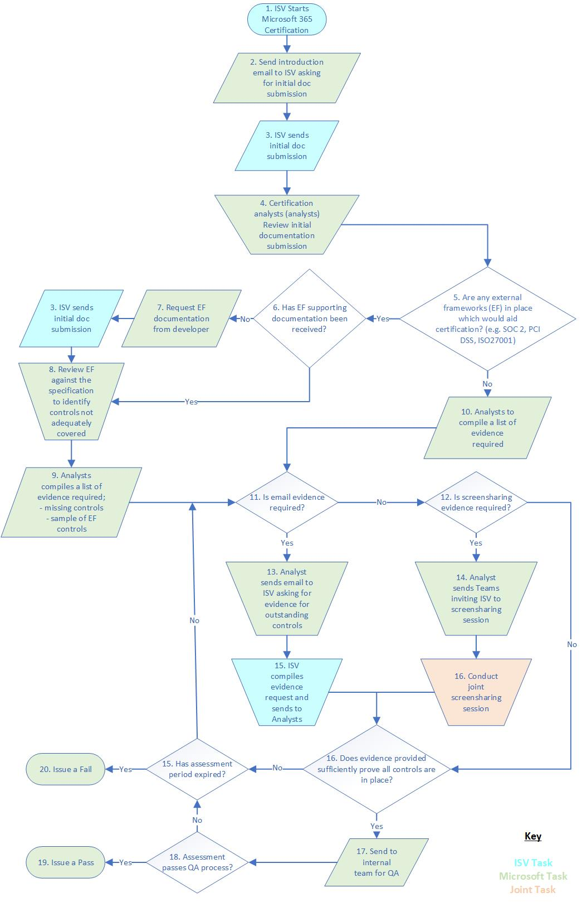

# Microsoft 365 認證提交指南Microsoft 365 Certification Submission Guide

**本文內容：****In this article:**
- [簡介Introduction](#introduction)
- [必要條件Prerequisites](#prerequisites) 
- [Microsoft 365 認證規格更新Microsoft 365 Certification Specification Updates](#microsoft-365-certification-specification-updates)
- [認證範圍Certification Scope](#certification-scope)
- [認證程式Certification Process](#certification-process)
- [規範證據Compliance Evidence](#compliance-evidence) 
- [初始檔提交Initial Document submission](#initial-document-submission) 
- [證據收集和評估活動Evidence Collection and Assessment Activities](#evidence-collection-and-assessment-activities)
- [認證準則Certification Criteria](#app-certification-criteria)
- [Application SecurityApplication Security](#application-security)
- [運作安全性Operational Security](#operational-security) 
- [資料處理安全性和隱私權Data Handling Security and Privacy](#data-handling-security-and-privacy)
- [選用的外部規範框架審查Optional External Compliance Frameworks Review](#optional-external-compliance-frameworks-review)
- [附錄 AAppendix A](#appendix-a)
- [附錄 BAppendix B](#appendix-b) 
- [附錄 CAppendix C](#appendix-c) 
- [附錄 DAppendix D](#appendix-d) 
- [附錄 EAppendix E](#appendix-e) 
- [附錄 FAppendix F](#appendix-f) 
- [附錄 G Appendix G ](#appendix-g)
- [深入了解Learn more](#learn-more) 
- [詞彙Glossary](#glossary) 

## 簡介Introduction

Microsoft 365 應用程式相容性計畫的一部分，當您將協力廠商開發人員應用程式/增益集整合至 Microsoft 365 平臺時，Microsoft 365 憑證會為企業組織提供保證及保護的安全性。Part of the Microsoft 365 App Compliance program, the Microsoft 365 Certification offers assurance and confidence to enterprise organizations that data and privacy are adequately secured and protected when integrating third-party developer apps/add-ins into the Microsoft 365 platform. 透過驗證的應用程式和增益集會在整個 Microsoft 365 生態系統中指定為 **microsoft 365 認證** 。Applications and add-ins that pass validation will be designated **Microsoft 365 Certified** throughout the Microsoft 365 ecosystem. 

加入 Microsoft 365 認證計畫後，您就會同意這些補充條款，並遵循任何365適用于 microsoft Corporation ( "Microsoft"、"我們"、"us" 或 "我們" ) 的隨附檔。By participating in the Microsoft 365 Certification  program, you are agreeing to these supplemental terms and to comply with any accompanying documentation that applies to your participation in the Microsoft 365 Certification program with Microsoft Corporation ("Microsoft", "we", "us",  or "our"). 您表示並保證我們有權代表您自己、公司和/或其他實體接受這些 Microsoft 365 認證補充條款（如適用）。You represent and warrant to us that you have the authority to accept these Microsoft 365 Certification supplemental terms on behalf of yourself, a company, and/or other entity, as applicable. 我們隨時可能會變更、修改或終止這些補充字詞。We may change, amend or terminate these supplemental terms at any time. 在任何變更或修正之後，您繼續參與 Microsoft 365 認證計畫，表示您同意新的附加條款。Your continued participation in the Microsoft 365 Certification program after any change or amendment means you agree to the new supplemental terms. 如果您不同意新的附加條款，或是我們終止這些補充條款，您必須停止參與 Microsoft 365 認證計畫。If you do not agree to the new supplemental terms or if we terminate these supplemental terms, you must stop participating in the Microsoft 365 Certification program.

本檔的目標是 Isv (獨立軟體廠商) 提供 Microsoft 365 認證程式的必要資訊、啟動程式的必要條件，以及 Isv 必須具備之特定安全性控制措施的詳細資料。This document is aimed at ISVs (Independent Software Vendors) to provide information on the Microsoft 365 Certification process, prerequisites to starting the process and details of specific security controls that ISVs must have in place.  Microsoft 365 應用程式規範計畫的一般資訊，可以在 Microsoft 365 應用程式規範方案 [頁面](https://docs.microsoft.com/microsoft-365-app-certification/overview)上找到。General information of the Microsoft 365 App Compliance program can be found under the Microsoft 365 App Compliance program [page](https://docs.microsoft.com/microsoft-365-app-certification/overview). 

> [!IMPORTANT]
> 目前 Microsoft 365 的認證有限：Currently, Microsoft 365 Certification is limited:
>* Microsoft 小組應用程式 (的索引標籤、Bot 等等 ) 。Microsoft Teams applications (Tabs, Bots, etc.) .
>* Sharepoint 應用程式/增益集Sharepoint Apps/Add-ins
>* Office 增益集 (Word、Excel、PowerPoint、Outlook、Project、OneNote) Office Add-ins (Word, Excel, PowerPoint, Outlook, Project, OneNote)

## 必要條件Prerequisites

### 發行者證明Publisher Attestation

在獎勵 Microsoft 365 認證程式之前，您必須已完成發行者證明。Before being awarded the Microsoft 365 Certification process you must have completed Publisher Attestation. 不過，您可以在完成發行者證明之前，先啟動 Microsoft 365 認證程式。However, you may start the Microsoft 365 Certification process prior to completing Publisher Attestation.  

### 閱讀 Microsoft 365 證書規格Read the Microsoft 365 Certification Specification

Microsoft 建議所有 Isv (獨立軟體廠商) 閱讀此 Microsoft 365 的憑證規格，以確保範圍內環境和應用程式/增益集符合所有適用的控制項。Microsoft recommends all ISVs (Independent Software Vendor) to read this Microsoft 365 Certification Specification in its entirety to ensure all applicable controls are being met by the in-scope environment and the app/add-in. 這會協助確保順利進行的評估處理常式。This will help ensure a smooth assessment process.

## Microsoft 365 認證規格更新Microsoft 365 Certification Specification Updates 

大約每隔六到十二個月就會預見 Microsoft 365 認證規格的更新。Updates to the Microsoft 365 Certification specification are anticipated approximately every six to twelve months. 這些更新可能會引入新的目標安全性網域和/或安全性控制。These updates might introduce new target security domains and / or security controls. 更新會根據開發人員的意見反應、對威脅環境所做的變更，以及在成熟時提升程式的安全性基準。Updates will be based on developer feedback, changes to the threat landscape, and to increase the security baseline of the program as it matures. 

已啟動 Microsoft 365 認證評估的 Isv 可以繼續使用評估開始時有效的 Microsoft 365 證書規格版本進行評估。ISVs that have already started the Microsoft 365 Certification assessment can continue the assessment with the version of the Microsoft 365 Certification Specification that was valid when the assessment was started. 所有新送出的報送（包括年度 recertification）都會針對發行的版本進行評估。All new submissions, including annual recertification, will be required to be assessed against the version published.

> [!NOTE]
> 您不需要遵循此 Microsoft 365 憑證規格中的所有控制項，即可獎勵憑證。You are not required to comply with all the controls within this Microsoft 365 Certification Specification to be awarded a certification. 不過，傳遞的臨界值 (，將不會在此 Microsoft 365 憑證規格中所討論的每個安全性網域) 就地公開。However, passing thresholds (which will not be disclosed) are in place for each of the security domains discussed within this Microsoft 365 Certification Specification. 有些控制項會 classed 為 "**Hard Fail**"，也就是說，缺乏這些安全性控制會導致評估失敗。Some controls will be classed as a ‘**Hard Fail**’ which means the lack of these security controls will result in a failed assessment. 

## 認證範圍Certification Scope

**範圍內環境** 是支援應用程式/增益集程式碼的傳遞，並支援應用程式/增益集可能會進行通訊的任何後端系統的環境。The **in-scope environment** is the environment that supports delivery of the app/add-in code and supports any backend systems that the app/add-in may be communicating with. 除非有足夠的分割，而且連接至環境不會影響範圍內環境的安全性，否則任何其他連接至的環境也會包含在範圍內。Any additional connected-to environments will also be included in scope unless adequate segmentation is in place AND the connected-to environments cannot impact the security of the in-scope environment. 任何嚴重損壞復原環境也必須包含在評估範圍內，因為在主要環境中，fulfil 服務需要任何的環境。Any disaster recovery environments will also need to be included within the scope of the assessment as these environments would be required to fulfil the service should anything happen to the primary environment.  術語  **範圍內系統元件**   參考範圍內環境中所使用的 **所有** 裝置和系統。The term  **in-scope system components** reference **ALL** devices and systems that are used within the in-scope environment. 範圍內的元件包括（但不限於）：In-scope components include, but are not limited to:
* Web 應用程式 (s) 。The web application(s).
* 伺服器。Servers.
* 防火牆 (或同等) 。Firewalls (or equivalent).
* 開關。Switches.
* 負載平衡器。Load balancers.
* 虛擬基礎結構。Virtual infrastructure.
* 雲端提供者 web 管理入口網站Cloud provider web management portals 

> [!IMPORTANT]
> 在範圍內環境中，必須要有 DMZ，且應用程式/增益集的支援環境必須從內部商務系統和公司環境中細分，因此只會將評估活動的範圍限制為僅限範圍內系統。The in-scope environment, must have a DMZ and the supporting environment of the app/add-in must be segmented from the internal business systems and corporate environments thus limiting the scope of the assessment activities to the in-scope systems only. 憑證分析員會在評估過程中驗證分割技術，以及審查滲透測試報告，該報告應該包含測試以驗證所使用之任何分割技術的有效性。Certification analysts will validate segmentation techniques during the assessment along with reviewing penetration testing reports which should have included testing to validate the effectiveness of any segmentation techniques in use.

### 基礎結構即服務 (IaaS) 、平臺為服務 (PaaS) 和軟體作為服務 (SaaS) Infrastructure as a Service (IaaS), Platform as a Service (PaaS) and Software as a Service (SaaS) 
其中 IaaS 和/或 PaaS 用以支援應用程式或增益集程式碼傳遞的基礎結構在「審閱」下，雲端平臺提供者會負責在整個認證過程中評估的某些安全性控制。Where IaaS and/or PaaS is used to support the infrastructure of the application or add-in code delivery under review, the Cloud platform provider will be responsible for some of the security controls assessed throughout the certification process. 因此，您必須將雲端平臺提供者針對    符合性 (AOC) 、ISO27001 或 [SOC 2](bookmark://soc-2)   Type II 報告等外部法規遵從性報告中的安全性最佳作法，以獨立外部驗證的安全性最佳作法，提供證書分析分析員。Therefore, certification analysts will need to be provided with independent external verification of security best practices by the Cloud platform provider through external compliance reports such as [PCI DSS](bookmark://pci-dss) Attestation of Compliance (AOC), ISO27001 or [SOC 2](bookmark://soc-2) Type II reports. 

附錄 F 提供根據下列部署類型及應用程式/增益集 exfiltrates M365 資料時，可能適用的安全性控制措施的詳細資料：Appendix F provides details of what security controls will likely be applicable based on the following deployment types and based upon whether the app/add-in exfiltrates M365 data or not: 
* ISV 主控ISV Hosted 
* 主控 IaaSIaaS Hosted 
* 主控 PaaS/無伺服器PaaS/Serverless Hosted 
* 混合主控Hybrid Hosted 
* 共用主控Shared Hosted 

在部署 IaaS 或 PaaS 時，您需要提供在這些部署類型中所主控的環境證據。Where IaaS or PaaS is deployed, you will need to provide evidence of the environment being hosted within these deployment types.

### 採樣Sampling

要求憑證評估的要求應該是以範圍內系統元件的範例為基礎，以考慮不同的作業系統、裝置的主要功能，以及不同的裝置類型。Requests for evidence in support of the certification assessment should be based on a sample of the in-scope system components in consideration of different operating systems, primary function of the device, and different device types. 在認證程式開始時，會選取適當的範例。A suitable sample will be selected at the start of the certification process. 下表應用作參考樣本大小的指南：The following table should be used as a guide on what the sample size may be:

|人口大小Population Size              | 範例Sample                  |
|---------------------------- |-------------------------|
|<5<5|11|
|>5 & <10>5 & <10|第2|
|>9 & <25>9 & <25|個3|
|>24>24|4 4|

> [!NOTE]
>如果在初始範例中所包含的裝置之間識別差異，則在評估期間可能會增加範例大小。If discrepancies are identified between devices included within the initial sample, the sample size may be increased during the assessment. 

## 認證程式Certification Process

開始認證程式之前，您需要成功啟動或完成發行者證明。Before starting the certification process, you would need to have successfully started or completed your Publisher Attestation. 您可以使用證明回應，以支援 Microsoft 365 認證程式，並依下列方式繼續：Your attestation responses will be used in support of the Microsoft 365 Certification process and proceeds as follows: 

1. 檢查您的發行者證明檔，以確保與您目前的環境一致Review your Publisher Attestation documentation to ensure alignment with your current environment 
2. 透過電子郵件傳送 Microsoft 365 認證的要求 <AppCert@microsoft.com>Request to progress to the Microsoft 365 Certification by emailing <AppCert@microsoft.com> 
3. 認證分析員會在開始 Microsoft 365 認證程式之前開啟一個對話方塊Certification analysts will open a dialogue before starting the Microsoft 365 Certification process   
4. 提交您的 [初始檔提交](#initial-document-submission)Submit your [Initial Document Submission](#initial-document-submission)
5. 認證分析員會提供必要證據的控制項清單，該清單正式啟動 Microsoft 365 證書處理常式Certification analyst will provide a listing of controls for which evidence is required, which formally starts the Microsoft 365 Certification process
6. 提交證據，表明所有範圍內的 Microsoft 365 證書控制都已符合60一天的範圍，以完成 Microsoft 365 認證Submit evidence that demonstrates that all in-scope Microsoft 365 Certification controls have been met within a 60-day window to complete Microsoft 365 Certification 

> [!IMPORTANT]
> **提交時間範圍：** 預計平均評估程式應該需要15天，但前提是您可以及時回應證據要求。**Submission time frame:** It is anticipated that on average the assessment process should take 15 days, provided you are able to respond to evidence requests within a timely manner. Microsoft 建議您確定已讀取此認證提交指南，並且確信您可以符合其內所設定的控制措施，而且您可以在開始認證程式之前提供足夠的證據。Microsoft recommends that you ensure this certification submission guide has been read and be confident that you can meet the controls set out within it, and you can provide enough evidence before starting the certification process. 在啟動認證程式時，最多可以有60天的時間來完成評估，否則已經收集的證據會變成陳舊。Upon starting the certification process, a maximum of 60 days is permitted to complete the assessment, otherwise evidence already collected becomes stale. 如果在60天的時段後，就不會達到成功的評估，提交將會失敗，且必須重新開始進行處理。If, after the 60-day time-period, a successful assessment is not reached, the submission will be issued a fail and the process must start again. 若由於無法符合 Microsoft 365 憑證規格，或是已到達60一天的時間內，但未提供足夠的證據，所以 Microsoft 不會公開失敗的結果。If a fail is issued due to failing to meet the Microsoft 365 Certification Specification or because the 60-day time-period is reached and enough evidence is not provided, failing results will not be made public by Microsoft. 

## 規範證據Compliance Evidence

雖然這不是必要的，但如果您目前與其他外部安全性架構相容，您可以選擇使用這些認證，以滿足一些 Microsoft 365 認證控制項。Although it is not required, if you are currently in compliance with other external security frameworks, you can elect to use these certifications to satisfy some of the Microsoft 365 Certification controls. 憑證分析員會檢查任何支援的外部安全性框架的範圍和安全性控制範圍，以判斷哪些控制項可以從 Microsoft 365 認證評估中排除，提供外部安全性框架的範圍包括 Microsoft 365 認證評估的範圍內環境。Certification analysts will review the scope and security control coverage of any supported external security frameworks to determine which controls can be excluded from the Microsoft 365 Certification assessment, providing the scope of the external security frameworks include the in-scope environments for the Microsoft 365 Certification assessment. 

憑證分析員會嘗試將現有的外部安全性框架與 Microsoft 365 憑證規格對齊。Certification analysts will try to align existing external security frameworks to the Microsoft 365 Certification specification. 不過，如果支援檔無法保證 Microsoft 365 認證控制項已評估為外部安全性框架的一部分審核/評估，您將需要提供目前所說的控制項的額外證據。However, if supporting documentation is unable to provide assurance that Microsoft 365 Certification controls were assessed as part of the external security frameworks audit/assessment you will need to provide additional evidence of the said controls being in place. 

目前，可用於支援 Microsoft 365 認證評估的外部安全性框架包括：Currently, the external security frameworks that can be used in support of the Microsoft 365 Certification assessment include:

*  [Ism](#isms) /[Iec](#iec) -IS0/IEC 27001 規格[ISMS](#isms)/[IEC](#iec) - IS0/IEC 27001 specification 
*  [PCI DSSPCI DSS](#pci-dss)
*  [SOC 2SOC 2](#soc-2)

檔必須充分示範 Microsoft 365 憑證的範圍內環境會包含在這些外部安全性框架的範圍內。Documentation must adequately demonstrate that the in-scope environment for the Microsoft 365 Certification was included within the scope of these external security frameworks. 透過接受由著名的外部協力廠商公司所執行的有效憑證證據，便可驗證這些安全性框架。Validation of these security frameworks will be fulfilled by accepting evidence of valid certifications conducted by reputable external third-party companies. 這些著名的公司必須是相關規範計畫的國際資格鑒定主體的成員。These reputable companies must be members of international accreditation bodies for relevant compliance programs.請參閱 iso 27001 和[合格的安全性評估者](https://www.pcisecuritystandards.org/assessors_and_solutions/qualified_security_assessors)的 [Iso 憑證和合規性標準](https://www.iso.org/certification.html)。) PCI DSS 的 (QSA。 See [ISO Certification and Conformity Standards](https://www.iso.org/certification.html) for ISO 27001 and [Qualified Security Assessors](https://www.pcisecuritystandards.org/assessors_and_solutions/qualified_security_assessors) (QSA) for PCI DSS. 

下表著重于此驗證程式的一部分，這是認證分析員所需的檔：The following table highlights documentation required by certification analysts as part of this validation process:

| **Standard****Standard** | **需求****Requirements** |
| ----- | ----- |
| **[ISO 27001](#iso-27001)****[ISO 27001](#iso-27001)** |  (SOA) 且所發出的 ISO 27001 憑證複本是 **公開的公開** 版本。A public facing version of the **Statement of Applicability** (SOA) and a copy of the ISO 27001 certificate issued will be required.  SOA 會摘要您在每個114資訊安全性控制上的位置，並將用來識別 ISO 27001 憑證中的任何不滿意的控制項排除。The SOA summarizes your position on each of the 114 information security controls and  will be used to identify if any exclusion of controls that are not satisfactorily detailed in the ISO 27001 certificate. 如果不能透過檢查 SOA 的公開版本來判斷這種情況，當 ISO 27001 將用來驗證某些 Microsoft 365 證書規格控制項時，分析者可能需要存取完整的 SOA。If this can't be determined by reviewing the public facing version of the SOA, the analyst might need access to the full SOA if ISO 27001 will be used to validate some of the Microsoft 365 Certification Specification controls.  除了驗證 ISO 27001 評估活動的範圍之外，分析員也會依照上述所述，確認審計公司的合法性。In addition to validating the scope of the ISO 27001 assessment activities, the analysts will also confirm the validity of the audit company as described above.|
|**[PCI DSS](#pci-dss)****[PCI DSS](#pci-dss)**| 必須提供有效 **的等級1證明規範** (AOC) 檔，才能明確識別範圍內的應用程式和系統元件。A valid **Level 1 Attestation of Compliance** (AOC) document must be provided clearly identifying the in-scope application and system components.  「自我評估 AOC」 **不** 會接受為會議安全性最佳作法的證據。A self-assessment AOC **will not** be accepted as evidence of meeting security best practices. AOC 將用來判斷哪一種 Microsoft 365 憑證規格控制已評估並確認為 PCI DSS 評估的一部分。The AOC will be used to determine which of the Microsoft 365 Certification Specification controls have been evaluated and confirmed as part of the PCI DSS assessment.|
|**[SOC 2](#soc-2)****[SOC 2](#soc-2)**|**SOC 2 (Type I 或 TYPE II)** report 必須是目前 (于過去15個月內發行的時間，以及在過去27個月內開始的宣告時間週期) ，以當作此 Microsoft 365 認證規格內任何評估控制項的符合性。The **SOC 2 (Type I or Type II)** report must be current (issued within the last 15 months and the declared time period started within the last 27 months) to be used as evidence of conformity with any of the assessment controls within this Microsoft 365 Certification Specification.|

## Microsoft 365 認證Microsoft 365 Certification

支援的外部安全性框架可以做為會議部分 Microsoft 365 認證控制項的證據。Supported external security frameworks can be used as evidence of meeting some of the Microsoft 365 Certification controls. 在您可以考慮使用外部安全性框架之前，認證分析員會透過上述檔中所提交的檔，檢查外部安全性架構的範圍和安全性控制範圍。Before external security frameworks can be considered, certification analysts will review the scope and security control coverage of the external security framework using the documentation submitted above. 

下列附錄可用於識別外部安全性架構與 Microsoft 365 憑證規格之間的潛在差距，如下所示：The following appendixes can be used to identify where potential gaps between the external security framework and the Microsoft 365 Certification specification exist as follows: 

|**框架****Framework** | **其他考量****Additional considerations** |
|-------------- | --------------------|
|ISO 27001ISO 27001| [**附錄 C**](#appendix-c)：證據集合– ISO 27001 的增量。[**Appendix C**](#appendix-c): Evidence Collection – Deltas for ISO 27001.|
|PCI DSSPCI DSS | [**附錄 D**](#appendix-d)：證據集合– PCI DSS 的增量。[**Appendix D**](#appendix-d): Evidence Collection – Deltas for PCI DSS.|
|SOC 2SOC 2| [**附錄 E**](#appendix-e)： SOC 2 的證據集合–增量。[**Appendix E**](#appendix-e): Evidence Collection – Deltas for SOC 2.|

> [!NOTE]
> 雖然上述的外部安全性標準/框架可以提交為證據，以符合某些 Microsoft 365 認證控制項，但傳遞 Microsoft 365 認證並不表示您會成功地透過這些標準/框架進行審計。Although the above-mentioned external security standards/frameworks can be submitted as evidence to meet some of the Microsoft 365 Certification controls, passing the Microsoft 365 Certification doesn't mean that you will successfully pass an audit against those standards/frameworks. Microsoft 365 憑證規格只是這些安全性標準/框架的小型子集，可讓 Microsoft 取得安全狀況的保證。The Microsoft 365 Certification Specification is only a small subset of those security standards/frameworks that allows Microsoft to gain a level of assurance in reference to your security posture.

## 初始檔提交Initial document submission

初始檔提交會協助認證分析員執行範圍，並決定評估的範圍中的內容。The initial document submission will help certification analysts perform scoping and determine what will be in scope for your assessment. 之後，您將需要提交用於執行評估的支援檔和證據。After which you will be required to submit supporting documentation and evidence used to carry out the assessment. 您的初始提交必須包含下列所指定的資訊：Your initial submission must include the information specified below:

| **檔 &nbsp; 概述****Documentation&nbsp;Overview**     |   **檔詳細資料****Documentation Details**  |
| -------------------------| -----------------------------|
|**應用程式/增益集描述****App/Add-in Description** | App/增益集的用途及功能的描述。A description of the app/add-in’s purpose and functionality. 這可讓認證分析分析員充分瞭解應用程式/增益集的功能及其用途。This should provide the certification analyst with a good understanding of how the app/add-in functions and what it is intended use is
|**滲透測試報告****Penetration Testing Report** |在過去12個月內完成的滲透測試報告。A penetration testing report completed within the last 12 months. 此報告必須包含支援部署應用程式/新增的環境，以及支援應用程式/增益集作業的任何其他環境。This report must include the environment that supports the deployment of the app/add along with any additional environment that supports the operation of the app/add-in. **附注：** 如果您不執行年度滲透測試，您可以選擇透過認證程式完成。**Note:** if you do not do annual penetration testing, you can elect to have them done through the certification process.|
|**架構圖表****Architecture diagrams**|邏輯架構圖，代表應用程式/增益集的支援基礎結構的高層次概述。A logical architecture diagram representing a high-level overview of your app's / add-in’s supporting infrastructure. 這必須包含支援應用程式/增益集的 **所有** 主控環境和支援基礎結構。This must include **all** hosting environments and supporting infrastructure supporting the app/add-in. 此圖表必須說明環境內所有不同的支援系統元件，以協助認證分析員瞭解範圍內的系統，並協助判斷抽樣。This diagram MUST depict all the different supporting system components within the environment to help certification analysts understand systems in scope and help to determine sampling. 請另外指出使用的主控環境類型;ISV 主控、IaaS、PaaS 或混合式。Please also indicate what hosting environment type is used; ISV Hosted, IaaS, PaaS, or Hybrid. **附注：** 在使用 SaaS 的地方，請指出用來在環境中提供支援服務的各種 SaaS 服務。**Note:** Where SaaS is used, please indicate the various SaaS services that are used to provide the supporting services within the environment.|
|**公開的足跡****Public Footprint** | 詳述支援基礎結構所使用的 **所有** 公用 IP 位址和 URLs。Detailing **all** public IP Addresses and URLs used by the supporting infrastructure. 這必須包含為環境所指派的完整可路由 IP 範圍，除非已執行適當的分割才能分割使用中的範圍 (足夠的分割的證據) This must include the full routable IP range allocated to the environment unless adequate segmentation has been implemented to split the range in use (adequate evidence of segmentation will be required)|
|**資料流程圖****Data flow diagrams** |詳述下列各項的流程圖：Flow diagrams detailing the following:
||在應用程式/增益集 (中 &#x2713; M365 資料流程，包括 [EUII](#euii) 和 [OII](#oii) ) 。&#x2713; M365 Data flows to and from the App / Add-in (including [EUII](#euii) and [OII](#oii) ).|
||&#x2713; 在支援的基礎結構內 M365 資料流程 (適用于) &#x2713; M365 Data flows within the supporting infrastructure(where applicable)|
||&#x2713; 圖表會強調儲存的位置和資料，也就是將資料傳遞給外部協力廠商的方式 (包含哪些協力廠商) 的詳細資料，以及如何透過開放/公用網路及靜態網路傳輸來保護資料。&#x2713; Diagrams highlighting where and what data is stored, how data is passed to external third parties(including details of what third parties) , and how data is protected in transit over open/public networks and at rest.|
|**API 端點詳細資料****API Endpoint Details**| 您的應用程式所使用之所有 API 端點的完整清單。A complete listing of all API Endpoints used by your app. 為了協助瞭解環境範圍，請在您的環境中提供 API 端點位置。To help understand the environment scope, provide API endpoint locations within your environment.                                
|**Microsoft API 許可權****Microsoft API Permissions**| 提供檔，詳述 **所有** 與要求的應用程式/增益集一起使用之許可權的 Microsoft APIs，以及要求的許可權的理由Provide documentation detailing **ALL** the Microsoft APIs that are used along with what permissions are being requested for the app/add-in to function along with a justification for the requested permissions|
|**資料儲存類型****Data storage types** |資料儲存與處理檔說明：Data storage and handling documents describing:|
||&#x2713; 您的客戶 M365 資料 [EUII](#euii) 和 [OII](#oii) 正在接收及儲存的程度&#x2713; To what extent is your customers M365 Data [EUII](#euii) and [OII](#oii) is being received and stored|
||&#x2713; 資料保留期間。&#x2713; The data retention period.|
||&#x2713; 即將捕獲客戶 M365 資料的原因。&#x2713; Why the customer M365 Data is being captured.|
||儲存客戶 M365 資料的 &#x2713; (應該包含在上述) 中的資料流程圖內。&#x2713; Where customer M365 Data is stored (should be included within data flow diagrams supplied above).|
|**合規性確認****Compliance confirmation**|包含在發行者認證提交中的外部安全性框架的支援檔，或在複查 Microsoft 365 認證控制項時加以考慮。Supporting documentation for external security frameworks included within the Publisher Attestation submission or to be considered when reviewing Microsoft 365 Certification controls. 目前支援下列三個專案：Currently, the following three are supported:|
|| (AOC) 的相容性 &#x2713; [PCI DSS](#pci-dss) 證明。&#x2713; [PCI DSS](#pci-dss) Attestation of Compliance (AOC).|
||&#x2713; [SOC 2](#soc-2) Type I/type II 報告。&#x2713; [SOC 2](#soc-2) Type I/Type II reports.|
||&#x2713; [ism](#isms)  /  [IEC](#iec) -1S0/IEC 27001 的適用性聲明 (SoA) 和認證。&#x2713; [ISMS](#isms) / [IEC](#iec) - 1S0/IEC 27001 Statement of Applicability (SoA) and Certification.|
|**Web 相依性****Web Dependencies**|檔：列出使用目前執行中的應用程式/增益集所使用的所有依存關係。Documentation listing all dependencies used by the app / add-in with the current running versions.|
|**軟體清查****Software Inventory**|最新的軟體清查，包含範圍內環境中所使用的所有軟體，以及版本。An up-to-date software inventory which includes all software used within the in-scope environment along with the versions.|
|**硬體清單****Hardware Inventory**| 支援基礎結構所使用的最新硬體清單。An up-to-date hardware inventory used by the supporting infrastructure. 這會在執行評估階段時用於協助抽樣。This will be used to help with sampling when performing the assessment phase. 如果您的環境包含 PaaS 提供所使用之服務的詳細資料。If your environment includes PaaS provide details of services consumed.|

## 證據收集和評估活動Evidence Collection and Assessment Activities

透過強大的證據收集和評估活動，認證分析師將能夠評估安全性狀態，以取得適當的資料安全性保證，並符合 Microsoft 365 的認證規格控制。Through robust evidence collection and assessment activities, certification analysts will be able to assess your security posture to obtain an adequate level of data security assurance and adherence to the Microsoft 365 Certification Specification controls. 認證分析員會以下列方式達成此目的：Certification analysts will achieve this as follows: 

**證據集合****Evidence Collection**

* 初始檔，在上方的 [初始檔提交](#initial-document-submission) 區段中高亮顯示Initial documentation, highlighted within the [Initial Documentation Submission](#initial-document-submission) section above 
* 原則檔Policy documents 
* 處理檔Process documents 
* 系統設定System configuration settings 
* 變更票證Change tickets 
* 變更控制項記錄Change control records 
* 系統報告System reports

將使用各種方法來收集完成評估程式所需的證據。Various methods will be used to collect the evidence necessary to complete the assessment process.  此證據集合的格式可為：This evidence collection may be in the form of: 
* 文件Documents 
* 螢幕擷取畫面Screenshots 
* 採訪Interviews 
* ScreensharingScreensharing 

使用的證據集合技術會在評估程式期間決定。The evidence collection techniques used will be determined during the assessment process. 

**評估活動****Assessment Activities**

認證分析師會檢查您提供的證據，以判斷您是否有足夠的控制此 Microsoft 365 認證規格。Certification analysts will review evidence you provide to determine if you have adequately met controls within this Microsoft 365 Certification Specification. 

您應該盡可能提供 [初始檔提交](#initial-document-submission)中所述的任何或所有檔，以盡可能縮短評估所需的時間   。Where possible and to reduce the amount of time required to complete the assessment, any or all of the documentation detailed in the [Initial Documentation Submission](#initial-document-submission) should be provided in advance.

憑證分析員會先從最初的檔提交和發行者認證資訊中檢查提供的證據，以識別適當的查詢、採樣大小，以及如以上所述取得進一步證據的需要。Certification analysts will first review the evidence provided from the initial documentation submission and the Publisher Attestation information to identify appropriate lines of inquiry, sampling size, and the need for further evidence to be obtained as detailed above.  憑證分析員會分析所有收集到的資訊，以在此 Microsoft 365 認證規格內，如何以及是否要為您的控制會議。Certification analysts will analyze all information gathered to draw conclusions as to how and if you are meeting the controls within this Microsoft 365 Certification Specification. 

## 應用程式認證準則App Certification Criteria

您的應用程式、支援基礎結構，以及支援檔將會跨下列安全網域評估：Your app, supporting infrastructure, and supporting documentation will be assessed across the following security domains:

1. [**Application Security****Application Security**](#application-security)
1. [**運作安全性/安全部署****Operational Security / Secure Deployment**](#operational-security)
1. [**資料處理安全性和隱私權****Data Handling Security and Privacy**](#data-handling-security-and-privacy)
1. [**選用的外部規範架構審查****Optional External Compliance Framework Review**](#optional-external-compliance-frameworks-review)

這些安全網域中的每一個都包含特定的主要控制項，包含一或多個在評估程式中評估的特定需求。Each of these security domains include specific key controls encompassing one or more specific requirements that will be evaluated as part of the assessment process. 為了確保 Microsoft 365 的憑證包含在所有大小的開發人員上，每四個安全網域都會使用計分系統進行評估，以判斷每個網域的整體分數。To ensure that Microsoft 365 Certification is inclusive to developers of all sizes, each of the four security domains is assessed using a scoring system to determine an overall score from each of the domains. 每個 Microsoft 365 憑證控制項的分數是在 1 (低) 和 3 (高) 之間，根據該控制項未滿足的認知風險進行分配。Scores for each of the Microsoft 365 Certification controls are allocated between 1 (low) and 3 (high) based upon the perceived risk of that control not being met. 四個安全網域中的每一個都會將最小的百分號視為傳遞。Each of the four security domains will have a minimum percentage mark to be deemed a pass. 此規格的某些元素包含一些自動失敗的準則：Certain elements of this specification include some automatic fail criteria:

- API 許可權不遵循 (PoLP) 最低許可權原則。API permissions not following the principle of least privilege (PoLP).  
- 不需要滲透測試報告。No penetration testing report when it is required.
- 無反惡意程式碼防護No anti-malware defenses
- 未使用 Multi-Factor 驗證來保護系統管理存取。Multi-Factor authentication not being used to protect administrative access.  
- 沒有修補程式。No patching processes.  
- 無適當的 [GDPR](#gdpr) 隱私權通知。No suitable [GDPR](#gdpr) privacy notice.  

## Application SecurityApplication Security

應用程式安全性網域著重于下列三個區域：The application security domain focuses upon the follow three areas: 
* GraphAPI 許可權驗證GraphAPI Permission Validation 
* 外部連線檢查External Connectivity Checks
* 應用程式安全性測試Application Security Testing 

**GraphAPI 許可權驗證****GraphAPI Permission Validation**

GraphAPI 許可權驗證的執行是為了驗證應用程式/增益集不會要求太好的許可權。GraphAPI permission validation is carried out to validate the app/add-in does not request overly permissive permissions. 這是透過手動檢查要求的許可權來執行。This is carried out by manually checking what permissions are requested. 憑證分析員會對照發行者認證提交，以參考這些檢查，並評估所要求的存取層級，以確保符合「最低許可權」作法。Certification analysts will cross reference these checks against the Publisher Attestation submission and evaluate the level of access being requested to ensure ‘least privilege’ practices are being met. 當憑證分析員認為未符合這些「最低許可權」做法時，認證分析員會與您展開討論，以驗證所要求之許可權的業務理由。Where certification analysts believe these ‘least privilege’ practices are not being met, certification analysts will have an open discussion with you to validate the business justification for the permissions being requested. 在此評審期間，針對發行者證明提交的任何矛盾也會取得意見反應，使您的發行者證明得以更新。Any discrepancies against your Publisher Attestation submission found during this review will also get feedback so your Publisher Attestation can be updated. 

**外部連線檢查****External Connectivity Checks**

在評估過程中，分析員會執行應用程式功能的輕量指導，以識別 M365 之外的連線。As part of the assessment, an Analyst will perform a light walk through of the applications functionality to identify connections outside of M365.  在評估期間，將會標記並討論任何未識別為 Microsoft 或直接連線至服務的連線。Any connections which are not identified as being Microsoft or direct connections to your service will be flagged and discussed during the assessment.

**應用程式安全性測試****Application Security Testing**

在應用程式/增益集與支援環境相關聯的風險中，有足夠的複查，在應用程式/增益集的安全性中為客戶提供保證保證是必要的。An adequate review of the risks associated with your app/add-in and supporting environment is essential in providing customers with assurance in the security of the app/add-in. 如果您的應用程式與 Microsoft 未發佈的任何服務有任何連線，則必須執行採用滲透測試形式的應用程式安全性測試。Application security testing in the form of penetration testing MUST be carried out if your application has any connectivity to any service not published by Microsoft. 如果您的應用程式獨立運作，但沒有連接至任何非 Microsoft 服務或後端，則不需要滲透測試。If your app operates standalone without connectivity to any non-Microsoft service or backend, then penetration testing is not required.

### 滲透測試範圍Penetration Testing Scope

滲透測試活動 **必須** 包含支援部署應用程式/增益集的環境 (例如，應用程式/增益集程式碼的主控位置通常是資訊清單檔案中的資源) ，以及任何支援應用程式/增益集作業的其他環境 (例如，若應用程式/增益集與 Microsoft 365) 以外的其他 web 應用程式交談。Penetration testing activities **MUST** include the environment that supports the deployment of the app/add-in (for example; where the app/add-in code is hosted which will typically be the resource within the manifest file) along with any additional environment that supports the operation of the app/add-in (for example; if the app/add-in talks to other web applications outside of Microsoft 365).  在定義範圍時，必須特別注意，以確保任何「連線至」系統或可能影響範圍內環境安全性的環境，也都會包含在所有滲透測試活動中。When defining the scope, care needs to be taken to ensure that any “connected-to” systems or environments that can impact upon the security of the in-scope environment is also included within ALL penetration testing activities. 

使用技術從其他環境分割範圍內的環境時，滲透測試活動必須驗證說出分割技術的有效性。Where techniques are used to segment the in-scope environments from other environments, penetration testing activities MUST validate the effectiveness of said segmentation techniques. 這必須在滲透測試報告中詳細說明。This must be detailed within the penetration testing report. 
 

### 測試規格Test Specification 

|測試Test | 控制措施Controls |
|-------|-----------|
|**滲透測試****Penetration testing**| 應用程式和基礎結構滲透測試 **必須** 每年 (12 個月進行，) 且由著名的獨立公司執行。Application and infrastructure penetration testing **MUST** take place annually (every 12 months) and conducted by a reputable independent company. 修正的嚴重和高風險弱點 **必須** 在滲透測試結束的一個月內完成，或根據所記錄的修補程式。Remediation of identified critical and high-risk vulnerabilities **MUST** be completed within one month of the conclusion of the penetration testing, or sooner depending on the documented patching process. (IP 位址、URLs、API 端點 ) 等的完整外部空間，必須包含在滲透測試範圍內，且必須在滲透測試報告中加以記錄。 (IP 位址、URLs、API 端點 ) 等的完整外部 **空間，必須** 包含在滲透測試範圍內，且必須在滲透測試報告中加以記錄。 The full external footprint (IP Addresses, URLs, API Endpoints, etc.) MUST be included within the scope of penetration testing and must be documented within the penetration testing report.The full external footprint (IP Addresses, URLs, API Endpoints, etc.) *\*MUST** be included within the scope of penetration testing and must be documented within the penetration testing report.                                                                                                                                                                           Web 應用程式滲透測試必須包含所有弱點類別;例如，最新的 OWASP Top 10 或 SANS Top 25 CWE。Web application penetration testing MUST include all vulnerability classes; for example, the most current OWASP Top 10 or SANS Top 25 CWE.                                                                                                                                                                                不需要透過滲透測試公司重新測試已識別的漏洞-修復和自我審查是足夠的，所以評估期間 **必須** 提供足夠的證據來示範足夠的修復。Retesting of identified vulnerabilities by the penetration testing company is not required — remediation and self-review is sufficient however, adequate evidence to demonstrate sufficient remediation **MUST** be provided during the assessment.|

### 應用程式安全性測試報告檢查Application Security Testing Report Review

將會檢查滲透測試報告，以確保沒有任何漏洞可滿足下列 **自動失敗準則：**Penetration testing reports will be reviewed to ensure there are no vulnerabilities that meet the following **automatic failure criteria:**

* 目前是否有不受支援的作業系統。Presence of an unsupported operating system. 

* 預設值、可枚舉或 guessable 的系統管理帳戶是否存在。Presence of default, enumerable, or guessable administrative accounts.

* SQL 注入風險的存在。Presence of SQL injection risks.\*

* 跨網站腳本的存在。Presence of cross-site scripting.\*

* 目錄遍歷 (檔案路徑) 漏洞。 \*Presence of directory traversal (file path) vulnerabilities.\*

* HTTP 弱點的存在，例如標頭回應分割、要求 smuggling 及 Desync 攻擊。 \*Presence of HTTP vulnerabilities, e.g., Header response splitting, Request smuggling, and Desync attacks.\*

* 來原始程式碼洩漏 (包括 [LFI](#lfi)) 。 \*Presence of source code disclosure (including [LFI](#lfi)).\*

* CVSS 修補程式管理指導方針所定義的任何重要或高分數。Any critical or high score as defined by the CVSS patch management guidelines.

* 任何重要的技術弱點，可被攻擊者利用以攻破大量的 EUII 或 OUI。Any significant technical vulnerability which can be readily exploited to compromise a large amount of EUII or OUI.

\* 不論弱點 CVSS 分數為何\*Regardless of the vulnerabilities CVSS Score

> [!IMPORTANT]
>報表必須能夠提供足夠的保證，您可以在 Application Security Test 規格區段中的詳細資訊中加以示範。Reports must be able to provide enough assurance that everything detailed within the Application Security Test Specification section can be demonstrated.

### 滲透測試需求和成本Penetration Testing Requirements and Cost

針對目前未參與滲透測試的 Isv，滲透測試會包含在 Microsoft 365 認證中。For ISVs that currently do not engage in penetration testing, penetration testing is included under the Microsoft 365 Certification. Microsoft 會安排並涵蓋最多12天手動測試的滲透測試成本。Microsoft will arrange and cover the cost of a penetration test for up to 12 days of manual testing. 滲透測試成本的計算取決於測試環境所需的天數。Penetration tests costs are calculated based on the number of days required to test the environment. 任何超過12天測試的費用都會成為 ISV 的責任。Any expenses exceeding 12 days of testing will be the responsibility of the ISV. ISV 也會負責示範滲透測試中所識別的安全性漏洞已在取得認證之前修正，但不需要產生全新報告。The ISV will also be responsible for demonstrating that vulnerabilities identified in the penetration test have been remediated prior to a certification being awarded, but do not need to produce a clean report.

在排列滲透測試之後，ISV 會負責與重新排定和取消相關的費用，如下所示：Once a penetration test is arranged, the ISV is responsible for fees associated with rescheduling and cancellations as follows:

| **重新排定費用的時間****Rescheduling Fee Timescale** | **應付比例****Proportion Payable** |
|------------------|------------------------|
| 在排定的開始日期之前的30天內，重新排程要求的接收時間超過30天。Re-schedule request received more than 30 days prior to scheduled start date. | 0% 應付0% Payable |
| 預定的開始日期之前，請重新排定要求的前8至30天。Re-schedule request received 8 to 30 days prior to scheduled start date. | 25% 應付25% Payable |
| 在排定的開始日期之前的2到7天內，將要求重新排定的時間設定為固定的重新預約日期。Re-schedule request received within 2 to 7 days prior to scheduled start date with a firm re-booking date.| 50% 應付50% Payable |
| 在開始日期之前的2天內，重新排程要求的接收時間小於2天。Re-schedule request received less than 2 days before the start date. | 100% 應付100% Payable |

| **取消費用時間****Cancellation Fee Timescale** | **應付比例****Proportion Payable** |
|------------------|------------------------|
| 在排定的開始日期之前收到超過30天的取消要求。Cancellation request received more than 30 days prior to scheduled start date. | 25% 應付25% Payable |
| 在排定的開始日期之前，已接收到8至30天的取消要求。Cancellation request received 8 to 30 days days prior to scheduled start date. | 50% 應付50% Payable |
| 在排定的開始日期之前7天內收到的取消要求。Cancellation request received within 7 days prior to scheduled start date. | 90% 應付90% Payable |

## 運作安全性Operational Security

這個網域會以安全性最佳作法衡量應用程式的支援基礎結構和部署程式的對齊方式。This domain measures the alignment of your app's supporting infrastructure and deployment processes with security best practices.

### 測試規格Test Specification

|測試Test | 控制措施Controls |
| ------------------------|------------------------------ |
| **惡意程式碼保護****Malware Protection** | 您必須在經常受到惡意程式碼影響的所有範圍內系統上部署惡意程式碼保護機制。You must deploy malware protection mechanisms on all in-scope systems that are commonly affected by malware. 這些保護機制可能包括使用防毒軟體或應用程式控制技巧，以防範惡意程式碼。These protection mechanisms can include the use of anti-virus software or application control techniques that protect against malware. 在使用防毒軟體或應用程式控制的地方，必須符合下列準則。Where anti-virus software or application control is used, it MUST meet the following criteria.                                                                                            防病毒 (也包含反惡意軟體產品) 必須符合下列各項：Anti-virus (also including anti-malware products) MUST meet the following: |
||在範圍內的所有系統元件上執行防毒軟體 &#x2713;。&#x2713; Anti-virus software is running on all system components within scope.|
||&#x2713; 防毒軟體會在30天內 () 。&#x2713; Anti-virus software is kept up to date (within 30 days).|
||&#x2713; 防病毒碼碼會在1天內 () 。&#x2713; Anti-virus signatures are kept up to date (within 1 day).|
||&#x2713; 必須設定 [使用中的掃描] 掃描及（或）定期掃描（必須設定通知）。&#x2713; Either on-access scanning and/or periodic scans with notifications must be configured.  在使用存取掃描的情況下，還 **必須** 設定每週掃描，但如果未設定存取掃描，則必須設定每日掃描。Where on-access scanning is used, weekly scans **MUST** also be configured, however if on-access scanning is not configured, daily scanning must be configured.|
||&#x2713; 防毒軟體 **必須** 設定如下。&#x2713; Anti-virus software **MUST** be configured as follows.|
||&emsp;&#x25fc; 封鎖可疑的惡意程式碼。&emsp;&#x25fc; Block suspected malware.|
||&emsp;&#x25fc; 隔離可疑的惡意程式碼。&emsp;&#x25fc; Quarantine suspected malware.|
||&emsp;&#x25fc; 對可疑的惡意程式碼提供警示。&emsp;&#x25fc; Provide an alert on suspected malware.|
||&#x2713; 防毒軟體 **必須** 設定為記錄所有活動。&#x2713; Anti-virus software **MUST** be configured to log all activities.
||&#x2713; 原則和程式 **必須** 準備好，以提升惡意的反惡意程式碼作法。&#x2713; Policies and procedures **MUST** be in place to promote strong anti-malware practices.|
||或or|
||必須在所有的內部範圍系統上設定應用程式控制項，才能符合下列各項：Application controls MUST be configured on all in-scope system to meet the following:|
||&#x2713; 所有允許在內部範圍系統元件上執行的應用程式，必須由組織正式核准。&#x2713; All allowed applications permitted to execute on in-scope system components MUST be formally approved by the organization..|
||&#x2713; 組織必須維護完整的核准應用程式清單，讓應用程式具備業務理由。&#x2713; The organization MUST maintain a complete list of approved applications with business justification for the application.|
||必須完整記錄 &#x2713; 特定的應用程式控制機制：例如，白名單位置;代碼簽署等。&#x2713; Specific application control mechanisms MUST be fully documented: i.e. whitelisted locations; code signing, etc.|
||&#x2713; 應用程式控制項必須設定為檔。&#x2713; Application control MUST be configured as document.|
||針對應用程式核准的 &#x2713; 已記錄的程式必須已就緒且可供審核。&#x2713; Documented process for application approvals must be in place and auditable.|
|**修補程式管理****Patch Management**|您 **必須** 具備已記錄的修補原則和程式，以確保及時進行修補程式的實施。You **MUST** have documented patching policies and procedures in place that ensure patching is conducted in a timely manner. 一個可靠的程式 **必須** 是就地，以根據 CVSS 中的 **建議風險排名分數** 或同等計分分類，識別、排名及修補新的安全性弱點：A robust process **MUST** be in place that identifies, ranks, and patches new security vulnerabilities based on the CVSS V3.1 **Recommended Risk Ranking Scores**, or equivalent scoring taxonomy: 
||**建議的風險排名分數** (CVSS App-v 3.1 基本分數範圍) **Recommended Risk Ranking Scores** (CVSS v3.1 Base Score Range)|
||&emsp;**嚴重**： 9.0-10.0。&emsp; **Critical**: 9.0 - 10.0.|
||&emsp;**高**： 7.0-8.9。&emsp; **High**: 7.0 - 8.9.|
||&emsp;**中**： 4.0-6.9。&emsp; **Medium**: 4.0 - 6.9.|
||&emsp;**低**： 0.1-3.9。&emsp; **Low**: 0.1 - 3.9.|
||&emsp;**無**：0。0&emsp; **None**: 0.0 |
|| **重要**：識別新漏洞的程式必須具備足夠強大的功能，才能允許以您所定義之已記錄的修補視窗來識別及修補弱點。**IMPORTANT**: The process to identify new vulnerabilities must be robust enough to allow for the identification and patching of vulnerabilities in line with the documented patching window you have defined. |
|**Patching****Patching**|&#x2713; 任何嚴重、高或中等風險問題， **都必須** 在主要確定和記錄的期間內進行修補，該 ISV 是由 ISV 所決定，在解決問題之前所 **需** 的最小時間範圍。&#x2713; Any Critical, High, or Medium risk issues **MUST** be patched within a pre-determined and documented period decided by the ISV which represents the minimal window of time before the issue **must be** resolved.  雖然 [修補程式] 視窗是由 ISV 定義，但視窗必須在合理的時間範圍內。Although the patching window is defined by the ISV, the window needs to be within a reasonable timeframe. 例如，用來修補重要弱點的三個月，在您的 Microsoft 365 認證評估中不會有合理的，因此遭到拒絕。For example, three months to patch a Critical vulnerability would not be reasonable and therefore rejected within your Microsoft 365 Certification assessment.|
||&#x2713; 的原則和程式詳細說明如何進行 **修補，** **必須** 使用環境中所用的所有適用作業系統、應用程式及軟體元件。&#x2713; Policies and procedures detailing how patching is conducted **MUST** be in place and **MUST** include all applicable operating systems, applications and software components used within the environment. 這包括應用程式/增益集內使用的任何 web 相關專案。This includes any web dependencies used within the app/add-in.|
||不再支援廠商所 &#x2713; 的軟體元件和作業系統， **不得** 在環境內使用。&#x2713; Software components and operating systems no longer supported by the vendor **MUST** not be used within the environment. 支援的原則 **必須** 已到位，以確保會從環境中移除不受支援的軟體元件/作業系統，以及識別何時必須使用軟體元件的程式。Supporting policies **MUST** be in place to ensure unsupported software components / operating systems will be removed from the environment and a process to identify when software components go end-of-life must be in place.|
|**弱點掃描****Vulnerability scanning**|弱點掃描必須包括：Vulnerability scanning must include:|
||&#x2713; 每個季度外部弱點掃描都是針對範圍外環境的 **完整** 公開範圍所進行的， (基礎結構及 Web 應用程式掃描) 的 URLS 和 IP 位址。&#x2713; Quarterly external vulnerability scanning carried out against the **FULL** public footprint of the in-scope environment (URLs AND IP Addresses for Infrastructure and Web Application scanning).|
||&#x2713; 每季驗證的內部弱點掃描會針對範圍內系統元件進行的掃描，而不是 (PaaS) 。&#x2713; Quarterly authenticated internal vulnerability scanning carried out against in-scope system components (not for PaaS).|
||&#x2713; 已記載的弱點修正原則 **必須** 已到位，以確保系統元件不會受到已知的漏洞影響，方法是詳述時程表以修正根據您定義的 CVSS  **建議的風險排名分數** 的時程表 (如以上) 所示。&#x2713; A documented vulnerability remediation policy **MUST** be in place to ensure system components are free from known vulnerabilities by detailing the timeline to fix vulnerabilities based upon your defined CVSS **Recommended Risk Ranking Scores**(see above).|
||&#x2713; 進行中的重新掃描 **必須** 執行，直到在必要的時程表（如 ISV 的修正原則所定義的）中修正已辨識的風險排名漏洞為止。&#x2713; Ongoing re-scans **MUST** be carried out until identified risk ranked vulnerabilities are remediated within the required timeline, as defined by the ISV’s remediation policy. 雖然 ISV 定義的是修復時程表，但視窗必須在合理的時間範圍內。Although the remediation timeline is defined by the ISV, the window needs to be within a reasonable timeframe. 例如，修正嚴重缺陷的三個月，在您的 Microsoft 365 認證評估中將不會有合理的，因此遭到拒絕。For example, three months to remediate a Critical vulnerability would not be reasonable and therefore rejected within your Microsoft 365 Certification assessment.|
|**防火牆****Firewalls**|您的支援基礎結構應該會有防火牆 (或同等的雲服務使用中) 設定如下：Your supporting infrastructure will be expected to have a firewall (or equivalent where Cloud services are being consumed) configured as follows:|
||在所有公開範圍內環境的網際網路連線上都 **必須** 安裝 &#x2713;。&#x2713; **MUST** be installed on all internet connections exposing the in-scope environments.|
||您 **必須** 在所有 DMZs (隔離區域之間安裝 &#x2713;，) 和任何信任的網路。&#x2713; **MUST** be installed between all DMZs (Demilitarized Zones) and any trusted networks.|
||&#x2713; 所有公用存取 **必須** 在 DMZ 中終止 (隔離區域) 。&#x2713; All public access **MUST** terminate in a DMZ (Demilitarized Zone). |
||在安裝至實際執行環境之前， **必須** 變更 &#x2713; 的預設系統管理認證。&#x2713; Default administrative credentials **MUST** be changed, prior to installation into production environments.|
||&#x2713; 任何一方向的透過範圍內防火牆所允許的所有流量 () **必須** 經過核准程式，而且所有的通訊協定、服務和埠都必須與業務合理性論證一起記錄。&#x2713; ­All traffic permitted through in-scope firewalls (in either direction) **MUST** go through an approval process and all protocols, services and ports must be documented with business justifications.|
||&#x2713; 防火牆規則必須以記錄的允許規則線上設定。&#x2713; Firewall rules must be configured in-line with the documented permitted rules.|
||在所有的防火牆非主控台管理介面上，**必須** 啟用 &#x2713; 強式密碼編譯，也就是 **附錄 B**。&#x2713; ­Strong cryptography, in line with **Appendix B**, **MUST** be enabled on all firewall non-console administrative interfaces.|
||&#x2713; 多重要素驗證 (MFA) **必須** 針對防火牆系統管理存取啟用。。&#x2713; Multi-factor authentication (MFA) **MUST** be enabled for firewall administrative access..|
||&#x2713; 防火牆評論 **必須** 至少進行六個月的執行。&#x2713;­ Firewall reviews **MUST** be conducted at least every six months.|
||憑證分析會檢查防火牆規則基礎，以瞭解是否存在傳出流量流向可能的協力廠商，以驗證外部協力廠商資料共用。Certification analysis will review the firewall rules base for the presence of egress traffic flows to potential third parties to validate external third-party data sharing.  |
||**Web 應用程式防火牆 (WAF)**。**Web Application Firewall (WAF)**. 如果部署 WAF 或同等量值，以協助防範 web 應用程式威脅和弱點，將會提供額外的信用。Additional credit will be given if a WAF or equivalent measure is deployed to help protect against web application threats and vulnerabilities. 如果有的話，支援的原則和程式 **應** 與下列 WAF 設定搭配使用：If present, supporting policies and procedures **SHOULD** be in place along with the following WAF configurations: |
||&#x2713; WAF 應以作用中的防禦模式運作 (自動封鎖已識別的攻擊) 或監視模式， (主動監視/調查警示) 。&#x2713; WAF SHOULD operate in active defense mode (automatically blocking identified attacks) or in monitoring mode (actively monitoring/investigating alerts).|
||設定為支援 [SSL](#ssl) 卸載 &#x2713; WAF。&#x2713; WAF configured to support [SSL](#ssl) offloading.|
||&#x2713; WAF 應根據 [OWASP](#owasp) **核心規則集** 設定   (3.0 或 3.1) ，以防範下列各項：&#x2713; WAF SHOULD be configured as per the [OWASP](#owasp) **Core Rule Set** (3.0 or 3.1) to protect against the majority of the following:|
||&emsp;&#x25fc; 通訊協定和編碼的問題。&emsp;&#x25fc; Protocol and encoding issues.|
||&emsp;&#x25fc; 頁首注入、要求 smuggling 及回應分割。&emsp;&#x25fc; Header injection, request smuggling, and response splitting.|
||&emsp;&#x25fc; 檔和路徑遍歷攻擊。&emsp;&#x25fc; File and path traversal attacks.|
||&emsp;&#x25fc; Remote file 包含 (RFI) 攻擊。&emsp;&#x25fc; Remote file inclusion (RFI) attacks.|
||&emsp;&#x25fc; 遠端程式碼執行攻擊。&emsp;&#x25fc; Remote code execution attacks.|
||&emsp;&#x25fc; PHP 植入攻擊。&emsp;&#x25fc; PHP-injection attacks.|
||&emsp;&#x25fc; 跨網站腳本攻擊。&emsp;&#x25fc; Cross-site scripting attacks.|
||&emsp;&#x25fc; SQL 植入攻擊。&emsp;&#x25fc; SQL-injection attacks.|
||&emsp;&#x25fc; 會話 fixation 攻擊。&emsp;&#x25fc; Session-fixation attacks.|
|**變更控制****Change Control**|變更控制原則和程式 **必須** 已到位，以確保以維護環境安全性、穩定性和完整性的方式來執行變更。Change control policies and procedures **MUST** be in place to ensure that changes are implemented in a manner aimed at maintaining the security, stability, and integrity of the environment. 下列 **是** 必要的變更控制準則：The following change control criteria **ARE** required:|
||&#x2713; 責任分隔-開發和測試環境 **必須** 與實際執行環境分開。&#x2713; Separation of duties—development and test environments **MUST** be separate from the production environments.|
||從生產環境 &#x2713; 敏感性資料 **不得** 用於開發/測試環境中。&#x2713; Sensitive data from production environments **MUST** not be used within development/test environments.|
||&#x2713; 所有變更，必須先在測試/開發環境中測試，然後再引進實際執行環境。&#x2713; All changes MUST be tested within a test/development environment prior to being introduced into the production environment.|
||在進入生產環境 **之前**，**會** 引發並授權 &#x2713; 變更要求。&#x2713; Change requests **ARE** raised and authorized **PRIOR** to going into production.|
||&#x2713; 變更要求至少 **必須** 包括：&#x2713; At a minimum, change requests **MUST** include:|
||&emsp;&#x25fc; 影響的檔。&emsp;&#x25fc; Documentation of impact.|
||&emsp;&#x25fc; 記錄的後端程式。&emsp;&#x25fc; Documented back-out procedures.|
||&#x2713; 變更要求 **必須** 標示為已完成，只有 **在** 執行成功的功能測試之後。&#x2713; Change requests **MUST** be marked as complete, only **AFTER** successful functionality testing has been carried out.|
|**安全的軟體發展/部署****Secure Software Development/Deployment**|安全性需要是軟體發展做法的最大程度，以降低向應用程式/增益集引入編碼弱點的風險，進而維護安全的環境，以及保護資料。Security needs to be at the forefront of software development practices to minimize the risk of introducing coding vulnerabilities into the app / add-in, thereby maintaining a secure environment, and securing data. 下列軟體發展安全作法 **必須** 已就緒：The following software development secure practices **MUST** be in place: |
||&#x2713; 您必須已建立且已記錄的軟體發展程式涵蓋整個軟體發展週期。&#x2713; You MUST have an established and documented software development process covering the entire software-development lifecycle.|
||&#x2713; 所有程式碼變更，都必須透過原始開發人員以外的其他人員進行審閱和授權程式。&#x2713; All code changes MUST go through a review and authorization process by someone other than the original developer.|
||&#x2713; 安全的編碼做法和審閱技巧 **必須** 解決 [OWASP 前10個](https://owasp.org/www-project-top-ten) 或 [san 前25個 CWE](https://www.sans.org/top25-software-errors) 弱點類別。&#x2713; Secure coding practices and review techniques **MUST** address the [OWASP Top 10](https://owasp.org/www-project-top-ten) or [SANS Top 25 CWE](https://www.sans.org/top25-software-errors) Vulnerability Classes.|
||&#x2713; 開發人員 **必須** 至少一年為安全的軟體編碼訓練。&#x2713; Developers **MUST** undergo secure software coding training at least annually.|
||&#x2713; 的程式碼存放庫 **必須** 由 MFA 保護。&#x2713; Code repositories **MUST** be secured by MFA.|
||&#x2713; 足夠的存取控制 **必須** 準備好，以保護程式碼存放庫免受惡意程式碼修改。&#x2713; Adequate access controls **MUST** be in place to protect code repositories against malicious code modifications.|
||**附注**： microsoft 已發佈 (SDL) 的 [安全性開發週期](https://www.microsoft.com/en-us/securityengineering/sdl/) ，以供 microsoft 用來支援其產品中的安全性保證與規範需求。**Note**: Microsoft has published the [Security Development Lifecycle](https://www.microsoft.com/en-us/securityengineering/sdl/) (SDL) that Microsoft follows to support security assurance and compliance requirements within its products. SDL 可協助開發人員建立更安全的軟體，方法是減少軟體中的漏洞數量和嚴重性，同時降低開發成本。The SDL helps developers build more secure software by reducing the number and severity of vulnerabilities in software, while reducing development cost.|
|**帳戶管理****Account Management**| 範圍內的系統元件帳戶管理，以及支援原則和程式 **必須** 符合下列專案：In-scope system component account management as well as supporting policies and procedures **MUST** meet the following: |
||&#x2713; (廠商或 ISV) 的預設認證 **，都是** 在所有範圍內系統元件上停用或移除。&#x2713; Default credentials (Vendor or ISV) **ARE** either disabled or removed across all in-scope system components.|
||&#x2713; 帳戶的建立、修改和刪除 **必須** 經過已建立的核准程式。&#x2713; Account creation, modification and deletion **MUST** go through an established approval process.|
||尚未使用超過3個月的 &#x2713; 帳戶 **必須** 停用或刪除，因此，ISV 必須具備實現此功能的機制。&#x2713; Accounts that have not been used for over 3 months **MUST** be disabled or deleted, therefore, ISV needs to have a mechanism of achieving this.|
||&#x2713;強式密碼原則或其他適當的緩解 **必須** 設定為保護使用者認證。&#x2713;Strong password policies or other suitable mitigation **MUST** be configured to protect user credentials. 下列密碼原則應該用來做為指導方針：The following password policy should be used as a guideline:|
||&emsp;&#x25fc; 長度為八個字元的最小密碼長度&emsp;&#x25fc; Minimum password length of eight characters|
||&emsp; 不超過10次嘗試的帳戶鎖定閥值&#x25fc;&emsp;&#x25fc; Account lockout threshold of no more than 10 attempts|
||&emsp; 至少有5個密碼的&#x25fc; 密碼歷史記錄&emsp;&#x25fc; Password history of a minimum of five passwords|
||&emsp;&#x25fc; 使用強式密碼的強制執行&emsp;&#x25fc; Enforcement of the use of strong passwords|
||必須對每位使用者發出 &#x2713; 唯一的使用者帳戶;不會使用任何共用帳戶。&#x2713; Unique user accounts MUST be issued to each user; no shared accounts are to be used.|
||&#x2713; 最低特權原則 **必須** 套用至所有使用者，用來達成此目的的機制應該記錄 (（即使用群組) ）。&#x2713; Least privilege principles **MUST** apply to all users, the mechanism used to achieve this should be documented (i.e. the use of groups). |
||&#x2713; 適當的服務帳戶強化， **必須** 加以記錄並進行，例如，互動式登入已停用、限制傳送至特定主機等。&#x2713; Suitable service account hardening **MUST** be documented and carried out, for example, interactive logon disabled, logons limited to specific hosts, etc. |
||&#x2713; 遠端存取解決方案 **必須** 執行下列作業：&#x2713; Remote Access solutions **MUST**: |
||&emsp;&#x25fc; 利用 MFA (多重因素驗證) &emsp;&#x25fc; utilize MFA (Multi Factor Authentication)|
||&emsp;&#x25fc; 會利用傳輸保護設定檔中的資料，該資料符合或超過「附錄 A」所述的資料傳輸設定檔&emsp;&#x25fc; utilize a data in transit protection profile that meets or exceeds the data-in-transit configuration profile as described in Appendix A|
||&#x2713; 在範圍內環境中管理公用 DNS 之外，必須設定所有可進行 DNS 修改的使用者帳戶，才能使用 MFA。&#x2713; Where the management of Public DNS is outside of the in-scope environment, all user accounts able to make DNS modifications MUST be configured to use MFA.|
||**附注** ：雲端管理入口網站也需要符合適用的帳戶管理需求，如需詳細資訊，請參閱附錄 F。**Note** : Cloud Management Portals will also need to meet applicable account management requirements, see Appendix F for further details.|
|**侵入偵測及防護 (選用)****Intrusion Detection and Prevention (OPTIONAL)**| 在範圍內的支援環境周邊使用 IDPS (侵入偵測和防護系統) 時，會提供額外的信用。Extra credit will be given where IDPS (Intrusion Detection and Prevention System) is used at the perimeter of the in-scope supporting environments.  下列建議的控制項包括：The following recommended controls include: |
||在支援的環境周邊應部署 &#x2713; IDPS&#x2713; IDPS SHOULD be deployed at the perimeter of the supporting environment |
||&#x2713; IDPS 簽章應保持在最新狀態，在過去一天內&#x2713; IDPS signatures SHOULD be kept current, within the past day |
||應該針對 TLS 檢查設定 &#x2713; IDPS&#x2713; IDPS SHOULD be configured for TLS inspection |
||應該針對所有輸入和輸出流量設定 &#x2713; IDPS&#x2713; IDPS SHOULD be configured for ALL inbound and outbound traffic |
||應該針對警示設定 &#x2713; IDPS&#x2713; IDPS SHOULD be configured for alerting |
|**事件記錄****Event Logging** |記錄覆蓋率 **必須** 包括 **所有** 範圍內的系統元件和應用程式，包括惡意程式碼防護機制。Logging coverage **MUST** include **ALL** in-scope system components and applications, including malware protection mechanisms. 以下是 **必須** 記錄的事件：The following events **MUST** be logged:|
||&emsp;&#x25fc; 使用者存取系統元件和應用程式&emsp;&#x25fc; Users access to system components and the application|
||&emsp;&#x25fc; 高許可權使用者採取的所有動作&emsp;&#x25fc; All actions taken by a high-privileged user|
||&emsp;&#x25fc; 不正確邏輯存取嘗試&emsp;&#x25fc; Invalid logical access attempts|
||&emsp;&#x25fc; 特權帳戶建立/修改&emsp;&#x25fc; Privileged account creation / modification|
||&emsp;&#x25fc; 事件記錄的篡改&emsp;&#x25fc; Event log tampering|
||&emsp;&#x25fc; 停用安全性工具;例如，Anti-Malware 或事件記錄&emsp;&#x25fc; Disabling of security tools; for example, Anti-Malware or event logging|
||&emsp;&#x25fc; Anti-Malware 記錄;例如，更新、惡意程式碼偵測、掃描失敗&emsp;&#x25fc; Anti-Malware logging; for example, updates, malware detection, scan failures|
||&emsp;&#x25fc; IDPS/WAF 事件 (若已設定) &emsp;&#x25fc; IDPS/WAF events (if configured)|
||事件記錄 **必須** 包含下列資訊：­Event logs **MUST** include the following information:|
||&emsp;&#x25fc; 使用者識別碼&emsp;&#x25fc; User Identification |
||&emsp; 事件的&#x25fc; 類型&emsp;&#x25fc; Type of event |
||&emsp;&#x25fc; 日期和時間&emsp;&#x25fc; Date and time |
||&emsp;&#x25fc; 成功/失敗指示器&emsp;&#x25fc; Success/Failure indicator|
||&emsp; 用以識別受影響系統的&#x25fc; 標籤&emsp;&#x25fc; Label to identify the affected system |
||時間同步處理 **必須** 跨所有範圍內的系統元件使用，以協助鑒證調查。­Time-synchronization **MUST** be used across all in-scope system components to aid in forensic investigations.|
||時間同步處理 **必須** 設定成使用相同的主要 (和次要的，如果需要) 時間來源Time-synchronization **MUST** be configured to utilize the same primary (and secondary if required) time source|
||在 DMZ 內 (系統公開的系統) **必須** 將記錄寫入內部的集中式記錄存放庫。­Public facing systems (systems within the DMZ) **MUST** write logs to an internal centralized logging repository. 集中式記錄存放庫不得位於 DMZ 內。The centralized logging repository must not be within the DMZ.|
||審核追蹤 **必須** 加以保護，以確保記錄檔資料無法由威脅者變更。­ Audit trails **MUST** be secured to ensure log data cannot be altered by a threat actor. 存取集中式記錄存放庫必須限制為僅限授權的人員。Access to the centralized logging repository must be limited to authorized personnel only.|
||記錄檔 **必須** 立即可供30天使用。­ Logs **MUST** be immediately available for 30 days. 記錄資料至少 **必須** 保留90天。Logging data **MUST** be retained for a minimum of 90 days.|
|**檢討****Reviewing** |審核程式以及支援原則和程式 **必須** 符合下列專案：Review processes as well as supporting policies and procedures **MUST** meet the following:|
||&#x2713; 執行每日記錄檢查，或利用自動化記錄分析和警示技術，檢查所有範圍內系統元件的事件，以找出任何可能的安全性事件。&#x2713; Perform daily log reviews or utilize automated log analysis and alerting technology to review events from all in-scope system components to identify any potential security events.|
||**必須** 立即遵循 &#x2713; 可能的安全性事件。&#x2713; Potential security events **MUST** be immediately followed up.|
|**提醒****Alerting** |警示處理常式以及支援原則和程式 **必須** 符合下列各項：Alerting processes as well as supporting policies and procedures **MUST** meet the following: |
||&#x2713; 記錄的安全性事件會危及系統安全性、作業或資料的安全性，必須觸發立即警示，例如 (不是詳盡的清單) ：&#x2713; Logged security events that pose a risk to the security of your systems, operations or data MUST trigger an immediate alert, for example (not an exhaustive list):|
||&emsp;&#x25fc; 特權帳戶的建立/修改&emsp;&#x25fc; Privilege account creation / modifications|
||&emsp;&#x25fc; 惡意程式碼事件&emsp;&#x25fc; Malware events|
||&emsp;&#x25fc; 停用安全性工具&emsp;&#x25fc; Disabling security tools|
||&emsp;&#x25fc; 事件記錄的篡改&emsp;&#x25fc; Event log tampering|
||&emsp;&#x25fc; IDPS/WAF 事件 (若已設定) &emsp;&#x25fc; IDPS / WAF events (if configured) |
||&#x2713; 人員必須一定能使用 (24/7) 才能回應觸發的警示。&#x2713; Staff MUST always be available (24/7) to react to triggered alerts.|
|**風險管理****Risk management**|您必須開發並執行風險評估方法，包括下列各項：A risk-assessment methodology must be developed and conducted that includes the following:|
||&#x2713; 正式定義的處理常式。&#x2713; A formally defined process.|
||&#x2713; 一年至少執行。&#x2713; Performed at least annually.|
||&#x2713; 包括範圍內環境中的所有資產。&#x2713; Includes all assets within the in-scope environment.|
||&#x2713; 針對所有包含的資產識別威脅和弱點。&#x2713; Identifies threats and vulnerabilities against all included assets.|
||&#x2713; 包括使用已定義的影響和可能性清單。&#x2713; Includes the use of defined impact and likelihood matrices.|
||&#x2713; 會產生風險登錄和對應風險治療計畫的建立。&#x2713; Results in the creation of a risk register and corresponding risk treatment plan.|
|**事件回應****Incident response**|需要完整的事件回應 **方案，** 至少 **必須** 包含下列專案：A thorough incident response plan **IS** required and **MUST** include as a minimum:|
||在最低範圍的系統元件和應用程式的覆蓋率 &#x2713;。&#x2713; At a minimum, coverage of the in-scope systems components and applications.|
||&#x2713; 預期威脅模型的特定事件回應程式。&#x2713; Specific incident response procedures for expected threat models.|
||&#x2713; 記錄的通訊過程，可確保所有重要專案關係人的及時通知，以及任何相關的外部主體，例如;付款商標/acquirers、法規法律和主管機構 ([GDPR](#gdpr)) 以規定的報表需求。&#x2713; Documented communications process, ensuring the timely notification of all key stakeholders and any relevant external bodies such as; payment brands/acquirers, regulatory bodies and supervisory authorities ([GDPR](#gdpr)) in line with mandated reporting requirements.|
||&#x2713; 事件回應會根據所學的教訓、組織變更，以及納入行業發展來更新。&#x2713; The incident response is updated based upon lessons learned, organizational changes and to incorporate industry developments.|
||&#x2713; 事件回應小組成員的年度訓練。&#x2713; Annual training for members of the incident response team.|

## 資料處理安全性和隱私權Data Handling Security and Privacy

在應用程式使用者、仲介服務和 ISV 系統之間傳輸的資料，必須透過支援最低 TLS 1.1 的 TLS 連線來保護。*請參閱*[**附錄 A**](#appendix-a)。Data in transit between the application user, intermediary services, and ISV’s systems will be required to be protected by encryption through a TLS connection supporting a minimum of TLS v1.1.*See* [**Appendix A**](#appendix-a).

您的應用程式會在其中檢索及儲存 M365 資料，您必須依照 [**附錄 B**](#appendix-a)中所定義的規格來執行資料儲存加密配置。Where your application retrieves and stores M365 data you will be required to implement a data storage encryption scheme that follows the specification as defined in [**Appendix B**](#appendix-a).

### 測試規格Test Specification

|測試Test | 控制措施Controls |
| -----------------------|-------------------------------- |
|**傳輸中的資料****Data in Transit**| 傳輸敏感性資料時，至少必須使用 TLS 1.1，但附錄 A 所述的一些例外狀況。Transmission of sensitive data MUST use a minimum of TLS 1.1 with a few exceptions described in Appendix A.|
||使用附錄 B 中所述的加密設定檔， **必須** 以適當的方式加密機密資料的傳輸。Transmission of sensitive data **MUST** be suitably encrypted in line with encryption profiles described in Appendix B.|
||必須停用 TLS 壓縮。TLS compression must be disabled.|
||HSTS (HTTP Strict Transport Security) **必須** 設定成 >= 15552000HSTS (HTTP Strict Transport Security) **MUST** be configured to >= 15552000|
|**靜態資料****Data at Rest**| 機密資料存放區 **必須** 以附錄 B 中所述的加密設定檔為依據，涵蓋加密、演算法、金鑰大小、雜湊和郵件驗證的基本需求。Sensitive data storage **MUST** be protected in line with the encryption profiles described in Appendix B covering minimum requirements of encryption, algorithms, key sizes, hashing and message authentication.|
||所有已儲存的資料類型都必須記錄下來。All stored data types MUST be documented.|
|**資料保留與處置****Data Retention and Disposal**|您 **必須** 先執行資料保留與處置原則、程式與程式，至少包括下列各方面的敏感性資料存放區：Sensitive data storage **MUST** be kept to a minimum by implementing data retention and disposal policies, procedures and processes that minimally include:|
||&#x2713; 記錄和限制法律、法規和/或業務需求所需的資料儲存量和保留時間。&#x2713; Document and limit data storage amount and retention time to that which is required for legal, regulatory, and/or business requirements.|
||&#x2713; 檔和部署程式，以在不再需要時，以記錄的原則進行安全刪除敏感性資料。&#x2713; Document and deploy processes for secure deletion of sensitive data when no longer needed, in-line with documented policies.|
||&#x2713; 檔並部署一季程式，用以識別及安全地刪除超出定義保留期間的儲存敏感性資料。&#x2713; Document and deploy a quarterly process for identifying and securely deleting stored sensitive data that exceeds the defined retention period.|
|**資料存取管理****Data Access Management**|限制具有合法業務理由的資料存取權，可協助組織避免透過 inexperience 或 malice mishandling 機密資料。Limiting data access to those with a legitimate business reason helps organizations prevent mishandling of sensitive data through inexperience or malice. 由應用程式/增益集及加密金鑰存取權所接收的敏感性資料，需要在所有存取層級上進行書面核准 (電子或撰寫) ，以供存取，並必須包括核准和驗證的許可權清單，以說明原則採用如下所示的指定需求：Sensitive data, received by the app/add-in and access to encryption keys requires documented approval (electronic or in writing) for authorized parties at all access levels to access and must include a listing of approved and verified privileges demonstrating the policy incorporates the specified requirements as follows: |
||&#x2713; 定義僅限特別需要這類特殊許可權存取之角色的存取需求和特權指派。&#x2713; Defining access needs and privilege assignments only to roles that specifically require such privileged access. |
||&#x2713; 限制對執行工作職責所需的最低許可權。&#x2713; Restricting access to the least privileges necessary to perform job responsibilities.|
||&#x2713; 確定資料共用協定與所有協力廠商消耗 M365 資料的協定相同。&#x2713; Ensure data sharing agreements are in place with all third-parties consuming M365 data.|
|**GDPR****GDPR**| 在 Microsoft 365 憑證過程中，您必須透過下列方式示範對 GDPR 的遵守：As part of the Microsoft 365 Certification process, you must demonstrate adherence to the GDPR, either by:|
||&#x2713; 提供由經驗豐富的外部審計公司獨立複查 GDPR 規範。&#x2713; Providing an independent review of the GDPR conformance by an experienced external audit company. 您將需要提交報告以供審查，或允許分析員查看報告。You will be required to submit the report for review or allow the analyst to view the report. 報告應該提供足夠的詳細資料，而不只是驗證外部審計員的評估，但是會提供完全信任，讓外部考核已確認符合 GDPR。The report should provide enough details to not only validate the external auditor’s assessment but also provide enough confidence that the external review has confirmed conformance to the GDPR.|
||或or|
||&#x2713; 提交進一步的證據，以提供對資料隱私權法律承諾的其他保證，如下所示：&#x2713; Submitting further evidence to provide additional assurance of your commitment to data privacy laws, as follows:|
||&#x25fc; 已記錄的主體存取要求 (SAR) 程式，其設計目的是為了符合客戶的要求，並符合 GDPR 的30天需求。&#x25fc; A documented subject access request (SAR) process designed to meet the requests of customers and meet the thirty-day requirement of the GDPR. 建議使用適當的資料探索工具，以確保在這些時間範圍內滿足 SAR。It is recommended that adequate data discovery tooling is in place to ensure a SAR is fulfilled within these time frames. **附注** ：不使用這些工具時，您必須示範其運作方式，並示範處理常式如何能夠保證所有資料主體資訊的探索。**Note** : Where these tools are not used, you will need to demonstrate how this works and demonstrate how the processes are able to guarantee discovery of all data subject’s information.|
||&#x25fc;隱私權通知必須存在於網站上，且包含下列資訊：&#x25fc;Privacy Notices must be present on the website and contain the following information:
||
||若無法使用獨立的 GDPR 報告，必須先將下列專案當做 M365 認證評估的一部分加以檢查：Where an independent GDPR report isn’t available, the following must be in place to be reviewed as part of the M365 Certification assessment: |
||&#x2713; 已記錄的主體存取要求 (SAR) 程式，其設計目的是為了符合客戶的要求，並符合 GDPR 的30天需求。&#x2713; A documented subject access request (SAR) process designed to meet the requests of customers and meet the thirty-day requirement of the GDPR.  建議使用適當的資料探索工具，以確保在這些時間範圍內（未使用這些工具）完成 SAR，您將需要示範其運作方式，並示範處理常式如何能夠保證所有資料主體資訊的發現。It is recommended that adequate data discovery tooling is in place to ensure a SAR is fulfilled within these time frames, where these tools aren't used, you will need to demonstrate how this works and demonstrate how the processes are able to guarantee discovery of all data subject’s information.|
||&#x2713; 隱私權通知必須存在於網站上，且包含下列資訊：&#x2713; Privacy Notices must be present on the website and contain the following information:|
||&emsp;&emsp;&#x25a1; 組織的連絡人詳細資料。&emsp;&emsp;&#x25a1; Organizations contact details.|
||&emsp;&emsp; 正在處理的個人資料&#x25a1; 類型。&emsp;&emsp;&#x25a1; Type of personal data being processed.|
||&emsp;&emsp;&#x25a1; Lawfulness 處理個人資料 (*文章 6*) 。&emsp;&emsp;&#x25a1; Lawfulness of processing personal data (*Article 6*).|
||&emsp;&emsp; 資料主體權力的&#x25a1; 詳細資料：&emsp;&emsp;&#x25a1; Details of data subject's rights:|
||&emsp;&emsp;&#x25a1; (*Articles13 和 14*) 所通知的許可權。&emsp;&emsp;&#x25a1; Right to be informed (*Articles13 and 14*).
||&emsp;&emsp; 資料主體 (*文章 15*) 的&#x25a1; 許可權。&emsp;&emsp;&#x25a1; Right of access by the data subject (*Article 15*).|
||&emsp;&emsp; 修正&#x25a1; 右邊 (*文章 16*) 。&emsp;&emsp;&#x25a1; Right of rectification (*Article 16*).|
||&emsp;&emsp;&#x25a1; 對 (*文章 17*) 中的擦除的權利。&emsp;&emsp;&#x25a1; Right to erasure (*Article 17*).|
||&emsp;&emsp;&#x25a1; (*文章 18*) 的處理限制許可權。&emsp;&emsp;&#x25a1; Right to restriction of processing (*Article 18*).|
||&emsp;&emsp; (*文章 20*) 中&#x25a1; 資料可攜性的權利。&emsp;&emsp;&#x25a1; Right to data portability (*Article 20*).|
||&emsp;&emsp;&#x25a1; 對 object 的右 () 的 *專案 21* 。&emsp;&emsp;&#x25a1; Right to object (*Article 21*).|
||&emsp;&emsp; 與自動決策標記相關的&#x25a1; 權利，包括分析 (*文章 22*) 。&emsp;&emsp;&#x25a1; Rights in relation to automated decision-marking, including profiling (*Article 22*).|
||&#x2713; 與協力廠商共用的資訊必須具備適當的協定，才能確保處理資料主體的資料是以資料隱私權法律為依據。&#x2713; Information sharing with third-parties must have agreements in place to ensure processing of data subject’s data are in line with data privacy laws.|

## 選用的外部規範框架審查Optional External Compliance Frameworks Review

如果外部安全性框架已包含在發行者證明內，則認證分析人員必須在 Microsoft 365 認證評估中檢查這些安全性合規性框架的合法性。If external security frameworks have been included within the Publisher Attestation, certification analysts will need to check the validity of those security compliance frameworks as part of the Microsoft 365 Certification assessment.
下列支援的外部安全性規範框架的證據包括：Evidence for the following supported external security compliance frameworks include:

* [Ism](#isms) / [Iec](#iec) -IS0/IEC 27001 規格[ISMS](#isms)/ [IEC](#iec) - IS0/IEC 27001 specification</h5>
* [PCI DSSPCI DSS](#pci-dss)
* [SOC 2SOC 2](#soc-2)

在「 [規範證據](#compliance-evidence) 」區段中所標示的檔，將用來執行這項審閱。Documentation identified within the [Compliance Evidence](#compliance-evidence) section will be used to perform this review.

### 測試規格Test Specifications

&#x2713; 應用程式/增益集支援環境 **和** 任何支援的商務程式都 **必須** 包含在任何支援的外部安全性合規性框架範圍內，且必須在提供的檔中明確指出。&#x2713; The App/Add-in supporting environment **AND** any supporting business processes **MUST** be included within the scope of any supported external security compliance frameworks and must be clearly indicated in supplied documentation.

&#x2713; 支援的外部安全性合規性框架 **必須** 是最新的，亦即在過去的12個月內 (或在15months 中（如果重新評估目前正在進行中），而且可提供證據) 。&#x2713; Supported external security compliance frameworks **MUST** be current, i.e. within the past 12 months (or within 15months if the re-assessment is currently being carried out and evidence can be provided).

&#x2713; 支援的外部安全性合規性框架 **必須** 由獨立于資格鑒定的公司執行。&#x2713; Supported external security compliance frameworks **MUST** be carried out by an independent accredited company.

## 附錄 AAppendix A

### TLS 設定檔設定需求TLS Profile configuration requirements

所有網路流量（不論是在虛擬網路、雲端服務或資料中心內）都必須受到至少 TLS 1.1 版的保護， (TLS 1.2 \* 為建議) 或其他適用的通訊協定。All network traffic, whether within a virtual network, cloud service, or a data center, must be protected with a minimum of TLS v1.1 (TLS v1.2+ is recommended) or other applicable protocol. 此要求的例外狀況如下：Exceptions to this requirement are:

* **HTTP 對 HTTPS 重新導向**。**HTTP-to-HTTPS redirect**. 您的應用程式可以透過 HTTP 回應，將用戶端重新導向至 HTTPS，但回應不能包含任何機密資料 (cookie、標頭、內容) 。Your app can respond over HTTP to redirect clients to HTTPS, but the response must not contain any sensitive data (cookies, headers, content). 允許除重新導向 HTTPS 和回應健康情況探查以外的其他 HTTP 回應。No other HTTP responses other than redirects to HTTPS and responding to health probes are allowed. 請參閱下列。See below.
* **狀況探查**。**Health probes**. **只有當** 檢查者不支援 HTTPS 狀況探查時，您的應用程式才可以透過 HTTP 回應健康情況探查。Your app can respond to health probes over HTTP **only if** HTTPS health probes are not supported by the checking party.
* **憑證存取**。**Certificate access**. 您可以存取 CRL、OCSP 和 AIA 端點，以取得憑證驗證和吊銷檢查的目的，可透過 HTTP 進行。Access to CRL, OCSP, and AIA endpoints for the purposes of certificate validation and revocation checking is allowed over HTTP.
* **本機通訊**。**Local communications**. 您的應用程式可以使用 HTTP (或其他非受保護的通訊協定) ，以進行未留下作業系統的通訊（e）。Your app can use HTTP (or other non-protected protocols) for communications that do not leave the operating system, e. g.g. 連接到在 localhost 上公開的網頁伺服器端點。connecting to a web server endpoint exposed on localhost.

**必須** 停用 TLS 壓縮。TLS Compression **MUST** be disabled.

## 附錄 BAppendix B

### 加密設定檔設定需求Encryption Profile Configuration Requirements

只允許加密的基元和參數，如下所示：Only cryptographic primitives and parameters are permitted as follows:

### 對稱密碼編譯Symmetric cryptography

**加密****Encryption**

&emsp;&#x2713; 只允許 AES、BitLocker、Blowfish 或 TDES。&emsp;&#x2713; Only AES, BitLocker, Blowfish or TDES are allowed. 任何支援的金鑰長度 >= 128 允許 (128、192及 256 bits) 而且可用於 256 () 。Any of the supported key lengths >=128 are allowed (128, 192, and 256 bits) and may be used (256-bit keys are recommended).

&emsp; 僅允許&#x2713; CBC 模式。&emsp;&#x2713; Only CBC mode is allowed. 每個加密作業都必須使用全新的、隨機產生的初始化向量 (IV) 。Every encryption operation must use a fresh, randomly generated initialization vector (IV).

&emsp;**不** 允許使用 stream 密碼的&#x2713; （例如 RC4）。&emsp;&#x2713; Use of stream ciphers, such as RC4, **IS NOT** allowed.

**雜湊函數****Hash functions**

&emsp;&#x2713; 所有新的程式碼都必須使用 SHA-256、SHA-1-384 或 512 SHA-1 (共同稱為 SHA-2) 。&emsp;&#x2713; All new code must use SHA-256, SHA-384, or SHA-512 (collectively referred to as SHA-2). 輸出可能會被截斷為小於128位數Output may be truncated to no less than 128 bits

&emsp;&#x2713; SHA-1 只能用於相容性的考慮。&emsp;&#x2713; SHA-1 may only be used for compatibility reasons.

&emsp; 不允許&#x2713; 使用 MD5、MD4、MD2 及其他雜湊函數，即使是非加密應用程式也是一樣。&emsp;&#x2713; Use of MD5, MD4, MD2 and other hash functions IS NOT allowed, even for non-cryptographic applications.

**郵件驗證****Message authentication**

&emsp;&#x2713; 所有新的程式碼都必須使用 HMAC 與其中一個已核准的雜湊函數。&emsp;&#x2713; All new code MUST use HMAC with one of the approved hash functions. HMAC 的輸出可能會截斷成小於128位。Output of HMAC may be truncated to no less than 128 bits.

&emsp;&#x2713; HMAC SHA1 只能用於相容性原因。&emsp;&#x2713; HMAC-SHA1 may only be used for compatibility reasons.

&emsp;&#x2713; HMAC 機碼至少必須是128位。&emsp;&#x2713; HMAC key MUST be at least 128 bits. 建議使用256位金鑰。256-bit keys are recommended.

### 非對稱演算法Asymmetric algorithms

**加密****Encryption**

&emsp; 允許&#x2713; RSA。&emsp;&#x2713; RSA is allowed. 索引鍵 **必須** 至少要有2048位，且必須使用 OAEP 襯距。Key **MUST** be at least 2048 bits and OAEP padding must be used. 僅允許對相容性原因使用 PKCS 填充。Use of PKCS padding only allowed for compatibility reasons.

**簽章****Signatures**

&emsp; 允許&#x2713; RSA。&emsp;&#x2713; RSA is allowed. 機碼 **必須** 至少要有2048位，且必須使用 PSS 的襯距。Key **MUST** be at least 2048 bits and PSS padding must be used. 僅允許對相容性原因使用 PKCS 填充。Use of PKCS padding only allowed for compatibility reasons.

&emsp; 允許&#x2713;ECDSA。&emsp;&#x2713;ECDSA is allowed. 機碼 **必須** 至少是256位。Key **MUST** be at least 256 bits. 必須使用 NIST P-256、P-384 或 P-521 曲線。NIST P-256, P-384 or P-521 curve must be used.

**金鑰交換****Key Exchange**

&emsp; 允許&#x2713; ECDH。&emsp;&#x2713; ECDH is allowed. 機碼 **必須** 至少是256位。Key **MUST** be at least 256 bits. 必須使用 NIST P-256、P-384 或 P-521 曲線。NIST P-256, P-384 or P-521 curve must be used.

&emsp; 允許&#x2713; ECDH。&emsp;&#x2713; ECDH is allowed. 機碼 **必須** 至少是256位。Key **MUST** be at least 256 bits. 必須使用 NIST P-256、P-384 或 P-521 曲線。NIST P-256, P-384 or P-521 curve must be used.

## 附錄 CAppendix C

### 證據收集– ISO 27001 的 DeltaEvidence Collection – Delta for ISO 27001

在您已獲得 ISO27001 合規性的情況下，下列 delta (間距) 並未全部在 ISO 27001 中涵蓋，至少需要在此 Microsoft 365 認證中檢查。Where you have already attained ISO27001 compliance, the following delta’s (gaps) not wholly covered by ISO 27001 will, at a minimum, need to be reviewed as part of this Microsoft 365 Certification.

> [!NOTE]
> 在您的 Microsoft 365 認證評估中，認證分析員會判斷是否有任何對應的 ISO 27001 控制未納入 ISO 27001 評估的一部分，也可能會決定要包含的範例控制項，以提供進一步的保證。As part of your Microsoft 365 Certification assessment, the certification analyst will determine if any of the mapped ISO 27001 controls were not included as part of the ISO 27001 assessment and may also decide to sample controls that were found to be included to provide further assurance. ISO 27001 缺少的任何需求，都必須包含在您的 Microsoft 365 認證評估活動內。Any requirements missing from the ISO 27001 will need to be included within your Microsoft 365 Certification assessment activities.

**惡意程式碼防護–反病毒****Malware Protection – Anti Virus**

如果惡意程式碼保護是使用應用程式控制，且在 ISO 27001 內 attested，則不需要進一步調查。If malware protection is in place using application control and is attested to within ISO 27001 Report no further investigation is necessary. 如果沒有任何應用程式控制，認證分析程式將需要識別並評估應用程式控制機制的證據，以防止在環境內引爆惡意程式碼。If no application control is in place, certification analysts will need to identify and assess evidence of application control mechanisms to prevent detonation of malware within the environment. 這將需要您：This will require you to:

* 示範防毒軟體是在所有抽樣的系統元件上執行。Demonstrate that anti-virus software is running across all sampled system components.

* 示範如何在所有抽樣系統元件上設定防病毒，以自動封鎖惡意程式碼，隔離 & 警示或警示。Demonstrate that anti-virus is configured across all sampled system components to either automatically block malware, to quarantine & alert or to alert.

* 防毒軟體 **必須** 設定為記錄所有活動。Anti-virus software **MUST** be configured to log all activities.

**修補程式管理–修補程式****Patch Management – Patching**

因為 ISO 27001 審計並未特別評估這類類別，所以需要您：As ISO 27001 audits do not specifically assess this category, this will require you to:

* 不支援廠商的軟體元件和作業系統， **不得** 在環境內使用。Software components and operating systems no longer supported by the vendor **MUST** not be used within the environment. 支援的原則必須已到位，以確保從環境中移除不受支援的軟體元件/作業系統，以及識別何時必須使用軟體元件的處理常式。Supporting policies MUST be in place to ensure unsupported software components / operating systems will be removed from the environment and a process to identify when software components go end-of-life must be in place

**弱點掃描****Vulnerability Scanning**  

因為 ISO 27001 審計並未特別評估這類類別，所以需要您：As ISO 27001 audits do not specifically assess this category, this will require you to:

* 示範執行每季內部及外部漏洞掃描的情況。Demonstrate that quarterly internal and external vulnerability scanning is conducted.

* 確認支援檔根據風險排名及符合下列專案的規格，針對弱點修正進行。Confirm supporting documentation is in place for vulnerability remediation based on risk ranking and in line with the specification as follows:
 
 &#x2713; 以內部掃描的風險排名，線上修正所有重要及 Highs 風險問題。&#x2713; Fix all Critical and Highs risk issues in-line with the risk ranking for Internal scanning.
 
 &#x2713; 針對外部掃描的風險排名，修正所有重要、Highs 及中型風險的問題。&#x2713; Fix all Critical, Highs and Medium risk issues in-line with the risk ranking for external scanning.
 
 &#x2713; 示範修復會以已記載的漏洞修正原則進行線上。&#x2713; Demonstrate that remediation is conducted in-line with the documented vulnerability remediation policy.

**防火牆–防火牆 (或同等技術)****Firewall – Firewalls (or equivalent technologies)**

因為 ISO 27001 審計並未特別評估這類類別，所以需要您：As ISO 27001 audits do not specifically assess this category, this will require you to:

* 示範防火牆是安裝在範圍內環境的邊界上。Demonstrate that firewalls are installed on the boundary of the in-scope environment.

* 示範如何在 DMZ 和信任的網路之間安裝防火牆。Demonstrate that firewalls are installed between the DMZ and trusted networks.

*   示範所有公用存取會在 DMZ 中終止。Demonstrate that all public access terminates in the DMZ.

*   示範在安裝到 live 環境之前，會變更預設的系統管理認證。Demonstrate that default administrative credentials are changed prior to installation into the live environment.

*   示範透過防火牆 (s) 所允許的所有流量，都是透過授權程式來進行，以取得業務理由的所有流量的檔。Demonstrate that all permitted traffic through the firewall(s) goes through an authorization process which results in the documentation of all traffic with a business justification.

*   示範所有防火牆皆已設定為丟棄未明確定義的流量。Demonstrate that all firewalls are configured to drop traffic not explicitly defined.

*   示範防火牆只支援所有非主控台管理介面上的強式密碼編譯。Demonstrate that firewalls support only strong cryptography on all non-console administrative interfaces.

*   示範防火牆對網際網路支援 MFA 所公開的非主控台管理介面。Demonstrate that firewall's non-console administrative interfaces exposed to the Internet support MFA.

*   示範至少每6個月執行防火牆規則檢查Demonstrate that firewall rule reviews are conducted at least every 6 months

**防火牆– Web 應用程式防火牆 (WAF)****Firewall – Web Application Firewalls (WAF)**  

如果部署了 WAF，則會提供額外的信用，以協助防範大量 web 應用程式威脅，以及應用程式可以公開的漏洞。Additional credit will be provided if a WAF is deployed to help protect against the myriad of web application threats and vulnerabilities that the application can be exposed to. 當出現 WAF 或類似的情況時，這將需要您：When a WAF or similar is present, this will require you to:

* 示範 WAF 已設定為作用中的防禦模式，或使用警示進行監視。Demonstrate the WAF is configured in active defense mode or monitoring more with alerting.

* 示範 WAF 已設定為支援 SSL 卸載。Demonstrate the WAF is configured to support SSL Offloading.

* 設定為依據 OWASP Core Rule Set (3.0 或 3.1) ，以防範下列大多數的攻擊類型：Is configured as per the OWASP Core Rule Set (3.0 or 3.1) to protect against most of the following attack types:

&#x2713; 通訊協定和編碼的問題。&#x2713; Protocol and encoding issues.

&#x2713; 頁首注入、要求 smuggling 及回應分割。&#x2713; Header injection, request smuggling, and response splitting.

&#x2713; 檔和路徑遍歷攻擊。&#x2713; File and path traversal attacks.

&#x2713; Remote file 包含 (RFI) 攻擊。&#x2713; Remote file inclusion (RFI) attacks.

&#x2713; 遠端程式碼執行攻擊。&#x2713; Remote code execution attacks.

&#x2713; PHP 植入攻擊。&#x2713; PHP-injection attacks.

&#x2713; 跨網站腳本攻擊。&#x2713; Cross-site scripting attacks.

&#x2713; SQL 植入攻擊。&#x2713; SQL-injection attacks.

&#x2713; 會話 fixation 攻擊。&#x2713; Session-fixation attacks.

**變更控制****Change Control**

因為 ISO 27001 審計並未特別評估變更要求程式的某些元素，所以需要您：As ISO 27001 audits do not specifically assess some elements of Change Request processes, this will require you to:

* 示範變更要求包含下列詳細資料：Demonstrate that change requests have the following details:

&#x2713; 記錄的影響。&#x2713; Documented impact.

&#x2713; 要執行之功能測試的詳細資料。&#x2713; Details of what functionality testing is to be conducted.

&#x2713; 任何後向外程式的詳細資料。&#x2713; Details of any back-out procedures.

* 示範執行變更之後所進行的功能測試。Demonstrate that functionality testing is conducted after changes are completed.

* 示範進行功能測試後，已登出變更要求。Demonstrate that change requests are signed off after functionality testing is conducted.

**帳戶管理****Account Management**

因為 ISO 27001 審計並未特別評估帳戶管理程式的某些元素，所以需要您：As ISO 27001 audits do not specifically assess some elements of account management processes, this will require you to:

*   示範如何執行 &#x2713;，以減輕重新顯示攻擊 (例如，MFA、Kerberos) 。Demonstrate how &#x2713;s are implemented to mitigate replay attacks (e.g. MFA, Kerberos).
*   示範如何停用或刪除3個月內尚未使用的帳戶。Demonstrate how accounts that have not been used in 3 months are either disabled or deleted.
*   您必須設定 &#x2713; 或其他適當的緩解措施，以保護使用者認證。&#x2713;  or other suitable mitigations must be configured to protect user credentials. 下列最小密碼原則應使用為指導方針：The following minimum password policy should be used as a guideline:

&#x2713; 長度為8個字元的最小密碼長度。&#x2713; Minimum password length of 8 characters.

&#x2713; 超過10次嘗試的帳戶鎖定閾值。&#x2713; Account lockout threshold of no more than 10 attempts.
 
&#x2713; 至少五個密碼的密碼歷史記錄。&#x2713; Password history of a minimum of five passwords.
 
&#x2713; 採用強式密碼的強制執行。&#x2713; Enforcement of the use of strong passwords.
 
*   示範 MFA 是針對所有遠端存取解決方案進行設定。Demonstrate that MFA is configured for all remote access solutions.

*   示範如何在所有遠端存取解決方案上設定增強式加密。Demonstrate that strong encryption is configured on all remote access solutions.

*   公用 DNS 的管理位於範圍外的環境之外，所有能夠進行 DNS 修改的使用者帳戶都必須設定為使用 MFA。Where the management of Public DNS is outside of the in-scope environment, all user accounts able to make DNS modifications MUST be configured to use MFA.

**侵入偵測及防護 (選用)****Intrusion Detection and Prevention (OPTIONAL)**

當 ISO 27001 審核未特別評估入侵偵測和防護服務的某些元素 (IDPS) 程式，這將需要您：As ISO 27001 audits do not specifically assess some elements of Intrusion Detection and Prevention Services (IDPS) processes, this will require you to:

*   IDPS **應該** 在支援的環境周邊部署。IDPS **SHOULD** be deployed at the perimeter of the supporting environment.

*   IDPS 簽章 **應** 保留在過去一天內的最新狀態。IDPS signatures **SHOULD** be kept current, within the past day.

*   IDPS **應** 針對 TLS 檢查進行設定。IDPS **SHOULD** be configured for TLS inspection.

*   IDPS **應** 針對所有輸入和輸出流量進行設定。IDPS **SHOULD** be configured for ALL inbound and outbound traffic.

*   **應該** 設定 IDPS 以進行警示。IDPS **SHOULD** be configured for alerting.

**事件記錄****Event Logging**

因為 ISO 27001 審計並未特別評估安全性事件記錄處理常式的某些元素，所以需要您：As ISO 27001 audits do not specifically assess some elements of security event logging processes, this will require you to:

* 示範公開面向的系統會登入集中式記錄解決方案，而不是在 DMZ 內。Demonstrate that public facing systems are logging to a centralized logging solution which isn't within the DMZ.

* 示範最少30天的記錄資料是否可以立即可用，保留90天。Demonstrate how a minimum of 30 days’ worth of logging data is immediately available, with 90 days being retained.

**檢查 (記錄資料)****Reviewing (Logging Data)**

因為 ISO 27001 審計並未特別評估此類別的某些元素，所以需要您：As ISO 27001 audits do not specifically assess some elements of this category, this will require you to:

*   示範每日記錄檢查的執行方式，以及如何識別例外狀況和異常的識別方式，以顯示如何處理這些狀況。Demonstrate how daily log reviews are conducted and how exceptions and anomalies are identified showing how these are handled.

**提醒****Alerting**

因為 ISO 27001 審計並未特別評估此類別的某些元素，所以需要您：As ISO 27001 audits do not specifically assess some elements of this category, this will require you to:

* 示範如何設定安全性事件，以觸發立即會審的警示。Demonstrate how security events are configured to trigger alerts for immediate triage.

* 示範員工如何提供24/7，以回應安全性警示。Demonstrate how staff are available 24/7 to respond to security alerts.

**風險管理****Risk Management**

因為 ISO 27001 審計並未特別評估風險評估程式的某些元素，所以需要您：As ISO 27001 audits do not specifically assess some elements of risk assessment processes, this will require you to:

* 示範是否已建立正式的風險管理流程。Demonstrate that a formal risk management process is established.

**事件回應****Incident Response**

因為 ISO 27001 審計並未特別評估事件回應原則和程式的某些元素，所以需要您：As ISO 27001 audits do not specifically assess some elements of incident response policies and processes, this will require you to:

*   示範事件回應計畫/套裝程式括：Demonstrate that the incident response plan/procedure includes:

&#x2713; 預期威脅模型的特定回應程式。&#x2713; Specific response procedures for expected threat models.

&#x2713; 的事件處理功能會對應至 NIST Cybersecurity Framework (識別、保護、偵測、回應、復原) 。&#x2713; Incident handling capabilities aligning to NIST Cybersecurity Framework (Identify, Protect, Detect, Respond, Recover).
 
&#x2713; IRP 涵蓋範圍內系統。&#x2713; The IRP covers the in-scope systems.
 
&#x2713; 事件回應小組的年度訓練。&#x2713; Annual training for the incident response team.

## 附錄 DAppendix D

### 證據集合– PCI DSS 的增量Evidence Collection – Deltas for PCI DSS

在您已具備 PCI DSS 規範的地方，下列 delta 的 (間距) 尚未完全涵蓋 PCI DSS，至少需要在此 Microsoft 365 憑證中查看。Where you have already attained PCI DSS compliance, the following delta’s (gaps) not wholly covered by PCI DSS will, at a minimum, need to be reviewed as part of this Microsoft 365 Certification.

> [!NOTE]
> 在 Microsoft 365 認證評估中，認證分析員會判斷是否有任何對應的 PCI DSS 控制措施未納入 PCI DSS 評估的一部分，也可以決定要包含的控制項範例，以提供進一步的保證。As part of the Microsoft 365 Certification assessment, the certification analyst will determine if any of the mapped PCI DSS controls were not included as part of the PCI DSS assessment and may also decide to sample controls that were found to be included to provide further assurance. PCI DSS 中缺少的任何需求，都必須納入 Microsoft 365 認證評估活動。Any requirements missing from the PCI DSS will need to be included into the Microsoft 365 Certification assessment activities.

**惡意程式碼保護-應用程式控制****Malware Protection - Application Control**

如果透過使用防病毒進行惡意程式碼保護，且 attested 至 PCI DSS 報告中，則不需要進一步調查。If malware protection is in place through use of anti-virus and is attested to within PCI DSS Report no further investigation is necessary. 如果沒有任何防毒軟體，認證分析人員必須識別並評估應用程式控制機制的證據，以防止在環境內引爆惡意程式碼。If no anti-virus is in place, certification analysts will need to identify and assess evidence of application control mechanisms to prevent detonation of malware within the environment. 這將需要您：This will require you to: 

*   示範如何進行應用程式核准，並確認已完成此作業。Demonstrate how the application approval is conducted and confirm that this is completed.

*   示範存在業務合理性論證的核准應用程式完整清單。Demonstrate that a complete list of approved applications with business justification exists.

*   提供或示範支援檔，以詳述如何設定應用程式控制軟體，以符合特定的應用程式控制機制 (例如 whitelisting、程式碼簽署等 ) 。Provide or demonstrate supporting documentation is in place detailing how application control software is configured to meet specific application control mechanisms (i.e. whitelisting, code signing, etc.).

*   示範所有抽樣的系統元件，應用程式控制設定為已記錄。Demonstrate that across all sampled system components, application control is configured as documented.

**修補程式管理–風險排名****Patch Management – Risk Ranking**

因為 PCI DSS 審核並未特別評估這類類別，所以需要您：As PCI DSS audits do not specifically assess this category, this will require you to:

* 示範風險排名如何進行中的安全。Demonstrate how risk ranking of vulnerabilities is conducted.

**弱點掃描****Vulnerability Scanning**

因為 PCI DSS 審核並未特別評估這類類別，所以需要您：As PCI DSS audits do not specifically assess this category, this will require you to:

* 示範如何使用已記錄的漏洞修正原則即時進行修復。Demonstrate that remediation is conducted in-line with the documented vulnerability remediation policy.

**防火牆–防火牆 (或同等技術)****Firewall – Firewalls (or equivalent technologies)**

因為 PCI DSS 審核並未特別評估這類類別，所以需要您：As PCI DSS audits do not specifically assess this category, this will require you to:

* 示範防火牆只支援所有非主控台管理介面上的強式密碼編譯。Demonstrate that firewalls support only strong cryptography on all non-console administrative interfaces.

* 示範防火牆對網際網路支援 MFA 所公開的非主控台管理介面。Demonstrate that firewall's non-console administrative interfaces exposed to the Internet support MFA.

如果部署的 Web 應用程式防火牆 (WAF) ，將會提供額外的信用，以協助防範大量 Web 應用程式威脅，以及應用程式可能公開的漏洞。Additional credit will be provided if a Web Application Firewall (WAF) s deployed to help protect against the myriad of web application threats and vulnerabilities that the application can be exposed to. 當出現 WAF 或類似的情況時，這將需要您：When a WAF or similar is present, this will require you to:

* 示範 WAF 已設定為作用中的防禦模式，或使用警示進行監視。Demonstrate the WAF is configured in active defense mode or monitoring more with alerting.

* 示範 WAF 已設定為支援 SSL 卸載。Demonstrate the WAF is configured to support SSL offloading.

* 設定為依據 OWASP Core Rule Set (3.0 或 3.1) ，以防範下列大多數的攻擊類型：Is configured as per the OWASP Core Rule Set (3.0 or 3.1) to protect against most of the following attack types:

&#x2713; 通訊協定和編碼的問題。&#x2713; Protocol and encoding issues.

&#x2713; 頁首注入、要求 smuggling 及回應分割。&#x2713; Header injection, request smuggling, and response splitting.

&#x2713; 檔和路徑遍歷攻擊。&#x2713; File and path traversal attacks.

&#x2713; Remote file 包含 (RFI) 攻擊。&#x2713; Remote file inclusion (RFI) attacks.

&#x2713; 遠端程式碼執行攻擊。&#x2713; Remote code execution attacks.

&#x2713; PHP 植入攻擊。&#x2713; PHP-injection attacks.

&#x2713; 跨網站腳本攻擊。&#x2713; Cross-site scripting attacks.

&#x2713; SQL 植入攻擊。&#x2713; SQL-injection attacks.

&#x2713; 會話 fixation 攻擊。&#x2713; Session-fixation attacks.

**變更控制****Change Control**

因為 PCI DSS 審核並未特別評估變更要求程式的某些元素，所以需要您：As PCI DSS audits do not specifically assess some elements of Change Request processes, this will require you to:

* 示範變更要求會在實際執行環境中提出之前引發。Demonstrate that change requests are raised before being made in production environments.

* 示範在實際執行之前，必須先取得變更的授權。Demonstrate that changes are authorized before going into production.

* 示範執行變更之後所進行的功能測試。Demonstrate that functionality testing is conducted after changes are completed.

* 示範進行功能測試後，已登出變更要求。Demonstrate that change requests are signed off after functionality testing is conducted.

**安全的軟體發展/部署****Secure Software Development/Deployment**

因為 PCI DSS 審核並未特別存取安全軟體發展和部署程式的某些元素，所以這需要您：As PCI DSS audits do not specifically access some elements of secure software development and deployment processes; this will require to you:

* 程式碼存放庫必須由 MFA 保護。Code repositories MUST be secured by MFA.

*   必須有足夠的存取控制，才能保護代碼存放庫，避免惡意的程式碼修改。Adequate access controls MUST be in place to protect code repositories against malicious code modifications.

**帳戶管理****Account Management**

因為 PCI DSS 審核並未特別評估帳戶管理程式的某些元素，所以需要您：As PCI DSS audits do not specifically assess some elements of account management processes, this will require you to:

* 示範授權機制的實施方式，以減輕重新顯示攻擊 (例如，MFA、Kerberos) 。Demonstrate how the authorization mechanisms are implemented to mitigate replay attacks (e.g. MFA, Kerberos).

* 必須設定強式密碼原則或其他適當的緩解措施，以保護使用者認證。Strong password policies or other suitable mitigations must be configured to protect user credentials. 下列最小密碼原則應使用為指導方針：The following minimum password policy should be used as a guideline: 

&#x2713; 長度為8個字元的最小密碼長度。&#x2713; Minimum password length of 8 characters.

&#x2713; 超過10次嘗試的帳戶鎖定閾值。&#x2713; Account lockout threshold of no more than 10 attempts.

&#x2713; 至少五個密碼的密碼歷史記錄。&#x2713; Password history of a minimum of five passwords.

&#x2713; 採用強式密碼的強制執行。&#x2713; Enforcement of the use of strong passwords.

* 示範如何在所有遠端存取解決方案上設定增強式加密。Demonstrate that strong encryption is configured on all remote access solutions.

* 公用 DNS 的管理位於範圍外的環境之外，所有能夠進行 DNS 修改的使用者帳戶都必須設定為使用 MFA。Where the management of Public DNS is outside of the in-scope environment, all user accounts able to make DNS modifications MUST be configured to use MFA.

**侵入偵測及防護 (選用)****Intrusion Detection and Prevention (OPTIONAL)**

因為 PCI DSS 審核並未特別評估入侵偵測及防護服務 (IDPS) 程式的某些要素，所以這需要您：As PCI DSS audits do not specifically assess some elements of Intrusion Detection and Prevention Services (IDPS) processes, this will require you to:

* IDPS 應針對 TLS 檢查進行設定。IDPS SHOULD be configured for TLS inspection.

*   IDPS 應針對所有輸入和輸出流量進行設定。IDPS SHOULD be configured for ALL inbound and outbound traffic.

**風險管理****Risk Management**

因為 PCI DSS 審核並未特別評估風險評估程式的某些元素，所以需要您：As PCI DSS audits do not specifically assess some elements of risk assessment processes, this will require you to:

* 示範風險評估包含影響和可能性清單。Demonstrate the risk assessment includes impact and likelihood matrices.

**事件回應****Incident Response**

因為 PCI DSS 審核並未特別評估事件回應原則和程式的某些要素，所以需要開發人員進行下列作業：As PCI DSS audits don't specifically assess some elements of incident response policies and processes, this will require the developer to:

* 示範事件處理功能，使其符合 NIST Cybersecurity Framework (識別、保護、偵測、回應、復原) 。Demonstrate Incident handling capabilities align to NIST Cybersecurity Framework (Identify, Protect, Detect, Respond, Recover).

## 附錄 EAppendix E

### 證據收集-SOC 2 的增量Evidence Collection - Deltas for SOC 2

在您已具備 SOC 2 相容性的情況下，下列差異的 (間距) 尚未完全涵蓋在此 Microsoft 365 認證中。Where you have already attained SOC 2 compliance, the following delta’s (gaps) not wholly covered by SOC 2 will need to be reviewed as part of this Microsoft 365 Certification.

> [!NOTE]
> 在 Microsoft 365 認證評估中，認證分析員會判斷是否有任何對應的 SOC 2 控制項未納入于 SOC 2 評估中，也可以決定要包含的控制項範例，以提供進一步的保證。As part of the Microsoft 365 Certification assessment, the certification analyst will determine if any of the mapped SOC 2 controls were not included as part of your SOC 2 assessment and may also decide to sample controls that were found to be included to provide further assurance. SOC 2 評估中遺漏的任何需求，都必須納入 Microsoft 365 認證評估活動的一部分。Any requirements missing from your SOC 2 assessment will need to be included as part of the Microsoft 365 Certification assessment activities.

**惡意程式碼保護-應用程式控制****Malware Protection - Application Control**

如果惡意程式碼防護是透過使用防毒程式所進行的，且是在 SOC 2 報表內 attested，則不需要進一步調查。If malware protection is in place through use of anti-virus and is attested to within your SOC 2 report no further investigation is necessary. 如果沒有任何防毒軟體，認證分析人員必須識別並評估應用程式控制機制的證據，以防止在環境內引爆惡意程式碼。If no anti-virus is in place, certification analysts will need to identify and assess evidence of application control mechanisms to prevent detonation of malware within the environment. 這將需要您：This will require you to:

* 提供或示範支援檔，以詳述如何設定應用程式控制軟體，以符合特定的應用程式控制機制 (例如 whitelisting、程式碼簽署等 ) 。Provide or demonstrate supporting documentation is in place detailing how application control software is configured to meet specific application control mechanisms (i.e. whitelisting, code signing, etc.).

* 示範如何進行應用程式核准，並確認已完成此作業。Demonstrate how the application approval is conducted and confirm that this is completed.

*   示範存在業務合理性論證的核准應用程式完整清單。Demonstrate that a complete list of approved applications with business justification exists.

*   示範所有抽樣的系統元件，應用程式控制設定為已記錄。Demonstrate that across all sampled system components, application control is configured as documented.

**修補程式管理–修補程式****Patch Management – Patching**

因為 SOC 2 審核並未特別評估這類類別，所以需要您：As SOC 2 audits do not specifically assess this category, this will require you to:

*   所有低、中、高或嚴重問題，都必須在正常的修補使用中視窗內修補。Any Low, Medium, High, or Critical issue must be patched within normal patching activity windows.

*   不支援廠商的軟體元件和作業系統，不得在環境內使用。Software components and operating systems no longer supported by the vendor MUST not be used within the environment. 支援的原則必須已到位，以確保會從環境中移除不受支援的軟體元件/作業系統，以及識別何時必須使用軟體元件的程式。Supporting policies MUST be in place to ensure unsupported software components / operating systems will be removed from the environment and a process to identify when software components go end-of-life must be in place.

**防火牆–防火牆****Firewall – Firewalls**

當 SOC 2 審核未特別評估變更控制至防火牆存取控制清單，這將需要您：As SOC 2 audits do not specifically assess change controls to firewall access control lists, this will require you to:

* 示範透過防火牆 (s) 所允許的所有流量，都是透過授權程式來進行，以取得業務理由的所有流量的檔。Demonstrate that all permitted traffic through the firewall(s) goes through an authorization process which results in the documentation of all traffic with a business justification.

* 示範防火牆規則檢查是否至少每六個月執行一次。Demonstrate that firewall rule reviews are conducted at least every six months.

如果已部署 Web 應用程式防火牆 (WAF) 或類似，則會提供額外的信用，以協助防範大量 Web 應用程式威脅，以及應用程式可以公開的漏洞。Additional credit will be provided if a Web Application Firewall (WAF) or similar is deployed to help protect against the myriad of web application threats and vulnerabilities that the application can be exposed to. 當出現 WAF 或類似的情況時，這將需要您：When a WAF or similar is present, this will require you to:

* 示範 WAF 已設定為作用中的防禦模式，或使用警示進行監視。Demonstrate the WAF is configured in active defense mode or monitoring more with alerting.

* 示範 WAF 已設定為支援 SSL 卸載。Demonstrate the WAF is configured to support SSL offloading.

* 設定為依照 OWASP Core Rule Set ( (3.0 或 3.1) ，以防範下列大多數的攻擊類型：Is configured as per the OWASP Core Rule Set ((3.0 or 3.1) to protect against the majority of the following attack types:

&emsp;&#x2713; 通訊協定和編碼的問題。&emsp;&#x2713; Protocol and encoding issues.

&emsp;&#x2713; 頁首注入、要求 smuggling 及回應分割。&emsp;&#x2713; Header injection, request smuggling, and response splitting.

&emsp;&#x2713; 檔和路徑遍歷攻擊。&emsp;&#x2713; File and path traversal attacks.

&emsp;&#x2713; Remote file 包含 (RFI) 攻擊。&emsp;&#x2713; Remote file inclusion (RFI) attacks.

&emsp;&#x2713; 遠端程式碼執行攻擊。&emsp;&#x2713; Remote code execution attacks.

&emsp;&#x2713; PHP 植入攻擊。&emsp;&#x2713; PHP-injection attacks.

&emsp;&#x2713; 跨網站腳本攻擊。&emsp;&#x2713; Cross-site scripting attacks.

&emsp;&#x2713; SQL 植入攻擊。&emsp;&#x2713; SQL-injection attacks.

&emsp;&#x2713; 會話 fixation 攻擊。&emsp;&#x2713; Session-fixation attacks.

**變更控制****Change Control**

當 SOC 2 審核並未特別評估變更要求程式的某些元素時，這需要開發人員進行下列作業：As SOC 2 audits don't specifically assess some elements of Change Request processes, this will require the developer to:

* 示範如何將開發/測試環境與實際執行的工作環境分開，以加強責任。Demonstrate how development / test environments are separate from the production environment enforcing separation of duties.

* 示範如何在開發/測試環境中使用即時資料。Demonstrate how live data isn't used within the development / test environments.

* 示範執行變更之後所進行的功能測試。Demonstrate that functionality testing is conducted after changes are completed.

* 示範進行功能測試後，已登出變更要求。Demonstrate that change requests are signed off after functionality testing is conducted.

**安全的軟體發展/部署****Secure Software Development/Deployment**

當 SOC 2 審核未特別存取安全軟體發展和部署程式的某些元素時，這需要您：As SOC 2 audits do not specifically access some elements of secure software development and deployment processes; this will require to you:

*   您必須已建立並記錄軟體發展程式，以涵蓋整個軟體發展週期。You MUST have an established and documented software development process covering the entire software-development lifecycle.

*   開發人員必須至少一年為安全的軟體編碼訓練。Developers MUST undergo secure software coding training at least annually.

*   程式碼存放庫必須由 MFA 保護。Code repositories MUST be secured by MFA.

*   必須有足夠的存取控制，才能保護代碼存放庫，避免惡意的程式碼修改。Adequate access controls MUST be in place to protect code repositories against malicious code modifications.

**帳戶管理****Account Management**

因為 SOC2 的審計並未特別評估帳戶管理程式的某些要素，所以需要您：As SOC2 audits do not specifically assess some elements of account management processes, this will require you to:

*   示範授權機制的實施方式，以減輕重新顯示攻擊 (例如，MFA、Kerberos) 。Demonstrate how the authorization mechanisms are implemented to mitigate replay attacks (e.g. MFA, Kerberos).

*   示範如何停用或刪除3個月內尚未使用的帳戶。Demonstrate how accounts that have not been used in 3 months are either disabled or deleted.

*   必須設定強式密碼原則或其他適當的緩解措施，以保護使用者認證。Strong password policies or other suitable mitigations must be configured to protect user credentials. 下列最小密碼原則應使用為指導方針：The following minimum password policy should be used as a guideline:

&emsp;&#x2713; 長度為8個字元的最小密碼長度。&emsp;&#x2713; Minimum password length of 8 characters.

&emsp;&#x2713; 超過10次嘗試的帳戶鎖定閾值。&emsp;&#x2713; Account lockout threshold of no more than 10 attempts.

&emsp; 至少要有5個密碼的&#x2713; 密碼記錄。&emsp;&#x2713; Password history of a minimum of 5 passwords.

&emsp;&#x2713; 使用強式密碼的強制執行&emsp;&#x2713; Enforcement of the use of strong passwords

*   示範是否要將唯一的使用者帳戶發佈給所有使用者。Demonstrate that unique user accounts are issued to all users.

*   公用 DNS 的管理位於範圍外的環境之外，所有能夠進行 DNS 修改的使用者帳戶都必須設定為使用 MFA。Where the management of Public DNS is outside of the in-scope environment, all user accounts able to make DNS modifications MUST be configured to use MFA.

**入侵偵測及防護 (選用) 。****Intrusion Detection and Prevention (OPTIONAL).**

當 SOC 2 審核未特別評估入侵偵測和防護服務的某些元素 (IDPS) 程式時，這將需要您：As SOC 2 audits do not specifically assess some elements of Intrusion Detection and Prevention Services (IDPS) processes, this will require you to:

*   IDPS 簽章應保持在最新狀態，在過去一天內IDPS signatures SHOULD be kept current, within the past day

*   應該針對 TLS 檢查設定 IDPSIDPS SHOULD be configured for TLS inspection

*   IDPS 應針對所有輸入和輸出流量進行設定IDPS SHOULD be configured for ALL inbound and outbound traffic

**事件記錄****Event Logging**

當 SOC 2 審核未特別評估安全性事件記錄處理常式的某些元素時，這需要您：As SOC 2 audits do not specifically assess some elements of security event logging processes, this will require you to:

* 示範如何在範例集內的所有系統元件上設定下列系統，以記錄下列事件Demonstrate how, on all system components within the sample set the following system are configured to log the following events

&emsp;&#x2713; 使用者對系統元件及應用程式 (s) 的存取權。&emsp;&#x2713; User access to system components and the application(s).

&emsp;&#x2713; 高許可權使用者採取的所有動作。&emsp;&#x2713; All actions taken by a high privileged user.

&emsp;&#x2713; 不正確邏輯存取嘗試。&emsp;&#x2713; Invalid logical access attempts.

示範記錄的事件包含;下列資訊至少會有：Demonstrate that logged events contain; at a minimum, the following information:

&emsp;&#x2713; 使用者。&emsp;&#x2713; User.

&emsp;&#x2713; 事件種類。&emsp;&#x2713; Type of Event.

&emsp;&#x2713; 日期和時間。&emsp;&#x2713; Date and Time.

&emsp;&#x2713; 成功/失敗指示器。&emsp;&#x2713; Success/Failure indicator.

&emsp; 用以識別受影響系統的&#x2713; 標籤。&emsp;&#x2713; Label to identify the affected system.

*   示範範例集內的所有系統元件皆已設定為使用時間同步處理，而且這些元件與主要/次要時間伺服器相同。Demonstrate that all system components within the sample set are configured to utilize time-synchronization and that these are the same as the primary/secondary time servers.

* 示範公開面向的系統會登入集中式記錄解決方案，而不是在 DMZ 內。Demonstrate that public facing systems are logging to a centralized logging solution which isn't within the DMZ.

*   示範公開面向的系統會登入集中式記錄解決方案，而不是在 DMZ 內。Demonstrate that public facing systems are logging to a centralized logging solution which isn't within the DMZ.

* 示範集中式記錄解決方案如何受到保護，以防未經授權篡改記錄資料。Demonstrate how the centralized logging solution is protected from unauthorized tampering of logging data.

* 示範最少30天的記錄資料如何立即可用，保留90天或更長的時間。Demonstrate how a minimum of 30 days’ worth of logging data is immediately available, with 90 days’ or more being retained.

**風險管理****Risk Management**

因為 SOC2 的審計並未特別評估風險評估程式的某些要素，所以這會需要您：As SOC2 audits do not specifically assess some elements of risk assessment processes, this will require you to:

* 示範是否至少一年執行正式的風險評估。Demonstrate that a formal risk assessment is conducted at least annually.

*事件回應。**Incident Response.*

因為 SOC2 的審計並未特別評估事件回應原則和程式的某些元素，所以需要您：As SOC2 audits do not specifically assess some elements of incident response policies and processes, this will require you to:

* 示範事件回應計畫/套裝程式括：Demonstrate that the incident response plan/procedure includes:

&emsp;&#x2713; 預期威脅模型的特定回應程式。&emsp;&#x2713; Specific response procedures for expected threat models.

&emsp;&#x2713; 記錄的通訊處理常式，以確保重要的專案關係人 (付款商標/acquirers、法規內文、主管機關、董事、客戶等的及時通知。&emsp;&#x2713; Documented communications process to ensure timely notification of key stakeholders (payment brands/acquirers, regulatory bodies, supervisory authorities, directors, customers, etc.

## 附錄 FAppendix F

### 裝載部署類型Hosting Deployment Types

Microsoft 承認您會在不同的主控環境中部署應用程式及儲存應用程式/增益集程式碼。Microsoft acknowledges you will deploy applications and store app/add-in code within different hosting environments. Microsoft 365 認證中某些安全性控制措施的整體責任將取決於所使用的主控環境。The overall responsibilities of some of the security controls within the Microsoft 365 Certification will depend on the hosting environment being used. 附錄 F 查看常見的部署類型，並根據評估程式中評估的安全性控制來對應這些類型。Appendix F looks at common deployment types and maps these against the security controls that are evaluated as part of the assessment process. 已識別下列主控部署類型：The following hosting deployment types have been identified:

|  |  |
|-----|------|
|**ISV 主控****ISV Hosted**|ISV 主控類型可定義為您負責用來支援應用程式/增益集環境的基礎結構。ISV hosted types can be defined as where you are responsible for the infrastructure used to support the app/add-in environment. 這可以實際位於您自己的資料中心或具有共同位置服務的協力廠商資料中心。This can be physically located within your own data centers or third-party data centers with a co-location service. 最後，您擁有對支援基礎結構和作業環境的完全擁有權和系統管理控制權。Ultimately, you have full ownership and administrative control over the supporting infrastructure and operating environment.|
|**基礎結構即服務 (IaaS)** (https://azure.microsoft.com/en-gb/overview/what-is-iaas/)**Infrastructure as a Service (IaaS)** (https://azure.microsoft.com/en-gb/overview/what-is-iaas/)|基礎結構即服務是一種服務，可讓雲端服務提供者代之實體支援基礎結構由雲端服務提供者 (CSP) 加以管理及維護。Infrastructure as a Service is a service that is provided whereby the physical supporting infrastructure is managed and maintained on their behalf by the cloud service provider (CSP). 通常，網路、儲存、實體伺服器及虛擬化基礎結構都是 CSP 的責任。Typically, networking, storage, physical servers, and the virtualization infrastructure is all the responsibility of the CSP. 作業系統、中介軟體、執行時間、資料和應用程式是您的責任。The Operating System, Middleware, Runtime, Data and Applications are the responsibilities of you. 此外，協力廠商也會管理及維護 Firewalling 功能，但防火牆規則基底的維護通常仍是消費者責任。Firewalling capabilities would also be managed and maintained by the third-party, however maintenance of the firewall rule base would usually be still the consumers responsibility.|
|**平臺為服務/無伺服器 (PaaS)** (https://azure.microsoft.com/en-gb/overview/what-is-paas/)**Platform as a Service/Serverless (PaaS)** (https://azure.microsoft.com/en-gb/overview/what-is-paas/)| 透過平臺即服務，您可以使用受管理的平臺，以呈現可使用的服務。With Platform as a Service, you are provisioned with a managed platform presenting a service that can be consumed. 您不需要執行 sysadmin 功能，因為作業系統及支援的基礎結構是由 CSP 所管理。You do not need to perform sysadmin functions as the operating system and supporting infrastructure is managed by the CSP. 這通常是在組織不想要展示 web 服務，而是可專注于在雲端管理 web 服務上建立 web 應用程式時，使用。This would typically be used when organizations do not want to be concerned with presenting a web service and instead can concentrate on creating the web application source code and publishing the web application on the cloud managed web services.  另一個範例可能是資料庫服務，其中會為資料庫提供連線，但是支援基礎結構和資料庫應用程式會從消費者中抽象出來。Another example may be a database service where connectivity is given to a database, however the supporting infrastructure and database application is abstracted from the consumer.   **附注：「無伺服器」和「PaaS」類似，所以 Microsoft 365 證書裝載部署類型的 [無伺服器] 和 [PasS] 視為相同。****Note: Serverless and PaaS are similar so for the purpose of the Microsoft 365 Certification Hosting Deployment Type's Serverless and PasS are deemed the same**|
|**混合主控****Hybrid Hosted**|使用混合式主控類型時，您可以使用多個主控類型來支援支援環境的各個部分。With the hybrid hosted type, you may utilize multiple hosted types to support various parts of the supporting environment. 在多個 M365 堆疊中使用應用程式/增益集的情況可能更多。This may be more the case where apps/add-ins are utilized across multiple M365 stacks. 雖然 Microsoft 365 的認證將會支援跨多個 M365 服務的應用程式/附加元件的開發，但在應用程式/增益集) 的整個 (的評估，都必須以每個適當的「主控型類型對應」來評估。Although the Microsoft 365 Certification will support where apps/add-ons across multiple M365 services are developed, an assessment of the entire (across app/add-ins) supporting environment would need to be assessed in line with each of the applicable "Hosted Type Mappings". 在某些情況下，您可能會利用針對單一增益集的不同主控類型，在其中執行這項功能時，準則的適用性必須仍然遵循各種主控類型的「主控類型對應」準則。Occasionally, you may utilize different hosted types for a single add-in, where this is being carried out, applicability of criteria will need to still follow the "Hosted Type Mappings" criteria across the various hosted types.|
|**共用主控****Shared Hosting**|共用主機是指在由多個個人消費者共用的平臺內主控環境的所在位置。Shared hosting is where you are hosting the environment within a platform that shared by multiple individual consumers. 由於採用雲端，未寫入 Microsoft 365 憑證規格，因此共用主控不是常見的。The Microsoft 365 Certification Specification was not written to account for this due to the adoption of cloud, shared hosting is not common. 如果您認為使用的是，請與 Microsoft 聯繫，因為需要建立額外的需求，以考慮此類型的主機類型下的其他風險。If you believe this is being used please contact Microsoft as additional requirements will need to be created to account for the additional risks under this type of hosting type.|

## 附錄 GAppendix G

### Microsoft 365 證書處理常式工作流程Microsoft 365 Certification Process Workflow

## 深入了解Learn more

[Microsoft 365 應用程式規範計畫概述Microsoft 365 App Compliance Program Overview](~/overview.md)  
[何謂 Microsoft 365 應用程式發行者認證？What is Microsoft 365 App Publisher Attestation?](~/docs/attestation.md)  
[何謂 Microsoft 365 認證？What is Microsoft 365 Certification?](~/docs/enterprise-app-certification-guide.md)

## 詞彙Glossary

### 友邦 保險AIA

\* 授權資訊存取是用來尋找發證憑證授權憑證的服務位置描述項。\*Authority Information Access is a service location descriptor used to find the certificate of the issuing certificate authority.

### CrlCRL

[\* 憑證吊銷清單] 提供一種方法，可讓安全通訊端層 (SSL) 端點，以確認從遠端主機收到的憑證是有效且可靠的。\*Certificate Revocation List provide a means for a Secure Sockets Layer (SSL) endpoint to verify that a certificate received from a remote host is valid and trustworthy.

### CVSS 分數CVSS score

[\* 常見弱點計分系統是一種已發佈的標準，可衡量弱點，並根據其嚴重性計算數值分數。\*Common Vulnerability Scoring System is a published standard that measures vulnerability and calculates a numerical score based on its severity.

### CVSS 修補程式管理指導方針CVSS patch management guidelines

* 重大 (9.0-10.0) Critical (9.0 - 10.0)
* 高 (7.0-8.9) High (7.0 - 8.9)
* 中型 (4.0-6.9) Medium (4.0 - 6.9)
* 低 (0.0-3.9) Low (0.0 - 3.9)

### DmzDMZ

\* 「網路隔離區域」是一種實體或邏輯的內部網路，可直接與外部或非 propriety 網路互動，同時保持主機內部、私人網路的獨立和獨立。\*Demilitarized zone is a physical or logical intermediate network that interacts directly external or non-propriety networks while keeping the host's internal, private network separate and isolated.

### EUIIEUII

*使用者識別資訊*。*End-user identifiable information*.

### GDPRGDPR

\* 一般資料保護規定是歐盟 (歐盟) 隱私權和資料保護法規的所有歐盟公民的資料，不論您的應用程式網站位於何處。\*General Data Protection Regulation is a European Union (EU) privacy and data protection regulation for all EU citizens’ data regardless of where your application site is located.

### HSTSHSTS

\* HTTP Strict Transport Security 利用 HTTP 回應標頭指示網頁瀏覽器僅透過 HTTPS 存取內容。\*HTTP Strict Transport Security utilizes a HTTP response header instructing the web browser to only access content over HTTPS.  這是為了防範降級攻擊和 cookie 劫持所設計。This is designed to protect against downgrade attacks and cookie hijacking.

### IecIEC

\* 國際 Electrotechnical 傭金。\*International Electrotechnical Commission.

### 主義ISMS

\* 資訊安全性管理系統。\*Information Security Management System.

### ISVISV

獨立的安全性廠商是一個人和組織，可在協力廠商軟體和硬體平臺上開發、投放及銷售軟體。Independent Security Vendors are individuals and organizations who develop, market and sell software that runs on third-party software and hardware platforms.

### ISO 27001ISO 27001

組織中的所有技術控制措施的資訊安全性管理系統規格架構。An information security management system specification framework for all technical controls in an organizations risk management policies and procedures processes.

### LFILFI

*本機檔包含* 可讓攻擊者透過網頁瀏覽器在伺服器上包含檔案。*Local File Inclusion* allows an attacker to include files on a server through the web browser.

### NistNIST

*國家安全局* 的國家標準 (NIST) 中，美國 Commerce 的非規章機關為我們提供的私營部門組織提供指導，以評估和核准其阻止、偵測及回應網路攻擊的能力。The *National Institute of Standards* (NIST), a non-regulatory agency of the U.S. Department of Commerce  provides guidance for private sector organizations in the US to assess and approve their ability to prevent, detect, and respond to cyber attacks.

### 非重大變更Non-Significant changes

* 次要錯誤修正。Minor Bug fixes.
* 次要效能增強。Minor performance improvements.
* 作業系統/文件庫/用戶端與伺服器應用程式。Operating systems/libraries/client and server application patches.

### OCSPOCSP

*線上憑證狀態通訊協定* 是用來檢查 x.509 數位憑證的吊銷狀態。*Online Certificate Status Protocol* is used to check the revocation status of X.509 digital certificates.

### OIIOII

*組織識別資訊*。*Organizational identifiable information*.

### OWASPOWASP

*開啟 Web 應用程式安全性專案*。*Open Web Application Security Project*.

### PCI DSSPCI DSS

*支付卡行業資料安全性標準*-維護全球持卡人資料之安全性標準的組織。*Payment Card Industry Data Security Standard*, an organization that maintains standards for the safety of cardholder data worldwide.

### 畫筆測試Pen testing

*滲透測試* 是一種測試 web 應用程式的方法，它會類比惡意攻擊，以找出攻擊者可能會利用的安全性弱點。*Penetration testing* is a method of testing a web app by simulating malicious attacks to find security vulnerabilities that an attacker could exploit.

### SamlSAML

*安全性聲明標記語言* 是一種開放的標準，用來交換使用者、身分識別提供者和服務提供者之間的驗證和授權資料。*Security Assertion Markup Language* is s an open standard for exchanging authentication and authorization data between the user, the identity provider and the service provider.

### 機密資料Sensitive Data

* 存取控制資料。Access control data.
* 客戶內容。Customer content.
* 使用者身分識別資訊。End-user identity information.
* 支援資料。Support data.
* 公用個人資料。Public personal data.
* 使用者 pseudonymous 資訊。End-user pseudonymous information.

### 重大變更Significant changes

* 主控環境的重新安置。Relocation of the hosting environment.
* 支援基礎結構的主要升級;例如，實施新的防火牆，主要升級至正面服務等等。Major upgrades to the supporting infrastructure; for example, implementation of a new firewall, major upgrades to front facing services, etc.
* 您的應用程式新增功能和/or 擴充功能。Addition of capabilities and /or extensions to your app.
* 更新您的應用程式，以捕獲其他的敏感性資料。Updates to your app that capture additional sensitive Data.
* 對應用程式的資料流程或授權模型所做的變更Changes to your app's data flows or authorization models
* 加入 API 端點或 API 端點函數。Addition of API endpoints or API endpoint functions.

### SOC 2SOC 2

*服務組織控制 2*：由五個信任服務原則組成的技術審核程式，可確保服務提供者安全地管理組織之用戶端的資料與隱私權。*Service Organization Control 2*, a technical auditing procedure comprised of five Trust Service Principles to ensure that service providers securely manage the data and privacy for an organization's clients.

### SslSSL

*安全通訊端層*。*Secure Sockets Layer*.

### TLSTLS

*傳輸層安全性*。*Transport Layer Security*.
