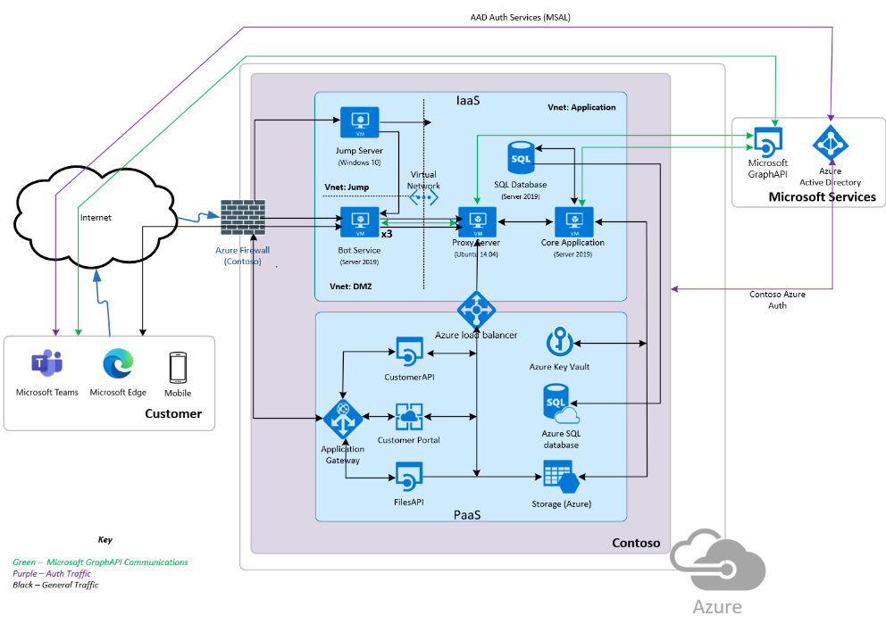
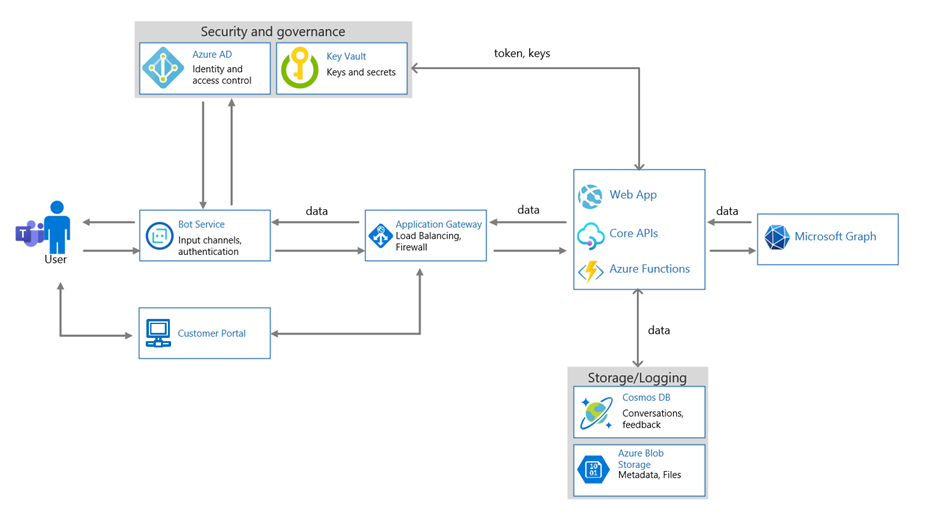

# Microsoft 365Ceritification-初始檔提交指南

初始檔提交是認證的預先評估階段的一部分。 所提供的資訊將為認證分析分析員提供必要的背景，以識別哪些控制項和系統元件將會在您的評估範圍內。 本檔的用途只是您的初始檔提交所需的範例。 您所提供的檔會因您設計、實施及管理解決方案的方式而有所不同。

## 滲透測試報告

請包含完整的滲透測試報告，其日期 evidencing 是在過去12個月內完成。 
-   此報告必須由手動滲透測試產生，它不能是自動掃描/測試控管的輸出。
-   此報告必須包含支援部署應用程式/新增的環境，以及支援應用程式/增益集作業的任何其他環境。

## 系統元件清查

支援基礎結構所使用之所有系統元件的最新 inventroy。 這會在執行評估階段時用於協助抽樣。 如果您的環境包括 PaaS，當您可以提供所有已使用 PaaS 服務的詳細資料時，它會非常有用。

**附注：** IaaS/PaaS 不會有屬於 Isv 控制項底下的任何硬體。  在此情況下，請提供所有 virual 資源的清單或螢幕擷取畫面。

**範例：**

|資產名稱|    資產類型| 描述|    製造商|   Model|
|-|-|-|-|-|
|D212|  Windows 機|   虛擬機器|    不適用| 不適用|
|LT101| 筆記型電腦| 工作站|    Microsoft|  第3表面|
|C2938| 參數| 參數|不適用|不適用|     
|LXM2|  Linux 電腦|  測試電腦|不適用|不適用|       

## 軟體清查

所有軟體資產的最新庫存，包含範圍內環境中所使用的所有軟體，以及版本。

**範例：**

|軟體|  Publisher|  版本|     用途|
|-|-|-|-|
|Windows 伺服器|    Microsoft 2016 | 組建14393| 實際執行環境的伺服器作業系統|.
|Linux Ubuntu|  不適用|    16.04 (Xenial) | 在 DMZ 內使用的伺服器作業系統。|
|ESXi|  VMWare| 6.5.0 (組建 13004031) | 用來支援虛擬伺服器。|
|Mysql (Windows) |   不適用|    8.0.2.1|    儲存聊天記錄的資料庫伺服器。|
|Tomcat|        Apache| 7.0.92| 客戶入口網站。|
|IIS|   Microsoft|  10.0|   支援 APIs。|

## 協力廠商相依性

檔：列出使用目前執行中的應用程式/增益集所使用的所有依存關係。

**範例：**

|Web 相依性|  目前使用中的版本|
|-|-|
|JQuery|    3.5.1|
|反應| 16.13.1|
|引導| 4.5.2|
|Express|   4.17.1|
|Angular|   10.0.14|
|AngularJS| 1.8.0|

## 公用 IP 位址

詳述支援基礎結構所使用的所有公用 IP 位址和 URLs。 這必須包含為環境所指派的完整可路由傳送 IP 範圍，除非已執行適當的分割，以分割所使用的範圍，否則將需要) 分割的 (足夠的證據。

**範例：**

|URL|  IP 位址|
|-|-|
|https://portal.contoso.com |40.113.200.201 |
|https://filesapi.contoso.com|  40.113.200.201|
|https://customerapi.contoso.com|   40.113.200.202|
|https://bot.contoso.com|   40.113.200.202|
|N/A (跳至伺服器) | 40.113.200.200|

## 資源端點

API 名稱端點位址 Contoso 客戶 API    https://customerapi.contoso.com Contoso Bot 服務 https://bot.contoso.com CONTOSO Files API   https://filesapi.contoso.com

您的應用程式所使用之所有 API 端點（包括內部開發及外部資源端點）的完整清單。 為了協助瞭解環境範圍，請在您的環境中提供 API 端點位置。

**範例：**

|API 名稱|  端點位址|
|-|-|
|Contoso 客戶 API|  https://customerapi.contoso.com|
|Contoso Bot 服務|   https://bot.contoso.com|
|Contoso Files API| https://filesapi.contoso.com|
|Microsoft Graph| https://graph.microsoft.com/v1.0/|

## 架構圖表

邏輯架構圖，代表應用程式/增益集的支援基礎結構的高層次概述。 這必須包含支援應用程式/增益集的所有主控環境和支援基礎結構。 此圖表必須說明環境內所有不同的支援系統元件，以協助認證分析員瞭解範圍內的系統，並協助判斷抽樣。 請另外指出使用的主控環境類型;ISV 主控、IaaS、PaaS 或混合式。 在使用 PaaS 的地方，請指出用來在環境中提供支援服務的各種 PaaS 服務。

## 資料 Flow 圖表

Flow 圖詳述下列各項：
-   從應用程式/增益集 (資料流程（包括客戶資料) ）。
-   支援基礎結構內的資料流程 (（適用于）) 
-   圖表會強調儲存位置和資料的位置、資料傳遞給外部協力廠商的方式 (包括) 協力廠商的詳細資料，以及資料在透過開放/公用網路和靜止的方式傳輸時受到保護的方式。

