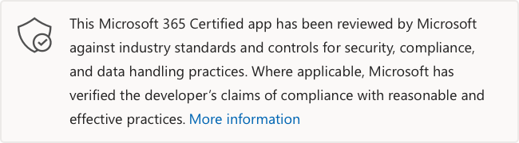

# officeatwork |Office 的範本選擇器officeatwork | Template Chooser for Office

上次於開發人員更新：2020年12月8日Last updated by the developer on: December 8, 2020

* <a href="https://appsource.microsoft.com/product/office/WA104380050" target="_blank">在 AppSource 中查看</a><a href="https://appsource.microsoft.com/product/office/WA104380050" target="_blank">View in AppSource</a>

::: zone pivot="general"

### 一般資訊General information

由 officeatwork 提供給 Microsoft 的資訊：Information provided by officeatwork to Microsoft:

| **Information****Information** | **回應****Response** |
|:----------------|:-------------|
| 應用程式名稱App name | officeatwork-Office 的範本選擇器officeatwork - Template Chooser for Office |
| IDID | WA104380050WA104380050 |
| 支援 Office 365 用戶端Office 365 clients supported | Excel 于 mac 上 iPad、Excel 2016 或更新版本、Excel 2013 或更新版本、Windows 或更新版本的 mac、Excel 網頁版、word 2013 或更新版本、iPad 或更新的 mac、Word 2016、Word 網頁版 2016 2013 （或更新） Windows，PowerPointExcel on iPad, Excel 2016 or later on Mac, Excel 2013 or later on Windows, Excel on the web, Word on iPad, Word 2016 or later on Mac, Word on the web, Word 2013 or later on Windows, PowerPoint on iPad, PowerPoint 2016 or later on Mac, PowerPoint on the web, PowerPoint 2013 or later on Windows, Project 2016 or later on Windows |
| 合作夥伴公司名稱Partner company name | officeatworkofficeatwork |
| 合作夥伴網站的 URLURL of partner website | [https://links.officeatwork.com/officeatwork-home](https://links.officeatwork.com/officeatwork-home) |
| 隱私權原則的 URLURL of Privacy Policy | [https://links.officeatwork.com/officeatwork-privacystatement](https://links.officeatwork.com/officeatwork-privacystatement) |
| 使用條款的 URLURL of Terms of Use | [https://links.officeatwork.com/officeatwork-licenseterms](https://links.officeatwork.com/officeatwork-licenseterms) |

 [!INCLUDE [Corrections or suggestions contact information](../includes/corrections-or-suggestions.md)]

::: zone-end

::: zone pivot="data"

### 應用程式如何處理資料How the app handles data

此資訊是由 officeatwork 提供的，此應用程式會如何收集和儲存組織資料，以及您的組織將會擁有該應用程式所收集資料的控制項。This information has been provided by officeatwork about how this app collects and stores organizational data and the control that your organization will have over the data the app collects.

#### 使用 Microsoft Graph 的資料存取Data access using Microsoft Graph

列出此應用程式所需的任何[Microsoft Graph 許可權](https://docs.microsoft.com/graph/permissions-reference)。List any [Microsoft Graph permissions](https://docs.microsoft.com/graph/permissions-reference) this app requires.

>| **Permission****Permission**  | **委派/應用程式的許可權 (類型)****Type of permission (Delegated/Application)** | **資料是否已收集？要收集的理由？****Is data collected? Justification for collecting it?** | **資料是否已儲存？儲存的理由****Is data stored? Justification for storing it?** | **Azure AD 應用程式識別碼****Azure AD App ID** |
>|:----------------|:--------------------|:---------------------------------------------------|:--------------------------|:--------------------------|
>| Files.ReadWrite.AllFiles.ReadWrite.All | 委託delegated | 不儲存任何資料。No data is stored. | 「我的我的最愛」：能夠讀取及寫入資料至使用者 OneDrive;OneDrive：能夠在使用者 OneDrive 中讀取及寫入資料。Favorites: to be able to read and write data to the users OneDrive; OneDrive: to be able to read and write data to the users OneDrive. | dae2eacf-3eb5-4440-baff-984fbd5cae68dae2eacf-3eb5-4440-baff-984fbd5cae68 |
>| Group.ReadWrite.AllGroup.ReadWrite.All | 委託delegated | 不儲存任何資料。No data is stored. | Teams：能夠讀取及寫入群組中的資料。Teams: to be able to read and write data to a Group. | dae2eacf-3eb5-4440-baff-984fbd5cae68dae2eacf-3eb5-4440-baff-984fbd5cae68 |
>| GroupMember Read。 AllGroupMember.Read.All | 委託delegated | 不儲存任何資料。No data is stored. | SharePoint線上：允許從 SharePoint 線上讀取資料的使用者許可權。SharePoint Online: user permission to enable reading data from SharePoint Online. | dae2eacf-3eb5-4440-baff-984fbd5cae68dae2eacf-3eb5-4440-baff-984fbd5cae68 |
>| Sites.Read.AllSites.Read.All | 委託delegated | 不儲存任何資料。No data is stored. | SharePoint線上：啟用從 SharePoint 線上讀取資料。SharePoint Online: to enable reading data from SharePoint Online. | dae2eacf-3eb5-4440-baff-984fbd5cae68dae2eacf-3eb5-4440-baff-984fbd5cae68 |
>| User.ReadUser.Read | 委託delegated | 不儲存任何資料。No data is stored. | 共同作業：讓 officeatwork 應用程式讀取使用者的基本屬性。Sing-In: to enable the officeatwork app to read the user's basic properties. | dae2eacf-3eb5-4440-baff-984fbd5cae68dae2eacf-3eb5-4440-baff-984fbd5cae68 |
>| User.Read.AllUser.Read.All | 委託delegated | 不儲存任何資料。No data is stored. | Teams：找出使用者所屬的群組。Teams: to find out what groups a user belongs to. | dae2eacf-3eb5-4440-baff-984fbd5cae68dae2eacf-3eb5-4440-baff-984fbd5cae68 |
>| offline_accessoffline_access | 委託delegated | 不儲存任何資料。No data is stored. | In：若要透過重新整理來啟用自動登入，使用者必須在每次啟動 officeatwork 應用程式時手動登入。Sing-In: to enable automatic sign-in via refresh-tokens, as without, users would have to manually sign-in every single time they launch the officeatwork app. 只有在啟用非 SSO 的主應用程式時，才需要此範圍。This scope is only required for non-SSO enabled host applications. | dae2eacf-3eb5-4440-baff-984fbd5cae68dae2eacf-3eb5-4440-baff-984fbd5cae68 |
>| openidopenid | 委託delegated | 不儲存任何資料。No data is stored. | In：讓使用者能夠利用其組織和/或 Microsoft 帳戶登入 officeatwork 應用程式Sing-In: to enable users to sign-in to the officeatwork app with their organizational and/or Microsoft Account | dae2eacf-3eb5-4440-baff-984fbd5cae68dae2eacf-3eb5-4440-baff-984fbd5cae68 |
>| profileprofile | 委託delegated | 不儲存任何資料。No data is stored. | In：用於顯示 officeatwork 應用程式中已登入的使用者。Sing-In: to show the signed-in user in the officeatwork app. 這有助於保證/確認使用者用來登入 officeatwork 應用程式的帳戶。This helps assure/confirm the user what account was used to sign-in to the officeatwork app. | dae2eacf-3eb5-4440-baff-984fbd5cae68dae2eacf-3eb5-4440-baff-984fbd5cae68 |

#### 使用其他 Microsoft APIs 的資料存取權Data access using other Microsoft APIs

以 Microsoft 365 為基礎的應用程式和增益集可能會使用 microsoft Graph 以外的其他 Microsoft APIs，來收集或處理組織識別資訊 (OII) 。Apps and add-ins built on Microsoft 365 may use additional Microsoft APIs other than Microsoft Graph to collect or process organizational identifiable information (OII). 列出此應用程式使用的 microsoft Graph 以外的任何 microsoft APIs。List any Microsoft APIs other than Microsoft Graph this app uses.

>| **API****API** |  **是否 OII 收集？****Is OII collected?** |  **收集的 OII 是什麼？****What OII is Collected?** | **收集 OII 的理由？****Justification for collecting OII?** | **OII 是否儲存？****Is OII stored?** | **儲存 OII 的理由？****Justification for storing OII?** |
>|:-------------------|:-------------------|:--------------------------|:--------------------------|:---------------------------------------------------|:--------------------------|
>| SharePointREST APIsSharePoint REST APIs | 否No |  |  |  |  |

#### 未使用的 Microsoft 服務Non-Microsoft services used

若應用程式使用非 Microsoft 服務來傳輸或共用組織資料，請列出應用程式使用的非 Microsoft 服務、要傳輸的資料，並包含有關應用程式傳送此資訊的原因的理由。If the app transfers or shares organizational data with non-Microsoft service, list the non-Microsoft service the app uses, what data is transferred, and include a justification for why the app needs to transfer this information.

>不會使用非 Microsoft 服務。Non-Microsoft services are not used.

#### 增益集資料存取Add-in Data Access

列出此應用程式在存取您組織的資料時所需的許可權、此許可權的理由和用途 (應用程式使用此資訊的情況為何？ ) ，以及應用程式是否在其資料庫中儲存任何這項資訊。List the permissions this app requires for accessing your organization's data, the justification and purpose for this permission (what does the app use this information for?), and whether the app stores any of this information in its databases.

>| **Permission****Permission**  | **描述****Description** |
>|:----------------|:----------------|
>| ReadWrite 檔ReadWrite Document | 可以讀取和變更您的檔Can read and make changes to your document |
>| 傳送資料Send Data | 可以透過網際網路傳送資料Can send data over the Internet |

#### 遙測資料Telemetry data

任何組織識別資訊 (OII) 或使用者身分識別資訊 (EUII) 是否會出現在這個應用程式的遙測或記錄檔中？Does any organizational identifiable information (OII) or end-user identifiable information (EUII) appear in this application's telemetry or logs? 如果是，請描述要儲存的資料，以及保留和移除原則為何？If yes, describe what data is stored and what are the retention and removal policies?

>是的，事件包括 oid 和 tenantId，而且會傳送至 Azure AppInsights。Yes, events include the oid and tenantId and are sent to Azure AppInsights. 事件會在90天后自動刪除。The events are automatically deleted after 90 days. 如果客戶想要刪除此資料，可使用隱私權聲明中提供的連結，以啟動對該資料的刪除。If a customer wishes to have this data deleted, they can use the link provided in the privacy statement to initiate the deletion of that data.

#### 夥伴所儲存資料的組織控制項Organizational controls for data stored by partner

說明組織管理員如何在合作夥伴系統中控制其資訊？例如刪除、保留、審核、封存、使用者原則等等。Describe how organization's administrators can control their information in partner systems? e.g. deletion, retention, auditing, archiving, end-user policy, etc.

>「應用程式設定」資料 (功能旗標、組織顯示名稱、tenantId、系統管理員 oid) 清單會儲存在 Azure Cosmos DB 實例中 (每個租使用者) 一個檔案。The applications settings data (feature flags, organization display name, tenantId, list of administrators oids) are stored in an Azure Cosmos DB instance (one file per tenant). 資料庫檔案已加密，且存取權僅限於選取的 officeatwork 工程師和支援人員。The DB files are encrypted, and access is restricted to selected officeatwork engineers and support staff. 客戶可以使用系統管理中心 Web App 來存取及操縱 officeatwork 應用程式設定資料。Customer can access and manipulate the officeatwork app settings data using the Admin Center Web App.

#### 組織資訊的人工檢查Human review of organizational information

參與審閱或分析任何組織身分識別資訊 (OII) 由此應用程式收集或儲存的資料嗎？Are humans involved in reviewing or analyzing any organizational identifiable information (OII) data that is collected or stored by this app?

>否No

[!INCLUDE [Corrections or suggestions contact information](../includes/corrections-or-suggestions.md)]

::: zone-end

::: zone pivot="mcas"

來自[Microsoft Cloud App Security](https://www.microsoft.com/enterprise-mobility-security/cloud-app-security)目錄的資訊如下所示。Information from the [Microsoft Cloud App Security](https://www.microsoft.com/enterprise-mobility-security/cloud-app-security) catalog appears below.

<iframe height='1020' title='Microsoft Cloud App Security資訊Microsoft Cloud App Security Information' src='https://appmcasinfoprod.azurewebsites.net/#/dashboard/35385' frameborder='no' style='width: 100%;'></iframe>

<a href="https://appmcasinfoprod.azurewebsites.net/#/dashboard/35385" target="_blank">在新的索引標籤中查看</a>

<a href="https://appmcasinfoprod.azurewebsites.net/#/dashboard/35385" target="_blank">View in a new tab</a>

[!INCLUDE [Corrections or suggestions contact information](../includes/corrections-or-suggestions.md)]

::: zone-end

::: zone pivot="identity"

### 身分識別資訊Identity information

Officeatwork 此資訊的提供方式是關於此應用程式如何處理驗證、授權、應用程式註冊最佳作法和其他身分識別準則。This information has been provided by officeatwork about how this app handles authentication, authorization, application registration best practices, and other Identity criteria.

| **Information****Information** | **回應****Response** |
|:----------------|:-------------|
| 您是否要與 Microsoft 識別平臺 (Azure AD) 整合？Do you integrate with Microsoft Identify Platform (Azure AD)?  | 是Yes |
| 您是否已複習並編譯 Microsoft 身分識別平臺整合檢查清單中所述的所有適用的最佳作法？Have you reviewed and complied with all applicable best practices outlined in the Microsoft identity platform integration checklist?  | 是Yes |
| 您的應用程式是否使用 MSAL (Microsoft 驗證程式庫) 進行驗證？Does your app use MSAL (Microsoft Authentication Library) for authentication? | 否No |
| 您的應用程式是否支援條件式存取原則？Does your app support Conditional Access policies? | 是Yes |
| 列出支援的原則類型List the types of policies supported | 安全性預設Security defaults |
| 您的應用程式是否要求最小許可權許可權給您的案例？Does your app request least privilege permissions for your scenario? | 是Yes |
| 您的應用程式的靜態註冊許可權是否要準確反映您的應用程式將動態和以增量方式要求的許可權？Does your app's statically registered permissions accurately reflect the permissions your app will request dynamically and incrementally? | 否No |
| 您的應用程式是否支援多租賃？Does your app support multi-tenancy? | 是Yes |
| 您的應用程式有機密用戶端嗎？Does your app have a confidential client? | 是Yes |
| 您是否擁有為您的應用程式註冊的所有重新導向統一資源識別元 (URI) ？Do you own all of the redirect Unified Resource Identifier (URI) registered for your app? | 是Yes |
| 您的應用程式，您避免使用什麼？For your app, what do you avoid using? | -萬用字元重新導向 URIs，- Wildcard redirect URIs, -OAuth2 隱含 Flow （除非 SPA 是必要的）- OAuth2 Implicit Flow, unless required for a SPA -Resource 物主密碼認證 (ROPC) 流程- Resource Owner Password Credential (ROPC) flow |
| 您的應用程式是否公開任何 web APIs？Does your app expose any web APIs? | 否No |
| 您的應用程式是否使用預覽 APIs？Does your app use preview APIs? | 否No |
| 您的應用程式使用的 APIs 是否已遭取代？Does your app use deprecated APIs? | 否No |

[!INCLUDE [Corrections or suggestions contact information](../includes/corrections-or-suggestions.md)]

::: zone-end
